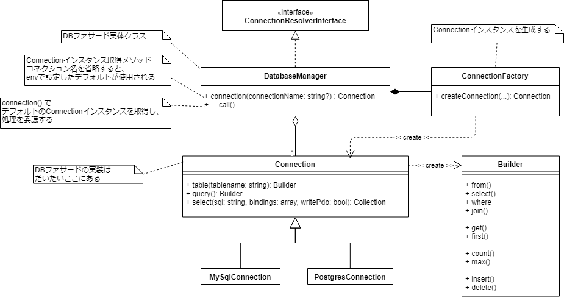
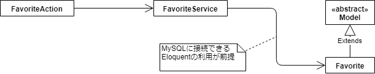
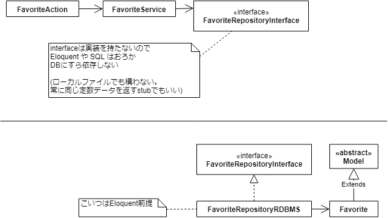
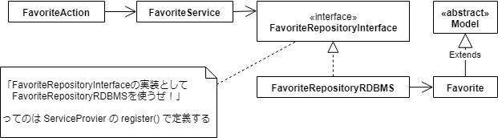

この本の輪読会 

[https://weeyble-php.connpass.com/event/110062/:title]

---


#前半の内容おさらい
[https://weeyble-php.connpass.com/event/107251/:title]
でやったやつ

## 5.1 マイグレーション (p.162)
- PHPコードでスキーマを管理 => ロジックの変更と同じバージョン管理下における

## 5.2 シーダー (p.173)
- 初期データの注入もPHPコードで行う => メリットは同上
  - マスタデータ
  - 自動テスト時のダミーデータ

## 5.3 Eloquent (p.181)
- SQLを書かずにDB操作
  - 良し悪し
    - パフォーマンスチューニング面で、SQLを書くことはおそらく避けられない

---

#後半(ぼく担当分)

##5.4 クエリビルダ (p.199)
クエリビルダのメソッドをつなげてSQLを組み立てる

Eloquentも内部ではクエリビルダのインスタンスに処理を委譲している

###5.4.1 クエリビルダの書式

####5.4.1.1 クエリビルダの書式

```php
<?php
    $results =
        // ベースとなるクエリビルダ生成、および "from `books`" 句の追加
        // 実は DB::query()->from('books') と書いてもいい
        DB::table('books') // Illuminate\Database\Query\Builderインスタンス

        // メソッドチェーンによる処理対象や処理内容の特定
        ->select(['bookdetails.isbn', 'books.name', 'authors.name', 'bookdetails.price'])
        ->leftJoin('bookdetails', 'books.bookdetail_id', '=', 'bookdetails.id')
        ->leftJoin('authors', 'books.author_id', '=', 'authors.id')
        ->where('bookdetails.price', '>=', 1000)
        ->where('bookdetails.published_date', '>=', '2011-01-01')
        ->orderBy('bookdetails.published_date', 'desc')

        // クエリ実行
        ->get();  // Illuminate\Support\Collection インスタンス
```

####Appendix: なかみ

##### TL;DR

- `table()` は `Connection` インスタンスのメソッド。`Builder` インスタンスを返す
- `get()` は `Builder` インスタンスのメソッド。中で `Connection` インスタンスの `select()` を呼ぶ
- `Connection` インスタンスの`select()`は、実際にクエリを実行する。  
  PDOを叩いて`array`の`array`を取得し、`Illuminate\Support\Collection`型でラップして返却する
- `select()`は、本命の処理を`run()`高階メソッドでデコレーションし、クエリのロギング等を行っている
  - `insert()` とか `cursor()` とかもそう。コードを共通化しててかっこいい

<details><div>

##### table()のなかみ  
- /vendor/laravel/framework/src/Illuminate/Database/Connection.php
```php
<?php
    public function table($table)
    {
        // クエリビルダインスタンスを生成し、from句を追加している
        return $this->query()->from($table);
    }

    // クエリビルダ生成処理
    public function query()
    {
        // 文法クラス Grammer
        // クエリ処理クラス Processor
        // のインスタンスを注入している
        return new QueryBuilder(
            $this, $this->getQueryGrammar(), $this->getPostProcessor()
        );
    }
```  

##### get()のなかみ
- /vendor/laravel/framework/src/Illuminate/Database/Query/Builder.php
```php
<?php
    // クエリを実行し、
    // Illuminate\Support\Collection インスタンスを返す
    public function get($columns = ['*'])
    {
        $original = $this->columns;

        if (is_null($original)) {
            $this->columns = $columns;
        }

        // Illuminate\Database\Query\Processors\Processor にクエリを処理させる。
        // 中ではなんやかんやでPDOStatementのfetchAll();が叩かれ、arrayが返る
        $results = $this->processor->processSelect($this, $this->runSelect());

        $this->columns = $original;

        // arrayのラッパ
        // Illuminate\Support\Collectionで包んで返す
        return collect($results);
    }

    // ↑の$resultにはこれの結果が入る
    protected function runSelect()
    {
        return $this->connection->select(
            // DB::getQueryLog()でとれるやつ。
            // "select * from `authors` where `authors`.`id` in (?, ?, ?)"
            // とか
            $this->toSql(),

            // DB:getQueryLog()でとれるやつ。
            // array:3 [
            //   0 => 1,
            //   1 => 3,
            //   3 => 5
            // ]
            // とか
            $this->getBindings(),

            ! $this->useWritePdo
        );
    }
```

- /vendor/laravel/framework/src/Illuminate/Database/Connection.php
```php
<?php
    // select文を実行し、結果をarrayで返す 
    public function select($query, $bindings = [], $useReadPdo = true)
    {
        // 本命の処理をrun高階メソッドでデコレーションし、クエリのロギング等を行っている
        return $this->run($query, $bindings, function ($query, $bindings) use ($useReadPdo) {
            // 本命のselect文実行処理はこの中

            if ($this->pretending()) {
                return [];
            }

            // PDOを叩いて、arrayを返却している
            $statement = $this->prepared($this->getPdoForSelect($useReadPdo)
                              ->prepare($query));

            $this->bindValues($statement, $this->prepareBindings($bindings));

            $statement->execute();

            return $statement->fetchAll();
        });
    }

    // クエリのロギングを行いつつ何かする高階メソッド
    // 「何かする」部分を$callbackで渡す。
    // select以外でもあちこちで使われている (cursorとか)
    protected function run($query, $bindings, Closure $callback)
    {
        $this->reconnectIfMissingConnection();

        // 処理時間測定開始
        $start = microtime(true);

        try {
            // 「何かする」部分
            $result = $this->runQueryCallback($query, $bindings, $callback);
        } catch (QueryException $e) {
            $result = $this->handleQueryException(
                $e, $query, $bindings, $callback
            );
        }

        // ログとってる
        // DB::getQueryLog()で取れるやつ
        $this->logQuery(
            $query, $bindings, $this->getElapsedTime($start)
        );

        return $result;
    }
```

</div></details>

###5.4.2 クエリビルダの取得

#### 5.4.2.1 DBファサードから
```php
<?php
    // DBファサードからbooksテーブルのクエリビルダを取得
    $query = DB::table('books');
```

#### 5.4.2.2 Illuminate\Database\Connectionクラスから
```php
<?php
    //  1. サービスコンテナからDatabaseManagerクラスのインスタンスを取得
    $db = \Illuminate\Foundation\Application::getInstance()->make('db');

    // 2. ↑から、Connectionクラスのインスタンスを取得
    $connection = $db->connection();

    // 3. ↑から、booksテーブルのクエリビルダを取得
    $query = $connection->table('books');
```
#### 所感
- DBファサードを使わせようというバイアスを感じる
  - DatabaseManagerインスタンス取得部分をワザワザめんどくさく書いている。  
    `$db = app()->make('db');`   
    でいい
  - コネクション名を指定しないなら`connection()`はわざわざ呼ばなくてもよい。  
    DatabaseManagerからConnectionに`__call()`マジックメソッド経由で処理が委譲される
  - DBファサードでも、.envの設定値以外のコネクション名を指定する場合は `connection()` が必要。  
    `DB::connection('sqlite')->table('books')`


#### Appendix: ファサードの処理の流れを追ってみた

##### TL;DR

- `DB::method();` の実態は `app()->make('db')->method()`
- `DatabaseManager` クラスのインスタンスメソッドが呼ばれている
- `DatabaseManager` に `method()` の定義がない場合、`__call()` マジックメソッド経由で  
    `connection()->method()` が呼ばれる

<details><div>

##### 全容

<figure class="figure-image figure-image-fotolife" title="DBファサードの中身のクラス図"><figcaption>DBファサードの中身のクラス図</figcaption></figure>

##### コード

- /config/app.php
```php
<?php

    'aliases' => [
        // ...
        // DBファサード定義クラス
        'DB' => Illuminate\Support\Facades\DB::class,
        // ...
```

- /vendor/laravel/framework/src/Illuminate/Support/Facades/DB.php
```php
<?php

namespace Illuminate\Support\Facades;

/**
 * @see \Illuminate\Database\DatabaseManager
 * @see \Illuminate\Database\Connection
 */
class DB extends Facade
{
    protected static function getFacadeAccessor()
    {
        //  サービスコンテナに「db」という名前でバインドされているクラスのインスタンスを使う
        return 'db';
    }
}
```

- /config/app.php
```php
<?php

    'providers' => [
        // ... 
        // このサービスプロバイダでDB関連クラス群のバインドを行っている
        Illuminate\Database\DatabaseServiceProvider::class, 
        // ...

```

- /vendor/laravel/framework/src/Illuminate/Database/DatabaseServiceProvider.php
```php
<?php

    protected function registerConnectionServices()
    {
        // DatabaseManagerに注入されるやつ
        $this->app->singleton('db.factory', function ($app) {
            return new ConnectionFactory($app);
        });

        // **********************************************************************
        // こいつだ！
        // 「db」は、DatabaseManagerインスタンスにバインドされている。
        // **********************************************************************
        $this->app->singleton('db', function ($app) {
            // インスタンス生成時はConnectionFactoryインスタンスが注入されている
            return new DatabaseManager($app, $app['db.factory']);
        });

        // これはどこで使われるか不明 (grepしても見つからず)
        // とりあえず用意しただけかな
        $this->app->bind('db.connection', function ($app) {
            return $app['db']->connection();
        });
    }

```

- /vendor/laravel/framework/src/Illuminate/Database/DatabaseManager.php
```php
<?php

    // DB::table('books')
    // は、結局 DatabaseManager インスタンスのtableメソッドの呼び出しになるが、
    // そんなもの定義されていないのでここに来る
    public function __call($method, $parameters)
    {
        // コネクションを取得し、そいつのtableメソッドに処理を委譲する
        return $this->connection()->$method(...$parameters);
    }


    // コネクション取得メソッド
    public function connection($name = null)
    {
        // コネクション名とタイプをパースして分割代入する
        // mysql::read なら
        //   $database = 'mysql'
        //   $type = 'read'
        list($database, $type) = $this->parseConnectionName($name);
        // 今回は$nameが未指定なので、
        // getDefaultConnection() の戻り値 'mysql' がパースされ、
        //   $database = 'mysql'
        //   $type = null
        // となる

        $name = $name ?: $database;

        // コネクション名 => Connectionインスタンス のメモ化部分
        // ないときだけインスタンス生成
        if (! isset($this->connections[$name])) {
            $this->connections[$name] = $this->configure(
                $this->makeConnection($database), $type
            );
        }

        // メモを返す
        return $this->connections[$name];
    }


    // connection()を無引数で呼び出したときに使用されるデフォルトコネクション名
    // /config/database.php の 'default'設定が読みだされる
    public function getDefaultConnection()
    {
        return $this->app['config']['database.default'];
    }
```

- /config/database.php
```php
<?php

    // 環境変数「DB_CONNECTION」の設定値をデフォルトのコネクション名として使用する。
    // 設定がなくば、mysqlを使用する。
    'default' => env('DB_CONNECTION', 'mysql'),
```

- /.env
```ini
# コネクション名にmysqlを使用する
DB_CONNECTION=mysql
```

以上。結構入り組んでるわね

</div></details>


#### 5.4.2.3 データ操作専用のクラスを作ってクエリビルダを利用する例

** Controllerやビジネスロジックに直接クエリビルダを書かない **

コード省略  

- 外から `DatabaseManager` をコンストラクタ注入できるようにする
  - この場合はDBファサード非推奨ということですね
  - 拡張性・テスト容易性
    - `DatabaseManager` は `Illuminate\Database\ConnectionResolverInterface` の一実装にすぎないので  
      コンストラクタの引数は `ConnectionResolverInterface` のほうがいいと思った。  
      そうすれば`DatabaseManagerStub` などに差し替えて単体テストすることもできる


### 5.4.3 処理対象や内容の特定

#### 5.4.3.1 Select系メソッド

##### select(カラム名の配列)
引数は、実は配列ではなく可変長引数でも可
/vendor/laravel/framework/src/Illuminate/Database/Query/Builder.php
```php
<?php
    public function select($columns = ['*'])
    {
        // 第1引数columnが配列ならそれを、
        // さもなくば全引数 func_get_args(); で配列として取得して
        // $this->columnsに格納する
        $this->columns = is_array($columns) ? $columns : func_get_args();

        return $this;
    }
```

##### selectRaw(SQL文)
- select文の中身をSQLで直接指定する。  
  ** SQLインジェクションには注意 **
- select()の後に併用可能。カラムが追加される  
  ** 逆は不可 **

/vendor/laravel/framework/src/Illuminate/Database/Query/Builder.php
```php
<?php
    public function selectRaw($expression, array $bindings = [])
    {
        // カラムを追加している！
        $this->addSelect(new Expression($expression));

        if ($bindings) {
            $this->addBinding($bindings, 'select');
        }

        return $this;
    }
```

- bindings を別途指定できる
```php
<?php
    $db = app()->make('db');
    $query = $db->connection()->table('bookdetails')
        ->select('id', 'price')
        ->selectRaw('price * ? as price_with_tax', [1.08]);  // 税込み価格カラムを追加、税率はbindingsで入れている
```

#### 5.4.3.2 Select系メソッドの利用
特筆すべきことなし

#### 5.4.3.3 Where系メソッド
- チェーンするとAND条件になる
- OR条件にしたい場合、メソッド名をorWhereXxx とする
- whereXxx とすると、カラムxxxに対して絞り込める

<details>
<summary>
Appendix: whereXxx() の実装
</summary>
<div>

/vendor/laravel/framework/src/Illuminate/Database/Query/Builder.php
```php
<?php

    // whereXxxを呼ぶとここに来る (定義がないため)
    public function __call($method, $parameters)
    {
        if (static::hasMacro($method)) {
            return $this->macroCall($method, $parameters);
        }

        // whereから始まるメソッド名の場合、dynamicWhereメソッドに処理が移る
        if (Str::startsWith($method, 'where')) {
            return $this->dynamicWhere($method, $parameters);
        }

        $className = static::class;

        throw new BadMethodCallException("Call to undefined method {$className}::{$method}()");
    }

    // whereXxxを呼ぶと__call()からここに来る
    public function dynamicWhere($method, $parameters)
    {
        // whereXxx の Xxx 部分を切り出す
        $finder = substr($method, 5);

        // なんかいろいろ頑張ってるみたい
        $segments = preg_split(
            '/(And|Or)(?=[A-Z])/', $finder, -1, PREG_SPLIT_DELIM_CAPTURE
        );
```

</div></details>

#### 5.4.3.4 Where系メソッドの利用
特筆すべきことなし

#### 5.4.3.5 LimitとOffsetメソッド
##### Limit

- limit句に置き換わる。「何件とる」
- takeエイリアスが存在する

##### Offset

- offset期に置き換わる。「先頭から何件飛ばす」
- skipエイリアスが存在する

##### Appendix: takeとskipの由来？
LINQかと

- LINQ: Language INtegrated Query -- 統合言語クエリ  
.NET Frameworkの機能。  
C#では、配列等(IEnumerable<T>)を、SelectとかWhereとかで操作できる。  
LINQでは「何件とる」がTake、「何件飛ばす」がSkip

#### 5.4.3.6 LimitとOffsetメソッドの利用
特筆すべきことなし

##### 5.4.3.7 集計系のメソッド
##### 5.4.3.8 連続したorderByメソッドによる複数カラムのソート
##### 5.4.3.9 テーブルの結合を行うメソッド
##### 5.4.3.10 連続したjoinメソッドによる結合
特筆すべきことなし  


### 5.4.4 クエリの実行
クエリビルダのメソッドチェーンの最後に実行し、クエリを実際に実行する

#### データの取得

##### get([$columns = ['*']]) : \Illuminate\Support\Collection;
全行取得  
実は列を配列で指定できる

##### first([$columns = ['*']]) : array
1行取得  
列を配列で指定できる  

##### count([$columns = '*']) : int
行数取得  
列名指定可  
(NULLがあるとき結果が変わってくる)

##### max($column), min($column), avg($column)
特筆すべきことなし  
averageエイリアスがあったりする


#### データの登録、更新、削除
SQLに対応するメソッドがある


### 5.4.5 トランザクションとテーブルロック

- Eloquent利用時にも使える
- DB::transaction(Closure $closure) を使うのが良いでしょう
  - begin - rollback or commit を自分で書くと、例外処理等々が煩雑になる
    - rollbackもcommitもしないコードパスが生まれたりする (途中でreturnしちゃったりすると)

Illuminate/Database/Concerns/ManagesTransactions.php
```php
<?php

    public function transaction(Closure $callback, $attempts = 1)
    {
        for ($currentAttempt = 1; $currentAttempt <= $attempts; $currentAttempt++) {
            $this->beginTransaction();

            try {
                return tap($callback($this), function ($result) {
                    $this->commit();  // 正常系  commitしておわり
                });
            }

            catch (Exception $e) {
                $this->handleTransactionException(
                    $e, $currentAttempt, $attempts
                );
            } catch (Throwable $e) {   // ↑でもなんか起きたらここに来る
                $this->rollBack();

                throw $e;
            }
        }
    }

    protected function handleTransactionException($e, $currentAttempt, $maxAttempts)
    {
        if ($this->causedByDeadlock($e) &&
            $this->transactions > 1) {
            $this->transactions--;

            throw $e;  // 異常系  transactionの catch(Throwable $e) にrollbackを委ねる
        }

        $this->rollBack();  // 正常系 ここでrollbackする

        if ($this->causedByDeadlock($e) &&
            $currentAttempt < $maxAttempts) {
            return;
        }

        throw $e;
    }
```  

### 5.4.6 ベーシックなデータ操作
Eloquentやクエリビルダは良し悪し

- パフォーマンス面で最適とは限らない
- 「手軽さ」「可読性」といったメリットは、クエリが長くなっていくと結局失われる

=>SQL直書きする方法も提供されている

** SQLインジェクションには注意 **

#### 5.4.6.2 DB:selectを使用したデータ抽出
コード省略

- `Connection` インスタンスの `select` メソッドを直接叩く
- パラメータマークは2通り
  - ? ... 名前なし
  - :name ... 名前あり

#### 5.4.6.3 PDOを利用したクエリの実行
コード省略

- `Connection` インスタンスから `getPdo()` でPDOインスタンスを取得して使用
  - `getReadPdo()` というのもあるようですよ

##5.5 リポジトリパターン (p.209)
データ周りの要求変更に負けない設計パターンを取り入れる

### 5.5.1 リポジトリパターンの概要
プログラムの変更範囲を可能な限り限定的にしたい  
=> 手段の1つ

### 5.5.2 リポジトリパターンの実装

#### 1. アプリケーション仕様

- 外部キーである `book_id` と `user_id` は、`int(10) unsigned` のほうがいいと思います
  - 対応する主キー `books.id`, `users.id` はともに `int(10) unsigned`だから
- UNIQUE制約をもうけることで、`book_id`と`user_id`は複合主キーとなる

#### 2. テーブル作成

特筆すべきことなし  
アプリケーション仕様が一部こっちにも書かれてしまっている

#### 3. コードの作成

- `Favorite`はファサードではないので、`Favorite::where` や `Favorite::create` は`Favorite`クラスのクラスメソッドが呼ばれている
- が、そんな定義はないので、`Model::__callStatic()`が呼ばれる
- `Favorite`クラスがインスタンシエートされて、`__call()`が呼ばれる

Illuminate/Database/Eloquent/Model.php
```php
<?php

    public static function __callStatic($method, $parameters)
    {
        return (new static)->$method(...$parameters);
    }
```


- ので、要するに下記とおなじ
```php
<?php

    $favorite = new Favorite();
    $favorite->where(/* ... */);
```
- 依存性注入するときに重要になってくる

#### 4. リファクタリング

##### As-Is



`FavoriteService` が `Favorite Eloquent` モデルに依存しており、あらゆる影響を受ける

- カラムの追加・削除・名前変更等
- パフォーマンスチューニング
- NoSQLなどへの乗り換え

##### To-Be



`FavoriteService` は `FavoriteRepositoryInterface` に依存しており、  
上述の影響はすべて `FavoriteRepositoryInterface` で吸収できる


##### 5.5.2.14 リポジトリインタフェースを実装した具象クラス

- もともと `FavoriteServiceのswitchFavorite(int $bookId, int $userId, string $createdAt): int` に書かれていたDB操作のコードをこちらに丸写しする
- ただし、Favorite Eloquentモデルを注入するので、`Favorite::xxx()` は `$this->favorite->xxx()` に置換すること。  
  前述のとおり、動作は同じである
  - 厳密には少し異なる。  
    `Favorite::xxx()` は呼び出すたびに`Favorite`クラスをインスタンシエートするため、パフォーマンス面でちょっと損するはず
    

##### 5.5.2.16 インターフェースと具象クラスのバインド



- インタフェース -&gt; 具象クラスの解決方法はサービスプロバイダで定義する
- 私はテキストから少し変えて、`FavoriteRepositoryRDBMS` とした。
  - `FavoriteRepository` で作っちゃうと、NoSQL版やストレージ版を作ることになったとき困りますよね？

###### 新たにServiceProviderを追加する場合

1. ServiceProviderつくる

    ```bash
    php artisan make:provider FavoriteServiceProvider
    ```

1. app/Providers/FavoriteServiceProviderができている

1. /config/app.php で登録
```php
<?php

    'providers' => [

        /*
         * Laravel Framework Service Providers...
         */
        Illuminate\Auth\AuthServiceProvider::class,
        Illuminate\Broadcasting\BroadcastServiceProvider::class,
        // ...
        /*
         * Application Service Providers...
         */
        App\Providers\AppServiceProvider::class,
        App\Providers\AuthServiceProvider::class,
        // App\Providers\BroadcastServiceProvider::class,
        App\Providers\EventServiceProvider::class,
        App\Providers\RouteServiceProvider::class,

        // このへんに追記する
        App\Providers\FavoriteServiceProvider::class,

    ],
```

##### 功罪

- 各クラスを疎結合にできる
  - 変更の影響範囲の局所化
  - 拡張性
  - テスト容易性
- クラス数が増える
  - 管理が大変
  - コーディング量が増える

検討材料: システムの要件や規模の拡張があるか？
