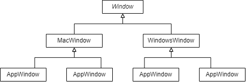

# Chapter 2 A CASE STUDY:DESIGNING A DOCUMENT EDITOR

ドキュメントエディタ「Lexi」を題材に、

1. さまざまな設計上の困難と
1. それを克服するために使用されているデザインパターン

を紐解いていく


## 2.2 Document Structure

### Problem
- LexiはWYSIWYGな感じの文書エディタ
   - MS Wordみたいな感じか
- 編集対象の文書はさまざまな要素からなる
   - テキスト
   - 画像
   - 基本図形
- テキストを特別扱い、画像を特別扱い、とかはしたくない
   - さもないとしくみが複雑になるから

### Solution: Composition Pattern

- テキスト、画像、基本図形など、「目に見えるなにか」を_Glyph_として汎化
- 目に見えない「行」「段組み」といったものも_Glyph_派生
   - 「行」に相当するRowクラスは_Glyph_を集約する ... 再帰的な木構造
   
   
## 2.3 Formatting

- Formatting: 文書の成形方法
   - どこで改行するか、とか
   
### Problem

- Formattingの頭の良さや美しさは実行速度とのトレードオフ
   - WYSIWYGなので、実行速度も重要
- Formattingのアルゴリズムには、以下のものがあるとする
   - Array
   - TeX
   - Simple
- 段組みColumn : _Glyph_をまとめ、文書全体を表現するComposition : _Glyph_クラスがあるとする
- 各アルゴリズムに対応するCompositioin派生を作りたくなる:
   - ArrayComposition
   - TexCompositon
   - SimpleComposition
- Formattingは良し悪しなので、ユーザが**実行時に選択できる**ことが望ましい
   - 上記の**継承では実現できない**
     

### Solution: Strategy Pattern

- アルゴリズムを汎化し、別の継承ツリーにはじき出す
   - 文章をComposeする抽象クラス、_Compositor_を定義
   - アルゴリズム別の具象クラスを用意
      - ArrayCompositor
      - TeXCompositor
      - SimpleCompositor
    - 僕的には後置修飾のほうが好み  
      -- 入力補完や、並んだ時の美しさの面で
       - CompositorArray
       - CompositorTeX
       - CompositorSimple
- Compositionクラスは、Formattingアルゴリズムに対応する_Compositor_インスタンス\_compositorをもつ
- Formattingアルゴリズムを選択するには、_compositorインスタンスを挿げ替える
   - _Compositor_派生は状態をもつべきではない
- Compositionは文書をFormatする際、`_compositor.Compose()`に処理を委譲する


## 2.4 Embellishing the User Interface

文書に以下のものを加えたい

- 枠線
- スクロールバー

いずれも、文書そのものとは関係ない飾りつけである (embellishment)

### Problem

- 飾りつけの処理の追加により本命の処理に影響を与えたくない
- クラス爆発は勘弁
   - BorderedComposition とか BorderdCompositionWithScrollBar とか悪夢
     
### Solution: Decorator Pattern


- 本命の処理を行うクラス(Composition : _Glyph_)を、同じインタフェース(_Glyph_)で包んでやり、処理を追加する
- 同じインタフェース_Glyph_で包むので、_Glyph_利用側からは**包む前後で区別がつかない** (Transparent Enclosure)
- いま、_Glyph_をちょうど1つ集約する_Glyph_派生、_Monoglyph_を定義する  
  枠線追加クラスBorder、スクロールバー追加クラスScrollerの定義は下記のようになる
   - _Monoglyph_ : _Glyph_
      - Border : _Monoglyph_
      - Scroller : _Monoglyph_
- 下記のように集約させると、文書にスクロールバーがつき、その周りに枠線がつく

```
Border <>-- Scroller <>-- Composition <>-- ...
```

- もしも、枠線ごとスクロールしたければこう。クラス爆発も回避できる

```
Scroller <>-- Border <>-- Composition <>-- ...
```

- Composition以降の集約関係や、_Glyph_としてCompositionを利用していたコードには変更が一切生じない


## 2.5 Multiple Look-and-Feel Standards

### Problem

- プラットフォームによって、ボタンやスクロールバーなど(ウィジェットと総称)の外観と雰囲気が異なる
- ユーザーを混乱させないためには、プラットフォーム標準に合わせたい
- すぐ思いつくのはこのような実装  
  各ウィジェットの各プラットフォーム版クラスを作り、利用側でnewする

```
ScrollBar* sb = new MacScrollbar();
Button* btn = new MacButton();
...
```

- 良くない点
  - 他プラットフォームへの移植が大変
  - 不注意で`WindowsButton()`とかが混ざる可能性がある
  
  
### Solution: Abstarct Factory

- _ScrollBar_とか_Button_とか、ウィジェット一式を作るファクトリクラス_GUIFactory_ をつくる
- プラットフォーム別に具象クラスをつくる
   - GUIFactoryMac : _GUIFactory_
   - GuiFactoryWindows : _GUIFactory_
- ウィジェット生成コードはこうなる

```
GUIFactory* guiFactory = new GUIFactoryMac();

ScrollBar* sb = guiFactory->CreateScrollBar();
Button* btn = guiFactory->CreateButton();
...
```

- Windows版にしたくなったらこう

```
- GUIFactory* guiFactory = new GUIFactoryMac();
+ GUIFactory* guiFactory = new GUIFactoryWindows();

ScrollBar* sb = guiFactory->CreateScrollBar();
Button* btn = guiFactory->CreateButton();
...
```

- GUIFactory*は、プラットフォーム判明後、ウィジェット生成ならどこで設定してもいい(実行時に選択できる)
  

## 2.6 Supporting Multiple Window Systems

### Problem

- ウィンドウはプラットフォームにより仕様が大きく異なる
   -グラフィック描画
   - 最小化・元に戻す
   - 座標系
- 各プラットフォームのウィンドウに対して、下記のバリエーションがある
   - アプリケーションのメインのウィンドウ
   - ダイアログ
- プラットフォーム別ウィンドウの派生を作るのは良くない
   - サブツリーをビルド時に切り替えないといけない

<figure class="figure-image figure-image-fotolife" title="プラットフォーム別ウィンドウを派生"><figcaption>antipattern: プラットフォーム別ウィンドウを派生</figcaption></figure>

- フラットにするのはもっとよくない(AppMacWindowとか)
   - クラス爆発
   
### Solution: Bridge Pattern

- プラットフォーム別実装を別の継承ツリーに切り出す
   - _WindowImp_抽象クラスとその派生
   - 具象クラスをインスタンシエートするには、AbstractFactoryをつかう
- _Window_の継承ツリーは、あくまで「メイン」「ダイアログ」といった「種類」に使う
