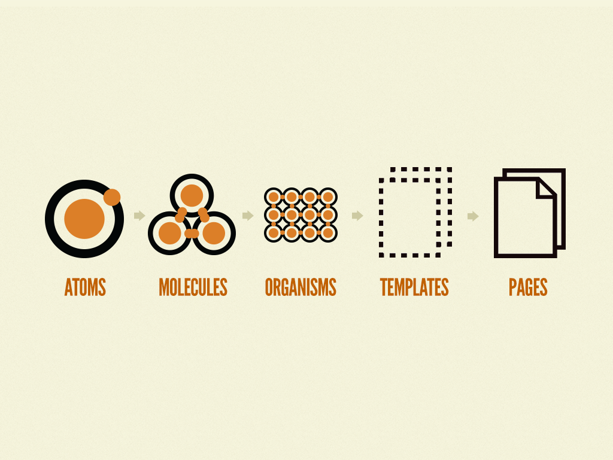
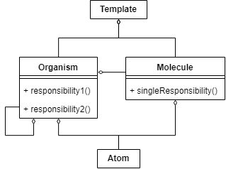
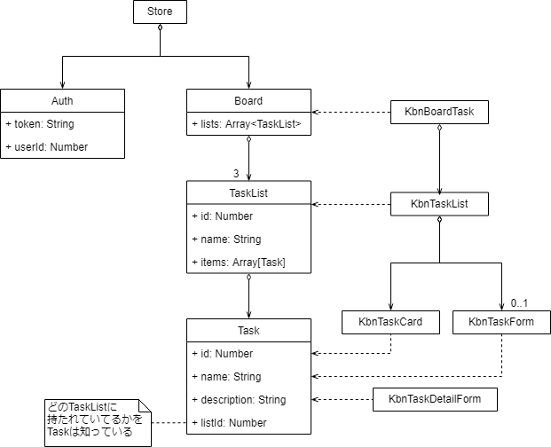

# Chapter 9 中規模・大規模向けのアプリケーション開発(2) 設計

仕様 -> **設計** -> 実装

設計フェーズを経ることによるメリット

- 開発効率の向上
- メンテナンス性向上


## 9.1 コンポーネント設計

- [Atomic Design](http://atomicdesign.bradfrost.com/chapter-2/) に準拠してコンポーネントを抽出してみる
   - 粒度
   - 相互の関連


### 9.1.1 Atomic Designによるコンポーネントの抽出

- Atomic Designの分類
  - Atoms
  - Molecules
  - Organisms
  - Templates
  - Pages
- Pagesはアプリケーションそのものなので、それ以外について考える
- MoleculesとOrganismsとの境目はどこなのか、についても解釈してみる


<figure class="figure-image figure-image-fotolife" title="MoleculesとOrganismsはどう違うんですか"><figcaption>MoleculesとOrganismsはどう違うんですか</figcaption></figure>

### 9.1.2 Atoms

#### 抽出結果

- ラベル
- テキストボックス
- ボタン
- アイコン

#### 解釈

- atom : 「原子」 というよりは、「それ以上分割できないもの」
   - ギリシャ語の「atomos」＝a（できない）＋tomos（分割） からきている
   - IT分野での用例
     - ACID特性 -- A:**Atom**icity (原子性)
         - トランザクション処理において、「全て実行するか、全く実行しないか」のどちらかであるという性質
         - 「一部のみ実行する」を許さない。**不可分性**とも
- 特定の目的を持たない汎用的な最小部品


### 9.1.3 Molecules


#### 抽出結果

- ログインフォーム
- ボードナビゲーション
- タスクリストヘッダー
- タスクフォーム
- タスクカード
- タスク詳細フォーム


#### 解釈

- molecule: 「分子」
- atomが組み合わさり、全体として機能を提供するようになったもの
- 各atomが目的をもつようになる
   - `<label>`は`<input>`が何の入力欄なのかを定義づける
   - `<button>`は`<form>`の内容をsubmitする
- 「比較的単純な塊」 ... 1 moleculeにつき1責任である  
     SRP: Single Responsibility Principle (単一責任原則)
   - 例:
       - ログインフォーム ... ログイン機能
       - ボードナビゲーション ... ログアウト機能
       - タスクリストヘッダー ... タスク(作成中)追加機能
       - タスクフォーム ... タスク追加機能
       - タスクカード ... タスクを表すことそれ自体が機能
       - タスク詳細フォーム ... タスク詳細定義機能
   - メリット:
      - テスト容易性
      - 再利用性
      - 一貫性
   - Organismsとの区別の指針になると思います


### 9.1.4 Organisms

#### 抽出結果

- タスクリスト
- ボードタスク
   - なぜこいつだけ後置修飾なのか


#### 解釈

- 比較的複雑な塊 ... 単一責任じゃない
   - タスクリスト
      - タスクリストは複数のタスクを集約する
      - タスクリスト上てタスクを作成できる
      - タスクリスト上に存在するタスクはドラッグ＆ドロップで別のタスクリストに移動できる
   - ボードタスク
      - ボード内には以下状態を持ったタスクを格納できるタスクリストのみ使用可能
         - TODO: やるべきタスクリスト
         - WIP: 作業用のタスクリスト
         - DONE: 完了したタスクリスト


#### 所感

ボードナビゲーションはOrganismsにすべきでは？

##### 仕様変更はある日突然やってくる

ある日、マネージャーがこう言うのです

**「有料プランを追加しよう。月額500円コースでは、ボードを3つに増やせるようにして」**

p.294の仕様が変わり、ボードナビゲーションは単一責任の原則から外れてしまいます

- 変更前
   - タスク管理アプリケーションで利用できるボードはシステムデフォルトの1枚のみ
- 変更後
   - 無料プランでは、タスク管理アプリケーションで利用できるボードはシステムデフォルトの1枚のみ
   - 月額500円プランでは、タスク管理アプリケーションで利用できるボードは3枚まで
   - ボードの切り替えは、ボードナビゲーション上で行うことができる


今たまたま単一責任になっているだけで、ナビゲーションバーとは本質的に複数の責任を抱えるもののはず。  
責任が増えることが容易に想像できる場合は、Organismsにしておいたほうがよいかと

<figure class="figure-image figure-image-fotolife" title="仕様追加により単一責任でなくなる例"><figcaption>仕様追加により単一責任でなくなったナビゲーションバー</figcaption></figure>


### 9.1.5 Templates

要するにワイヤフレーム


### 全体像

<figure class="figure-image figure-image-fotolife" title="Atomic Designによるコンポーネント分類の概念クラス図"><figcaption>Atomic Designによるコンポーネント分類の概念クラス図</figcaption></figure>


## 9.2 単一ファイルコンポーネント化

### 9.2.1 ディレクトリの構造化とファイルの配置

#### ディレクトリの構造化

Atomic Design準拠の分類ごとにフォルダを掘る

- Atoms
- Molecules
- Organisms
- Templates

#### ファイル命名規則

**K**an**b**a**n** -&gt; Kbnプレフィックス

HTML標準やサードパーティーのコンポーネントとの衝突を防ぐ

##### 所感

Atoms, MoleculesあたりはKanban Appプロジェクト以外でも使いまわせるはず。  
社名など、より一般なプレフィックスのほうがよいのでは
   
#### ファイルの配置

- windowsではテキストのコマンドは動きません
- PowerShellではこう

```powershell
"atoms","molecules","organisms","templates" | % {mkdir src/components/$_}
"Button","Icon" | % {New-Item src/components/atoms/Kbn$_.vue}
...
```

- cmdは…
   - touchがない  
     ... copy nul
   - `/`区切りのパスで構文エラー  
     ... ""で囲むか、`\`区切りに
   - ブレース展開がない  
     ... どうすればいいんでしょうね


#### 他

- HTML標準で事足りるものはわざわざコンポーネント化しない
   - 機能を付与する場合はSFC化を検討する
   - YAGNI: You ain't gonna need it


### 9.2.2 コンポーネントのAPI

- SFC同士の協調動作
- 汎用性の高いコンポーネントについては再利用性を考慮
   - KbnButtonとか

#### 所感

汎用でないコンポーネントの存在を示唆している  
= コンポーネント化のモチベーションは再利用だけではない

- 高水準言語のすごい所は「名前」をつけられること
- [プログラマが知るべき97のこと/名前重要](https://xn--97-273ae6a4irb6e2hsoiozc2g4b8082p.com/%E3%82%A8%E3%83%83%E3%82%BB%E3%82%A4/%E5%90%8D%E5%89%8D%E9%87%8D%E8%A6%81/)  
>適切な名前をつけられると言うことは、その機能が正しく理解されて、設計されているということで、逆にふさわしい名前がつけられないということは、その機能が果たすべき役割を設計者自身も十分理解できていないということ
- たとえ1回しか呼び出さなくても、処理の塊を適切に切り出して、名前をつけることはあると思います
   - 関数やサブルーチンといいます
   
   
### 9.2.3 KbnButtonコンポーネントのAPI

再利用可能なコンポーネントのAPI定義

- プロパティ
- イベント
- スロット

書いてある通りなので割愛

#### Storybook

コンポーネントのカタログ化、チームで共有

- UI単体での動作確認
- APIのドキュメント化


## 9.3 状態モデリングとデータフローの設計

大規模アプリケーションでは、状態の管理や適切なデータ設計が必須

- p.232 7章序文

### 9.3.1 状態モデリング

モデリングにより下記の**状態**が抽出されるそうです

- Auth
- Task
- TaskList
- Board

<figure class="figure-image figure-image-fotolife" title="状態モデリング"><figcaption>状態モデリング。右の連中は、状態を利用するコンポーネント</figcaption></figure>

#### ストアによる管理

- 下記をVuexで一元管理
   - Auth
   - Board
- 状態はすべてVuexで一元管理しなければならない、というわけではない
   - コンポーネントごとに持ったほうがよいものもある
   - とはいえ、pp.334-335の仕様によれば、  
      `Board <>-- TaskList <>-- Task`  
      という集約関係にあるので、今回の例では結局全部Vuexで一元管理されている
      
      
#### 気になった点

##### TaskとTaskListが相互参照になっている

- 相互参照
   - TaskListは当然子供であるTaskを知っている (`items: Array<Task>`)
   - Taskは所属するTaskListを知っている(`listId: Number`)
   - なるべく避けるべきとされる
       - 維持が大変
       - 一方の変更が他方に影響を与える
- なぜ相互参照にしたのか
   - `listId`は、Taskをデータベースに永続化するときに必要になる
       - TaskListとTaskは「1対多」の関係なので、  
         「多」の側であるTaskに外部キー`listId`を持たせる必要がある
   - `items: Array<Task>`はデータベースに入れられない
      - 第一正規形すら満たせない
   - でもJSのコードを書く上で無いと不便なので、DBから取ってきたデータから生成している
   
   
##### ぼくならこうする

1. `Board.tasks: Array<Task>` メンバを定義する
    - TaskはBoard上でTaskList間を移動することもあるので不自然ではないでしょう
1. `TaskList.items: Array<Task>`を消す
1. ストアに下記のようなゲッタを定義

```javascript
getters: {
  // あるタスクリストに所属する全タスクを返すメソッド
  getTaskItemsByListId: (state) => (listId) => {
    return state.board.tasks.filter(task => task.listId === listId)
  }
}
```

参考: [APIリファレンス](https://vuex.vuejs.org/ja/guide/getters.html)


KbnTaskListからはこんな感じに使う

```javascript
computed: {
  items: function () {
    return this.$store.getters.getTaskItemsByListId(this.listId);
  }
}
```

いちいちfilterするのは重いかもしれませんが、実際にパフォーマンスに困って、測定を行い、ここがボトルネックだとわかってから変えればよいのです


### 9.3.2 データフロー

状態を適切に処理するためには、データフローの設計も必要

テキストに書いてある通りです

- 一方通行なのが重要
   - p.232
   - pp.237-240
   
   
### 9.3.3 データフロー周りの雛型コードのセットアップ
### 9.3.4 アクションの雛型

- 9.3.2で定義したミューテーション/アクションのハンドラのスタブを定義する
   - ファイルを分離する
      - src/store/mutations.js
      - src/store/actions.js
   - 実装漏れを防ぐためにErrorを投げる
   - 本実装は10章担当に丸投げする

#### ES2015を知らないので面食らったところ

恥ずかしながら、普段の業務では太古の昔のJSしか書いていないのです

##### `[types.AUTH_LOGIN](state, payload){ /* ... */ }`

初見では「C++11のラムダか？」と思いました

```javascript
{
  [types.AUTH_LOGIN] (state, payload) { /* ... */ }
}
```

```javascript
{
  [types.AUTH_LOGIN]: function (state, payload) { /* ... */ }
}
```

```javascript
(function () {
  var tmp = {};
  tmp[types.AUTH_LOGIN] = function (state, payload) { /* ... */ };
  return tmp;
})()
```

ぜんぶおなじ


##### `login: ({ commit }) => { /* ... */ }`

オブジェクト分割代入

```javascript
login: (ctx) => {
  var commit = ctx.commit;
  /* ... */ 
};
```

ctxという名前が発生する以外はおなじ


## 9.4 ルーティング設計

SPAなのでJS側でルーティング設計する

### 9.4.1 ルートフロー

書いてある通り

### 9.4.2 ルート定義

- ルート定義ファイルを`src/router/routes.js`に分離する
   - プロジェクトのコードが整理される
   - 単体テストしやすい
- ルーティングと表示コンポーネントを対応付けるだけなので、設計フェーズだがここは実装了

#### ルートメタフィールド

「このルートにアクセスするには認証が必要ですよ」  
というような情報をルートに持たせられる

```javascript
{
  path: '/',
  component:KbnBoardView,
  meta: { requiresAuth: true }  // <- これ
}
```

フック関数内でルートオブジェクトから取得。  
認証モジュールの呼び出しを共通化できる

```javascript
router.beforeEach((to, from, next) => {
  if (to.matched.some(record => record.meta.requiresAuth)) {
    // このルートはログインされているかどうか認証が必要です。
    // もしされていないならば、ログインページにリダイレクトします。
    if (!auth.loggedIn()) {
      next({
        path: '/login',
        query: { redirect: to.fullPath }
      })
    } else {
      next()
    }
  } else {
    next() // next() を常に呼び出すようにしてください!
  }
})
```
from [APIリファレンス](https://router.vuejs.org/ja/guide/advanced/meta.html)


後はがんばって実装してください
