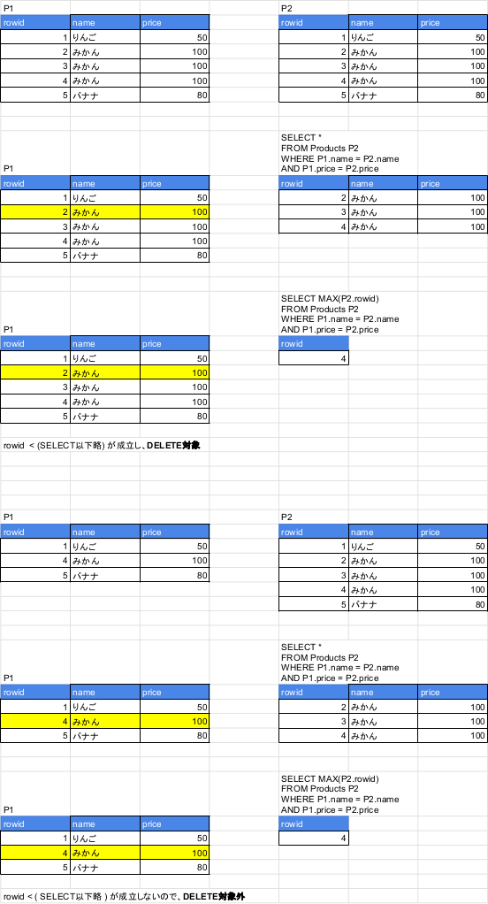
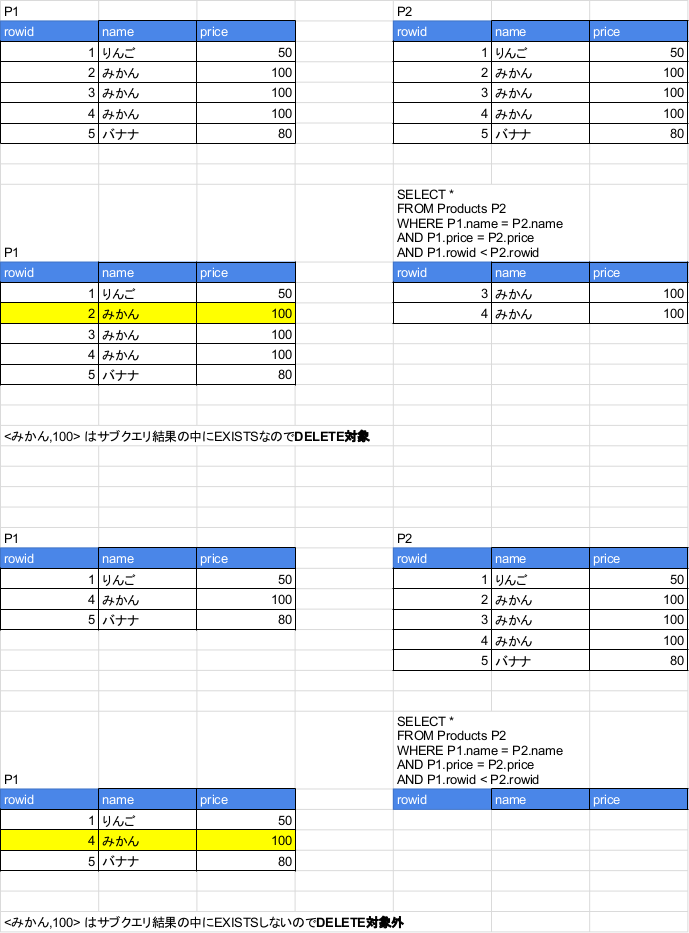

# 3. 自己結合の使い方


## 序文

### キーフレーズ

**物理**から**論理**への**跳躍**

### 自己結合(self join)とは

- 結合演算
   - 内部結合
   - 外部結合
   - クロス結合
   - ...
- 通常、異なるテーブルまたはビューに対して行われる
- **同一**のテーブルやビューに対して行えない法はない  
   = 自己結合


## 重複順列・順列・組み合わせ

[サンプル](https://sqliteonline.com/#fiddle-5c07475308ee3asdjpamcqfc)

### 「対」の種類

- 順序対 (ordered pair)  
  `<1,2> ≠ <2,1>`
- 非順序対 (unordered pair)  
  `{1,2} = {2,1}`

### 対をつくる: 自己CROSS JOIN

```sql
-- 重複順列を得るSQL
SELECT P1.name AS name_1, P2.name AS name_2
  FROM Products P1 CROSS JOIN Products P2;

```

- クロス結合=総当たり
   - 高コスト
   - 結合条件(ON句)が存在しない
       - 書けちゃうんですけどsqliteだからですか
- **物理的には`Products`という同一のテーブル**にデータが格納されていても、  
  `P1`,`P2`という別名を与えたら、それらは**論理的に別々のテーブル**
  
#### 気になった点

教科書とデータ順がちがう(辞書順になってる？)

### 重複を許して、順列(順序対)をつくる

条件なしでCROSS JOIN

### 重複を除いて、順列(順序対)をつくる

`ON name_1 <> name_2` をつけてINNER JOIN

### 重複を除いて、組み合わせ(非順序対)をつくる

- `ON name_1 < name_2` をつけてINNER JOIN
   - `=` と `>` のペアを除いている
   
### 非等値結合

`=` 以外の比較演算子を用いた結合

- `>`
- `<`
- `<>`
     
### 対(pair)から3列以上(tuple)への拡張

JOINをいっぱい重ねる


## 重複行を削除する

重複行を許すな

- [サンプル](https://sqliteonline.com/#fiddle-5c074a8208ee4asdjpamu7fb)
   - CREATEしたり、DELETEしたり、左のTableからdropしてCREATEし直したりしてご利用ください


### 自己相関サブクエリを使った方法

- JOINよろしく、相関サブクエリも同じ表に対して適用できる
- 例によって、**物理的に単一の`Product`**は別名`P1`,`P2`を与えられ、**論理的に別々なテーブル**になる
- 「実表」「導出表」というのはSQLの動作上区別して考える必要なし。  
  **どちらも等しく「集合」**
   - パフォーマンスを除けば

### 極値関数を利用する方法

<figure class="figure-image figure-image-fotolife" title="極値関数を利用する方法の動作"><figcaption>極値関数を利用する方法の動作</figcaption></figure>

### 非等値結合を利用する方法

<figure class="figure-image figure-image-fotolife" title="非等値結合を利用する方法の動作"><figcaption>非等値結合を利用する方法の動作</figcaption></figure>


## 部分的に不一致なキーの検索

[サンプル](https://sqliteonline.com/#fiddle-5c074c1c08ee6asdjpan2znd)


## 問題

値段が同じ商品の組み合わせを取得する

[サンプル](https://sqliteonline.com/#fiddle-5c07439d08edeasdjpalscx9)

テキストは「組み合わせ」(非順序対の集合)を取得できてないので自分なりの回答も添えた


## まとめ

1. 自己結合は非等値結合と組み合わせて使うのが基本
1. GROUP BYと組み合わせると、再帰的集合を作ることができる(コラムにて)
1. 本当に異なるテーブルを組み合わせていると考えると理解しやすい
1. 物理ではなく論理の世界で考える


## コラム SQLとフォン・ノイマン

[サンプル](https://sqliteonline.com/#fiddle-5c0746e708ee2asdjpamaf2r)


## 演習問題

### 3-1

[サンプル](https://sqliteonline.com/#fiddle-5c07475308ee3asdjpamcqfc)


### 3-2

[サンプル](https://sqliteonline.com/#fiddle-5c07b89208ef7asdjpb3m3ki)

