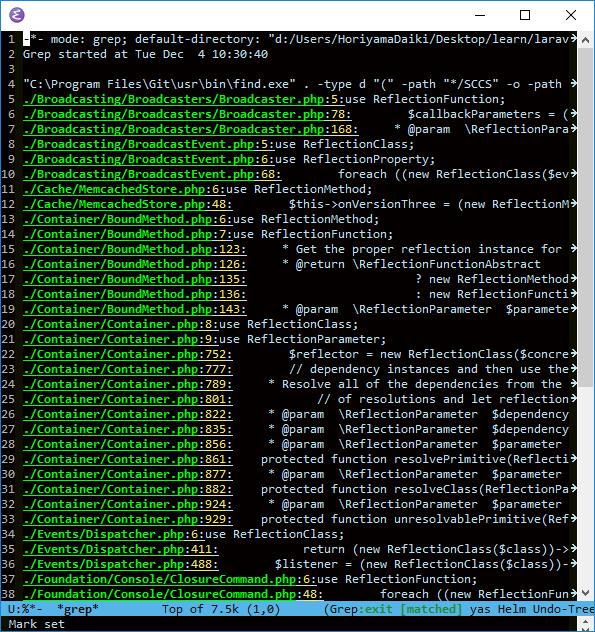
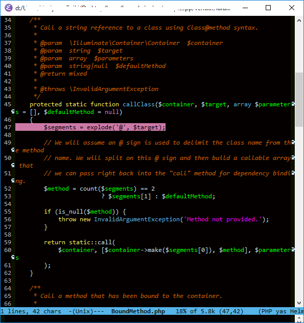

## **2019/03/21追記**

```
app()->call([$this, 'hoge']);
```

で`hoge`メソッドを呼び出せる

この中で`BoundMethod::call`が叩かれる

# 結論


- 実装はIlluminate\Container\BoundMethod
- `Illuminate\Container\BoundMethod::call(app(), $callback);`  
  で引数を自動注入できる。
   - $callbackは、[インスタンス, メソッド名] の配列を指定することで、メソッドも使用可。
- 例えばこんなとき
```php
<?php

function fuga () {
    $hoge = app()->make(Hoge::class);
    $this->piyo($hoge);
}

function piyo (Hoge $hoge) {
    /* ... */
}
```

こう書ける

```php
<?php

function fuga () {
    // 呼び出し側からhogeの4文字が消える
    BoundMethod::call(app(), [$this, 'piyo']);
}

function piyo (Hoge $hoge) {
    /* ... */
}
```


# 自動注入？

仮引数にタイプヒンティングをつけておくと、  
実引数省略時、自動的にサービスコンテナを使って依存解決してくれるやつ

## 例

例えば、こんな風に書いたとき

routes/web.php
```php
<?php

Route::get('/', 'HomeController@showIndex');
```

下記コントローラアクションが呼び出される。

App\Controller\HomeController.php
```php
<?php

    public function showIndex(Request $request)
    {
        /* ... */
    }
```

Requestクラスの$requestインスタンスが自動的に依存解決され注入されているわけです

   

## 実装を追う

### プログラム実行時に、プログラム自身を解析する ... Reflection

/vendor/laravel/framework/src/Illuminateで`reflection`でgrepをかけてみる

<figure class="figure-image figure-image-fotolife" title="emacs_rgrep_result"><figcaption>emacs_rgrep_result</figcaption></figure>

眺めていると…

<figure class="figure-image figure-image-fotolife" title="&#x27;@&#x27;で区切って何かしてそう"><figcaption>&#x27;@&#x27;で区切って何かしてそう</figcaption></figure>

これは…


```php
<?php

Route::get('/', 'HomeController@showIndex');
```

この`@`では？

ここから追ってみるぞー


### Illuminate\Container\BoundMethod

ソースコードを追っていく。適宜コメントを付与した

#### `protected static function callClass`


```php
<?php

    // $container: サービスコンテナ。 app()
    // $target: 'HomeController@showIndex' とかの文字列
    protected static function callClass($container, $target, array $parameters = [], $defaultMethod = null)
    {
        // 'クラス名@メソッド名' を'@'で分割し
        $segments = explode('@', $target);

        // メソッド名を拾う(なければ$defaultMethod)
        $method = count($segments) == 2
                        ? $segments[1] : $defaultMethod;

        if (is_null($method)) {
            throw new InvalidArgumentException('Method not provided.');
        }

        // このクラスのcallメソッドでメソッドを呼び出す
        return static::call(
            // クラス名を用いて、
            // サービスコンテナからインスタンスを取り出している
            $container, [$container->make($segments[0]), $method], $parameters
        );
    }
```


#### `public static function call()`

```php
<?php

    // callClassから呼ばれるやつ
    // $container: サービスコンテナ。 app()
    // $callback: 実行可能オブジェクト
    // - string
    // - array
    public static function call($container, $callback, array $parameters = [], $defaultMethod = null)
    {
        // $callbackがstringで、かつ
        // '@'が含まれている場合、callClassに処理をゆだねる
        // ('@'で分割されて、結局こっちに戻ってくる)
        if (static::isCallableWithAtSign($callback) || $defaultMethod) {
            return static::callClass($container, $callback, $parameters, $defaultMethod);
        }

        // $callbackがstringだが`@`が含まれない、
        // または$callbackが配列形式の場合、ここにくる
        return static::callBoundMethod($container, $callback, function () use ($container, $callback, $parameters) {
            return call_user_func_array(
                // dependenciesをgetしている。こいつが怪しいぞ
                $callback, static::getMethodDependencies($container, $callback, $parameters)
            );
        });
    }
```

#### `protected static function getMethodDependencies()`

```php
<?php

    // メソッドの依存性を取得し、明示的に指定された引数とマージして返す
    //
    // $container: サービスコンテナ
    // $callback: メソッド or 関数
    // $parameters: 明示的に指定された実引数
    // $dependencies: 指定省略された仮引数に対応する実引数をこれに入れていく
    protected static function getMethodDependencies($container, $callback, array $parameters = [])
    {
        $dependencies = [];

        // Reflector！
        // ゴールが見えてきた感じがする
        //
        // Reflectorにより仮引数情報を取得している
        foreach (static::getCallReflector($callback)->getParameters() as $parameter) {
            static::addDependencyForCallParameter($container, $parameter, $parameters, $dependencies);
        }

        return array_merge($dependencies, $parameters);
    }
```

`static::getCallReflector`は、[ReflectionFunctionAbstractインタフェース](http://php.net/manual/en/class.reflectionfunctionabstract.php)の実装クラスのインスタンスを返すよう。

[ReflectionFunctionAbstract::getParameters](http://php.net/manual/en/reflectionfunctionabstract.getparameters.php)は、[ReflectionParameter](http://php.net/manual/en/class.reflectionparameter.php)インスタンスを返す。


#### `protected static function getCallReflector()`

```php
<?php

    // $callbackに応じたReflectionFunctionAbstractを返す
    // - メソッド: ReflectionMethod
    // - 関数(クラスに属してないやつ) : ReflectionFunction
    protected static function getCallReflector($callback)
    {
        if (is_string($callback) && strpos($callback, '::') !== false) {
            $callback = explode('::', $callback);
        }

        return is_array($callback)
                        ? new ReflectionMethod($callback[0], $callback[1])
                        : new ReflectionFunction($callback);
    }
```


#### `protected static function addDependencyForCallParameter()`

```php
<?php
    // 依存性を $dependenciesに追加していく
    //
    // $contaimer: サービスコンテナ
    // $parameter: リフレクションにより得られた仮引数情報
    // &$parameters: 関数/メソッド呼び出しで明示的に指定された実引数
    // &$dependencies: 指定省略された仮引数に対応。
    //                 クラス名とサービスコンテナを用いてこれを埋めていく
    protected static function addDependencyForCallParameter($container, $parameter, array &$parameters, &$dependencies)
    {
        // 明示的に実引数($parameters)に渡されてきたものは
        // $parametersから$dependenciesに移す
        if (array_key_exists($parameter->name, $parameters)) {
            $dependencies[] = $parameters[$parameter->name];

            unset($parameters[$parameter->name]);
        // タイプヒンティングがある場合
        } elseif ($parameter->getClass()) {
            // サービスコンテナで解決し、追加
            $dependencies[] = $container->make($parameter->getClass()->name);
        // タイプヒンティングがない場合、
        // 仮引数にデフォルト値が設定されていれば、それを用いる
        } elseif ($parameter->isDefaultValueAvailable()) {
            $dependencies[] = $parameter->getDefaultValue();
        }
    }
```

#### シーケンス図

STUB

