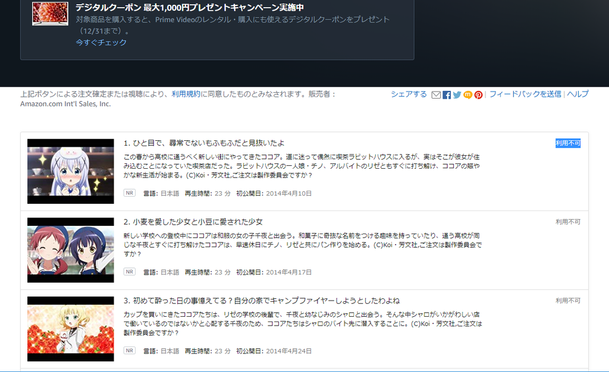

<figure class="figure-image figure-image-fotolife" title="この世の終わり"><figcaption>この世の終わり</figcaption></figure>

「今度見よ～っと」

そう言って積んでいた[Prime Videoのごちうさ](https://www.amazon.co.jp/gp/video/detail/B014GMMG86/ref=atv_wtlp_wtl_1)が2018年11月くらいから見られなくなっていた

ぼくは泣き崩れた

↓

Puppeteerを用いて[ごちうさのページ](https://www.amazon.co.jp/gp/video/detail/B014GMMG86/ref=atv_wtlp_wtl_1)を監視し、復活していたらメールを送信する環境を構築した

せっかくなので触り慣れていないDockerも絡めて勉強のタネにした

[github](https://github.com/wand2016/scraping-gochiusa)

---
