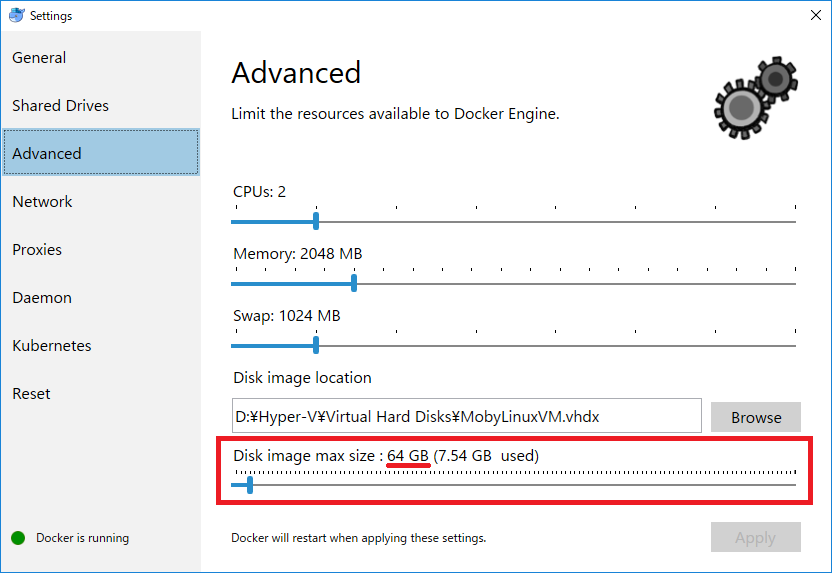
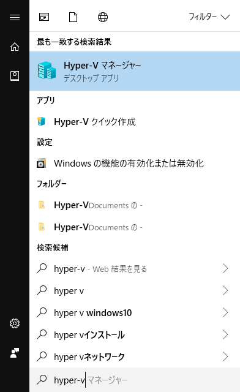
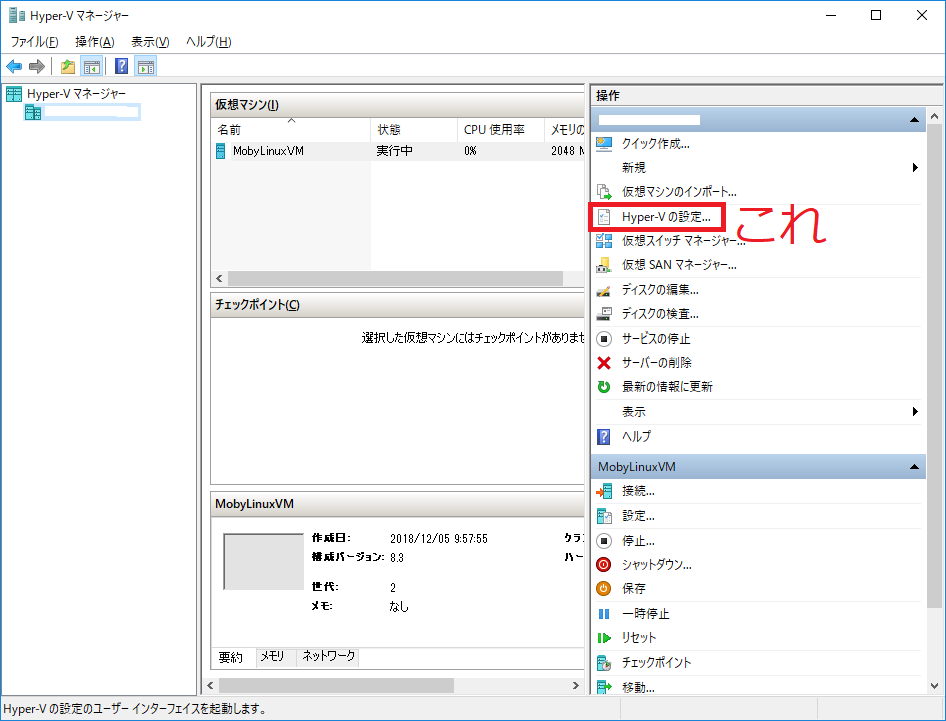
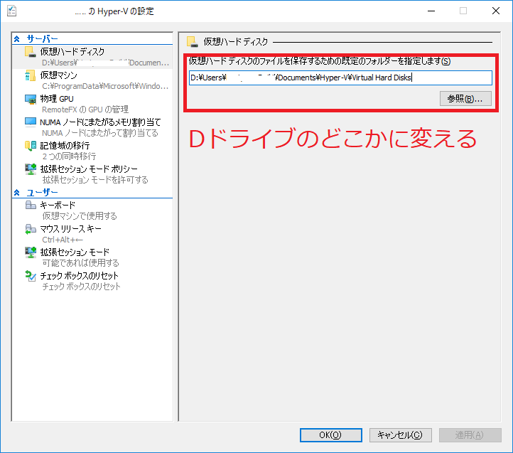
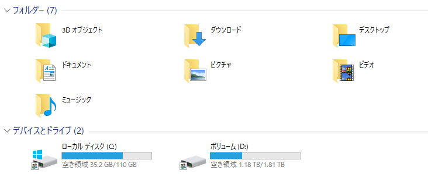
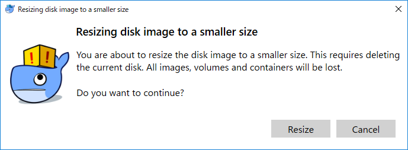

# サマリー

- dockerにCドライブを食い尽くされた
- Hyper-Vの設定変更で解決
  - Virutal hard disksをDドライブに移した

---

# 環境

- Windows 10 PRO
- Docker for Windows
    - Hyper-V上で動く

# 現象

Cドライブの容量危機

- 110GBのCドライブの空き容量が0になった
- 110GB使い切るほどいろいろ入れてないはず
- 空きを作って様子をみたところ、dockerを動かすと容量が圧迫されることが判明
    - `docker build` とかやってると、あれよあれよと減っていく
        - 朝いろいろ消して確保した4GBの空きが昼にはなくなった

# 原因

- Hyper-VのVirtual Hard Disksが  
  `C:\Users\Public\Documents\Hyper-V\Virtual hard disks`  
  にあった
- Docker for Windowsがデフォルトで64GB確保しようとしていた  
<figure class="figure-image figure-image-fotolife" title="タスクトレイ-&gt;クジラのアイコン右クリック-&gt;Settings-&gt;Advanced"><figcaption>タスクトレイ-&gt;クジラのアイコン右クリック-&gt;Settings-&gt;Advanced</figcaption></figure>

# やったこと

## Virtual Hard DiskをDドライブに移す

1. Docker for Windowsを止める
    1. タスクトレイのクジラのアイコン右クリック
    1. Quit Docker Desktop
1. Hyper-Vマネージャーを開く  
    
1. 「Hyper-Vの設定」を開く  
    
1. 「仮想ハードディスク」を選択  
1. 「仮想ハードディスクのファイルを保存するために規定のフォルダーを指定します」が  
`C:\Users\Public\Documents\Hyper-V\Virtual hard disks`  
とかになっているのを  
`D:\Users\<UserName>\Documents\Hyper-V\Virtual hard disks`  
とかに変更  

1. 仮想ハードディスクファイルを変更後の場所に移す
    - `MobyLinuxVM.vhdx`という名前だった
1. Docker for Windowsを再度起動

# 結果

- Cドライブが35GB空いた
    - Dockerは64GB確保しようとしていたので足りるわけがなかったのである  
      
    
# APPENDIX

- Hyper-Vの設定を行わずとも、Docker for Windwosの設定で完結できたかも
    - Disk image max sizeを64GBから16GB等に減らす
        - ただし、減らす場合、imageはすべて失われる  

