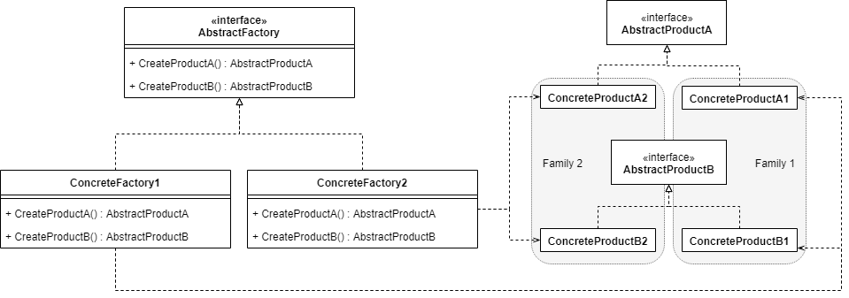
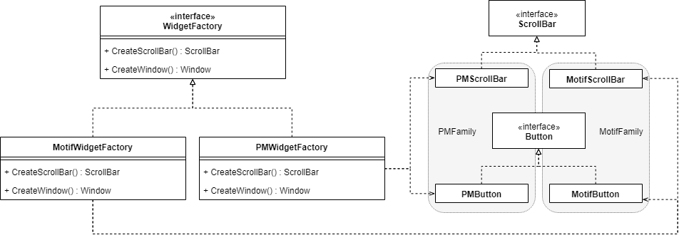

# まとめ

- 一式のオブジェクト群を生成するクラス
    - 関連がある
    - 依存がある
- ただし、利用側に具象クラスを意識させない

# 別名

Kit

# 登場人物

- AbstractFactory
    - AbstractProductを返却するメソッドのインタフェースを定義
    - メソッドに実装を持たせてもいい  
      その場合はConcreteFactoryで適宜overrideする
    - ぶっちゃけAbstractじゃなくてもいい
- ConcreteFactory
    - AbstractFactoryの実装
    - シグネチャ的にはAbstractProductを返す
        - 利用側はConcreteProductを意識しない
    - もちろん生成してreturnするのはConcreteProduct
- AbstractProduct
    - 生成するオブジェクトのクラスを抽象化したクラス
    - ScrollBarとかButtonとか
    - ファクトリ利用側はこれのみ意識する
- ConcreteProduct
    - 生成するオブジェクトのクラス
    - MotifScrollBarとかPMButtonとか
        - MotifとかPresentationManagerとかを利用側は意識しない
        - MotifButtonはMotifScrollBarと一緒に使う、といった条件を  
          利用側に意識させない
- Family
    - クラスではない
    - MotifScrollBar,MotifButton など、一緒に使うべきProduct一式

# 全体像

<figure class="figure-image figure-image-fotolife" title="一般化"><figcaption>一般化</figcaption></figure>

<figure class="figure-image figure-image-fotolife" title="もうちょい具体的なやつ"><figcaption>もうちょい具体的なやつ</figcaption></figure>

# つかいどころ

- 利用側からオブジェクトの作り方等を隠蔽したい
- インタフェースだけ公開したい
- Familyを別のFamilyに挿げ替えることがある
- 関連があり、一緒に使うべきオブジェクトがある
    - 「一緒に使う」という束縛条件を利用側に意識させない

    

# 功罪

- ファクトリ利用側に、Productの具体的なクラスを意識させない
    - 利用側コードからMotifとかPMとかいう文字列が消える
- Familyの切り替えが楽
    - Motif一式をPM一式にしたり
        - 利用側で直接newとかするとこうはいかない
- 一貫性が保たれる
    - コピペ修正漏れでMotif ScrollBar上でPM Buttonを使ってしまう、ということがなくなる
- Productの種類を増やすのは大変
    - AbstractFactoryのインタフェースの追加変更を伴う
        - 各ConcreteFactoryも影響を受ける
        
        
# 実装面

## Singleton

- ファクトリはふつう状態をもたないし、一品物でよいので、Singletonにするのがよい

## ふつうの実装

- `AbstractFactory.CreateScrollBar()`, `AbstractFactory.CreateButton()`とかを定義して、ConcreteFactoryで実装|overrideする
    - この方法だと、FamilyごとにConcreteFactoryを作る必要がある
        - Family1とFamily2の差分がProduct一種類だけでも、である
        - Familyの数が多いときつい
          
## Familyが多い場合・Family間の差分が少ない場合の実装

- Familyの種類が多い場合は、ただ一つの具象ファクトリクラスを用意し、  
  生成するConcreteProductクラスをメンバとして持たせるとよい
    - AbstractProduct名 =&gt; Concrete Productクラス の辞書を持たせる
        - partCatalog
    - クラスが第一級オブジェクトである必要がある
        - そうでない言語では、Productのプロトタイプオブジェクトを  
          partCatalogにに入れて、newの代わりにcloneする (Prototype Pattern)
          
## Productが増えても大変にならない実装

- 型安全性とのトレードオフ
- `AbstractWidget AbstractFactory.Create('button')` という感じにする
    - `ScrollBar`, `Button`等を一緒くたに扱うクラスが必要(`Widget`)
    - 危険なダウンキャストを伴う (`Widget` =&gt; `Button`)
    
    
# 型安全

- 上記「Productが増えても大変にならない実装」は型安全でない
- ファクトリ内で自身の別のメソッドを呼んで作ったAbstractProductは、  
  同じFamilyのものであることが保証されるので安全にダウンキャストできる
    - PMFactory.CreateWindow()の中でPMFactory.CreateButton()を呼び、Buttonを作ったとする
    - これは安全にPMButtonにダウンキャストできる
      

# 関連するパターン

- Singleton
- FactoryMethod
- Prototype

    
