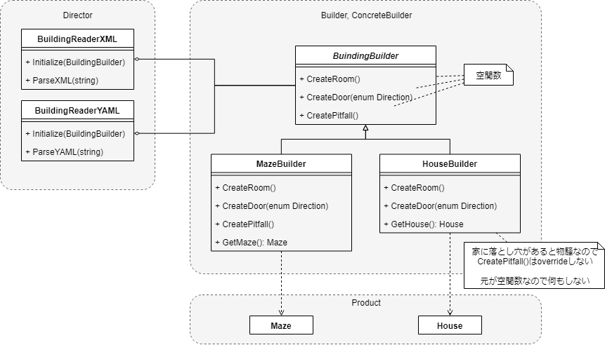

# モチベーション

- 複雑なオブジェクトについて、生成アルゴリズムを低レベルな内部表現から切り離し、高レベルなものにする
    - 高レベルな生成アルゴリズムの例
      - XMLを読み込みます
      - `<room>`ノードがあれば、部屋をつくります
      - `<room>`2つに紐づいた`<door>`ノードがあれば、部屋を扉で仕切ります
    - 低レベルな内部表現の例
      - MazeはRoomとDoorからなります
      - Roomは4方向のドアを4つのフラグで管理します
      - Doorは開錠済フラグをもちます
- 内部表現の知識はBuilderクラスに持たせる
- Builderを差し替えても、生成アルゴリズムは流用できる
    - 迷路を構築する`MazeBuilder`を、  
      家を構築する`HouseBuilder`に差し替えたら、  
      同じ間取りの家`House`オブジェクトが得られる
- 生成アルゴリズムを差し替えても、Builderは流用できる
    - YAML読み込みに変えても`MazeBuilder`はそのまま使える

# 登場人物

- Product
    - 生成される複雑なオブジェクト
- Builder
    - Product構築処理のインタフェースを定義する抽象クラス
    - Productの**取得処理のインタフェースは定義しない**
    - ConcreteBuilderの基底
- ConcreteBuilder
    - Builder派生の具象クラス
    - Productの部品を集積・Productを構築していく
    - Productの内部表現と構築のしかたを知っている
    - Productの取得処理を定義・実装
- Director
    - ConcreteBuilderで初期化される
    - クライアントからの構築要請(例:迷路をつくれ)を  
      Builderに委譲する(例:部屋を作れ、部屋を作れ、扉で仕切れ)
    - Productの取得処理は委譲しない
        - Productは汎化しないため、できない

# 全体像

# クライアントコードからの利用

- クライアントコードはDirectorをインスタンシエートし、ConcreteBuilderオブジェクトで初期化
- クライアントコードはDirectorにProductオブジェクトの構築を命じる
- DirectorはBuilderにProductを構築させる
- クライアントコードは、生成されたProductオブジェクトをBuilderから取り出す

    

# 功罪

- Productがさまざまな内部表現をもてる
    - DirectorはProductの内部表現を知らない
    - 異なる内部表現を追加したくなったら、新たなConcreteBuilderを定義しさえすればよい
- Productの生成アルゴリズム(Director)と内部表現(ConcreteBuilder)との分離
    - 別のDirectorから、ConcreteBuilderを使いまわせる
- 構築処理をきめ細やかに制御できる
    - 生成物をきめ細やかに制御できるということである
    - 構築処理はstep-by-step
    - BuilderからProductを取り出して初めておわり

        
# 実装面で考えるべきこと

## Builderクラスの構築処理のインタフェース

- 全ConcreteBuilderをカバーする、十分に汎用的なものである必要あり
    - 構築処理は「末尾に追加」されるのが普通だが、それをインタフェースに含めてはいけない
    - そうじゃない例
        - 例1) 迷路  
          (部屋)-(部屋)  
          が  
          (部屋)-(扉)-(部屋)  
          になる
        - 例2) 構文木  
          木がroot側に育っていく

## Productは汎化しない

- 過度な汎化
    - 違いすぎて、共通の規定をもうけるうまみがない
- クライアントコードがDirectorにConcreteBuilderを設定して初期化するので、  
  クライアントコードは欲しいProductを当然知っている。  
  したがってProductを抽象化する必要がない

## 基底のBuilderのメソッドは空の処理

- Directorからリクエストされる構築処理をデフォルト全無視にしておく
    - そのため、あえてinterfaceや完全抽象クラスにはしない
- ConcreteBuilderで、必要なものだけoverrideする

# 用例

- コンパイラ
- ClassBuilder  
  Classが自身のサブクラスをBuildするために使用するBuilder。  
  この例では、ClassはDirectorであると同時にProductでもある
      

# 関連するパターン

- AbstractFactory
    - 「複雑なオブジェクトを生成しうる」という点は似ている
- Composite
    - 複雑なProduct = Compositeだったりする

## BuilderとAbstarctFactoryとのちがい

||Builder|AbstractFactory|
|---|---|---
|主眼|複雑なオブジェクトを step-by-stepで構築すること|一緒に使われるべきオブジェクトを 一式で構築すること|
|生成したオブジェクトの取得|構築がすんだらBuilderから取り出してもらう|returnで即時返却|

