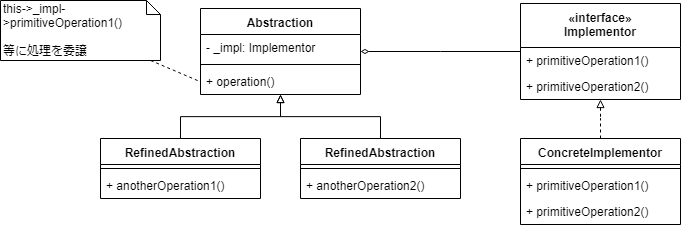

# ねらい

- 種類に関する継承ツリー(`Abstraction`)と実装に関する継承ツリー(`Implementor`)を分離する
    - 種類に関する継承ツリー
        - Window
        - IconWindow
        - DialogWindow
    - 実装に関する継承ツリー
        - WindowsWindowImp
        - MacOSWindowImp

# 別名

Handle/Body

# モチベーション

- 種類と実装を一つの継承ツリーに盛り込むとクラス数が爆発して大変なことになる
    - 種類を追加するたびに実装派生クラスを追加しないといけない
        - TransientWindowsWindow
        - TransientMacOsWindow
    - 実装を追加するたびに種類ぶんだけクラスを追加しないといけない
        - CentOSWindow
        - IconCentOsWindow
        - DialogCentOsWindow
- 種類(`Abstraction`)と実装(`Implementor`)を分離し、別々に拡張できるようにする

# つかいどころ

- 種類の抽象化と実装とを結合させたくない
    - 実行時に選択したり挿げ替えたりしたい
- 種類と実装とを別々に拡張したい
- 実装が変わってもクライアントコードに再コンパイルが生じないようにしたい
- 【C++】ヘッダ定義中のprivateメンバを隠したい
    - Pimplイディオム
- クラス数が爆発してやばい
    - nested generalizations
- 実装を複数オブジェクト間で共有し、かつクライアントコードからそのことを隠蔽したい

# 構造

# 登場人物

- `Abstraction`
    - 種類に関する抽象化を行うクラス
    - `Implementor`オブジェクトへの参照を保持する
    - 冒頭の例でいうところの`Window`
- RefinedAbstraction
    - `Abstraction`の派生
    - `Window`の例でいうところの`IconWindow`とか
- `Implementor`
    - `Abstraction`が仕事をぶん投げる先のクラス
    - `Abstraction`のインタフェースと対応している必要はない
        - `Implementor`のインタフェースは低レベル
            - 「線を描く」
            - 「円弧を描く」
        - `Abstraction`のインタフェースは`Implementor`のものに基づいた高レベルなもの
            - 「棒人間を描く」
- `ConcreteImplementor`
    - `Implementor`の実装クラス
    
    
# クライアントコードからの利用

- クライアントは`Abstraction`のメソッドを呼ぶ
- `Abstraction`は`Implementor`に処理を委譲する

# 結果

- インタフェースと実装とが分離される
    - 実行時に挿げ替え可能
    - コンパイル時の依存が断たれる
        - `ConcreteImplementor`の実装に変更があっても、`Abstraction`やクライアントコードに再コンパイルが生じない
    - システムがいい感じにレイヤ分けされる
        - 上の層が細かいことを知りすぎない
- 拡張性の向上
    - `Abstraction`と`Implementor`との継承ツリーを独立して拡張できる
- 実装の隠蔽

# 実装にあたり考えるべきこと

- `Implementor`が1つしかないパターン
    - degenerated Bridge
    - 無意味...ではない
        - `ConcreteImplementor`に変更があっても`Abstraction`以上のレイヤには再コンパイルが生じない
        - 【C++】Pimplイディオム
            - ヘッダ中のprivateメンバを隠したい
- 「正しい」`ConcreteImplementor`実装クラスを、いつどうやって決めるか
    - `Abstraction`が決める
        - 「要素数」を受け取り、少なければ2分木、多ければHashとか
        - cf. Strategy Pattern  
          「少なければバブルソート、多ければマージソート」とかはStrategy
    - Abstract Factoryに決めさせる
- `Implementor`オブジェクトの共有
    - 参照カウントを搭載し、解放忘れを回避、といったこともできる
        - Bridgeパターン関係なくね？？
    - C++11で追加された、`shared_ptr<T>`みたいなかんじ
        - `shared_ptr<T>`に関してはDecoratorパターンな気もする
            - `T*`としての透過性を維持しつつ「参照カウントが0になったら解放」という機能を付与している
- 多重継承
    - C++などでは、`Abstraction`をpublicで、`ConcreteImplementor`をprivateで多重継承することができる
    - が、`ConcreteImplementor`と密結合してしまうのであらゆるメリットが失われる

# 関連するパターン

- Abstract Factory
    - `Implementor`の生成
- Adaptorとの対比
    - Adapterは、Bridgeの登場人物でいうと、既製`Implementor`を後付けで`Abstraction`で包む感じ
    - Bridgeは、設計段階で`Abstraction`と`Implementor`を前もって用意しておく
- Strategyとの対比 (ぼく解釈)
    - Bridgeパターンにおける`Implementor`は状態込みでの「実装」
    - Strategyパターンにおける`Strategy`は状態をもたず、ロジックのみ
        - 状態は`Abstraction`がもつ
        - 状態を持たないので、Flyweightと併用できる

----------------------------------------

# 英語

- gear toward
    - ～に合わせて調整する
- up-front(形、副)
    - 前もって(の)、あらかじめ(の)
