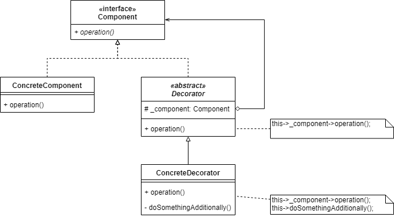
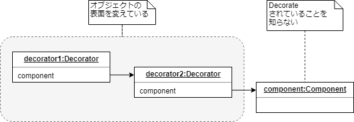
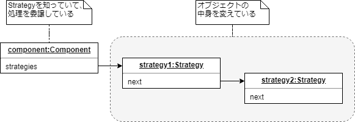

# ねらい

- オブジェクトに責務を動的に追加する

# AKA

- Wrapper
    - AdapterもWrapperであるが、大きく異なる
        - 最後の「関連するパターン」にて

# モチベーション

- クラス全体にではなく、個々のオブジェクトに責務を追加したいことがある
- 継承で実現するのはイマイチ
    - 静的に責務が決まってしまい、柔軟でない
    - 責務の組み合わせにしたがい継承していくとサブクラス数が爆発する
- 集約で実現するのがよい
    - 透過的なオブジェクトで包む
    - クライアントや包まれるオブジェクトは「透過的なオブジェクト」を意識しない
        - もちろん包む処理自体は除く

# つかいどころ

- 個々のオブジェクトに責務を動的に追加したい
- 責務がオプショナル
- 責務の追加を継承で実現するのが困難なケース
    - クラス数の爆発が予想される
    - クラス定義が隠されている

# 構造

# 登場人物

- `Component`
    - インタフェース
    - 包まれるやつ
    - 責務の追加対象
- `ConcreteComponent`
    - `Component`を実装するクラス
- `Decorator`
    - `Component`を実装する抽象クラス
    - 包む`Component`オブジェクトへの参照を保持
    - すべての操作についてデフォルト動作を定義  
      `Component`オブジェクトに処理を委譲する
        - Transparent Enclosure
- `ConcreteDecorator`
    - `Decorator`派生
    - 責務を追加する
        - 操作をオーバライドし、前もしくは後に処理を追加する

# クライアントコードからの利用

- `Decorator`でデコレートされていようがいまいが、`Component`オブジェクトとして扱える(透過性)

# 功罪

## 功

- 継承よりも柔軟
    - クラス数の爆発を回避できる
    - 同じデコレーションを複数回適用できる
        - BorderDecoratorを2回適用することで、2重ボーダーを適用できる
        - 継承で実現しようとすると、同じクラスを2回継承することになり、おそらくエラーになる
- 機能盛りだくさんなクラスがCompositeクラスツリーの根っこ側に来るのを避けられる
    - 継承で実現しようとすると、追加されうるすべての機能を、ツリーの根っこ側で定義しなければならない
    - 結果、機能盛りだくさんで複雑なクラスができてしまう
        - ある機能の追加のために、関係ない機能が影響をうけがちになる
    - Decoratorで実現すれば、単機能のシンプルな`Decorator`クラスに切り分けることができる

## 罪

- `Decorator`オブジェクトで包んだオブジェクトは`Component`として**透過的に扱えるが**、  
  包む前の`Component`オブジェクトと**同一のオブジェクトではない**ことに注意
    - 安易に `==` 等で比較できなくなる
- 小さな`Decorator`オブジェクトが大量に生まれる
    - しかも全部似ている
        - 基本的に処理を委譲する
        - 機能を追加する部分だけ、前後で何かする
    - 不慣れな人のアサイン障壁になる
        - 【所感】勉強してくれ
    

# 実装にあたり考えるべきこと

- `Decorator`は`Component`インタフェースに準拠すること
    - これはextendsとかimplementsとかで実現する
- 抽象クラス`Decorator`を省く
    - `Component`インタフェースを`ConcreteDecorator`が直接実装する
        - 「処理を委譲するデフォルト動作」も`ConcreteDecorator`に書くことになる
    - `ConcreteDecorator`が一つしかないならこれでいい
- `Component`インタフェースをシンプルに
    - データを保持すべきではない
        - 【所感】だからわざわざ本記事では「インタフェース」と書いている
    - データ保持は`Component`実装クラスに任せる
        
        
# Strategyパターンとの対比

<figure class="figure-image figure-image-fotolife" title="Decorator"><figcaption>Decorator</figcaption></figure>

<figure class="figure-image figure-image-fotolife" title="Strategy"><figcaption>Strategy</figcaption></figure>

- Decoratorは表面を変える
    - `Component`はDecoratorに包まれることを認知しない
- Strategyは中身を変える
    - `Component`はStrategyのことを知っていて、処理をStrategyオブジェクトに委譲する
- `Component`が巨大で、Transparent Enclosureを作るのがコストオーバーな場合は、Strategyパターンのほうが適切
    - 【所感】PHPなんかだとマジックメソッド`__call()`があるから楽ですね

# 関連するパターン

- Adapter
    - ともに「Wrapper」として知られるが、大きく異なる
        - Decorator: 透過的=インタフェースを変えない、責務を追加する
        - Adapter: インタフェースを変える
- Composite
    - Decoratorは、子ノードを1つしかもたない特別なCompositeパターンであるといえる
    - ただし、力点は異なる
        - Composite: 部分-全体構造を作ること
        - Decorator: 責務を追加すること
- Strategy
    - Decoratorがオブジェクトの「表面を変える」のに対して、Strategyは「中身を変える」
    - 適材適所
    

----------------------------------------

# 英語

- liability
    - (benefitsと対になることば)
        - 「責任」と訳されるが、負い目、負債といった負の側面が強調されるっぽい
- proliferate
    - 増殖
        - クラス数が爆発するときなどにつかう
            - an explosion of subclasses
        - 本文では出てこなかったが、他のパターンの説明でしょっちゅう出てくる単語
- error-prone
    - エラーになりがちな
        - コンパイルが通らなそうなコードとかを表現する言葉
- feature-laden
    - 機能が盛りだくさんな
- pay-as-you-go
    - 使った分だけ払う方式の
        - 本文では機能が必要になった文だけ実装する、という意味合いで使われている
        - Incremental
- comformance
    - 準拠
        - インターフェースが合致している、という文脈で使用
- gut
    - (skinと対になる言葉)
        - 表面/中身といった訳が適切か
- adorn
    - decorateと同義
    - embellishとも一緒に出てきた
- full-fledged
    - 一人前の
        - 羽が全部生えそろっていることを意味する
        - 病気やスキャンダルが進展・発展した際にも使われる
        - 本文では、`Component`インターフェースの膨大なシグネチャを全部implementした、といった意味で使われている
        
        
