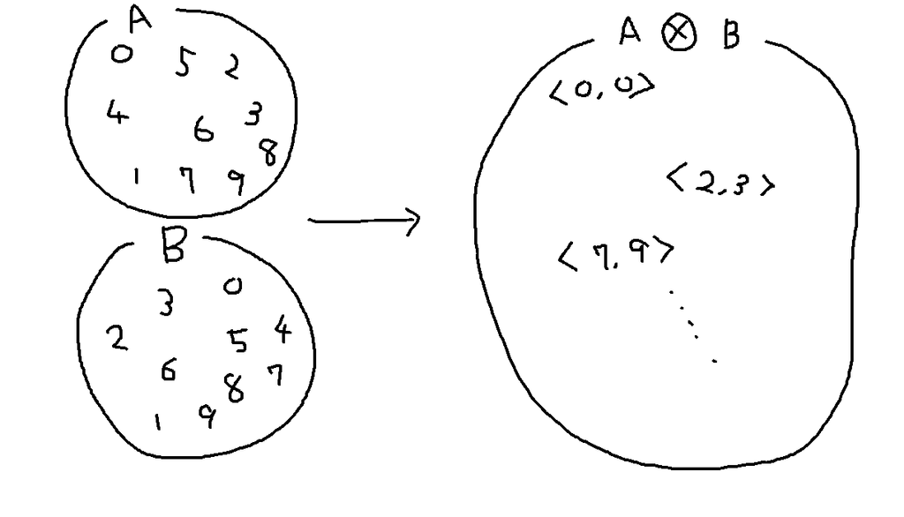

の輪読会資料


# まとめ

- SQLのデータの扱い方は2通り
    - 順序のない集合
        - 集合と述語
    - 順序集合
        - ウィンドウ関数
- 全称文の表し方は2通り
    - 存在文と2重否定に同値変形(5章)
        - `∀xPx = ￢∃x￢Px`
    - 【補】集約(6章)
        - 「ぜんぶおなじ」: `MIN` = `MAX`
            - 比較可能なデータ型であること(全順序)
        - もっと複雑なやつ: `SUM(特性関数)` とか
            - 複雑な部分を特性関数に押し込める


# はじめに

- 関係モデルのデータ構造には「順序」という概念がない
- RDBのテーブルやビューにも行列の順序がない
    - ORDER BYはカーソル定義の一部
- SQLも、もともと順序集合を扱う目的ではできていない
    - ので、もともと順序集合を扱う文化とは異なるアプローチをとった
        - 述語論理の量子化
            - 後で出てくる「単調増加と単調減少」のような例
        - 順序数を定義する再帰集合
            - 【補】p.57
                - `0 := φ`
                - `1 := {0}`
                - `2 := {0, 1}`
                - ...
- 近年、ウィンドウ関数で順序集合を直接的に扱えるようになった
- 新旧の解法を比較し、本質をとらえるのが趣旨


# 連番を作ろう

## 00から99までの100個の数の中には、0,1,2,......9の各数字はそれぞれ何個含まれるか

<font color="#bbbbbb">

||||||||||||
|---|---|---|---|---|---|---|---|---|---|
| 00 | 0<font color="green">1</font> | 02 | 03 | 04 | 05 | 06 | 07 | 08 | 09 |
| <font color="red">1</font>0 | <font color="red">1</font><font color="green">1</font> | <font color="red">1</font>2 | <font color="red">1</font>3 | <font color="red">1</font>4 | <font color="red">1</font>5 | <font color="red">1</font>6 | <font color="red">1</font>7 | <font color="red">1</font>8 | <font color="red">1</font>9 |
| 20 | 2<font color="green">1</font> | 22 | 23 | 24 | 25 | 26 | 27 | 28 | 29 |
| 30 | 3<font color="green">1</font> | 32 | 33 | 34 | 35 | 36 | 37 | 38 | 39 |
| 40 | 4<font color="green">1</font> | 42 | 43 | 44 | 45 | 46 | 47 | 48 | 49 |
| 50 | 5<font color="green">1</font> | 52 | 53 | 54 | 55 | 56 | 57 | 58 | 59 |
| 60 | 6<font color="green">1</font> | 62 | 63 | 64 | 65 | 66 | 67 | 68 | 69 |
| 70 | 7<font color="green">1</font> | 72 | 73 | 74 | 75 | 76 | 77 | 78 | 79 |
| 80 | 8<font color="green">1</font> | 82 | 83 | 84 | 85 | 86 | 87 | 88 | 89 |
| 90 | 9<font color="green">1</font> | 92 | 93 | 94 | 95 | 96 | 97 | 98 | 99 |

</font>

- 計20個
    - <font color="red">10の位</font>: 10個
    - <font color="green">1の位</font>: 10個


**ある数を「文字列」として捉えると、各位の数字の組み合わせとして表現できる**


## 0-99の連番を作る

## 1-542の連番を作る

## シーケンスビューを作る

## シーケンスビューから1-100まで取得

[sqlite online](https://sqliteonline.com/#fiddle-5c216464d29a2er2jq2x9hmi)


## 【補】0-255の連番をつくる

べつに10進数にこだわる必要もない

[sqlite online](https://sqliteonline.com/#fiddle-5c21571ed299cer2jq2v8ni3)


## この連番生成方法について

<figure class="figure-image figure-image-fotolife" title="勉強に飽きて唐突にお絵描きしたくなった"><figcaption>勉強に飽きて唐突にお絵描きしたくなった</figcaption></figure>

- 数の「順序」という性質を使っていない
    - 各位の数字の組み合わせ = 集合 = 順序がない
        - 集合の元は`<10の位, 1の位>`という順序対なので注意


# 欠番を全部求める

欠番のない連番との差分を求めればよい


## 差集合演算

[sqlite online](https://sqliteonline.com/#fiddle-5c216464d29a2er2jq2x9hmi)

## 【演習】NOT EXIST

```sql
-- 欠番を求める -- 外部結合/中間テーブル
SELECT Sequence.seq AS seq_dense,
       SeqTbl.seq   AS seq_sparse
  FROM Sequence
  LEFT OUTER JOIN SeqTbl ON seq_dense = seq_sparse
 WHERE seq_dense BETWEEN (SELECT MIN(SeqTbl.seq) FROM SeqTbl) 
                     AND (SELECT MAX(SeqTbl.seq) FROM SeqTbl);
```

## 【演習】外部結合

```sql
-- 欠番を求める -- 外部結合/中間テーブル
SELECT Sequence.seq AS seq_dense,
       SeqTbl.seq AS seq_sparse
  FROM Sequence
  LEFT OUTER JOIN SeqTbl ON seq_dense = seq_sparse
 WHERE seq_dense BETWEEN (SELECT MIN(SeqTbl.seq) FROM SeqTbl) 
                     AND (SELECT MAX(SeqTbl.seq) FROM SeqTbl);
```


| seq_dense | seq_sparse |
|-----------|------------|
| 1         | 1          |
| 2         | 2          |
| 3         | null       |
| 4         | 4          |
| 5         | 5          |
| 6         | 6          |
| 7         | 7          |
| 8         | 8          |
| 9         | null       |
| 10        | null       |
| 11        | 11         |
| 12        | 12         |


```sql
-- 欠番を求める -- 外部結合
SELECT Sequence.seq AS seq
  FROM Sequence
  LEFT OUTER JOIN SeqTbl ON Sequence.seq = SeqTbl.seq
 WHERE Sequence.seq BETWEEN (SELECT MIN(SeqTbl.seq) FROM SeqTbl) 
                        AND (SELECT MAX(SeqTbl.seq) FROM SeqTbl)
   AND SeqTbl.seq IS NULL;
```


| seq |
|-----|
| 3   |
| 9   |
| 10  |


# 3人なんですけど、座れますか？

[sqlite online](https://sqliteonline.com/#fiddle-5c22a056d29b8er2jq49f2kr)


## NOT EXISTS

- 全座席を対象に、連続3座席をピックアップ
- 間がすべて空の席ならOK


OK
<font color="#bbbbbb">

| 1  | 2  | <font color="blue">3</font>  | <font color="blue">4</font>  | <font color="blue">5</font> |6 | 7  | 8  | 9  | 10 | 11 | 12 | 13 | 14 | 15 |
|----|----|----|----|----|----|----|----|----|----|----|----|----|----|----|
| 占 | 占 | <font color="green">空</font> | <font color="green">空</font> | <font color="green">空</font> | 占 | 空 | 空 | 空 | 空 | 空 | 占 | 占 | 空 | 空 |

</font>

NG
<font color="#bbbbbb">

| 1  | 2  | 3  | <font color="blue">4</font>  | <font color="blue">5</font>  | <font color="blue">6</font>  | 7 | 8  | 9  | 10 | 11 | 12 | 13 | 14 | 15 |
|----|----|----|----|----|----|----|----|----|----|----|----|----|----|----|
| 占 | 占 | 空 | <font color="green">空</font> | <font color="green">空</font> | <font color="red">占</font> | 空 | 空 | 空 | 空 | 空 | 占 | 占 | 空 | 空 |

</font>


## ウィンドウ関数

- 空の席だけを対象に、連続3座席をピックアップ(seat ～ end_seat)
- 全座席でみたときに、seat ～ end_seat が連続3座席になっていればOK


OK
<font color="#bbbbbb">

| 1  | 2  | <font color="green">3</font>  | <font color="green">4</font>  | <font color="green">5</font>  | 6  | 7  | 8  | 9  | 10 | 11 | 12 | 13 | 14 | 15 |
|----|----|----|----|----|----|----|----|----|----|----|----|----|----|----|
| 占 | 占 | <font color="blue">空</font> |<font color="blue">空</font> | <font color="blue">空</font> | 占 | 空 | 空 | 空 | 空 | 空 | 占 | 占 | 空 | 空 |

</font>

NG
<font color="#bbbbbb">

| 1  | 2  | 3  | <font color="green">4</font>  | <font color="green">5</font>  | <font color="green">6</font>  | <font color="red">7</font>  | 8  | 9  | 10 | 11 | 12 | 13 | 14 | 15 |
|----|----|----|----|----|----|----|----|----|----|----|----|----|----|----|
| 占 | 占 | 空 | <font color="blue">空</font> | <font color="blue">空</font> | 占 | <font color="blue">空</font> | 空 | 空 | 空 | 空 | 占 | 占 | 空 | 空 |

</font>


## 【補】前者の考え方で、ウィンドウ関数で書けないか？


>    - 全座席を対象に、連続3座席をピックアップ
>    - 間がすべて空の席ならOK
> 
> 
>    OK
>    <font color="#bbbbbb">
> 
>    | 1  | 2  | <font color="blue">3</font>  | <font color="blue">4</font>  | <font color="blue">5</font> |6 | 7  | 8  | 9  | 10 | 11 | 12 | 13 | 14 | 15 |
>    |----|----|----|----|----|----|----|----|----|----|----|----|----|----|----|
>    | 占 | 占 | <font color="green">空</font> | <font color="green">空</font> | <font color="green">空</font> | 占 | 空 | 空 | 空 | 空 | 空 | 占 | 占 | 空 | 空 |
> 
>    </font>
> 
>    NG
>    <font color="#bbbbbb">
> 
>    | 1  | 2  | 3  | <font color="blue">4</font>  | <font color="blue">5</font>  | <font color="blue">6</font>  | 7 | 8  | 9  | 10 | 11 | 12 | 13 | 14 | 15 |
>    |----|----|----|----|----|----|----|----|----|----|----|----|----|----|----|
>    | 占 | 占 | 空 | <font color="green">空</font> | <font color="green">空</font> | <font color="red">占</font> | 空 | 空 | 空 | 空 | 空 | 占 | 占 | 空 | 空 |
> 
>    </font>

- こっちの方が断然直感的じゃないですか
    - **「3」**という知識が1回しか出てこないのが良い
- ウィンドウ関数でこれを書けないか？ =&gt; **あまり綺麗になりませんでした**


### クソクエリ

```sql
-- 人数分の空席を探す:補1 ウィンドウ関数
SELECT seat,
       '～',
       seat + seat_count - 1 AS end_seat
  FROM (SELECT seat,
               MIN(status) OVER W AS lower_status,
               MAX(status) OVER W AS upper_status,
               -- 3シート集計してくれる保証はない
               -- 14, 15 で終わりとか
               COUNT(seat) OVER W AS seat_count
          FROM Seats
        -- 3シートずつ集計する
        WINDOW W AS (ORDER BY seat
                         ROWS BETWEEN CURRENT ROW
                                  AND (3 - 1) FOLLOWING))

 WHERE seat_count = 3      -- ちゃんと3シート集計してくれていて
   AND upper_status = '空' -- ウィンドウ関数の集計範囲のシートが全部同status
   AND lower_status = '空' -- かつ、そのstatusというのが空
;
```

- 「連続3座席が全部空」というのを`MAX(status) = MIN(status) = 空` で表現
    - cf. 6節 HAVING句の力 p.123
- **「3座席」である保証がない**ので`COUNT`も必要なのが残念
    - (1,2,3), (2,3,4), ... ,(13,14,15), **(14,15), (15)**
    - これのせいで「3」という知識をまとめることはできない
- 同じウィンドウ関数`W`を何度も適用しているのが見るからにやばい


### まあまあクエリ


```sql
-- 人数分の空席を探す:補2 ウィンドウ関数 + 特性関数
SELECT seat,
       '～',
       seat + seat_available_count - 1 AS end_seat
  FROM (SELECT seat,
               -- 空シートを1、それ以外をNULLとする特性関数を通して総和
               -- 集計対象のシートが全部空なら、集計件数になる
               SUM(CASE WHEN status = '空' THEN 1
                        ELSE NULL
                        END) OVER W AS seat_available_count
          FROM Seats
        -- 3シートずつ集計する
        WINDOW W AS (ORDER BY seat
                         ROWS BETWEEN CURRENT ROW
                                  AND (3 - 1) FOLLOWING))

 WHERE seat_available_count = 3  -- 集計範囲で3シート空いていること
 ;
```


- コメントを消して冒頭のSELECT句を1行にまとめれば、p.206のクエリと同じくらいの行数
- 「連続3座席が全部空」というのを`SUM(特性関数(status)) = COUNT(status) = 3` で表現
    - `空`を`1`、他を`NULL`とする
- **「3座席」である保証がないので`COUNT`も必要**なのはおなじ


# 折り返しのある数列

- 略
- 座席を座席列`line_id`ごとに**類別**すればいいだけ
    - ウィンドウ関数は、`PARTITION BY`句として直接サポート


# (狭義の)単調増加と単調減少

[sqlite online](https://sqliteonline.com/#fiddle-5c22ba4bd29beer2jq4ddhsz)

- `a_0 < a_1 < a_2 < ...` ってやつ
- 狭義なので `a_0 <= a_1 <= a_2 < ...` は含めない


## 【補】別解

```sql
-- 自己結合でシーケンスをグループ化
SELECT MIN(deal_date) AS start_date,
       '～',
       MAX(deal_date) AS end_date
  FROM (SELECT M1.deal_date,
               COUNT(M2.row_num) - MIN(M1.row_num) AS gap
          FROM MyStockUpSeq M1 INNER JOIN MyStockUpSeq M2
            ON M2.row_num <= M1.row_num
         GROUP BY M1.deal_date) TMP
 GROUP BY gap;
```

は

```sql
-- ウィンドウ関数による解法
SELECT MIN(deal_date) AS start_date,
       '～',
       MAX(deal_date) AS end_date
  FROM (SELECT deal_date,
               ROW_NUMBER() OVER (ORDER BY row_num) - row_num AS gap
          FROM MyStockUpSeq) TMP
 GROUP BY gap;
```

でもいい


### 別解解説


#### 教科書の解答: サブクエリ内で自己結合している

p.211の解答のサブクエリをほぐすと、以下に行きつく


```sql
-- 自己結合でシーケンスをグループ化
SELECT M1.deal_date,
       COUNT(M2.row_num) cnt,
       MIN(M1.row_num) min_row_num,
       COUNT(M2.row_num) - MIN(M1.row_num) AS gap
  FROM MyStockUpSeq M1 INNER JOIN MyStockUpSeq M2
    ON M2.row_num <= M1.row_num
 GROUP BY M1.deal_date;
```

<font color="gray">

| deal_date  | <font color="red">cnt</font> | min_row_num | gap |
|------------|------------------------------|-------------|-----|
| 2018-01-08 | <font color="red">1</font>   | 2           | -1  |
| 2018-01-16 | <font color="red">2</font>   | 7           | -5  |
| 2018-01-17 | <font color="red">3</font>   | 8           | -5  |
| 2018-01-18 | <font color="red">4</font>   | 9           | -5  |

</font>

cntを求めるために自己結合している


<font color="gray" style="float:left">

M1

| deal_date  | min_row_num                |
|------------|----------------------------|
| 2018-01-08 | <font color="red">2</font> |
| 2018-01-16 | 7                          |
| 2018-01-17 | 8                          |
| 2018-01-18 | 9                          |

</font>

<font color="gray" style="float:right">

M2

| deal_date  |  min_row_num |
|------------|--------------|
| 2018-01-08 | <font color="red">2</font> |
| 2018-01-16 |  7           |
| 2018-01-17 |  8           |
| 2018-01-18 |  9           |

</font>

<p style="clear:right"></p>


<font color="gray" style="float:left">

M1

| deal_date  | min_row_num                |
|------------|----------------------------|
| 2018-01-08 | 2                          |
| 2018-01-16 | 7                          |
| 2018-01-17 | <font color="red">8</font> |
| 2018-01-18 | 9                          |

</font>

<font color="gray" style="float:right">

M2

| deal_date  | min_row_num                |
|------------|----------------------------|
| 2018-01-08 | <font color="red">2</font> |
| 2018-01-16 | <font color="red">7</font> |
| 2018-01-17 | <font color="red">8</font> |
| 2018-01-18 | 9                          |

</font>

<p style="clear:right"></p>


#### 同じことをウィンドウ関数でやる

結局欲しいのはこれ

<font color="gray">

| deal_date  | <font color="red">cnt</font> | row_num | gap |
|------------|------------------------------|-------------|-----|
| 2018-01-08 | <font color="red">1</font>   | 2           | -1  |
| 2018-01-16 | <font color="red">2</font>   | 7           | -5  |
| 2018-01-17 | <font color="red">3</font>   | 8           | -5  |
| 2018-01-18 | <font color="red">4</font>   | 9           | -5  |

</font>


ウィンドウ関数で求めるとこうなる


```sql
-- ウィンドウ関数でもいい
SELECT deal_date,
       ROW_NUMBER() OVER (ORDER BY row_num) AS cnt,
       row_num,
       ROW_NUMBER() OVER (ORDER BY row_num) - row_num AS gap
  FROM MyStockUpSeq;
```
