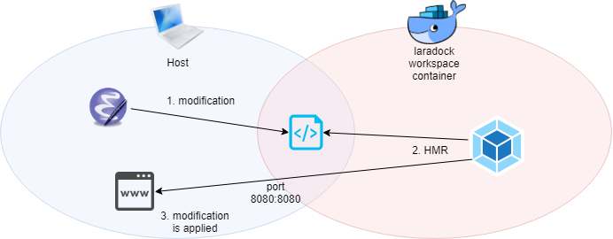

# 環境

- [Laravel 5.5 LTS](http://laravel.jp/)
- on [laradock](https://laradock.io/)
- on Windows 10 PRO

# やったこと


<figure class="figure-image figure-image-fotolife" title="全体像"><figcaption>全体像</figcaption></figure>


1. ホスト側でソース編集
1. dockerコンテナ内のwebpackでHMR
1. ホスト側のブラウザに反映
    - localhost:80  
      ... アプリケーション
    - localhost:9001  
      ... Storybook for Vue
    
    
勤め先のプロダクトに関わることなのでスクショはないです

記憶を頼りに書き起こしているので不足や間違いがあるかも


# つまりどころ

- HMRの設定
    - ホスト側でのソース編集を、dockerコンテナ内のwebpackが拾ってくれない
- Storybook for Vueの導入
    - vue-loaderのバージョンを上げすぎてアプリケーションのビルドが壊れる
    - アプリケーションのHMRは効くのにstorybookのHMRが効かない


# アプリケーションのHMR on dockerの設定


```sh
yarn run hot
```

でHMRが有効になるまで


## laradockのポート設定

HMRには8080番ポートを使う。
dockerコンテナ内の8080番ポートを対応づける必要がある。


### 参考

- [laradockでLaravel-MixのHMR(Hot Module Replacement)を使う場合の設定](https://qiita.com/boushi-bird@github/items/030a1e57c8cec7ed3a64)


### ポート設定を別ファイルに分割

laradock/.env
```diff
- COMPOSE_FILE=docker-compose.yml:docker-compose.dev.yml
+ COMPOSE_FILE=docker-compose.yml:docker-compose.dev.yml:../docker-compose.laradock.yml
```


### ポート設定用yamlファイルを作成・ポート設定

laradock/../docker-compose.laradock.yml
```yaml
version: "3"   # laradock/docker-compose.ymlに合わせる。
               # 2018年12月現在、2ではなく3
services:

### Workspace Utilities Container ###########################

    workspace:
      ports:
        - "8080:8080"
```


### コンテナ再起動

```sh
cd laradock
# buildしてからでもOK
# docker-compose build workspace
docker-compose up -d nginx workspace
```


## Laravel Mixの設定

Laravel Mix: **webpackのラッパ**。Laravelフレームワークが提供


### 使用ポートとポーリング間隔の設定

laravelプロジェクト/webpack.mix.js
```javascript
mix.webpackConfig({
    devServer: {
        host: '0.0.0.0',
        port: 8080  // docker-compose.laradock.ymlで設定した、コンテナ側のポート
    },
    watchOptions: {
        poll: 2000,  // とりあえず2000ms、らしい
        ignored: /node_modules/
    }
});
```


# Storybook for Vueの導入


```sh
yarn run storybook
```

で、下記ができるようになるまで

- ホストlocalhost:9001でstorybookをプレビューできる
- HMRが効く


## @storybook/vueのインストール～設定

### 参考

- [Storybook for Vue 入門](https://qiita.com/SotaSuzuki/items/b20167ee811aa3bd29df)


### インストール


workspaceコンテナ内、`/var/www`にて

```sh
yarn add -D @storybook/vue
```


### storybookビルドスクリプトの登録


laravelプロジェクト/package.json
```json
{
  "scripts": {
    ... other commands ... 

    "storybook": "start-storybook --ci -p 9001 -c .storybook",
    "buid-storybook": "build-storybook -s public"
  }
}
```

`--ci` オプションをつけないと、docker内でブラウザを開こうとして死ぬ


### storybookの設定


ディレクトリ `laravelプロジェクト/.storybook/` を掘る


laravelプロジェクト/.storybook/config.js
```javascript
import { configure } from '@storybook/vue'

import Vue from 'vue'

function loadStories () {
  require('path/to/stories')
}

configure(loadStories, module)
```


### コンテナのポート設定

storybookは9001番ポートを使用する

laradock/../docker-compose.laradock.yml
```diff
version: "3"   # laradock/docker-compose.ymlに合わせる。
               # 2018年12月現在、2ではなく3
services:

### Workspace Utilities Container ###########################

    workspace:
      ports:
-        - "8080:8080"
+        - "8080:8080",
+        - "9001:9001"
```


コンテナ再起動


## vue-loaderのバージョン上がりすぎ問題の修正

@storybook/vue を入れたことで、  
**vue-loaderのバージョンが上がりすぎて、アプリケーションのビルド(`yarn run hot/dev/prod`)が壊れた**


### 参考


- [Migrating from v14](https://vue-loader.vuejs.org/migrating.html)
- [[Vue.js]vue-loaderのバージョンを上げすぎてエラーが出た話](https://qiita.com/tosite0345/items/2b153049805190fc5d15)


### Laravel Mixの設定を直す


laravelプロジェクト/webpack.mix.js
```diff

let mix = require('laravel-mix');

+ const VueLoaderPlugin = require('vue-loader/lib/plugin');

mix.webpackConfig({
    devServer: {
        host: '0.0.0.0',
        port: 8080  // docker-compose.laradock.ymlで設定した、コンテナ側のポート
    },
    watchOptions: {
        poll: 2000,  // とりあえず2000ms、らしい
        ignored: /node_modules/
    },
    
+　　plugins: [
+　　　　new VueLoaderPlugin()
+　　],
});
```


### コンポーネント読み込みコードを直す


requireじゃだめみたい


laravelプロジェクト/resources/assets/js/app.js
```diff
require('./bootstrap');
window.Vue = require('vue');
+ import ExampleComponent from './components/ExampleComponent.vue';

- Vue.component('example-component', require('./components/ExampleComponent.vue'));
+ Vue.component('example-component', Examplecomponent);

const app = new Vue({
    el: '#app'
});
```


## storybookのHMRだけ効かない問題の修正


アプリケーションのHMRは効くのに、storybookは効かない  
これでしばらく詰まった

**storybookはLaravel Mixを通してビルドしないので、[HMR用の設定](#使用ポートとポーリング間隔の設定)が別途必要**だったのである  
しょうもねぇ～


### 参考

- [Storybook/Custom Webpack Config](https://storybook.js.org/configurations/custom-webpack-config/)

### storybookのwebpack設定


デフォルト設定に、[HMR用の設定](#使用ポートとポーリング間隔の設定)をマージする


laravelプロジェクト/.storybook/webpack.config.js
```javascript
const path = require("path");

module.exports = (baseConfig, env, defaultConfig) => {
    defaultConfig.devServer = {
        host: '0.0.0.0',
        port: 8080  // docker-compose.laradock.ymlで設定した、コンテナ側のポート
    };
    defaultConfig.watchOptions = {
        poll: 2000,  // とりあえず2000ms、らしい
        ignored: /node_modules/
    };

    return defaultConfig;
};
```


設定コードが2重になっているが今は目をつぶる


# bibliography

感謝

- [laradockでLaravel-MixのHMR(Hot Module Replacement)を使う場合の設定](https://qiita.com/boushi-bird@github/items/030a1e57c8cec7ed3a64)
- [Storybook for Vue 入門](https://qiita.com/SotaSuzuki/items/b20167ee811aa3bd29df)
- [Migrating from v14](https://vue-loader.vuejs.org/migrating.html)
- [[Vue.js]vue-loaderのバージョンを上げすぎてエラーが出た話](https://qiita.com/tosite0345/items/2b153049805190fc5d15)
- [Storybook/Custom Webpack Config](https://storybook.js.org/configurations/custom-webpack-config/)
