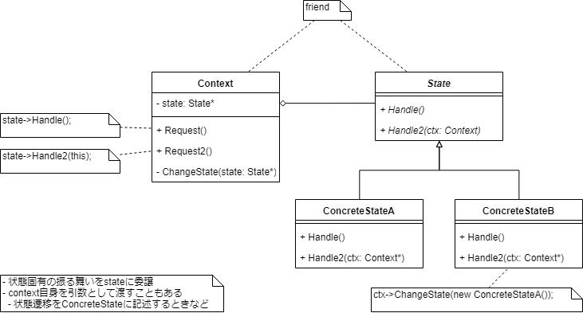

# ねらい

- 状態が変化した際に振る舞いを変える
    - クラスが変わったように見える
    
    
# AKA

- Objects for States

# つかいどころ

- オブジェクトが、実行時に状態によりふるまいを変える
     - 例: TCP接続
        - Established
        - Listening
        - Closed
    - クラスが変わったように見える
    - たいていの言語の「継承」では実現できない
        - オブジェクト生成後にクラスを変えることはできない
- メソッドが巨大で、状態により分岐している
    - Stateパターンを知らない人ならenumで分岐するような感じ
    - 同じような分岐がいくつものメソッドにある
    

# 構造

# 登場人物

- `Context`
    - `state`オブジェクトを保持し、状態固有の処理を委譲する
- `State`
    - 状態固有の処理のインターフェースを定義
- `Concretestate`
    - `State`の実装クラス
    - 1つの状態をあらわす
    - 状態固有の処理の実装

# クライアントコードからの利用

- `context`は状態固有の処理を`state`オブジェクトに委譲する
    - `context`は自身を`state`のメソッドの引数に渡すことがある
        - 状態遷移の責務を`State`に負わせる場合などに
- クライアントは`context`オブジェクトに`state`オブジェクトを渡し、以降は`State`を直接触ることはない
- 状態遷移先の決定や、状態遷移の条件については、`Context`か`Concretestate`が責務をもつ

# 結果

- 状態固有のふるまいの知識が`State`のクラスツリーに局所化される
    - 新しい状態の追加が楽
        - `State`派生を増やすだけ
        - State Pattern導入前は、状態に関する似たようなif-elseやswitch-caseにまみれており、状態の追加が大変
    - 新しい振る舞いの追加は大変
        - 既存の全`Concretestate`に対してふるまいを追加しなければならない
        - これはこれで健全ともいえる
            - State Patternを導入しない場合、if-elseで区分けした巨大な関数になってしまう
            - 状態遷移や状態固有の振る舞いが小分けにカプセル化されることで、コードの意図を汲みやすくなる
- 状態遷移が明示的になる
    - 単なるメンバ変数にenumを代入するような形だと、状態遷移を明示的に表しているとはいえない
    - `state`オブジェクトを使うことで、より明示的になる
- `State`が状態をもたなければ、SingletonやFlyweightを適用可能

# 実装にあたり考えるべきこと

## 誰が状態遷移を定義するか
- `Context`に中央集権
    - 変更・拡張が大変
        - 【補】結局、`state`の型フィールドでの分岐にまみれた一枚岩になる
- `Concretestate`に分散
    - 柔軟
    - 各`Concretestate`どうしに依存を持ち込んでしまう
        
## テーブルにより遷移を表現する方法
- 焦点がちがう
    - State Pattern: 状態固有の振る舞いをモデル化
    - テーブル: 状態遷移の定義
- メリット
    - 規則的
- デメリット
    - 仮想関数呼び出しよりも非効率
    - わかりにくい
    - 状態遷移にともない何か処理を行うのが難しい
        - 【補】入場動作/退場動作
        
## `state`オブジェクトの生成・解体のポリシー

|              | 都度生成・解体                   | 作り置き・解体しない     |
|--------------|----------------------------------|--------------------------|
| つかいどころ | どの状態になりうるか予想できない | しょっちゅう状態遷移する |
|              | 状態遷移があまり頻繁でない       |                          |

【補】Flyweightパターンを併用した、都度生成するけど解体はせず、次回以降流用する方法もあると思います

## 動的継承

- できる言語があるらしい
- 言語レベルでStateパターンをサポートしているような感じ

# 関連するパターン

- Flyweight
- Singleton

いずれも、`State`が状態を持たない場合に適用されうる

    

----------------------------------------

# 英語

- impose A on B
    - AにBを課す、強いる
        - コードの構造化を強制する、というような文脈で使用
- amount
    - に達する
        - 「実質同じになる」みたいな意味合いで使っている
