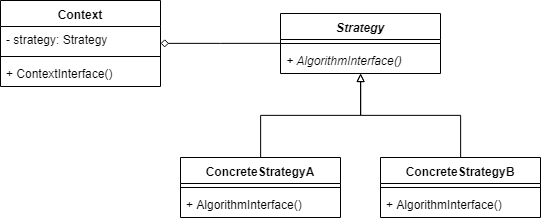
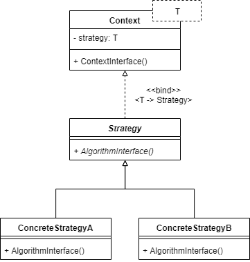

# ねらい

- アルゴリズムをカプセル化し、他のアルゴリズムと可換にする
- アルゴリズム利用側とは独立して変更・拡張できるようにする

# AKA

- Policy

# つかいどころ

- ふるまいだけが異なる似通ったクラスが複数ある
- いくつかのアルゴリズムを選べるようにしたい
    - 時間・空間・美しさ等のトレードオフ
- アルゴリズム固有のデータを隠蔽したい
    - 【補】マージソートの`O(n)`の外部空間とか？
    - アルゴリズム利用側からしたらどうでもいい(知りたくない)データ
- 同じような分岐がいくつものメソッドにある
    - enumか何かで分岐している
    - enumに対応する`Strategy`を用意して、これを排することができる

# 構造

## オブジェクトの集約版

## ジェネリクス版

- 制限付き
- 静的にバインドするので実行時効率が良い

# 登場人物

- `Strategy`
    - 全アルゴリズム共通のインターフェースを定義
- `Concretestrategy`
    - `Strategy`の実装クラス
    - アルゴリズム固有のデータを保持することも
    - 状態をもたなければ、FlyweightやSingletonにできる
- `Context`
    - `concretestrategy`オブジェクトでカスタムできる
    - `strategy`オブジェクトを保持
        - nullableにして、デフォルト動作を`Context`に実装する方法もある
    - `Strategy`からデータアクセスするためのインターフェースを設けることも

# クライアントコードからの利用

- クライアントは`concretestrategy`オブジェクトを選択・生成し、`context`に渡す
- 以降、`concretestrategy`オブジェクトを直接触ることはない
- `context`は`concretestrategy`オブジェクトに処理を委譲する
    - 必要なデータだけ渡すパターン
    - `context`丸ごと渡して、`concretestrategy`側で必要なものを取得するパターン

# 結果

- 関連するアルゴリズムが1つのクラスツリーに切り出される
    - ベースクラスに共通の処理を置くことができる
        - 【補】Template Method Pattern
- 継承ではないアプローチである
    - `Context`を継承するデメリット
        - 振る舞いだけ異なる`Context`派生が大量に生まれる
        - `Context`の実装とアルゴリズムの実装とが混然一体となり、変更・拡張が大変になる
            - 【補】「実装は問わず、とりあえずソートさえできればいい」場合
                - `qsort(collection)`、`mergesort(collection)`とかが並ぶと見通しが悪い
                - `sortStrategy->sort(collection);` と抽象的に書けたほうが見通しが良い
        - オブジェクト生成後にアルゴリズムを動的に変更できない
- 条件分岐がなくなる
    - `Context`の中でenumでアルゴリズムを分岐していたらStrategy Patternを適用すべきサイン
        - Strategy Patternを知らない人が、
        - `Context`の継承も行わずに、
        - 複数のアルゴリズムを選択可能にするとこうなる
- ブラックボックスの実装を選択可能にできる
    - 入出力は同じだが、時間と空間のトレードオフが異なる場合など
    - 【補】ソートアルゴリズム
        - 要素数が少なければバブルソート等がよい
        - 増えてきたらquick sort等がよい
- クライアントは`Strategy`のバリエーションを知っている必要がある
    - 適切なものを選択するために、その中身についても知っている必要がある
    - 【補】ソートアルゴリズム
        - 要素数がxx以下なら、`O(n^2)`でもオーバヘッドがない分バブルソートのほうが効率が良い、とか
- `Strategy`と`Context`の相互作用のオーバヘッド
    - `Concretestrategy`ごとに必要なパラメータが異なることがある
    - `Strategy`のインターフェースは和集合的でなければならない
    - したがって、必要ない引数を生成し渡してしまうケースが出てくる
    - `Concretestrategy`と`Context`とを密結合にすることで回避可能
- オブジェクトの数が増える
    - `Concretestrategy`に状態を持たせず、SingletonやFlyweightにすることで軽減可能

# 実装にあたり考えるべきこと

- `Context`と`Strategy`のインターフェース
    - `Concretestrategy`は`Context`から必要なデータを取得できる必要がある
        - 引数で渡す(push)
            - 各`Concretestrategy`で必要なものの和集合になる
            - ので、無駄が生じうる
        - `context`を丸ごと渡し、`Concretestrategy`で必要なものを取得する(pull)
            - 無駄はなくなる
            - `Context`と`Concretestrategy`とが密結合してしまう
- `Strategy`を`Context<Strategy>`のテンプレート型引数にする
    - 静的にバインドするので実行時効率が良い
    - 制限付き
        - アルゴリズムは静的に決まる
        - アルゴリズムは動的に変わらない
- `strategy`オブジェクトをオプショナルにする
    - なければデフォルト動作、あれば処理を委譲
    - 【所感】nullチェックが鬱陶しいので`DefaultStrategy`を用意したほうが良くないですか(Null Object Pattern)

# 関連するパターン

- Flyweight
- Singleton
    - ともに、`Strategy`が状態をもたなければ適用可能

----------------------------------------

# 英語

- factor out
    - 因数分解する
    - 構成要素を取り除く
        - 長くなりすぎた関数の一部を外に追い出すときなど
        - refactorの一つの手段として factoring out がある
