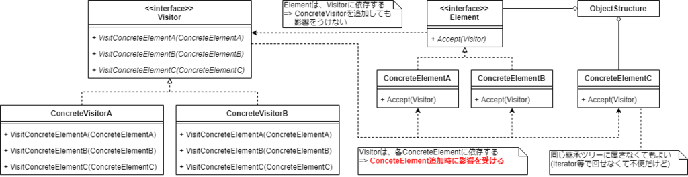

# ねらい

- あるクラス群(`Element`派生)に対する、同じ目的の操作群を、1つのクラスにまとめる
- 操作群の追加を容易にする
    - `Element`とその派生に変更を生じさせない

# モチベーション

- 例) プログラムの解析・コード解析等
- AST: Abstract Sytax Tree(抽象構文木)は、さまざまな`Node`派生クラスのオブジェクトからなる
    - `AssinmentNode`  
        代入演算
    - `VariableRefNode`  
        変数読み出し
- ASTに対してさまざまな操作を行いたい
    - 型チェック
    - オブジェクトコード生成
    - pretty print
- Visitorパターンを知らないと、こういった操作を、各`Node`派生に実装したくなる
    - `AssignmentNode::TypeCheck()`
    - `VariableRefNode::TypeCheck()`
- そうすると、下記のようなデメリットが生じる
    - 同じ目的の操作が各`Node`派生に散らばり、理解しづらくなる
    - 操作を追加するたびに、`Node`に変更を加えなければならない
        - `Node`クラス利用側が影響を受ける
        - `Node`の全派生クラスが影響を受ける
            - 再コンパイルが必要
- 同じ目的の操作を1つのクラスに切り出したい ... `Visitor`クラス

# つかいどころ

- オブジェクト構造がさまざまなクラス(`ConcreteElement`)から構成されている
    - クラスごとに異なる操作を行いたい
- 目的が同じ操作を、各`ConcreteElement`に散らかしたくない
    - `AssignmentNode::TypeCheck()`
    - `VariableRefNode::TypeCheck()`
- `ConcreteElement`クラスが追加されることはあまりない
    - しょっちゅう追加されるならVisitorパターンは不向き
 
 
# 構造

# 登場人物

- `Visitor`
    - 各`ConcreteElement`に対応する`Visit`メソッドの定義
        - 名前を分ける
        - 同じ名前でオーバーロード
- `ConcreteVisitor`
    - 目的が同じ1つの操作ごとに派生をつくる
        - 【補】型チェック用`Visitor`派生の例
            - `TypeCheckVisitor::VisitAssignmentNode(AssignmentNode node)`
            - `TypeCheckVisitor::VisitVariableRefNode(VariableRefNode node)`
    - オブジェクト構造を走査する際、状態を蓄積できる
        - 【補】例) 変数の被参照箇所を数えるなど
- `Element`
    - `Accept(Visitor visitor)`メソッドの定義
- `ConcreteElement`
    - `Accept`メソッドの実装
        - `Visitor`のどの`Visit`メソッドで操作されればよいかを知っている
        - 【補】オーバーロード実装なら知らなくてもいい
- オブジェクト構造
    - `element`オブジェクトをまとめた構造
        - Composite
        - 汎用コレクション
            - Array
            - List
            - etc.

# クライアントコードからの利用

1. クライアントコードは`concreteVisitor`を生成
1. オブジェクト構造を走査するさい、`element->Accept(concreteVisitor)`する
1. `Element`派生は、`visitor`を受け取ったら、しかるべき`Visit`メソッドを呼び出す
    - `visitor->VisitXxx(this)`
1. 2.で`element`によるシングルディスパッチ、3.で`visitor`によるシングルディスパッチにより処理が決定される
    - 動的ポリモーフィズム
    - 正味、`element`と`visitor`の**ダブルディスパッチ**になる
    

# 結果

- 新しい操作の追加が楽
    - `ConcreteVisitor`クラスを追加するだけ
    - `Element`側に変更は生じない
- `ConcreteVisitor`に、目的が同じ関連する操作がひとまとめになる
    - 関連しないものは別の`ConcreteVisitor`にまとまる
- `ConcreteElement`の追加は大変になる
    - `Visitor`と全派生に、対応する`Visit`メソッドを追加しなければならない
    - `ConcreteElement`がしょっちゅう追加されるならVisitorパターンは不向き
- `Visit`する対象は同じ継承ツリーにいる必要はない
    - 構造を参照
- 状態を蓄積できる
    - 【補】コードの静的解析において、変数の被参照回数を数えるなど
- カプセル化を壊してしまうことがある
    - `ConcreteElementA`は、全`ConcreteVisitor`の`VisitA(ConcreteElementA element)`メソッドで用を満たせるインターフェースを持たねばならない
    - `ConcreteElementA`はpublicなgetterまみれになりカプセル化が台無しになることも
        - 【所感】friendにしてはどうか？
        

# 実装にあたり考えるべきこと

## Visitをオーバーロードする

- メリット
    - 引数は違えど、同じ目的の処理を行うということが強調される
- デメリット
    - コードを追いづらい
  
  
## ダブルディスパッチ

- `visitor`の型と`element`の型の2つによって処理が決定する
- 言語が引数型によるディスパッチをサポートしているなら、Visitorパターン不要
    - Lisp
    - C#のdynamic

## オブジェクト構造の走査は誰が行う？

- オブジェクト構造自身
    - よくある実装
    - Compositeなら再帰的に`Accept(visitor)`を呼び出せばよい
- `Iterator`
    - internal iterator
    - external iterator
- `Visitor`
    - 走査処理を`ConcreteVisitor`ごとに書く必要あり
    - 走査のしかたが特殊な場合などは選択に値する

# 関連するパターン

- Composite
    - 走査対象のオブジェクト構造はCompositeであったりする
- Interpreter
    - ASTの例まさにそのもの

----------------------------------------

# 英語

- consolidate
    - 一元管理する
        - 責務を中央集権にする場合などに
