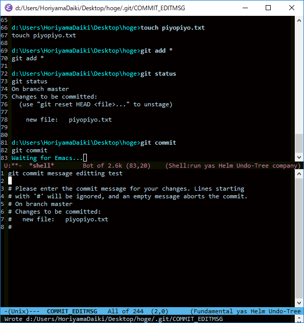
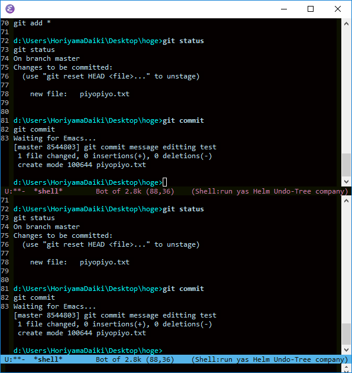

# TL;DR

- `GIT_EDITOR=emacsclient`
- `M-: (server-start) RET`


# 直面した問題

> shellの上でEmacsを使う者と、Emacsの上でshellを使う者がいる

僕は後者です。  
全ての作業をEmacs上で完結させたい。  
マウスに手を伸ばさないといけないなんて耐えられない。

で、Emacs上でGitを使おうとして直面した問題。  
editorにEmacsを設定すると、`git commit`するたびに新しいEmacsフレームが立ち上がってしまう。  
init.elの読み込みに時間がかかって仕方がない


# 解決方法

- `emacs`や`runemacs`コマンドは、新しくEmacsを起動してバッファを開くコマンド。
- 対して、`emacsclient`コマンドは、**serverモードで起動しておいたEmacsでバッファを開くことができる**


## Emacsをサーバーモードで起動する設定

[serverの使い方](https://www-he.scphys.kyoto-u.ac.jp/member/shotakaha/dokuwiki/doku.php?id=toolbox:emacs:server:start)


init.elに下記を記入
```lisp
(require 'server)
(unless (server-running-p)
   (server-start))
```


## Gitのエディタの設定

下記のいずれかを実施(前者のほうが優先されるそう)

- 環境変数の設定
    - `GIT_EDITOR=emacsclient`
- git configの設定
    - `git config --global core.editor`


## 結果



- `git commit`すると、**同じEmacs上で**COMMIT_EDITMSGバッファが開き、コミットメッセージを編集できる。
- この間、shellは処理待ちとなる



- `C-x k`でCOMMIT_EDITMSGバッファをkillすると、shellに処理が戻り、commitされる。
