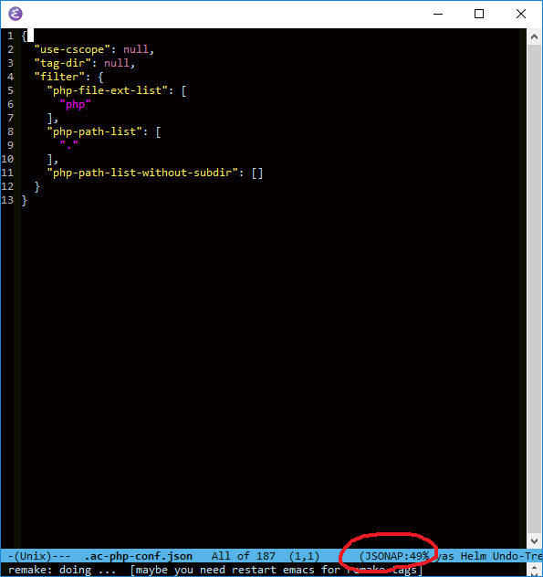

# 環境

- windows 10
- GNU Emacs 25.2.1 (i686-w64-mingw32)
- company-mode導入済


# 動機

- Laravel 5.5 LTE 上で開発
    - PHPのフレームワーク
- 自動補完ほしい
- 定義ジャンプもほしい


# ac-php


- [ac-php](https://github.com/xcwen/ac-php)
    - ググると真っ先に出てくる
    - emacsでPHPを補完・定義ジャンプ

    
# 依存

- Emacs Lisp
    - company-php
- executable
    - php


# 導入

## ac-php, company-php

1. `M-x package-list-packages RET`
1. `ac-php`, `company-php`を探してINSTALL


## PHP本体

### なんで今更

- 普段は仮想環境内のPHPを使っている
    - laradock on docker
    - Homestead on vagrant
- エディタはホスト側にあるので、ホスト側にPHPを入れる必要が生じた

### 入れる

1. [php公式](https://windows.php.net/download#php-7.3)にアクセス、zipを落としてくる
    - とりあえず最新の
        - Laravel 5.5が7系必須だった気がする
    - とりあえずスレッドセーフなやつ
1. 適当に解凍、パスを通す
1. インストール確認

```sh
php --version
```

```
PHP 7.3.1 (cli) (built: Jan  9 2019 22:20:52) ( ZTS MSVC15 (Visual C++ 2017) x64 )
Copyright (c) 1997-2018 The PHP Group
Zend Engine v3.3.1, Copyright (c) 1998-2018 Zend Technologies
```

## init.elいじる

```lisp
(defun php-company-hook ()
  (require 'company-php)
  (company-mode t)
  (ac-php-core-eldoc-setup) ;; enable eldoc
  (make-local-variable 'company-backends)
  (add-to-list 'company-backends 'company-ac-php-backend)
  ; 定義にジャンプ
  (define-key php-mode-map  (kbd "M-.") 'ac-php-find-symbol-at-point)
  ; ジャンプ先から戻る
  (define-key php-mode-map  (kbd "M-,") 'ac-php-location-stack-back))


(add-hook 'php-mode-hook 'php-company-hook)
```

- ほぼ[公式](https://github.com/xcwen/ac-php#user-content-usage-with-company)どおり
    - 定義ジャンプ/戻るのキーバインドだけ標準的なものに変えた
- ここらでemacs再起動


# 下準備

- laravelプロジェクトルートに`.ac-php-conf.json`ファイルを作る
    - 空でいい
- `M-x ac-php-remake-tags-all RET` でタグファイルを作る
    - `~/.ac-php`の中にできる
    - Windowsの場合、`~`を解決するために`%HOME%`環境変数が必要かも  
        
- バッファ右下に進捗が表示される。完了を待つ  
    
    


# つかう

## 補完

- ばっちり補完される
    - 
    - 
- `__callStatic()`マジックメソッドで他モジュールに委譲している呼び出しまで拾ってくれる  
    
    - `\Illuminate\Support\Facades\DB` =&gt; `\Illuminate\Database\DatabaseManager`
    - `\Illuminate\Database\DatabaseManager` => `\Illuminate\Database\Connection`
    - たぶん`@see`とか`@mixin`アノテーションのおかげ(未検証)

```php
<?php

/**
 * @see \Illuminate\Database\DatabaseManager
 * @see \Illuminate\Database\Connection
 */
class DB extends Facade
```

```php
<?php

/**
 * @mixin \Illuminate\Database\Connection
 */
class DatabaseManager implements ConnectionResolverInterface
```


## 定義ジャンプ


`M-.`


快適

## 限界

- `\DB::select()`とかは補完してくれない  

    - `<project_root>/config/app.php`の`aliases`定義までは拾ってくれない模様  
        


