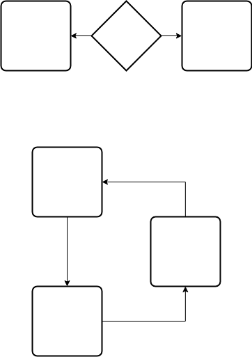
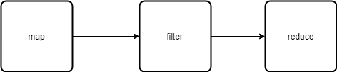

# Part3 **関数型のスキルを磨く**

# まえがき

- FPの特徴
    - 理解しやすい
    - 読みやすい
        - 宣言的なのでコードそれ自体が文書
    - 保守しやすい
    - テストしやすい &lt;- New!


# ユニットテストへの関数型プログラミングの影響

- テストのレベルごとのFPの影響
    - 受け入れテスト
        - ソフトウェアパラダイム関係なし
    - 結合テスト
        - 関数の合成等を使えば問題なく動くことはわかっている
    - ユニットテスト
        - 結合テストに費やしていた時間をこちらに割ける
- 本書はQUnit推し


# 命令型プログラムのテストにおける課題

## 単純なタスクを特定して分解することの困難さ

- 一枚岩コードを切り分ける直感的な方法がない
- 純粋な部分と不純な部分がごった煮になる
    - 不純なコードは副作用があるためテスト困難


## 共有リソースへの依存は不一致な結果をもたらす

- 共有リソース
    - グローバル変数
    - DOM
- 実行するたびに成否が変わる


## あらかじめ定義された実行の順序

- 実行順で成否が変わる
    - 先のテストケースの実行が、  
      後のテストケースの前提条件になってしまっている
- 関数型で書けばそんなことにはならない
    - 関数型のコーディングにかける時間は投資
    - テストフェーズで取り返せ


# 関数型コードをテストする

## 関数をブラックボックスとして扱う

- 副作用がなく参照透過
- つまりテストの結果が引数から完全に予想可能
    - 呼び出し回数に依存しない
    - 呼び出し順に依存しない


## 制御フローではなくビジネスロジックに注目する

- 制御フローを関数コンビネータで置換する
    - if-else ... alternationコンビネータ
    - ループ ... sequenceコンビネータ
- RamdaやLodashライブラリはよくテストされているためテスト不要
    - 実施するにしても、単純な関数で簡単にテストするだけでいい
        - 受け取る関数に依存しないから
- 残るビジネスロジックに注力できるようになる


## モナドの分離を用いて純粋なコードを不純なコードから分離する

- 純粋なコードのテストは取るに足らない
- 不純なコードは厄介
    - DOM操作
    - XHR
    - DB
    - ファイル
- 厄介な部分を隔離
    - 純粋な部分は信頼性をもってテストできる
    - 不純な部分は信頼性をもってテストはできない
        - テストしたい部分に入る前に例外で抜けちゃったり
    - モノリシックで「丸ごと不純で、信頼性をもってテストできない」状態から、
      「9割がた純粋で、残りは不純」なほうが格段に良い


## 外部依存性をモックする

- 本書では、sinon推し
    - QUnitのプラグイン
    
```javascript
var studentStore, mockContext;

QUnit.module(
    'CH06',
    {
        // 各テスト前にモックコンテキストを用意
        beforeEach: function () {
            studentStore = DB('students');
            mockContext = sinon.mock(studentStore);
        },
        // 各テスト後にアサーション検証・後始末
        afterEach: function () {
            mockContext.verify();
            mockContext.restore();
        },
    }
);

QUnit.test(
    'showStudent: findStudent returning null',
    function (assert) {
        // 厳密に1回、nullを返すstudentStoreのモックを作る
        mockContext.expects('get').once().return(null);

        const findStudent = safeFetchRecord(studentStore);

        // nullがEitherで包まれてLeftが返るはず
        assert.ok(findStudent('xxx-xx-xxxx').isLeft);
    }
);

QUnit.test(
    'showStudent: findStudent returning valid Object',
    function (assert) {
        // 厳密に1回、有効な結果を返すモックを作る
        mockContext.expects('find').once().return(
            new Student('Alonzo', 'Church', 'princeton')
                .setSsn('444-44-4444'));

        const findStudent = safeFetchRecord(studentStore);

        // 有効なオブジェクトがEitherで包まれてRightが返るはず
        assert.ok(findStudent('444-44-4444').isLeft);
    }
);
```


# プロパティベースのテストを利用して仕様を把握する

- プロパティベースのテスト
    - 参照透過な関数に対して適用可能
        - コンテキスト非依存
        - 引数から評価結果が完全に予測可能
    - 関数の入出力仕様からテストケースを自動生成
- JSCheck
    - 関数のプロパティを証明するために、多数のテストケースをランダムに生成
    - エッジケースも自動生成

```javascript
JSC.clear();
JSC.on_report(str => console.log(str));


// JSCheckでは、claimを指定する
// claimは4つの要素からなる
// - Name
// - Predicate
// - Specifiers
// - Classifier (optional)
JSC.test(
    // Name
    'Compute Average Grade',
    // Predicate
    // バーディクトを返す
    function (verdict, grades, grade) {
        // 例えば、
        // grades = [80, 90, 100]
        // なら、平均点は 90
        // このとき、gradeは'A'
        // というのを判定する
        return verdict(computeAverageGrade(grades) === grade);
    },
    // Specifiers
    [
        // grades
        // 条件を満たす配列を自動生成する
        JSC.array(
            JSC.integer(20),     // 配列長最大20
            JSC.number(90, 100)  // 配列の要素は90-100(浮動小数含む)
        ),
        // grade
        'A',
    ],
    // Classifier
    function (grades, grade) {
        return 'Testing for an ' + grade + ' on grades:' + grades;
    }
);
```

- テストコード自体が仕様書になる

## 【補】verdict関数は回りくどくないか？

単に`return computeAverageGrade(grades) === grade` じゃダメなの？


[JSCheck公式](http://www.jscheck.org/)

> The predicate function uses the verdict function to announce the result of the case (true if the case succeed, and false if it failed). The verdict function makes it possible to conduct tests that might be completed in a different turn, such as tests involving event handling, network transactions, or asynchronous file processing.

- 非同期処理でもテストできるようにするため
    - イベント
    - N/Wトランザクション
    - XHR


# コードカバレッジにより有効性を測定する

- コードカバレッジ: プログラムコードのうち実行された部分の割合
- コードカバレッジが高いことは、高品質の必要条件
- 本書ではBlanket推し

## 関数型コードのテストに関する有効性を測定する

### 有効な入力(前提条件OK)

- 命令型
    - 有効な入力に対して、`throw`文はスキップされるので、カバレッジは100%にならない
- 関数型
    - 有効な入力でも、`Either`や`Maybe`の生成は通るので、カバレッジは100%になる
    
### 無効な入力

- 命令型
    - 無効な入力に対して、ほとんどのロジックをスキップするので、カバレッジは低い
- 関数型
    - 無効な入力でも、`Either`や`Maybe`の生成は通る
    - 入力値依存部分のみ、`Left`や`Nothing`によりスキップされる
    - カバレッジは100%にはならないが、そこそこ高い


## 関数型コードの複雑度を測定する

- 制御フローがあるとコードは複雑になる
    - if-else
    - for
- 可能な限り制御フローを排除し、関数を単純に保て
    - if-else
        - alternationコンビネータ
    - for
        - sequenceコンビネータ
        - map, filter, reduce
- 循環的複雑度(CC: Cyclomatic compelxity)
    - 複雑性の定量的尺度
    - `M = E - N + P`
        - M: 循環的複雑度
        - E: フロー内のエッジ数
        - N: ノード・ブロック数
        - P: 出口点を持つノード数
- ほかの
    - 循環的複雑度の密度(%)
        - CC値を、コードの命令型の行数に基づいて百分率で表現
        - 低いほどよい
    - 保守容易性指数
        - 高いほどよい
        
### 【補】計算例

#### 命令型

<figure class="figure-image figure-image-fotolife" title="命令型のif,for"><figcaption>命令型のif,for</figcaption></figure>

- if
    - E = 2
    - N = 3
    - P = 2
    - M = 2 - 3 + 2 = 1
- for
    - E = 3
    - N = 3
    - P = 1
    - M = 3 - 3 + 1 = 1
    - breakがあるとさらに複雑になる(Pが増加し、Mが増加)

#### 関数型

<figure class="figure-image figure-image-fotolife" title="関数型のmap,filter,reduceの直列"><figcaption>関数型のmap,filter,reduceの直列</figcaption></figure>

- E = 2
- N = 3
- P = 1
- M = 2 - 3 + 1 = 0

# まとめ

- きわめて単純な関数を結合するために抽象されたプログラムは、モジュール化されている
-純粋関数に基づいてモジュール化されたコードは、テストが容易であり、プロパティベースのテストなどにより厳密な種類のテスト方法論への道を開く
- テスト可能なコードは、制御フローが単純でなければならない
- 制御フローが単純になると、プログラム全体としての複雑度が減少する。これは、複雑度メトリックスによって定量的に測定可能である
- 複雑度が減少すると、プログラムを把握するのが簡単になる
