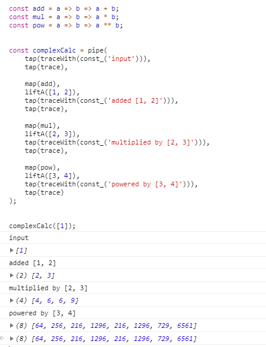

この本でApplicativeが全く出てこなかったので

参考: [Functors, Applicatives, And Monads In Pictures](http://adit.io/posts/2013-04-17-functors,_applicatives,_and_monads_in_pictures.html#applicatives)


``` javascript
// a -> a
const identity = x => x;

// a -> b -> a
const const_ = c => _ => c;

// 関数合成
const compose = function (/* functions */) {
    return Array.from(arguments).reduce((f, g) => x => f(g(x)), identity);
};

// composeのミラー関数
const pipe = function(/* functions */) {
    var functions = Array.from(arguments);
    functions.reverse();
    return compose.apply(null, functions);
};

// ファンクタに関数をマップ
// (a -> b) -> f a -> f b
const map = func => functor => functor.map(func);

// Arrayの中の関数をArrayに適用してArrayを得る
// [a -> b] -> [a] -> [b]
Array.prototype.liftA = function (arr) {
    return map(func => map(func)(arr))(this).reduce((arr1, arr2) => arr1.concat(arr2));
};

// [a -> b] -> [a] -> [b]
const liftA = f1 => f2 => f2.liftA(f1);

// a -> void
const trace = console.log.bind(console);

// a -> _ -> void
const traceWith = modifier => compose(trace, modifier);

// (b -> c -> d) -> (a -> b) -> (a -> c) -> a -> d
const fork = join => f1 => f2 => v => join(f1(v))(f2(v));

// (a -> void) -> a -> a
const tap = opr => fork(const_)(identity)(opr);

// ----------------------------------------

const add = a => b => a + b;
const mul = a => b => a * b;
const pow = a => b => a ** b;


const complexCalc = pipe(
    tap(traceWith(const_('input'))),
    tap(trace),
    
    map(add),
    liftA([1, 2]),
    tap(traceWith(const_('added [1, 2]'))),
    tap(trace),

    map(mul),
    liftA([2, 3]),
    tap(traceWith(const_('multiplied by [2, 3]'))),
    tap(trace),
    
    map(pow),
    liftA([3, 4]),
    tap(traceWith(const_('powered by [3, 4]'))),
    tap(trace)
);


complexCalc([1]);

```

<figure class="figure-image figure-image-fotolife" title="計算結果"><figcaption>計算結果</figcaption></figure>


計算の流れ
```
[1] <$> (+) <*> [1, 2] <$> (*) <*> [2, 3] <$> (**) <*> [3, 4]
[(1+)] <*> [1, 2] <$> (*) <*> [2, 3] <$> (**) <*> [3, 4]
[2, 3] <$> (*) <*> [2, 3] <$> (**) <*> [3, 4]
[(2*), (3*)] <*> [2, 3] <$> (**) <*> [3, 4]
[4, 6, 6, 9] <$> (**) <*> [3, 4]
[(4**), (6**), (6**), (9**)] <*> [3, 4]
[64, 256, 216, 1296, 216, 1296, 729, 6561]
```
