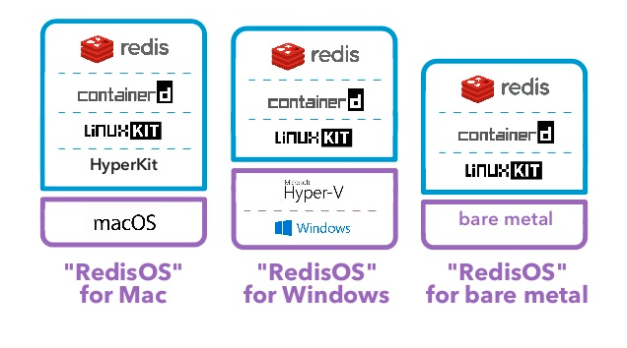

# Dockerとは

- 構成
    - dockerd
        - コンテナ型仮想化技術を実現するために実行される常駐アプリケーション
    - CLI
        - デーモンを操作するためのコマンド
- その他エコシステム
    - Docker Hub
        - コンテナイメージをインターネット上で共有
    - Docker Cloud
- どんなもの
    - 軽量な仮想環境
    - アプリケーションのデプロイに特化
        - このあと何度も繰り返されるテーマ
- 既存の仮想化技術と比較しての特徴

|                            | 既存の仮想化技術                                                 | Docker                                                                         |
|----------------------------|------------------------------------------------------------------|--------------------------------------------------------------------------------|
| 環境構築                   | 大変。ドキュメント通りにパッケージマネージャを操作して色々入れる | 簡便。Dockerfile書いてbuildコマンド叩くだけ                                    |
| オーバヘッド               | 大きい。H/Wをエミュレートしたり                                  | 小さい。ホストのH/W使う                                                          |
| ポータビリティ             | 低い                                                             | 高い。ローカルのを本番に持って行ったり、本番のをローカルに持ってきて動かしたり |
| 用途                       | ローカル検証                                                 | 本番にも使える                                                             |
| OSとしての振る舞いの再現性 | 高い                                                             | 低い                                                                           |
| OSの制限                   | ない？                                                           | 非Linux環境を動かせない(FreeBSD等) 【補】Windowsコンテナとかありませんでしたっけ                                       |

- 活用例
    - ホストを汚さずに何かインストールして使う
        - 【補】僕は最近PostgreSQLを勉強するためにコンテナ使いました
    - 高い動作再現性をもつスクリプトの配布
        - 依存を同梱する
    - HTTP負荷テスト
        - workerをDockerコンテナとして用意して、HTTPリクエスト数を上げる

## Dockerの歴史

- エコシステムの話とか。略

## Dockerの基礎概念

### 仮想化技術の分類

|                | コンテナ型仮想化技術(OS-level virtualization)              | ホストOS型の仮想化                                       |
|----------------|------------------------------------------------------------|----------------------------------------------------|
| 例             | Docker, LXC                                                | VMWare, VirtualBox                                 |
| 仕組み         | 仮想化S/WなしにOSのリソースを隔離、仮想OS(=コンテナ)にする | 仮想化S/WでH/Wをエミュレートし、その上でOSを動かす |
| オーバーヘッド | 小さい                                                     | 大きい                                                   |

### Dockerのコンテナ型仮想化技術の推移

- 昔はLXC上で動作していた
- 0.9系で独立
    - libcontainerの開発
        - Linux namespaces, cgroupsといったAPIを直接実行
        - Linuxカーネルのコンテナ実現に必要
- 1.11系からはOCI: Open Container Initiative仕様に準拠

### アプリケーションにフォーカスしたDocker

- LXCはシステムコンテナとして一定の地位を確立した
    - 単純なリソース分離用途
    - アプリケーションデプロイを前提としない
- アプリケーションのデプロイ・運用の観点では機能不足
    - ポータビリティ
        - LXCの設定が異なると、別のLXCホストに持って行っても動かない
- 他、LXCができず、Dockerが解決したこと
    - ホストに左右されない実行環境
        - Docker Engineによる実行環境の標準化
    - DSL:Domain Specific Languageによるコンテナ構成、アプリケーション配置定義
        - Dockerfileのこと
        - 再現性を保ちやすい
    - イメージのバージョン管理
    - レイヤ構造をもつイメージフォーマット(差分ビルド可能)
        - 【所感】結果、`&& \`区切りの黒魔術みたいなRUNコマンドが生み出されましたね
    - Dockerレジストリ
        - イメージの保管サーバのようなもの
        - 【補】例
            - DockerHub
            - AWS ECR
            - レジストリを立てるためのイメージも配布されてるそうで
    - プログラマブルな各種API
- Docker以前はアプリケーションをホストOS、またはゲストOSにデプロイするスタイルが主流だった
    - 動作はOS依存になる
- Dockerは、アプリケーションと実行環境をコンテナに同梱
    - 依存問題を解決
    - デプロイが単純化

## Dockerの考えに触れる

- Hello World
- アプリケーションコードをコンテナに同梱する実例

### より実践的なDockerの実行

- Hello Worldは即終了、EXIT 0しちゃってた
- ふつう常駐するよね、という話
- CMDで実行する点はとくに変わらない
    - 【補】常駐するヤツの例
        - [php-fpm](https://github.com/docker-library/php/blob/c44aab7001ea12c8bec96664533df503bbf0af19/7.2/alpine3.8/fpm/Dockerfile)
        - [mysql](https://github.com/docker-library/mysql/blob/bb7ea52db4e12d3fb526450d22382d5cd8cd41ca/5.7/Dockerfile)
        - [nginx](https://github.com/nginxinc/docker-nginx/blob/baa050df601b5e798431a9db458e16f53b1031f6/mainline/stretch/Dockerfile)
            - `CMD ["nginx", "-g", "daemon off;"]`
            - フォアグラウンドで常駐させる
                - デフォルトだとバックグラウンドで常駐し、即コンテナがEXITしてしまう

### コラム - Mobyプロジェクト

- Mobyプロジェクトの成果物コンポーネント・ツール群をアセンブルしたのがDocker
- DockerはMobyプロジェクトの成果物に依存する
- MobyプロジェクトはDockerに依存していない
    - 自分で何か追加開発したり盛り込んだりしてMyDockerを作ることもできる
- DockerをDockerとして使ってる人には関係ない話
- Dockerの種類
    - Docker CE
        - Communioty Edition
        - 無償(今までのやつ)
    - Docker EE
        - Enterprise Edition
        - 商用

### コラム - LinuxKit

- WindowsとmacOSでDockerを動かすために頑張ったよ、という話
- そもそもdockerdはLinux上でしか動かない
- 昔は、Windows/macOSでは_ホストOS型の仮想化_の上でDockerを動かす他なかった
    - メリット台無し
- LinuxKit
    - 上記の課題を解決
    - コンテナ特化のLinuxサブシステム
    - Windows: Hyper-Vコンテナ(!=Dockerコンテナ)上で動かす
    - macOS: HyperKit上で動かす

<figure class="figure-image figure-image-fotolife" title="LinuxKit"><figcaption>LinuxKit</figcaption></figure>

# Dockerを利用する意義

- 不変な実行環境による冪等性の確保
- 実行環境構築とアプリケーション構成のコード化
- 実行環境とアプリケーションの一体化によるポータビリティ性の向上
- システムを構成するアプリケーションやミドルウェアの構成管理の容易さ

## 環境差異問題からの脱却

- 同じアプリケーションなのに、デプロイするサーバによって動作が異なる話
    - Mutable Infrastructure
    - サーバに依存しまくり
        - OS
        - CPU
        - メモリ
        - 言語ランタイム
        - ライブラリ
        - 依存する別プロセス
    - 環境差異を極力なくそう
- IaC: Infrastructure as Code
    - コードを実行することでインフラを構築する
    - これだけじゃだめ
        - パッケージ管理ツールで`stable`とか`latest`とかを指定すると、冪等にならない
        - 一つ一つバージョン指定とかするのはそれはそれで大変
- Immutable Infrastructure
    - **イメージ**
        - ある時点でのサーバの状態を保存したもの
    - 「同じサーバー」を作りたくなったら、イメージをもとに複製する
    - 変更を加える場合は、新しく作る
        - 【補】プログラミングにおける「immutable」と同じ意味ですね
        - 冪等性を保ちやすくなる
            - 継ぎ足しを考えない
            - 1から構築することだけ考えればいい

|                          | Dockerでの実現方法                                                                   |
|--------------------------|--------------------------------------------------------------------------------------|
| IaC                      | Dockerfile                                                                           |
| Immutable Infrastructure | `docker image build`でイメージを作っておいて、`docker container run`でいくつでも実行 |

### アプリケーションとインフラをセットで構築する

- Dockerイメージにアプリケーションコードも入れる
- どこでも動く
    - ローカルで動作確認できたら、本番サーバでも動く
    - SaaS系CIサービス上でイメージをビルドして、自動テスト回して、本番環境にデプロイできる

## アプリケーション構成管理のしやすさ

- 複数コンテナ on 単一ノード
    - システムの構成
        - アプリケーション
        - ミドルウェア
    - アプリケーションやミドルウェアごとにコンテナを作る
    - コンテナ間に依存性が生まれる
        - 実行順
    - コンテナの設定とかも必要
        - 環境変数
        - ポート開放
- 複数コンテナ on 複数ノード
    - コンテナオーケストレーション
        - サーバリソースを考慮したスケールアウトやローリングアップデート

|                                                                | Dockerでの実現方法                  |
|----------------------------------------------------------------|-------------------------------------|
| 単一ノード上でのシステム構成管理 (なんかもっと短い言い方ないの) | docker-compose                      |
| コンテナオーケストレーション                                   | docker-swarm, kubernetes            |
| 高度なコンテナオーケストレーション                             | Kubernetes (これ自体はGoogle開発OSS) |

## 本番環境に導入してこそのDocker

- 杞憂
    - Dockerに対する信頼性への疑問
        - 散々使われている
    - パフォーマンス面での心配
        - オーバヘッドはごくわずか
        - メリットが勝る
            - スケールアウトのしやすさ等
    - 現実的に運用していけるかどうか？
        - 適切なサービス理由などを心がければ難しくない
        - コンテナは適材適所
            - 無理に全部をDockerコンテナにするな
                - DBとか
            - ステートレスなものは大体大丈夫
                - Webアプリケーション
                - APIサーバ

## 新しい開発スタイルへ

- アプリケーションの開発に集中しやすく
    - コンテナを活用した開発の敷居が下がってきた
    - サーバやインフラをあまり意識しなくて済む
- インフラエンジニアとサーバーサイドエンジニアの垣根がなくなりつつある
    - インフラをコードレベルで触れるため
- アプリケーションを小さく作っていく向き
    - Microservicesアーキテクチャとの親和性が高い
- Webフロントエンドエンジニア、スマートフォンエンジニア等にとっても必須技術になりつつある
    - モックサーバ、開発環境等がDockerで提供されることが増えてきた
        - 【補】Laravelの開発環境、laradockとか
            - Vue.js触るおじさんもlaradockのworkspaceでnpm叩いたり
    - Android開発でCI高速化のためにDockerを利用する
        - 【疑問】想像できなかったです
        - [CircleCI公式イメージ](https://hub.docker.com/r/circleci/android/)

# ローカルDocker環境を構築する

- 略

