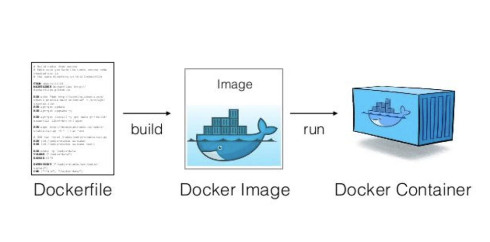
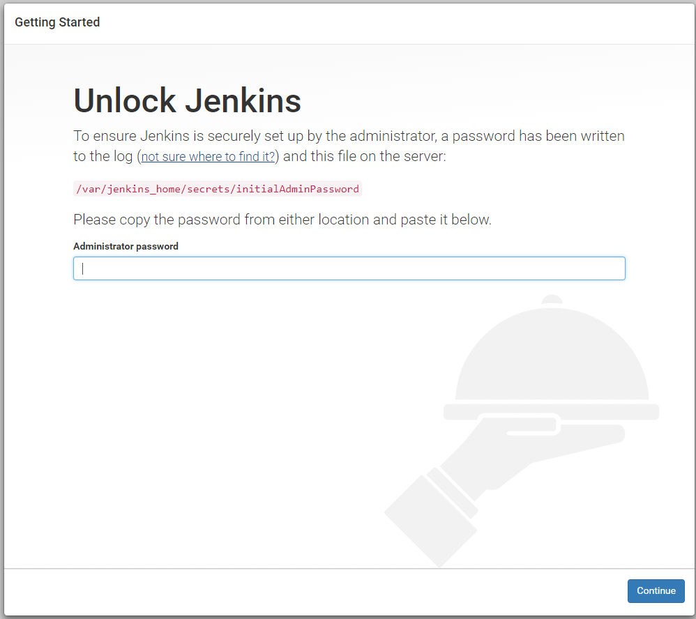
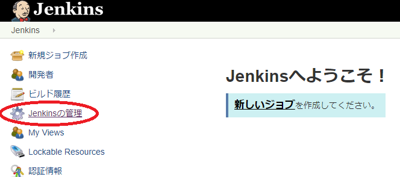
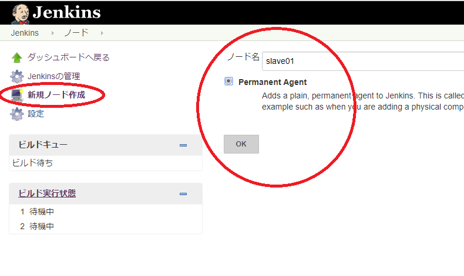
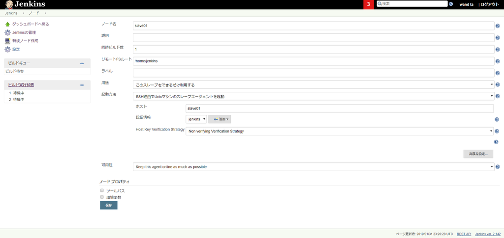
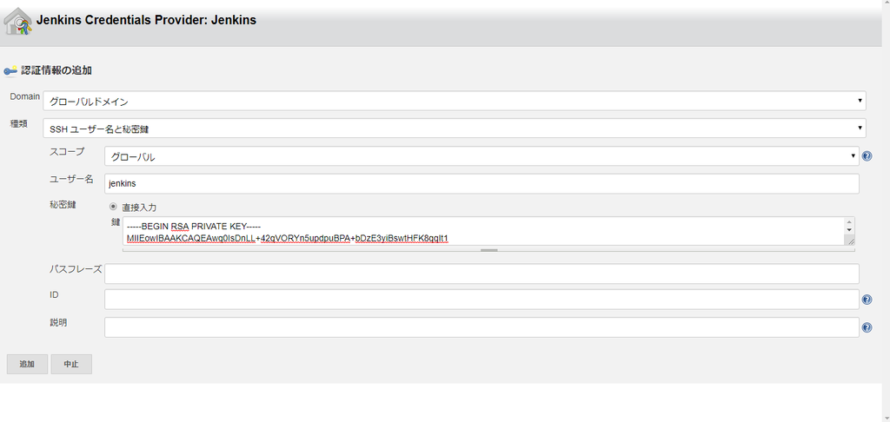
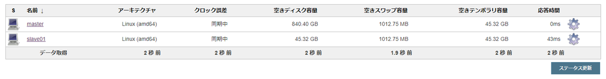
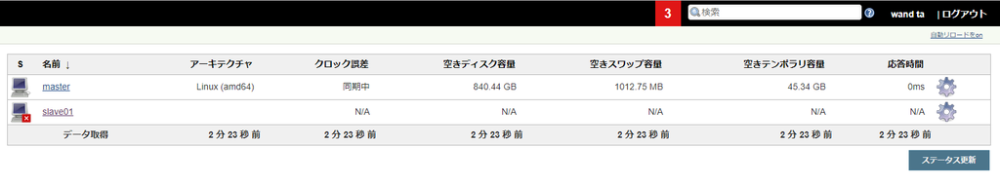
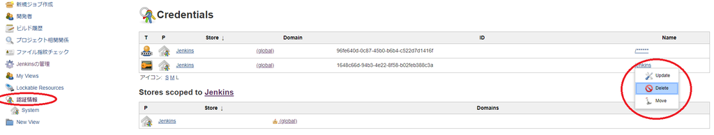

# コンテナでアプリケーションを実行する

## DockerイメージとDockerコンテナの基本

- イメージpullする

```sh
docker image pull gihyodocker/echo:latest
```

- pullしてきたイメージでコンテナ作成・実行

```sh
docker container run -t -p 9000:8080 gihyodocker/echo:latest
```

- HTTPサーバー立ち上がる
- ブラウザで`localhost:9000`にアクセスするとrequestをreceiveする

```
docker container run -t -p 9000:8080 gihyodocker/echo:latest
2019/01/28 12:41:14 start server
2019/01/28 12:41:16 received request
2019/01/28 12:41:16 received request
2019/01/28 12:41:20 received request
2019/01/28 12:41:20 received request
```

- Ctrl+Cとかでコンテナから出る
- 動いているコンテナ全停止


```sh
docker container stop $(docker container ls -q)
```


## 簡単なアプリケーションとDockerイメージをつくる

- さっきpullしてきたイメージと同じものを作ってみる


main.go
```go
package main

import (
	"fmt"
	"log"
	"net/http"
)

func main() {
	http.HandleFunc("/", func(w http.ResponseWriter, r *http.Request) {
		log.Println("received request")
		fmt.Fprintf(w, "Hello Docker!!")
	})

	log.Println("start server")
	server := &http.Server{Addr: ":8080"}
	if err := server.ListenAndServe(); err != nil {
		log.Println(err)
	}
}
```

Dockerfile
```docker
FROM golang:1.9

RUN mkdir /echo
COPY main.go /echo

CMD ["go", "run", "/echo/main.go"]
```

### DSL: Domain Specific Language

- 要するにDocker語
- `FROM golang:1.9`
    - レジストリからベースのイメージをpullしてくる
        - デフォルトDockerHub
    - go言語のランタイムが入っているイメージをベースにする
        - `golang:1.9`
        - `library/golang` の略
            - 公式イメージ
        - `:1.9`は**タグ**
    - 1回しか使えない
- `RUN mkdir /echo`
    - `mkdir /echo`を実行
- `COPY main.go /echo`
    - ホストからコンテナへのファイル/ディレクトリコピー
        - ホスト: Dockerfileがあるディレクトリの`main.go`
        - コンテナ: `/echo/main.go`
- `CMD ["go", "run", "/echo/main.go"]`
    - コンテナ起動時に実行されるコマンド
        - cf. `RUN`はコンテナイメージのビルド時に実行される
    - 実行時上書きできる
        - `docker container run -it xxx bash`の`bash`がそう

### Dockerイメージをビルドする

```sh
docker image build -t example/echo:latest .
```

- `docker image build`
    - イメージをビルドする
- `-t example/echo:latest`
    - 名前とタグをつける
- `.`
    - Dockerfileはカレントディレクトリにある
        


## コラム

### ENTRYPOINTでコマンドの実行の仕方を工夫する

- コンテナ起動時に実行されるコマンドを指定
- これを指定すると、CMDはENTRYPOINTの引数になる


### Dockerfileのその他のインストラクション

- ドキュメント嫁


## Dockerコンテナを実行する

- さっき作ったイメージでコンテナを作成・実行

```sh
docker container run example/echo:latest
```

- Ctrl+Cで離脱
- 今度はバックグラウンドで実行
    - コンテナの中ではあくまで`go run /echo/main.go`をフォアグラウンドで実行
    - コンテナ自体をバックグラウンドで実行

```sh
docker container run -d  example/echo:latest bash
9309e37449f183d3cbbb1bf8bd594e29957f0c75e23d923242e27068a5b5cfc3

docker container ls
CONTAINER ID        IMAGE                 COMMAND             CREATED             STATUS              PORTS               NAMES
9309e37449f1        example/echo:latest   "bash"              5 seconds ago       Up 3 seconds                            vigilant_varahamihira
```

### ポートフォワーディング

main.go(コンテナ内で動く)
```go
	server := &http.Server{Addr: ":8080"}
```

- この8080ポートは**コンテナポート**
- コンテナ外=ホストから直接利用できない
- ホストから利用するには**ポートフォワーディング**
    - ホストのポートとコンテナポートとを紐づける


```sh
docker container run -d -p 9000:8080 example/echo:latest
```


# Dockerイメージの操作




- リファレンス。特筆すべきことなし。あまり触ったことのない機能だけメモ


## 【補】`docker image push`

- `docker login -u your_docker_id` で止めることで、stdinでパスワード入力できる
- イメージにタグをつけておく `docker image tag xxxxx organization/imagename:tag`
    - `xxxxx`はイメージIDや`[organization/]imagename:tag`
- DockerHubで`organization`を作っておく必要がある


# Dockerコンテナの操作


## Dockerコンテナのライフサイクル

- イメージはテンプレート ... 状態を持たない
- コンテナはイメージを具象化したもの ... 状態を持つ
    - 実行中
        - golangで書いたHTTPサーバーはずっと実行中
    - 停止
        - ユーザが明示的に停止
            - `docker container stop`
        - コンテナで実行されているアプリケーションがEXIT
            - Ch.1のHello Worldコンテナとか
    - 破棄
        - 停止状態のコンテナは明示的に消さない限り残る
            - `docker container ls -a`で確認可能
        - 停止したコンテナを明示的に破棄してディスクを空ける
- [図](http://blog.kamiazya.tech/post/docker-lifecycle/)
    - `docker container state` とかでググっても分かりづらい図ばっか


## コマンドの説明

- リファレンス。特筆すべきことなし。あまり触ったことのない機能だけメモ


### 名前付きコンテナ

- コンテナの特定方法
    - ID
    - name
- IDとnameは自動付与される
    - 開発中は、自動付与=毎回変わるものは不便
- 名前を自分でつける

```sh
docker container run -t -d --name gihyo-echo example/echo:latest
```

```
CONTAINER ID        IMAGE                     COMMAND                  CREATED             STATUS                      PORTS                 NAMES
51578e055f7e        example/echo:latest       "go run /echo/main.go"   6 seconds ago       Up 3 seconds                                      gihyo-echo
```

- 名前が被ると怒られる
    - ので、本番ではあまり使わない

```sh
docker container run -t -d --name gihyo-echo example/echo:latest
```

```
C:\Program Files\Docker\Docker\Resources\bin\docker.exe: Error response from daemon: Conflict. The container name "/gihyo-echo" is already in use by container "51578e055f7ecac2a6fd760e3136ca1501dd4ce433c082df85d874962e1e2953". You have to remove (or rename) that container to be able to reuse that name.
See 'C:\Program Files\Docker\Docker\Resources\bin\docker.exe run --help'.
```


### `docker container ls`

### 【補】停止したコンテナだけ拾う

```sh
docker container ls --filter="status=exited"
```

```
CONTAINER ID        IMAGE                     COMMAND                  CREATED             STATUS                      PORTS               NAMES
d808f21d025d        alpine:3.7                "uname -a"               8 minutes ago       Exited (0) 8 minutes ago                        flamboyant_lovelace
8a03655d503c        alpine                    "/bin/sh"                10 hours ago        Exited (0) 10 hours ago                         angry_margulis
44075995e879        alpine                    "/bin/sh"                10 hours ago        Exited (0) 10 hours ago                         adoring_dewdney
...
```

- `-a`は要らない


### 【補】`--filter="ancestor=xxx"`の仕様

```sh
docker container ls --filter="ancestor=golang:1.9" -a
```

```
CONTAINER ID        IMAGE                 COMMAND                  CREATED             STATUS                  PORTS               NAMES
51578e055f7e        example/echo:latest   "go run /echo/main.go"   5 minutes ago       Up 5 minutes                                gihyo-echo
a48768a11bea        example/echo:latest   "bash"                   3 days ago          Exited (0) 3 days ago                       xenodochial_tereshkova
```

- ancestor:「祖先」の意
    - コンテナ`51578e055f7e`は、イメージ`example/echo:latest`から生成されたもの
    - イメージ`example/echo:latest`は、イメージ`golang:1.9`がベース


Dockerfile
```
FROM golang:1.9 # <= これ

RUN mkdir /echo
COPY main.go /echo

CMD ["go", "run", "/echo/main.go"]
```


# 運用管理向けコマンド

- リファレンス。特筆すべきことなし。あまり触ったことのない機能だけメモ


## `docker container stats` -- 利用状況の取得

- Unixの`top`コマンドのDocker版
    - 各コンテナのリソース使用状況を確認できる
- cf. `docker container top CONTAINER [ps OPTIONS]`
    - 特定のコンテナの中で`top`する感じ


```sh
docker container stats
```

```
CONTAINER ID        NAME                     CPU %               MEM USAGE / LIMIT     MEM %               NET I/O             BLOCK I/O           PIDS
51578e055f7e        gihyo-echo               0.02%               8.996MiB / 1.934GiB   0.45%               1.46kB / 0B         25.6MB / 8.19kB     15
```

```sh
docker container top gihyo-echo
```

```
PID                 USER                TIME                COMMAND
3881                root                0:00                go run /echo/main.go
3942                root                0:00                /tmp/go-build159567899/command-line-arguments/_obj/exe/main
```

```sh
docker exec -t gihyo-echo top
```

```
top - 22:20:52 up  1:07,  0 users,  load average: 0.37, 0.20, 0.07
Tasks:   3 total,   1 running,   2 sleeping,   0 stopped,   0 zombie
%Cpu(s):  0.2 us,  0.2 sy,  0.0 ni, 99.7 id,  0.0 wa,  0.0 hi,  0.0 si,  0.0 st
KiB Mem :  2027864 total,   150816 free,   642844 used,  1234204 buff/cache
KiB Swap:  1048572 total,  1045116 free,     3456 used.  1206352 avail Mem

  PID USER      PR  NI    VIRT    RES    SHR S  %CPU %MEM     TIME+ COMMAND
    1 root      20   0  161620  10504   6628 S   0.0  0.5   0:00.22 go
   26 root      20   0   36856   4572   3792 S   0.0  0.2   0:00.00 main
   42 root      20   0   41060   3100   2600 R   0.0  0.2   0:00.01 top
```


# Docker Composeでマルチコンテナを実行する

- システムは複数のアプリケーションやミドルウェアからなる
- Dockerコンテナはアプリケーションのデプロイに特化
- 複数アプリケーション = 複数のコンテナが欲しくなる
    - 仮想サーバ(1台1システム)とは粒度が異なる
- **Docker Compose** ... Dockerコンテナ(群)の構成管理ツール
    - 環境変数
    - コンテナ間依存
    - ポートフォワーディング
- IaC
    - アプリケーションの構成管理: Dockerfile
    - 複数のコンテナの構成管理: **docker-compose.yml**


## `docker-compose`によるコンテナの実行


### 既存のイメージから実行

- これと同じことをComposeでやってみる
```sh
docker container run -d -p 9000:8080 example/echo:latest
```


- docker-compose.yml
```yaml
version: "3"
services:
  echo:
    image: example/echo:latest
    ports:
      - 9000:8080
```

- docker-compose.ymlがあるディレクトリで実行
```sh
docker-compose up -d
```


- 起動確認
    - 【補】`learn/docker/ch2/docker-compose.yml` を読み込んだため、  
        `ch2_echo_1`というコンテナ名が自動付与された
```sh
docker container ls
```

```
CONTAINER ID        IMAGE                 COMMAND                  CREATED              STATUS              PORTS                    NAMES
1b972def4595        example/echo:latest   "go run /echo/main.go"   About a minute ago   Up About a minute   0.0.0.0:9000->8080/tcp   ch2_echo_1
```


- docker-composeでも起動確認できる
    - Compose管理下のコンテナのみ`-a`相当で表示
```sh
docker-compose ps
```

```
docker-compose ps
   Name            Command          State           Ports
------------------------------------------------------------------
ch2_echo_1   go run /echo/main.go   Up      0.0.0.0:9000->8080/tcp
```

### イメージをビルドする


- docker-compose.yml
```yaml
version: "3"
services:
  echo:
    build: .
    ports:
      - 9000:8080
```

```sh
docker-compose build
```


### 実行時に必ずビルドする


```sh
docker-compose up -d --build
```

- cf. `docker-compose up -d`は、ビルド済イメージがあればリビルドしない
- 開発中、頻繁にイメージを更新する場合などに便利


# Composeによる複数コンテナの実行


## Jenkinsコンテナを実行する


jenkins/docker-compose.yml
```yaml
version: "3"
services:
  master:
    container_name: master
    image: jenkinsci/jenkins:2.142-slim
    ports:
      - 8080:8080
    volumes:
      - ./jenkins_home:/var/jenkins_home
```

- jenkinsコンテナを実行
    - この後の作業を考えて、バックグラウンドで実行してます

```sh
cd jenkins
docker-compose up -d
```

```
 docker-compose up  -d
Creating network "jenkins_default" with the default driver
Pulling master (jenkinsci/jenkins:2.142-slim)...
2.142-slim: Pulling from jenkinsci/jenkins
802b00ed6f79: Pull complete
c93b65a61a80: Pull complete
a9885ada077a: Pull complete
a89352ec9377: Pull complete
796c914eaedf: Pull complete
69436e8df502: Pull complete
501f626f3aba: Pull complete
a82ee17fd0f5: Pull complete
f8f632d79ecc: Pull complete
b60c147d6cac: Pull complete
52bf368210e0: Pull complete
77540290a559: Pull complete
4b4c3238eab0: Pull complete
166ab282d2bf: Pull complete
4514c94376d2: Pull complete
c2f128aeee3c: Pull complete
85c112e8d33a: Pull complete
97322bf56814: Pull complete
fc4b423b890f: Pull complete
Creating master ...
Pulling master (jenkinsci/jenkins:2.142-slim)...
Creating master ... done
```

- バックグラウンドで実行したコンテナの標準出力を拾う
    - 初期パスワードをコピー

```sh
docker-compose logs master
```

```
...
master    | *************************************************************
master    |
master    | Jenkins initial setup is required. An admin user has been created and a password generated.
master    | Please use the following password to proceed to installation:
master    |
master    | xxxxxxxxxxxxxxxxxxxxxxxxxxxxxxxx
master    |
master    | This may also be found at: /var/jenkins_home/secrets/initialAdminPassword
master    |
master    | *************************************************************
...
```

- jenkinsのセットアップ
    - unlock画面で初期パスワード入力
    - ガイダンス通り
    - デフォルト設定
    - workspaceのクリーンアップ等でエラーが出たがとりあえずスルー


## Master JenkinsのSSH鍵を作る

- 書籍のやり方: `docker`コマンド
    - コンテナ名`master`でコンテナを特定している
        - docker-compose.ymlの `container_name: master`で名前付きコンテナを作っている
```sh
docker container exec -it master ssh-keygen -t rsa -C ""
```

- 【補】`docker-compose`でもコマンド実行できる
    - docker-compose.yml の`services:`の`master:`でコンテナを特定する
```sh
docker-compose exec master ssh-keygen -t rsa -C ""
```


- 【補】Win10 Powershellだからか上記いずれもうまくいかず。  
    bashでコンテナに入ってコマンド実行した...
    
```sh
docker-compose exec master bash
jenkins@230d6c7957db:/$ ssh-keygen -t rsa -C ""
```

```
Generating public/private rsa key pair.
Enter file in which to save the key (/var/jenkins_home/.ssh/id_rsa):
Created directory '/var/jenkins_home/.ssh'.
Enter passphrase (empty for no passphrase):
Enter same passphrase again:
Your identification has been saved in /var/jenkins_home/.ssh/id_rsa.
Your public key has been saved in /var/jenkins_home/.ssh/id_rsa.pub.
The key fingerprint is:
SHA256:O4y2BYYv7Zobr7icAa+4XbSwWguD6VMctCnf7kPpxhA
The key's randomart image is:
+---[RSA 2048]----+
|                 |
|   .             |
|  . o            |
| . E .           |
|. = * + S        |
|.+ O O + .       |
|= * @ = =        |
|oX * & o .       |
|=oO.B==          |
+----[SHA256]-----+
jenkins@230d6c7957db:/$
```

- id_rsa.pubをMaster-&gt;Slave接続に使用する
```sh
cd /var/jenkins_home/.ssh
ls
```

```
id_rsa  id_rsa.pub
```

- コンテナから出る
```sh
exit
```


## Jenkins Slaveコンテナを作る

- jenkins/docker-compose.yml
    - slave01コンテナの追加
    - masterとslave01が通信できるようにする
    - 公開鍵を環境変数に設定
        - .ssh/id_rsa.pub
```diff
  version: "3"
  services:
    master:
      container_name: master
      image: jenkinsci/jenkins:2.142-slim
      ports:
        - 8080:8080
      volumes:
        - ./jenkins_home:/var/jenkins_home
+     links:
+       - slave01
+  
+   slave01:
+     container_name: slave01
+     image: jenkinsci/ssh-slave
+     environment:
+       - jenkins_slave_ssh_pubkey=ssh-rsa AAAAB3Nz...
```

- Master再起動、Slaveビルド・起動
```sh
docker-compose down
docker-compose up -d

docker-compose ps
```

```
 Name                Command               State                 Ports
------------------------------------------------------------------------------------
master    /sbin/tini -- /usr/local/b ...   Up      50000/tcp, 0.0.0.0:8080->8080/tcp
slave01   setup-sshd                       Up      22/tcp
```

## 最終調整

- GUI上であれやこれやする

<figure class="figure-image figure-image-fotolife" title="初期パスワード入力"><figcaption>初期パスワード入力</figcaption></figure>













- 失敗したら認証情報を消してやり直す
    - jenkinsという名前じゃないと駄目

---





