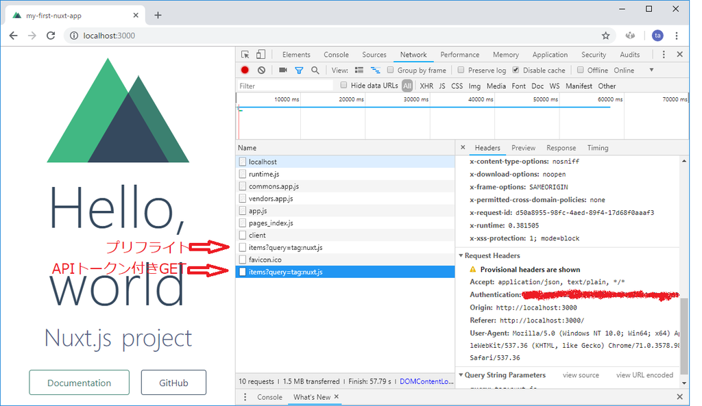
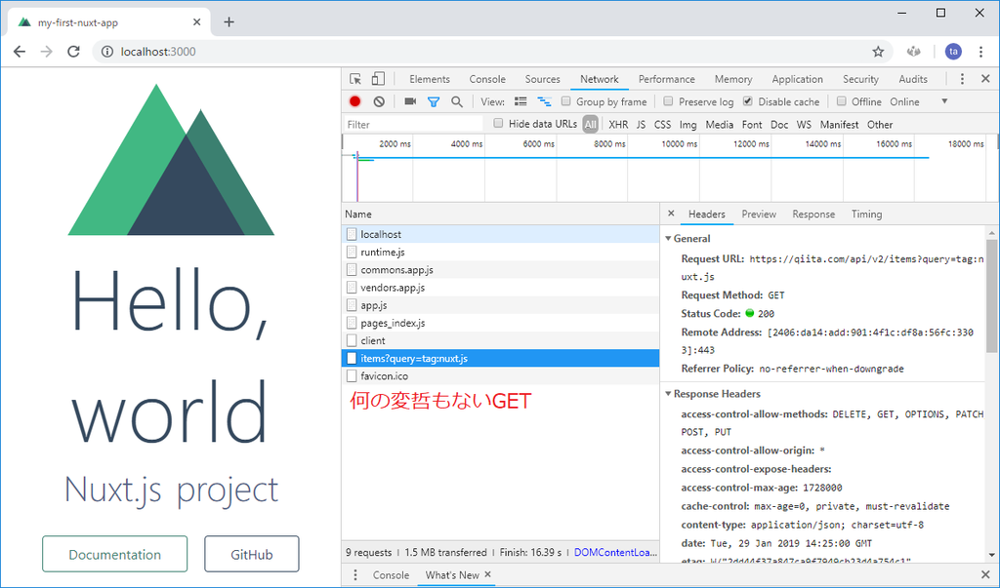
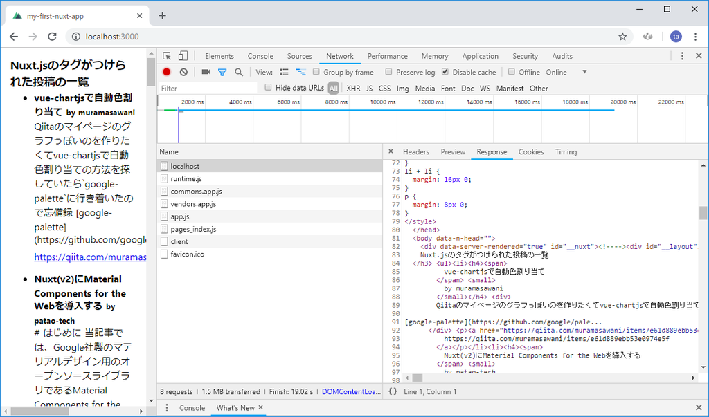

# 開発するアプリケーションについて


## 開発するアプリケーションの概要

- QiitaのNuxt.jsタグのビューアー
    - Nuxt.jsタグの投稿一覧表示
    - 投稿者のプロフィールと投稿一覧表示


# 事前準備

## Node.jsとYarnによる必須環境の導入

- yarn導入済だった


## 推奨ツール「direnv」の導入

- windowsぼく、低みの見物


# Vue CLIによるアプリケーションひな形の作成

- Vue CLIのinit機能でVueプロジェクトのひな形をらくらく生成

```sh
npm i -g @vue/cli @vue/cli-init
```

- version確認

```sh
vue -V

3.3.0
```

- Nuxt.jsのスターターテンプレート使う

```sh
vue init nuxt-community/starter-template my-first-nuxt-app

? Project name my-first-nuxt-app
? Project description Nuxt.js project
? Author wand <d19921207@gmail.com>

   vue-cli · Generated "my-first-nuxt-app".

   To get started:

     cd my-first-nuxt-app
     npm install # Or yarn
     npm run dev
```

- パッケージインストール

```sh
cd my-first-nuxt-app
yarn
yarn dev
```

- http://localhost:3000 開く


# はじめてのページ作成と「Hello, world」

- HMRがセットアップされててうれしい


# Nuxt.jsプロジェクトの構成について


## ASSETS

This directory contains your un-compiled assets such as LESS, SASS, or JavaScript.

More information about the usage of this directory in the documentation:
https://nuxtjs.org/guide/assets#webpacked

**This directory is not required, you can delete it if you don't want to use it.**


- JS以外のリソース
    - 画像
    - 設定
    - CSS

## COMPONENTS

The components directory contains your Vue.js Components.
Nuxt.js doesn't supercharge these components.

**This directory is not required, you can delete it if you don't want to use it.**


- AppLogo.vueが置いてあったりする


## PAGES

This directory contains your Application Views and Routes.
The framework reads all the .vue files inside this directory and creates the router of your application.

More information about the usage of this directory in the documentation:
https://nuxtjs.org/guide/routing


- index.vueとか置いてある
- Nuxt.jsの中でも特に変わったつくり


## STATIC

This directory contains your static files.
Each file inside this directory is mapped to /.

Example: /static/robots.txt is mapped as /robots.txt.

More information about the usage of this directory in the documentation:
https://nuxtjs.org/guide/assets#static

**This directory is not required, you can delete it if you don't want to use it.**


- (ファイル名も)そのまま公開されてほしい静的リソースを管理
    - 【補】Laravelでいうpublic的な
    - ファイル名が決まっているもの
        - favicon.txt
        - robots.txt
        

## STORE

This directory contains your Vuex Store files.
Vuex Store option is implemented in the Nuxt.js framework.
Creating a index.js file in this directory activate the option in the framework automatically.

More information about the usage of this directory in the documentation:
https://nuxtjs.org/guide/vuex-store

**This directory is not required, you can delete it if you don't want to use it.**


- index.jsがVuexルート
- 他のはファイル名に対応したVuexモジュール
    - 部分木的な


# PLUGINS

This directory contains your Javascript plugins that you want to run before instantiating the root vue.js application.

More information about the usage of this directory in the documentation:
https://nuxtjs.org/guide/plugins

**This directory is not required, you can delete it if you don't want to use it.**

- あとでつかう
    - 拡張機能の設定とか


# ルーティングとページコンポーネントの作成

- pages以下のディレクトリ構成がルーティングに反映される
    - `hoge/index.vue`だけは`hoge/`扱い
- ファイル名を`_`で始めるとルートパラメータになる
    - `/users/_id.vue`とか
- 優先度は静的なルーティング > 動的なルーティング
    - `/users/register.vue` > `/users/_id.vue`


# 動的ルーティングのコンテンツの出し分け

- `_`以下のファイル名がそのまま`this.$route.params`に入る


# axios-moduleによる外部リソースの取得

## axios-moduleの導入

- axios-module入れる
    - axiosを便利に使うやつ
    - リクエストのhookなどを簡単に行える可能拡張


```sh
yarn add @nuxtjs/axios
```

/nuxt.config.js
```diff
    loading: { color: '#3B8070' },

+   modules: [
+       '@nuxtjs/axios'
+   ],
+   axios: {
+
+   },
```


- HMR再起動しとく


## Qiita APIへのアクセス


index.vue
```javascript
  async mounted() {
    console.log(
      JSON.stringify(await
        this.$axios.$get(
          'https://qiita.com/api/v2/items?query=tag:nuxt.js',
          true,
          ' '
        )
      )
    )
  }
```

- 統一的なインタフェースのもとで利用できる


## 【補】Promise対応

- Vue.jsの時点でPromise対応してるそうで

[動的 & 非同期コンポーネント](https://jp.vuejs.org/v2/guide/components-dynamic-async.html)


# 認証情報を付与したAPIリクエスト

## Qiita APIの制限

- 認証するとAPIの制限が緩和
- さもないとHMRで使い尽くしちゃう


## Qiitaのアクセストークンの取得

- 略

## 認証情報の設定

- direnvの代わりにdotenv入れた

nuxt.config.js
```diff
+ require('dotenv').config();

  module.exports = {

/* ... */
   
    axios: {
   
    },
+   plugins: [
+     '~/plugins/axios.js'
+   ],
+   env: {
+     QIITA_TOKEN: process.env.QIITA_TOKEN
+   },
```

/plugins/axios.js
```javascript
export default function({ $axios }) {
  $axios.onRequest((config) => {
    if (process.env.QIITA_TOKEN) {
      config.headers.common['Authentication'] = process.env.QIITA_TOKEN
    }
    return config
  })
}
```

/.env
```
QIITA_TOKEN="xxxxxxxxxxxxxxxxxxxxxxxxxxxxxxxxxxxxxxxx"
```


<figure class="figure-image figure-image-fotolife" title="APIトークン追加後"><figcaption>APIトークン追加後</figcaption></figure>


<figure class="figure-image figure-image-fotolife" title="APIトークン追加前"><figcaption>比較：APIトークン追加前</figcaption></figure>


# 非同期通信を含むコンテンツのSSR


- `data`や`mounted`の代わりに`asyncData({ app })`使え
    - `asyncData`実行時点でコンポーネントは初期化前
    - したがって`this`にアクセスできない
    - したがって`this.$axios`にもアクセスできない
    - ので`app.$axios`が使えるようになっている


<figure class="figure-image figure-image-fotolife" title="サーバでレンダリングされてHTMLが降ってくる"><figcaption>サーバでレンダリングされてHTMLが降ってくる</figcaption></figure>


# ルーティングを組み合わせたSSR

- by xxxx にリンク張る
    - `<nuxt-link>`
        - Vue.jsの`<router-link>`みたいなカスタムタグ
- `asyncData()`に渡ってくるオブジェクトから`route`を取れる


# head()によるHTMLメタの設定

- headタグの中身を弄れる
    - サイト共通の`<title>`書式
    - description
    - OGP
    - Twitterカード

## 共通タイトルの設定

```diff
  head: {
    title: 'my-first-nuxt-app',
+   titleTemplate: '%s | Nuxt.js tag items viewer',
    meta: [
```

- printf記法
- `title`が`%s`に入る

## ページごとのタイトルの設定

- config.jsのheadと同じ構造のオブジェクトを返し、overrideする

```diff
  export default {
+   head() {
+     return {
+       title: this.user.id
+     }
+   },
    async asyncData({ route, app }) {
```


# ロジックのVuexストアへの移植

- 普通のVue.jsのVuexと大差ない
- ちがうとこ
    - `asyncData`内では引数に渡ってくる`{ store }`を利用する必要がある
    - `computed`へのgetterのマッピングは通常通り`mapGetter`をスプレッドすればOK
- データフェッチのキャッシュ利用のロジックが出てきたあたりでVuexストアの利用を検討せよ
    - Nuxt.jsはVuexストアと強力に連携している
