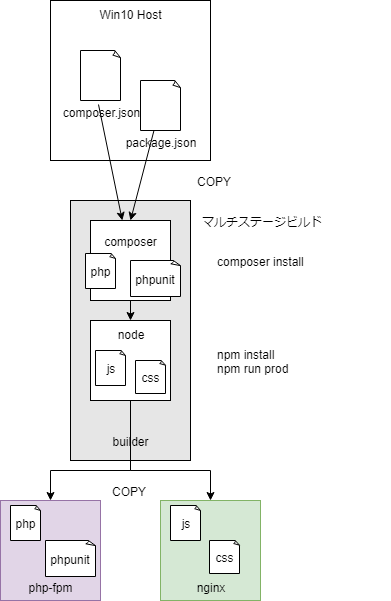

# コンテナ構成
- nginx
- php-fpm
- mysql
    - 認証絡みで面倒くさくなって5.7


# 動機

- [laradock](https://laradock.io/)はサクっと始められて便利
- だが、ホストとのボリューム共有があり、そのままでは本番環境にデプロイできない
- ローカルでテストしたコンテナを本番環境にそのままデプロイするには、  
    アプリケーションコードもコンテナに詰めてやる必要がある


# イメージビルド環境

[github](https://github.com/wand2016/laravel_multibuild)


# ハマった所～解決の経緯

- php-fpmコンテナでphpunitが動かなくなった
- Win10ホストとボリューム共有状態でphpunitをcomposer installしたのが原因
    - ホスト-コンテナ間でシンボリックリンクをCOPYすると壊れる  
        [XSym symbolic links cannot be used in PHP on Docker for Windows](https://stackoverflow.com/questions/53396559/xsym-symbolic-links-cannot-be-used-in-php-on-docker-for-windows)
- マルチステージビルドで解決
    - `composer install`, `npm install`, `npm run prod`を行うbuilderイメージを追加
    - ホストを介さず、builderからphp-fpmへ直接COPY


## マルチステージビルド




builderコンテナ
```dockerfile
# ----------------------------------------
# stage 1: resolve PHP packages
# ----------------------------------------
FROM composer:latest as php_builder

ARG APP_CODE_PATH_HOST=./www
ARG APP_CODE_PATH_CONTAINER=/var/www


# accelerate composer
RUN composer config -g repositories.packagist composer https://packagist.jp
RUN composer global require hirak/prestissimo

# copy source files
WORKDIR ${APP_CODE_PATH_CONTAINER}
COPY ${APP_CODE_PATH_HOST} ${APP_CODE_PATH_CONTAINER}

# make writable
RUN chmod +w ${APP_CODE_PATH_CONTAINER}

# resolve packages
RUN composer install

# ----------------------------------------
# stage 2: resolve JS packages and build JS
# ----------------------------------------
FROM node:latest

ARG APP_CODE_PATH_HOST=./www
ARG APP_CODE_PATH_CONTAINER=/var/www

# copy source files
WORKDIR ${APP_CODE_PATH_CONTAINER}
COPY --from=php_builder ${APP_CODE_PATH_CONTAINER} ${APP_CODE_PATH_CONTAINER}

# resolve packages
RUN npm install

# build JS
RUN npm run prod
```

nginxコンテナ
```
ARG BUILDER_CONAINER_IMAGE_NAME=${BUILDER_CONAINER_IMAGE_NAME}
# ----------------------------------------
# ビルド成果物抽出用
# ----------------------------------------
FROM ${BUILDER_CONAINER_IMAGE_NAME} as built


# ----------------------------------------
# ベースイメージ
# ----------------------------------------
FROM nginx:alpine

LABEL maintainer="Mahmoud Zalt <mahmoud@zalt.me>"

COPY ./nginx/nginx.conf /etc/nginx/

# If you're in China, or you need to change sources, will be set CHANGE_SOURCE to true in .env.

ARG CHANGE_SOURCE=false
RUN if [ ${CHANGE_SOURCE} = true ]; then \
    # Change application source from dl-cdn.alpinelinux.org to aliyun source
    sed -i 's/dl-cdn.alpinelinux.org/mirrors.aliyun.com/' /etc/apk/repositories \
;fi

RUN apk update \
    && apk upgrade \
    && apk add --no-cache bash \
    && adduser -D -H -u 1000 -s /bin/bash www-data

ARG PHP_UPSTREAM_CONTAINER=php-fpm
ARG PHP_UPSTREAM_PORT=${NGINX_PHP_UPSTREAM_PORT}

# PHPコンテナとの通信
# デフォルトのconfは消す
RUN echo "upstream php-upstream { server ${PHP_UPSTREAM_CONTAINER}:${PHP_UPSTREAM_PORT}; }" > /etc/nginx/conf.d/upstream.conf \
    && rm /etc/nginx/conf.d/default.conf

# 設定ファイルのコピー
# デフォルトのconfが含まれる
RUN mkdir -p /etc/nginx/sites-available
COPY ./nginx/sites /etc/nginx/sites-available

# コードのコピー
# 静的ファイルだけでいいのでpublicのみ
ARG APP_CODE_PATH_CONTAINER=${APP_CODE_PATH_CONTAINER}
COPY --from=built --chown=www-data:www-data ${APP_CODE_PATH_CONTAINER}/public ${APP_CODE_PATH_CONTAINER}/public

# サーバ起動
CMD ["nginx"]

EXPOSE 80 443
```

php-fpmコンテナ
```
ARG PHP_VERSION=${PHP_VERSION}
ARG BUILDER_CONAINER_IMAGE_NAME=${BUILDER_CONAINER_IMAGE_NAME}
# ----------------------------------------
# ビルド成果物抽出用
# ----------------------------------------
FROM ${BUILDER_CONAINER_IMAGE_NAME} as built

# ----------------------------------------
# ベースイメージ
# ----------------------------------------
FROM laradock/php-fpm:2.2-${PHP_VERSION}

# 設定ファイルのコピー
ARG PHP_VERSION=${PHP_VERSION}
# ARG使ってない
# 7.2を指定してもなぜか7.2.4になってコケるので諦めました
COPY ./php-fpm/php7.2.ini /usr/local/etc/php/php.ini

# コードのコピー
ARG APP_CODE_PATH_CONTAINER=${APP_CODE_PATH_CONTAINER}
WORKDIR ${APP_CODE_PATH_CONTAINER}

COPY --from=built --chown=www-data:www-data ${APP_CODE_PATH_CONTAINER} ${APP_CODE_PATH_CONTAINER}

# 初期化処理のコードのコピー
COPY --chown=www-data:www-data ./php-fpm/init.sh ${APP_CODE_PATH_CONTAINER}
RUN chmod +x ./init.sh


# これをしないとstorage/logsの書き込みでpermission errorになる
USER www-data
```

