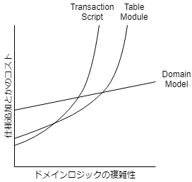
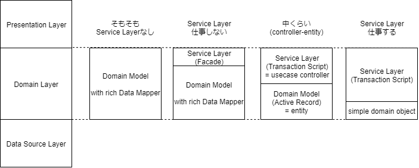

# 前章の話

- アプリケーションを層分けしろ
    - プレゼンテーション層
    - ドメイン層
    - データソース層

# Organizing Domain Logic

- ドメインロジックを構成する設計は主に3種類
    - Transaction Script
    - Domain Logic
    - Table Module
    
## Transaction Script

- 一番シンプル
- ユーザの望む1アクションにつき1手続き
- 例えば、買い物システムなら
    - チェックアウトスクリプト
    - ショッピングカートに物を追加するスクリプト
    - 配送状態表示スクリプト
    - etc.
- メリット
    - 単純な手続き型モデル。理解できない開発者はまずいない
    - データソース層が単純ならうまくいく
        - Row Data Gateway
        - Table Data Gateway
    - DBのトランザクションの設定が容易
        - スクリプトの開始でトランザクション開始
        - スクリプトの終了でトランザクション終了
- デメリット...ドメインロジックが複雑になるにつれ顕在化
    - コード多重化
        - 似てるアクションのためにほとんど同じスクリプトを書く
        - 共通部分を抜き出して共通化できるが、構造化しないのでぐっちゃぐちゃになる

## Domain Model

- 複雑性に対処ときたらオブジェクト指向
- (少なくとも最初は)主にビジネスドメインで現れる名詞をオブジェクト化する
    - 賃貸システムの例
        - 賃貸
        - 資産
        - 契約
    - 会計システムの例
        - 契約
        - 製品
        - 収益認識ストラテジ
            - Strategy Pattern
        - 収益認識
- Transaction Scriptとの違いは、シーケンス図を見れば一目瞭然
    - Transaction Script: 中央集権型
    - Domain Model: 各オブジェクトに処理を委譲
- 拡張が楽
    - Transaction Script: 条件文の追加
        - 影響大。すべてがブチ壊れる可能性がある
    - Domain Model: Strategy Patternにしたがい、Strategyオブジェクトを追加する
        - Strategyインタフェースに依存するので影響最小限
- 著者(Martin Fowler)くらいオブジェクト指向狂いになると、単純なケースでもDomain Modelを好むようになる
- こわくないよ　みんなやってるよ
- オブジェクトとDBのマッピング
    - Domain Modelが豊かになるにつれ、RDBへのマッピングは複雑になる
        - Data Mapper
    - 精巧なデータソース層は固定資産のようなもの
        - 良いものを作るのにはコストがかかる
        - が、ひとたび手に入れればあれこれできる
        

## Table Module

- Transaction ScriptとDomain Modelの中くらい
- Domain Modelとの違いは、単一オブジェクトであること
    - Domain Model: 1レコードにつき1オブジェクト
    - Table Module: シングルトン
        - レコードの集合(Record Set)について仕事する
        - 個々のレコードについて仕事したいときはIDを渡す
- Transaction Scriptよりはコード多重化を排除しやすい
- Domain ModelよりはOOのテクニックを適用しづらい
    - 継承
    - ストラテジ
    - etc.
- メリット ... ドメイン層以外とフィットする
    - GUIはRecord Setを受け取る
    - GUIから渡ってきたRecord Setをバリデート・計算する

# Making a Choice

<figure class="figure-image figure-image-fotolife" title="ドメイン層の設計3種の比較"><figcaption>ドメイン層の設計3種の比較</figcaption></figure>

- 結局どれ使えばいいの
    - 簡単な選択ではない
- 定性的には
    - ドメインロジックが単純なら Transaction Script
    - ドメインロジックが複雑なら Domain Model, Table Module
- ドメインロジックの複雑性を定量的に図ることができないのであまり意味がない
- 実際的には、要件の初期分析を経験豊富な人にしてもらい、決めてもらうことになる
- Domain Model導入の初期コスト
    - データソース層を成功に作りこむ必要があるため、Transaction Script, Table Moduleよりは高くなる
    - チームの面子がOOに慣れていればある程度下げられる
- Table Moduleの強みは、環境がRecord Setを支援してくれるかによる
    - .NETとかCOMとか
    - ツールの支援等を受けられないとつらい
- 一度決めたら絶対変えられない、というものではない
- が、変えるのは注意とスキルを要する
    - Transaction Scriptで始めて、「しくじった」と思ったら、ためらわずDomain Modelに向けてリファクタしろ
    - Domain Modelで始めてTransaction Scriptに方向転換するのは、精巧に作りこんだデータソース層を単純化できない限り割に合わない
- そもそも3つの設計は排他的ではない
    - いくつかのドメインロジックにだけTransaction Scriptを適用する

# Service Layer

<figure class="figure-image figure-image-fotolife" title="Service層にどれくらい仕事させるか"><figcaption>Service層にどれくらい仕事させるか</figcaption></figure>

- ドメイン層をさらに2分割することは一般的
    - 上: Service Layer
    - 下: Domain Model, Table Module
    - ※ Transaction Scriptを適用すべき単純なケースでは、わざわざ分割する必要はない
- Service LayerはAPIのようにふるまう
    - Service Layerを通してドメインロジックにアクセスする
- Service Layerはトランザクション制御やセキュリティチェックを実装する場所としても有用
- Service Layerにどこまで仕事させる？
    - 仕事しない側: Facade
        - 振る舞いをもたず、低レベルなオブジェクトに委譲するだけ
        - トランザクション、セキュリティチェックでラップする等
    - 仕事する側: Transaction Script
        - Service Layer内にTransaction Scriptをガリガリ書く
        - 下層のオブジェクトは簡素になる
        - (もう少し作りこんで)Domain Modelにするとしても、  
            1つのDBのレコードに1つのモデルが紐づく、単純なActive Recordになる
    - 中くらい: controller-entityスタイル
        - controller
            - 著者は**use-case controller**と呼ぶ
                - MVCのControllerとかAction Controllerとかとは違う言葉
            - Service Layer
            - 単一のビジネストランザクションやユースケース特有のロジックをTransaction Scriptで書く
        - entity
            - Domain Model
            - 複数のユースケースで使うロジックを置く
- controller-entityスタイルはよく使われるが、著者は好まない
    - Transaction Scriptよろしく、コード多重化を招く
    - 著者見解: Domain Modelでいくことに決めたなら、それを主要にして徹底的にやるべき
    - 例外: ドメイン層の設計をTransaction Scriptで始めて、後で変えることにした場合
        - Transaction ScriptではRow Data Gatewayを扱う
        - コード共通化のためにロジックをRow Data Gatewayに移していく
        - Row Data Gatewayだったものは振る舞いを持つようになり(Active Record)、Domain Modelになる
- ドメイン層の二分割の分け方は固定的なものではない
    - 著者見解: Service Layerは、設けるにしても、薄く保つべき
        - 基本的に不要
        - アプリケーションが必要としたら追加する
    - Service Layerにかなりのロジックを置く良い設計者もいる
        - Randy Staffordとか

----------------------------------------

# 英語

- behind the scenes
    - Out of sight of the public at a theatre or organization.
- revenue
    - Income, especially when of an organization and of a substantial nature.
- revenue recognition
    - 収益認識
- warped
    - Abnormal or strange; distorted.
- cast in stone
    - Permanently fixed or firmly established; not subject to any amendment or alteration. Often used in the negative.
- tricky
    - requiring care and skill because difficult or awkward.
- warrant
    - Justify or necessitate (a course of action)
- go whole hog
    - Do something completely or thoroughly.
