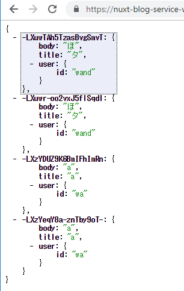

# 本章で開発するもの

- Ch.3よりも少し実践的なアプリケーション
    - 考慮すぺき事項が多い


## 開発するアプリケーションについて

- ブログアプリケーション
- 機能
    - APIで下記をやりとり
        - ユーサー情報
        - 投稿
        - いいねデータ
    - ログイン済ユーザ
        - 投稿
        - いいね
- UI面
    - Element UI
        - Vue.js開発における最もメジャーなUIフレームワーク


## 利用するAPIサーバーについて

- REST APIモードにしたFirebaseのRealtime Database
    - 拡張を考慮しての選択
    - テスト用のサーバーとしてのみ利用する場合はJSON Serverとかでいい
    

## DBの構造について

- Firebase上に構築するため、非正規化している
    - データに重複あり
    - 目をつぶってね


# Firebaseのセットアップ

## Firebaseプロジェクトの作成

- [Firebase](https://console.firebase.google.com)
- `databaseURL`だけ拾う
    - `https://nuxt-blog-service-wandta.firebaseio.com`


## Realtime Databaseのセットアップ

- 推されているFirestoreをあえて選ばない
    - 情報がすぐに変わるかもしれないから避けたそうな

> または Realtime Database を選択

- テストモードでつくる
    - r/w

    

# プロジェクトのスキャフォールディング

## create-nuxt-appによるプロジェクト作成

- `vue init nuxt-community/starter-template`よりもよりモダンで高機能

create-nuxt-appのインストール
```sh
npm install -g create-nuxt-app
```

プロジェクト作る
```sh
create-nuxt-app nuxt-blog-service
```

答える
```
? Project name nuxt-blog-service
? Project description My first-rate Nuxt.js project
? Use a custom server framework none
? Choose features to install Prettier, Axios
? Use a custom UI framework element-ui
? Use a custom test framework none
? Choose rendering mode Universal
? Author name wand
? Choose a package manager yarn
```

始める
```
        To get started:

        cd nuxt-blog-service
         yarn run dev
```


## プロジェクトディレクトリの移動

### before

tree -L 1
```
.
├── README.md
├── assets
├── components
├── layouts
├── middleware
├── node_modules
├── nuxt.config.js
├── package.json
├── pages
├── plugins
├── static
├── store
└── yarn.lock
```

### after

```
.
├── README.md
├── app
│   ├── assets
│   ├── components
│   ├── layouts
│   ├── middleware
│   ├── pages
│   ├── plugins
│   ├── static
│   └── store
├── node_modules
├── nuxt.config.js
├── package.json
└── yarn.lock
```


nuxt.config.js
```diff
  module.exports = {
    mode: 'universal',
+   srcDir: 'app',
```


### 効能

- アプリケーションのコアコードとそうでないコードとが明確に分かれる
    - 「そうでないコード」の例
        - テスト
            - app以下とtest以下とを同じディレクトリ構造にすると、各ファイルの状況と役割が明確化
        - サーバーサイドのコード
- 各種ツールのglob記法のパス指定が簡潔になる
    - nuxt.config.js等、Listやコードフォーマットの形式外なものをignoreしなくて済む
        

## APIサーバーの設定

```diff
  axios: {
+   baseURL: 'https://nuxt-blog-service-wandta.firebaseio.com'
  },

```


# ユーザーインターフェースの構築

- レイアウト全域にElement UIのコンポーネントを利用して、簡単に組み上げる
- 共通レイアウトに関しては、Nuxt.jsのlayouts機能を活用する


## 共通レイアウトの作成

- アプリケーション全体で利用する汎用CSSファイルを作る
- [Vue.jsスタイルガイド](https://jp.vuejs.org/v2/style-guide/index.html#%E5%8D%98%E4%B8%80%E3%82%A4%E3%83%B3%E3%82%B9%E3%82%BF%E3%83%B3%E3%82%B9%E3%81%AE%E3%82%B3%E3%83%B3%E3%83%9D%E3%83%BC%E3%83%8D%E3%83%B3%E3%83%88%E5%90%8D-%E5%BC%B7%E3%81%8F%E6%8E%A8%E5%A5%A8)

> 常に 1 つのアクティブなインスタンスしか持たないコンポーネントは、
> 1つしか存在しえないことを示すために The というプレフィックスで始めるべきです。

## 各ページ

- el-プレフィックスがつくタグがElement UIのタグ
- ゴリゴリ書く


# ログイン機能の開発


## ユーザーのリソース構造について

最も単純な構造
```json
{
  "id": "blog-user"
}
```

## アカウント登録とログイン処理の実装

- IDだけを返すので単純なGET/PATCH
    - StoreにVueのアクション作る
        - ユーザー登録: register
        - ログイン:  login
    - いちいちdispatchしなくていいように、methodsにマッピングする
        - ヘルパメソッドというそうで
- ゴリゴリ書く
- ログイン成否などは`$notify`プラグインを使って表示
    - スキャフォールディング時に導入済


## ログイン情報の永続化

- 認証状態をcookieで永続化する
    - universal-cookie
- cookieからの情報の読み出しはmiddlewareで行う
    - モジュールに書くと、storeとの多重管理になりややこしい


## グローバルナビゲーションでのログイン確認

- ログイン中かどうかをグローバルナビゲーションに表示するようにする


# 基本的な投稿機能の実装

## 投稿データのエンティティについて

```json
{
  "id": "",
  "title": "",
  "body": "",
  "created_at": "",
  "user": {
      "id": "blog-user"
  }
}
```

- パフォーマンスを考慮して、データ二重持ち
    - /posts
        - 全ユーザの投稿
    - /users/_user_id/posts/
        - 1ユーザの投稿
- NoSQLではよくあることらしい？(p.86)


## 投稿ページの作成

- ガリガリ書く

```
    if (!store.getters['users']) {
```

- 【所感】↑の認証判定式、名前を付けたほうがいい気がする
    - Laravelでいうところの`Auth.check()`とか`Auth.guest()`とか
- 【所感】リダイレクトはミドルウェアに書いたほうがいい気がする
    

## 投稿機能のロジック実装

```sh
yarn add moment lodash.clonedeep
```

- ライブラリ入れる
    - moment: 日付操作
    - lodash: 関数型
- momentのロケール設定

~/plugins/moment.js
```javascript
import 'moment/locale/ja'
import moment from 'moment'

moment.locale('ja')
export default moment
```

- momentはファイルサイズが非常に大きいため、一度読み込んだものを使いまわすこと推奨
- 書籍通りモリモリ実装する
- `https://nuxt-blog-service-wandta.firebaseio.com/posts.json`で投稿データを確認できる
    - 配列ではなく、ランダムなキー文字列が採番され、辞書になっている




## 投稿一覧ページの作成

- ガリガリ書く


```javascript
    Object.entries(posts)
      .reverse()
      .forEach(([id, content]) => {
      ...
```

- ObjectのforEachができないので少しテクいことをしている
    - Object.entries
        - Object.keysとObject.valuesをzipしたやつ
        - Arrayを返すので、こいつにはforEach適用可能

```javascript
  computed: {
    showPosts() {
      return this.posts.map(post => {
        post.created_at = moment(post.created_at).format('YYYY/MM/DD HH:mm:ss')
        return post
      })
    },
    ...mapGetters('posts', ['posts'])
  }
```

- 【懸念】これ副作用あるけどいいのか
    - `this.posts`の要素`post`のメンバをmodifyしている
    
```html
      <el-table
          :data="showPosts"
          style="width: 100%"
          @row-click="handleClick" 
          class="table">
```

- 【補】Element UIのテーブルの仕様
    - データにコレクションを渡す
    - `@row-click`で、行クリック時のイベントを登録できる
    - `@row-click`のハンドラに渡る引数
        - 0: 行に対応するデータ(`post`)
        - 1: ネイティブの`MouseEvent`
        - 2: Element UI固有オブジェクト


## 投稿個別ページの作成

``` javascript
  async asyncData({ store, route, error }) {
    const { id } = route.params

    // すでにデータ取得済なら何もしない
    if (store.getters['posts/posts'].find(p => p.id === id)) {
      return
    }

    try {
      await store.dispatch('posts/fetchPost', { id })
      if (
        !store.getters['posts/posts'].find(p => p.id === this.$route.params.id)
      ) {
        throw new Error('post not found')
      }
    } catch {
      error({ statusCode: 404 })
    }
  },
```


# ユーザーページの実装

## usersモジュールの作成と実装

```javascript
export const state = () => ({
  users: []
})
export const getters = {
  users: state => state.users
}

export const mutations = {
  addUser(state, { user }) {
    state.users.push(user)
  }
}

export const actions = {
  async fetchUser({ commit }, { id }) {
    const user = await this.$axios.$get(`/users/${id}.json`)
    commit('addUser', { user })
  }
}
```

- `addUserPost`, `clearUserPosts`ミューテーションは不要


## マイページのコーディングと実装

- 書くだけ


# 「いいね」機能の実装

- 「いいね」の関連は、ユーザー-投稿の関連ほど単純ではない
    - ユーザーから取得することもあれば、投稿から取得することもある


## 「いいね」の持ちうる構造

```json
{
    "like_from": "<user_id>",
    "like_post": "<post_id>",
    "liked_at": "2019-02-06T07:00:00+09:00
}
```

## 「いいね」情報の格納先とモジュール

- どこにデータ格納する
- ユースケース
    - ユーザが行ったいいねの一覧を取得したい
    - 投稿についたいいねの一覧を取得したい
- それぞれにデータを持たせる
    - usersモジュール、postsモジュールそれぞれに`likes`を追加

## 「いいね」のロジック実装

- store/index.js
- store/posts.js

## 「いいね」の表示機能の実装


- なんかコンソールエラーが出て諦めた
- 設計がやばい気がしてならない


## キャッシュを考慮した「いいね」設計

- SSR部分はキャッシュが効く
    - SSRしなくて済む
- キャッシュしたくない部分を`<no-ssr>`で囲む
    - いいね数とか、古い情報がキャッシュされても嬉しくない部分


# おわりに

## 発展的な要素について

- Linterおよびコードフォーマッタの導入
    - アプリケーションのコアコードをappディレクトリにまとめた恩恵にあずかれる
- Firebase Authによる認証・認可
    - 今回は認証をすっ飛ばした
        - 特定のAPI構造やサービスのシステムに依存しないよう
    - 実際の開発では、バックエンドに合わせた認証の実装が必要
    - Firebaseでもいろいろできる
- ユーザーページのいいね実装
    - 現設計で実現しようとすると、パフォーマンス上問題のあるリクエストを飛ばさないといけない
    - データの非正規化で解消
        - モジュール設計をどうするか？
        - FirebaseのDBに直接アクセスすると、呼び出すアクションが増えて見通しが悪くなる
            - Expressサーバー等を挟んで、リクエストを成形するのも手
