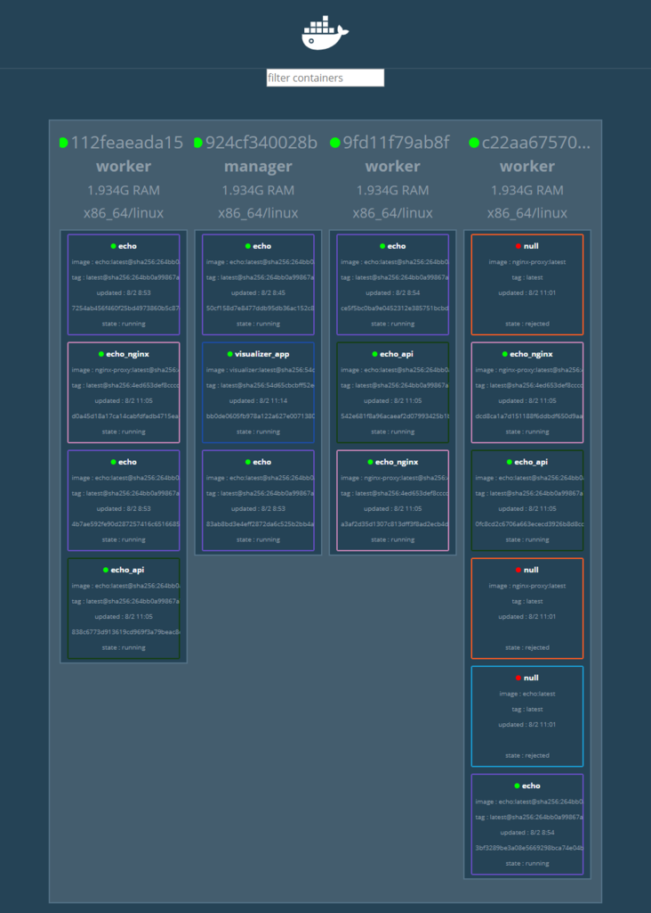
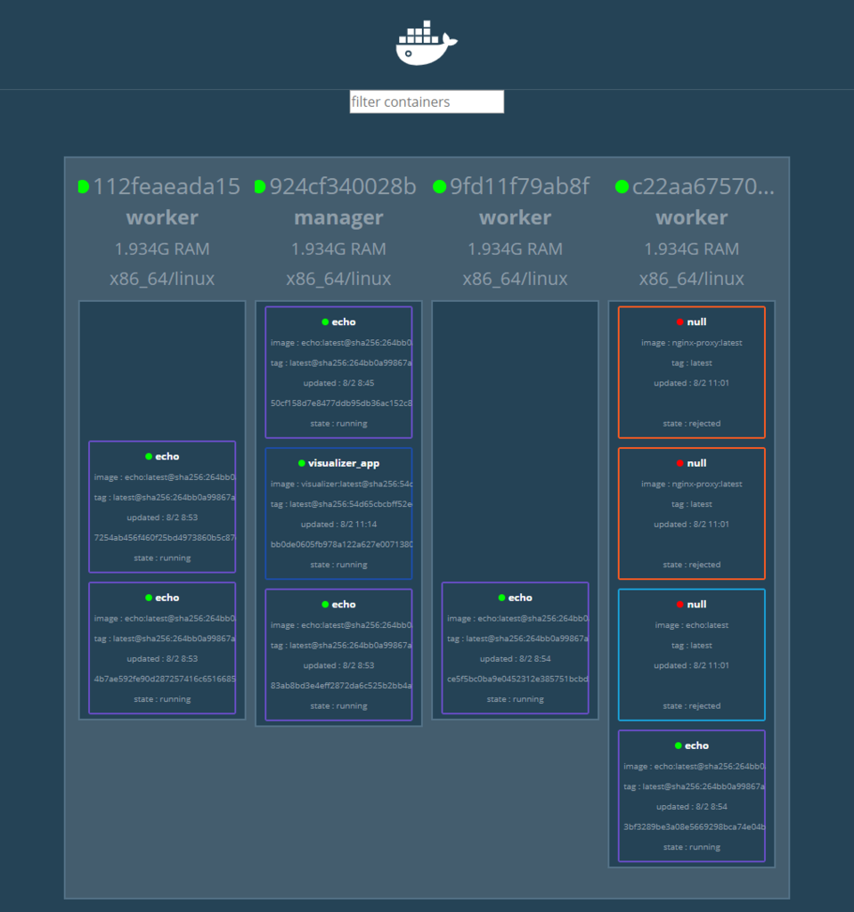
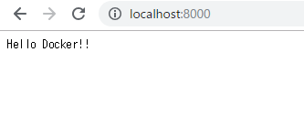

# コンテナ配置戦略


- 複数ホスト上にコンテナを配置する


## Docker Swarm

- コンテナオーケストレーションシステム
    - 複数のDockerホストを束ねてクラスタ化する
    - スケーラビリティのあるアプリケーション構築に不可欠
    - どこのDockerホストにコンテナを配置するか
    - ホストをまたいだコンテナ同士の通信
    - 複数のホストを意識せずに透過的に操作できる


| 名称    | 役割                                                                      | 対応するコマンド |
|---------|---------------------------------------------------------------------------|------------------|
| Compose | 複数コンテナを使うDockerアプリケーションの管理(単ホスト)                  | docker-compose   |
| Swarm   | クラスタの構築や管理(複数ホスト)                                          | docker swarm     |
| Service | Swarm前提、クラスタ内のService(単一種コンテナの1つ以上の集まり)を管理する | docker service   |
| Stack   | Swarm前提、複数のServiceをまとめたアプリケーション全体の管理              | docker stack     |


### 複数のDockerホストを用意し、Swarmクラスタを構築する

- dindを使ってやってみる

./docker-compose.yml
```yaml
version: "3"
services:
  registry:
    container_name: registry
    image: registry:2.6
    ports:
      - 5000:5000
    volumes:
      - "./registry-data:/var/lib/registry"
      
  manager:
    container_name: manager
    image: docker:18.05.0-ce-dind
    privileged: true
    tty: true
    ports:
      - 8000:80
      - 9000:9000
    depends_on:
      - registry
    expose:
      - 3375
    command: "--insecure-registry registry:5000"
    volumes:
      - "./stack:/stack"

  worker01:
    container_name: worker01
    image: docker:18.05.0-ce-dind
    privileged: true
    tty: true
    depends_on:
      - manager
      - registry
    expose:
      - 7946
      - 7946/udp
      - 4789/udp
    command: "--insecure-registry registry:5000"

  worker02:
    container_name: worker02
    image: docker:18.05.0-ce-dind
    privileged: true
    tty: true
    depends_on:
      - manager
      - registry
    expose:
      - 7946
      - 7946/udp
      - 4789/udp
    command: "--insecure-registry registry:5000"

  worker03:
    container_name: worker03
    image: docker:18.05.0-ce-dind
    privileged: true
    tty: true
    depends_on:
      - manager
      - registry
    expose:
      - 7946
      - 7946/udp
      - 4789/udp
    command: "--insecure-registry registry:5000"
```

```sh
docker-compose up -d
docker-compose ps
```

```
  Name                Command               State                                Ports
--------------------------------------------------------------------------------------------------------------------
manager    dockerd-entrypoint.sh --in ...   Up      2375/tcp, 3375/tcp, 0.0.0.0:8000->80/tcp, 0.0.0.0:9000->9000/tcp
registry   /entrypoint.sh /etc/docker ...   Up      0.0.0.0:5000->5000/tcp
worker01   dockerd-entrypoint.sh --in ...   Up      2375/tcp, 4789/udp, 7946/tcp, 7946/udp
worker02   dockerd-entrypoint.sh --in ...   Up      2375/tcp, 4789/udp, 7946/tcp, 7946/udp
worker03   dockerd-entrypoint.sh --in ...   Up      2375/tcp, 4789/udp, 7946/tcp, 7946/udp
```

- これだけでは、まだクラスタとして協調動作はしない
- managerコンテナをSwarmのmanagerに設定

```sh
docker-compose exec manager docker swarm init
```

```
Swarm initialized: current node (teeifjlt3m3tgsihtsub4bsix) is now a manager.

To add a worker to this swarm, run the following command:

    docker swarm join --token SWMTKN-1-1c4pyx2ti6q9sps42wixflkfzy3ri5oiie36cnij69kubhylwo-eesmg5op9uq1xht2namli0cza 172.18.0.3:2377

To add a manager to this swarm, run 'docker swarm join-token manager' and follow the instructions.
```

- workerコンテナをSwarmクラスタに登録
    - `bash -c` でブレース展開しようとしたけどうまくいかなかった windowsキライ

```sh
docker-compose exec worker01 docker swarm join --token SWMTKN-1-1c4pyx2ti6q9sps42wixflkfzy3ri5oiie36cnij69kubhylwo-eesmg5op9uq1xht2namli0cza manager:2377
docker-compose exec worker02 docker swarm join --token SWMTKN-1-1c4pyx2ti6q9sps42wixflkfzy3ri5oiie36cnij69kubhylwo-eesmg5op9uq1xht2namli0cza manager:2377
docker-compose exec worker03 docker swarm join --token SWMTKN-1-1c4pyx2ti6q9sps42wixflkfzy3ri5oiie36cnij69kubhylwo-eesmg5op9uq1xht2namli0cza manager:2377
```


- 登録確認

```sh
docker-compose exec manager docker node ls
```

```
ID                            HOSTNAME            STATUS              AVAILABILITY        MANAGER STATUS      ENGINE VERSION
qo2h97erczjn5j5ov3na06903     9fd11f79ab8f        Ready               Active                                  18.05.0-ce
yv7223kcy5snyuagksznhn4s5     112feaeada15        Ready               Active                                  18.05.0-ce
teeifjlt3m3tgsihtsub4bsix *   924cf340028b        Ready               Active              Leader              18.05.0-ce
kpv8c0m96r2koqlklbhqyl09k     c22aa67570ce        Ready               Active                                  18.05.0-ce
```


### DockerレジストリにイメージをPushする


- `[push先のレジストリのホスト/]リポジトリ名/イメージ名:タグ` という書式でタグ付け

```sh
docker image tag example/echo:latest localhost:5000/example/echo:latest
```

```
REPOSITORY                    TAG                 IMAGE ID            CREATED             SIZE
example/echo                  latest              bd8704147da5        10 days ago         750MB
localhost:5000/example/echo   latest              bd8704147da5        10 days ago         750MB
```


- registryサーバにexample/echoをpush

```sh
docker image push localhost:5000/example/echo:latest
```

```
The push refers to repository [localhost:5000/example/echo]
7dc016053afb: Pushed
7040a361c2a2: Pushed
186d94bd2c62: Pushed
24a9d20e5bee: Pushed
e7dc337030ba: Pushed
920961b94eb3: Pushed
fa0c3f992cbd: Pushed
ce6466f43b11: Pushed
719d45669b35: Pushed
3b10514a95be: Pushed
latest: digest: sha256:264bb0a99867a71ee02b21009e9042d6ef3c12d474ee77ad9f36b2cbe5b48a71 size: 2417
```

- workerからpull

```
docker-compose exec worker01 docker image pull registry:5000/example/echo:latest
```

```
latest: Pulling from example/echo
55cbf04beb70: Pull complete
1607093a898c: Pull complete
9a8ea045c926: Pull complete
d4eee24d4dac: Pull complete
9c35c9787a2f: Pull complete
8b376bbb244f: Pull complete
0d4eafcc732a: Pull complete
186b06a99029: Pull complete
d8ad46f9ce62: Pull complete
a6235c996378: Pull complete
Digest: sha256:264bb0a99867a71ee02b21009e9042d6ef3c12d474ee77ad9f36b2cbe5b48a71
Status: Downloaded newer image for registry:5000/example/echo:latest
```

- イメージ確認

```sh
docker-compose exec worker01 docker image ls
```
```
REPOSITORY                   TAG                 IMAGE ID            CREATED             SIZE
registry:5000/example/echo   latest              bd8704147da5        10 days ago         750MB
```


## Service

- コンテナのデプロイの方法がこれまでとは違うよ、という話
    - docker run
    - docker-compose up
- アプリケーションの構成はいろいろ
    - 1つのコンテナ？
    - 複数種のコンテナ？
    - それらのレプリカ？
- Serviceとは、アプリケーションを構成する一部のコンテナを制御するための単位

```sh
docker-compose exec manager docker service create --replicas 1 --publish 8000:8080 --name echo registry:5000/example/echo:latest
```

```
qq7iamln8e127hxun243c2t5w
overall progress: 1 out of 1 tasks
1/1: running   [==================================================>]
verify: Service converged
```


- サービス一覧の確認

```sh
docker-compose exec manager docker service ls
```

```
ID                  NAME                MODE                REPLICAS            IMAGE                               PORTS
qq7iamln8e12        echo                replicated          1/1                 registry:5000/example/echo:latest   *:8000->8080/tcp
```

- 動いているechoコンテナの確認

```sh
docker-compose exec manager docker service ps echo
```

- ホスト`924cf340028b`上でID`r85omi5kh6pf`コンテナが動いているようだ
```
ID                  NAME                IMAGE                               NODE                DESIRED STATE       CURRENT STATE           ERROR               PORTS
r85omi5kh6pf        echo.1              registry:5000/example/echo:latest   924cf340028b        Running             Running 3 minutes ago
```

- ホスト`924cf340028b`ってどれ


```sh
docker-compose exec manager docker node ls
```

- managerだったみたい
```
ID                            HOSTNAME            STATUS              AVAILABILITY        MANAGER STATUS      ENGINE VERSION
qo2h97erczjn5j5ov3na06903     9fd11f79ab8f        Ready               Active                                  18.05.0-ce
yv7223kcy5snyuagksznhn4s5     112feaeada15        Ready               Active                                  18.05.0-ce
teeifjlt3m3tgsihtsub4bsix *   924cf340028b        Ready               Active              Leader              18.05.0-ce
kpv8c0m96r2koqlklbhqyl09k     c22aa67570ce        Ready               Active                                  18.05.0-ce
```

- manager上でechoコンテナが動いていることを確認する

```sh
docker-compose exec manager docker container ls
```

```
CONTAINER ID        IMAGE                               COMMAND                  CREATED             STATUS              PORTS               NAMES
50cf158d7e84        registry:5000/example/echo:latest   "go run /echo/main.go"   6 minutes ago       Up 6 minutes                            echo.1.r85omi5kh6pf4pjgs2l9ls4ym
```

- スケールアウトしてみる

```sh
docker-compose exec manager docker service scale echo=6
```

```
echo scaled to 6
overall progress: 6 out of 6 tasks
1/6: running   [==================================================>]
2/6: running   [==================================================>]
3/6: running   [==================================================>]
4/6: running   [==================================================>]
5/6: running   [==================================================>]
6/6: running   [==================================================>]
verify: Service converged
```

- 動いているコンテナの確認

```sh
docker-compose exec manager docker service ps echo
```

- 増えている
- 各ノードに分散している

```
ID                  NAME                IMAGE                               NODE                DESIRED STATE       CURRENT STATE                ERROR               PORTS
r85omi5kh6pf        echo.1              registry:5000/example/echo:latest   924cf340028b        Running             Running 10 minutes ago
udilbue6ii39        echo.2              registry:5000/example/echo:latest   9fd11f79ab8f        Running             Running 42 seconds ago
qauesniepz6i        echo.3              registry:5000/example/echo:latest   112feaeada15        Running             Running about a minute ago
neo55v2bdnkz        echo.4              registry:5000/example/echo:latest   112feaeada15        Running             Running about a minute ago
q14potoogtbo        echo.5              registry:5000/example/echo:latest   924cf340028b        Running             Running about a minute ago
1jcjv5h3s5ea        echo.6              registry:5000/example/echo:latest   c22aa67570ce        Running             Running 43 seconds ago
```

```
docker-compose exec manager docker container ls
CONTAINER ID        IMAGE                               COMMAND                  CREATED             STATUS              PORTS               NAMES
83ab8bd3e4ef        registry:5000/example/echo:latest   "go run /echo/main.go"   4 minutes ago       Up 4 minutes                            echo.5.q14potoogtbofxpw9xppsby2q
50cf158d7e84        registry:5000/example/echo:latest   "go run /echo/main.go"   12 minutes ago      Up 12 minutes                           echo.1.r85omi5kh6pf4pjgs2l9ls4ym

docker-compose exec worker01 docker container ls
CONTAINER ID        IMAGE                               COMMAND                  CREATED             STATUS              PORTS               NAMES
4b7ae592fe90        registry:5000/example/echo:latest   "go run /echo/main.go"   4 minutes ago       Up 4 minutes                            echo.4.neo55v2bdnkziimrogflxdgu0
7254ab456f46        registry:5000/example/echo:latest   "go run /echo/main.go"   4 minutes ago       Up 4 minutes                            echo.3.qauesniepz6i4clrhwqgri654

docker-compose exec worker02 docker container ls
CONTAINER ID        IMAGE                               COMMAND                  CREATED             STATUS              PORTS               NAMES
ce5f5bc0ba9e        registry:5000/example/echo:latest   "go run /echo/main.go"   3 minutes ago       Up 3 minutes                            echo.2.udilbue6ii39pz8w5851hbp7q

docker-compose exec worker03 docker container ls
CONTAINER ID        IMAGE                               COMMAND                  CREATED             STATUS              PORTS               NAMES
3bf3289be3a0        registry:5000/example/echo:latest   "go run /echo/main.go"   4 minutes ago       Up 3 minutes                            echo.6.1jcjv5h3s5eamod6e6rxwr8ck
```


- Service消す
```sh
docker-compose exec manager docker service rm echo
docker-compose exec manager docker service ls
```
```
ID                  NAME                MODE                REPLICAS            IMAGE                               PORTS
```


- Serviceにレプリカ数の制御を指示すると、自動でコンテナを複製し、複数のノードにまたがって適切に配置してくれる
    - Serviceなしで行うのは無理ゲー


## Stack

- 複数のServiceをグルーピングした、アプリケーション全体の構成管理
- ServiceのCompose版という感じ
    - Swarm上でスケールイン・アウトやconstraintを記述可能
- **overlayネットワーク**
    - Dockerホストをまたぐネットワーク
    - 同一overlayネットワーク内なら、別ホスト上のサービスでも通信できる
    - 別のoverlayネットワークに存在するサービスはディスカバリも通信もできない
- Stackで利用するoverlayネットワークを指定しなければ、stackの数だけoverlayネットワークが作成される


### Stackをデプロイする


- アプリケーションの構成
    - フロントエンド: Nginx
    - バックエンド: API

./stack/docker-stack.yml
```yaml
version: "3"
services:
  nginx:
    image: gihyodocker/nginx-proxy:latest
    deploy:
      replicas: 3
      placement:
        constraints: [node.role != manager]
    environment:
      BACKEND_HOST: echo_api:8080
    depends_on:
      - api
    networks:
      - ch03
  api:
    image: registry:5000/exaple/echo:latest
    deploy:
      replicas: 3
      placement:
        constraints: [node.role != manager]
    networks:
      - ch03

networks:
  ch03:
    external: true
```

- overlay networkは自動で作られないので、あらかじめ作っておく

```sh
docker-compose exec manager docker network create --driver=overlay --attachable ch03
```

```
o7t5ak2je3l9ivvyhrry3ridc
```

- StackをSwarmクラスタにデプロイ
    - `-c`は`--compose-file`の意

```sh
docker-compose exec manager docker stack deploy -c /stack/docker-stack.yml echo
```


```
Creating service echo_nginx
Creating service echo_api
```

- Stackの確認

```sh
docker-compose exec manager docker stack ls
```

```
NAME                SERVICES
echo                2
```

```sh
docker-compose exec manager docker stack services echo
```


```
ID                  NAME                MODE                REPLICAS            IMAGE                               PORTS
56zq1ut1zw3l        echo_nginx          replicated          3/3                 gihyodocker/nginx-proxy:latest
o825ipqini8p        echo_api            replicated          3/3                 registry:5000/example/echo:latest
```

- サービスで動いているコンテナの確認

```
docker-compose exec manager docker service ps echo_api

ID                  NAME                IMAGE                               NODE                DESIRED STATE       CURRENT STATE                ERROR               PORTS
dsogfmca5ass        echo_api.1          registry:5000/example/echo:latest   112feaeada15        Running             Running about a minute ago
iv99dpishl7q        echo_api.2          registry:5000/example/echo:latest   c22aa67570ce        Running             Running about a minute ago
sxhrigncxc3w        echo_api.3          registry:5000/example/echo:latest   9fd11f79ab8f        Running             Running about a minute ago

docker-compose exec manager docker service ps echo_nginx
ID                  NAME                IMAGE                            NODE                DESIRED STATE       CURRENT STATE                ERROR                       PORTS
kvoxzogmk084        echo_nginx.1        gihyodocker/nginx-proxy:latest   9fd11f79ab8f        Running             Running about a minute ago
lrrifqdkm0yk        echo_nginx.2        gihyodocker/nginx-proxy:latest   c22aa67570ce        Running             Running about a minute ago
ou8uj318wopt        echo_nginx.3        gihyodocker/nginx-proxy:latest   112feaeada15        Running             Running about a minute ago
```

- まとめて確認できる

```sh
docker-compose exec manager docker stack ps echo
```

```
ID                  NAME                          IMAGE                               NODE                DESIRED STATE       CURRENT STATE            ERROR                              PORTS
kvoxzogmk084        echo_nginx.1                  gihyodocker/nginx-proxy:latest      9fd11f79ab8f        Running             Running 3 minutes ago
dsogfmca5ass        echo_api.1                    registry:5000/example/echo:latest   112feaeada15        Running             Running 3 minutes ago
lrrifqdkm0yk        echo_nginx.2                  gihyodocker/nginx-proxy:latest      c22aa67570ce        Running             Running 2 minutes ago
iv99dpishl7q        echo_api.2                    registry:5000/example/echo:latest   c22aa67570ce        Running             Running 3 minutes ago
ou8uj318wopt        echo_nginx.3                  gihyodocker/nginx-proxy:latest      112feaeada15        Running             Running 2 minutes ago
sxhrigncxc3w        echo_api.3                    registry:5000/example/echo:latest   9fd11f79ab8f        Running             Running 3 minutes ago
```


### Swarmクラスタ上のコンテナを可視化する


./stack/visualizer.yml
```yaml
version: "3"

services:
  app:
    image: dockersamples/visualizer
    ports:
      - "9000:8080"
    volumes:
      - /var/run/docker.sock:/var/run/docker.sock
    deploy:
      mode: global
      placement:
        constraints: [node.role == manager]
```

- `mode: global`は、Swarmクラスタの全ノードにデプロイする、の意
- constraints併用により、「全managerノードにデプロイ」の意
- dindに9000-&gt;8080でポートフォワーディングしている
- ホストからmanagerノードコンテナは9000-&gt;9000でポートフォワーディングしているので、ホストのlocalhost:9000で接続できる


```sh
docker-compose exec manager docker stack deploy -c /stack/visualizer.yml visualizer
```
```
Creating network visualizer_default
Creating service visualizer_app
```

- Stack確認

```
docker-compose exec manager docker stack ls
NAME                SERVICES
echo                2
visualizer          1

docker-compose exec manager docker stack services visualizer
ID                  NAME                MODE                REPLICAS            IMAGE                             PORTS
xesh8068cn6k        visualizer_app      global              1/1                 dockersamples/visualizer:latest   *:9000->8080/tcp

docker-compose exec manager docker stack ps visualizer
ID                  NAME                                       IMAGE                             NODE                DESIRED STATE       CURRENT STATE           ERROR               PORTS
qk6d1wzazknf        visualizer_app.teeifjlt3m3tgsihtsub4bsix   dockersamples/visualizer:latest   924cf340028b        Running             Running 9 minutes ago
```


- localhost:9000で、Swarmクラスタ上のコンテナを一覧できる。すごい
    - いろいろミスったのでゴミが残ってる



### Stackの削除

- echoスタックを消す

```sh
docker-compose exec manager docker stack rm echo
```

```
Removing service echo_api
Removing service echo_nginx
```

- visualizer上にもリアルタイムで反映される




## ServiceをSwarmクラスタ外から利用する

- visualizerは必ずmanagerコンテナで動くので、多段ポートフォワーディングで利用できた
- echoスタックのecho_nginxサービスは、worker01～worker03ノードに分散しているのでそうはいかない
- クラスタ外からクラスタ内のサービスへのプロキシサーバーが必要になる


./stack/ingress.yml
```yaml
version: "3"

services:
  haproxy:
    image: dockercloud/haproxy
    networks:
      - ch03
    volumes:
      - /var/run/docker.sock:/var/run/docker.sock
    deploy:
      mode: global
      placement:
        constraints: [node.role == manager]
    ports:
      - 80:80
      - 1936:1936  # for stats page (basic auth. stats:stats)

networks:
  ch03:
    external: true
```


./stack/docker-stack.yml
```diff
version: "3"
services:
  nginx:
    image: gihyodocker/nginx-proxy:latest
    deploy:
      replicas: 3
      placement:
        constraints: [node.role != manager]
    environment:
+     SERVICE_PORTS: 80
      BACKEND_HOST: echo_api:8080
    depends_on:
      - api
    networks:
      - ch03
  api:
    image: registry:5000/example/echo:latest
    deploy:
      replicas: 3
      placement:
        constraints: [node.role != manager]
    networks:
      - ch03

networks:
  ch03:
    external: true
```


- stackデプロイ
```
docker stack deploy -c /stack/docker-stack.yml echo
Creating service echo_nginx
Creating service echo_api

docker-compose exec manager docker stack deploy -c /stack/ingress.yml ingress
Creating service ingress_haproxy
```


- ホスト-&gt;managerは8000-&gt;80にポートフォワーディングしているので、localhost:8000でアクセスできる



### 重要なポイント

- Serviceはレプリカ数(コンテナの数)を制御することで容易にコンテナを複製でき、複数のノードに配置できるため、スケールアウトへの親和性が高い
- Serviceによって管理される複数のレプリカはService名で名前解決でき、かつServiceへのトラフィックはレプリカへ分散される
- Swarmクラスタの外からSwarmのServiceを利用するには、Serviceにトラフィックを分散するためのプロキシを用意する
- Stackは複数のServiceをグルーピングでき、複数のServiceで形成されるアプリケーションのデプロイに役立つ


## 【補】AWS ECSとの比較

|                                        | Swarm   | AWS ECS |
|----------------------------------------|---------|---------|
| 同種コンテナをレプリケーションしたやつ | Service | -       |
| 異種コンテナをまとめたやつ             | -       | Task    |
| アプリケーション                       | Stack   | Service |

