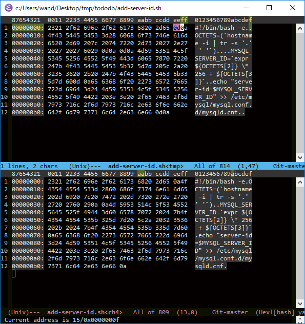
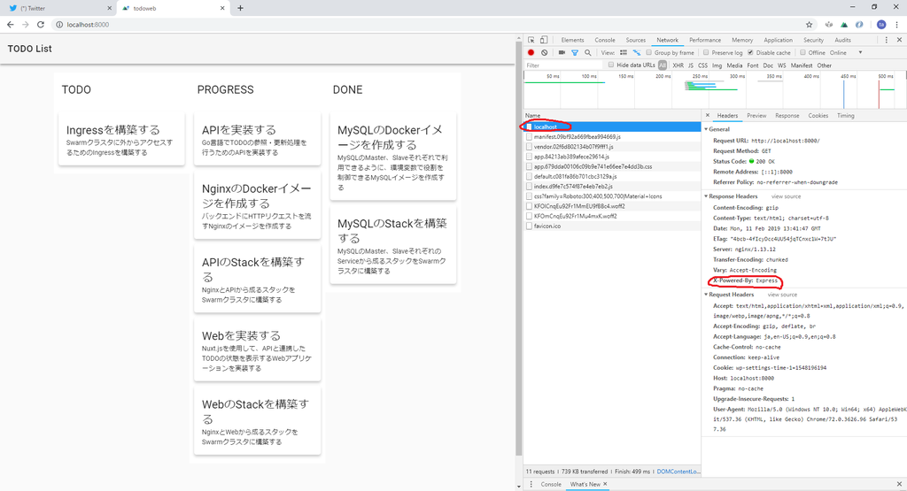
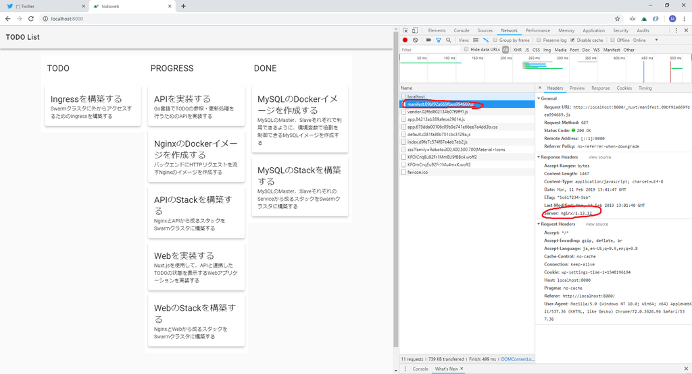

# 本章を一言でいうと

- 環境変数使え


# Webアプリケーションの構成

- 1～3章での学習内容の実践


## アプリケーションの仕様

- TODOアプリ
    - TODOを登録・更新・削除できる
    - 登録されているTODOの一覧を表示できる
    - ブラウザから利用できるWebアプリケーションとして構築する
    - ブラウザ以外のプラットフォームからも利用できるように、JSON APIのエンドポイントも作成する


## アーキテクチャ

- Docker Swarmでつくる
    - p.119の図参照
    
### アーキテクチャの構成要素

- MySQL
    - データストア
    - Master-Slave構成
        - Master: INSERT/UPDATE/DELETE
        - Slave: SELECT
    - Masterのreplicasは1
        - SPOF: Single Point Of Failureになるのを許容する
- API
    - RESTful APIを提供
    - TODOアプリのドメインに特化したMicroservices
    - DBにコマンド・クエリする人
- Web
    - ブラウザで表示するためのWebページをレンダリング
        - API叩く
    - Node.js
- Nginx
    - リバースプロキシ
        - アプリケーションのフロントエンドサーバー
        - API
    - キャッシュ利用
    - バックエンドへの柔軟なルーティング
    - アクセスログの出力

### 配置戦略

- 前章で作った4ノードSwarmクラスタを使う
- アプリケーションの構成
    - MySQL stack
        - mysql_master service
        - mysql_slave service
    - Application stack
        - app_nginx
        - app_api
    - Frontend stack
        - frontend_nginx
        - frontend_web


### 下準備


#### Swarmクラスタ立ち上げておく

- docker-compose.yml
```yaml
version: "3"
services:
  registry:
    container_name: registry
    image: registry:2.6
    ports:
      - 5000:5000
    volumes:
      - "./registry-data:/var/lib/registry"
      
  manager:
    container_name: manager
    image: docker:18.05.0-ce-dind
    privileged: true
    tty: true
    ports:
      - 8000:80
      - 9000:9000
    depends_on:
      - registry
    expose:
      - 3375
    command: "--insecure-registry registry:5000"
    volumes:
      - "./stack:/stack"

  worker01:
    container_name: worker01
    image: docker:18.05.0-ce-dind
    privileged: true
    tty: true
    depends_on:
      - manager
      - registry
    expose:
      - 7946
      - 7946/udp
      - 4789/udp
    command: "--insecure-registry registry:5000"

  worker02:
    container_name: worker02
    image: docker:18.05.0-ce-dind
    privileged: true
    tty: true
    depends_on:
      - manager
      - registry
    expose:
      - 7946
      - 7946/udp
      - 4789/udp
    command: "--insecure-registry registry:5000"

  worker03:
    container_name: worker03
    image: docker:18.05.0-ce-dind
    privileged: true
    tty: true
    depends_on:
      - manager
      - registry
    expose:
      - 7946
      - 7946/udp
      - 4789/udp
    command: "--insecure-registry registry:5000"
```

- managerの初期化

```sh
docker-compose exec manager docker swarm init
```

```
Swarm initialized: current node (wvvhqzdiuabms8o3btujfxfav) is now a manager.

To add a worker to this swarm, run the following command:

    docker swarm join --token SWMTKN-1-2n5bidzy8hs5dyvk6cj1nx3fon93xpduectnsjukjbves9l8sn-ae0u6zwdzt374z963y9pycyad 172.18.0.3:2377

To add a manager to this swarm, run 'docker swarm join-token manager' and follow the instructions.
```

- workersの登録

```sh
docker-compose exec worker01 docker swarm join --token SWMTKN-1-2n5bidzy8hs5dyvk6cj1nx3fon93xpduectnsjukjbves9l8sn-ae0u6zwdzt374z963y9pycyad manager:2377
docker-compose exec worker02 docker swarm join --token SWMTKN-1-2n5bidzy8hs5dyvk6cj1nx3fon93xpduectnsjukjbves9l8sn-ae0u6zwdzt374z963y9pycyad manager:2377
docker-compose exec worker03 docker swarm join --token SWMTKN-1-2n5bidzy8hs5dyvk6cj1nx3fon93xpduectnsjukjbves9l8sn-ae0u6zwdzt374z963y9pycyad manager:2377
```

```
This node joined a swarm as a worker.
This node joined a swarm as a worker.
This node joined a swarm as a worker.
```


#### overlayネットワーク作っておく

```sh
docker-compose exec manager docker network create --driver=overlay --attachable todoapp
```

```
z602be544tq0ioaq0er27oy2v
```


## TODOアプリケーション構築の全体像

1. データストアとなるMaster/Slave構成のMySQL Serviceの構築
1. MySQLとデータのやり取りをするためのAPI構築
1. ウェブアプリケーションとAPI間にリバースプロキシとなるNginxを通じてアクセスできるように設定
1. APIを利用してサーバサイドレンダリングをするWebアプリケーションを実装
1. フロント側にリバースプロキシ(Nginx)を置く


# MySQL Serviceの構築

- Master/Slave構成のMySQLイメージ一式を拾ってくる

```sh
git clone https://github.com/gihyodocker/tododb
docker run --rm -v ${pwd}:/root  wandta/tree ./tododb
```

```
./tododb
├── Dockerfile
├── LICENSE
├── README.md
├── add-server-id.sh
├── etc
│   └── mysql
│       ├── conf.d
│       │   └── mysql.cnf
│       └── mysql.conf.d
│           └── mysqld.cnf
├── init-data.sh
├── prepare.sh
└── sql
    ├── 01_ddl.sql
    └── 02_dml.sql
```

- **【補】Windowsの場合、shファイルをLF改行にして上書きしておくこと**
    - CRLF改行になってると、コンテナ内でbashで実行するときに死ぬ


<figure class="figure-image figure-image-fotolife" title="上: Windows改行(CRLF)、下: Unix改行(LF)"><figcaption>上: Windows改行(CRLF)、下: Unix改行(LF)</figcaption></figure>

- 0d0a = CRLF
- 0a = LF


## データベース・コンテナ構成

- 方針
    - 公式5.7ベース
    - 1つのDockerイメージでMaster/Slaveそれぞれの役割を果たせるように
        - 環境変数MYSQL_MASTER の有無で判定
            - Dockerらしい方法
    - Slaveを増やすときはserviceのreplicasで対応
        - ダウンタイム許容
        

## 認証情報

- p.123


## MySQLの設定 - etc/mysql/mysql.conf.d/mysqld.cnf

- log-bin
    - Master/各Slave共通で`/var/log/mysql/mysql-bin.log`
- server-id
    - Master/各Slaveで**変える必要がある**
    - コンテナ起動時に変えている
    
Dockerfile
```
# (4) スクリプトとmysqldの実行
ENTRYPOINT [ \
  "prehook", \
    "add-server-id.sh", \
    "--", \
  "docker-entrypoint.sh" \
]

CMD ["mysqld"]
```
    
add-server-id.sh
```sh
#!/bin/bash -e
OCTETS=(`hostname -i | tr -s '.' ' '`)

MYSQL_SERVER_ID=`expr ${OCTETS[2]} \* 256 + ${OCTETS[3]}`
echo "server-id=$MYSQL_SERVER_ID" >> /etc/mysql/mysql.conf.d/mysqld.cnf
```

- IPアドレスの第3・4オクテットを活用して重複のないように振っている

### 【補】entrykit

- コンテナ内のプロセス起動時に便利な軽量initシステム
    - `prehook`で設定ファイル追記
    - sigilテンプレートで書いた設定ファイルを  
        `render`で環境変数に応じてレンダリング


## レプリケーションを設定する

- prepare.sh
- MYSQL_MASTER
    - Master判定用
    - Slaveのための設定なので、値が入っていたら即exit 0
- MYSQL_MASTER_HOST
    - SlaveからMasterへmysqlコマンドを実行するための、Masterのホスト名
    - 3秒周期でポーリングして疎通確認する
- 【TODO】MySQLのREPLICATION周りはマジでわからない。調べる


## MySQL(mysql_master/mysql_slave)のDockerfile

- ベースイメージのDockerfileも見ないとわからないこともある
    - `docker-entrypoint.sh`のことなど
- entrykit (再掲)
    - prehookでENTRYPOINTの実行前に割り込める
    
    
### ビルドとSwarmクラスタとしての利用

- ビルド
```sh
docker image build -t ch04/tododb:latest tododb
```

- localのregistryにpush
```
docker image tag ch04/tododb:latest localhost:5000/ch04/tododb:latest
docker image push localhost:5000/ch04/tododb:latest
```


## Swarm上でMaster/Slaveサービスを実行する

- ./stack/todo-mysql.yml
    - managerの/stackにマウントされている
```yaml
version: "3"

services:
  master:
    image: registry:5000/ch04/tododb:latest
    deploy:
      replicas: 1
      placement:
        constraints: [node.role != manager]
    environment:
      MYSQL_ROOT_PASSWORD: gihyo
      MYSQL_DATABASE: tododb
      MYSQL_USER: gihyo
      MYSQL_PASSWORD: gihyo
      MYSQL_MASTER: "true"
    networks:
      - todoapp

  slave:
    image: registry:5000/ch04/tododb:latest
    deploy:
      replicas: 2
      placement:
        constraints: [node.role != manager]
    depends_on:
      - master
    environment:
      MYSQL_MASTER_HOST: master
      MYSQL_ROOT_PASSWORD: gihyo
      MYSQL_DATABASE: tododb
      MYSQL_USER: gihyo
      MYSQL_PASSWORD: gihyo
      MYSQL_REPL_USER: repl
      MYSQL_REPL_PASSWORD: gihyo
    networks:
      - todoapp

networks:
  todoapp:
    external: true
```

- stackをデプロイ
```sh
docker-compose exec manager docker stack deploy -c /stack/todo-mysql.yml todo_mysql
```

```
Creating service todo_mysql_master
Creating service todo_mysql_slave
```


- 動作確認
```sh
docker-compose exec manager docker service ls
```

```
ID                  NAME                MODE                REPLICAS            IMAGE                              PORTS
onv0orbb5ks7        todo_mysql_master   replicated          1/1                 registry:5000/ch04/tododb:latest
r8gk1p6s6k8c        todo_mysql_slave    replicated          2/2                 registry:5000/ch04/tododb:latest
```

- コンテナも確認
```sh
docker-compose exec manager docker stack ps todo_mysql
```

```
ID                  NAME                  IMAGE                              NODE                DESIRED STATE       CURRENT STATE            ERROR               PORTS
2vmdsztsclv6        todo_mysql_slave.1    registry:5000/ch04/tododb:latest   1fb3f2e4a7a6        Running             Running 13 minutes ago
tmt17ytb6t1h        todo_mysql_master.1   registry:5000/ch04/tododb:latest   9180aed3bbf9        Running             Running 13 minutes ago
k09007py9gnv        todo_mysql_slave.2    registry:5000/ch04/tododb:latest   6eef811e9822        Running             Running 13 minutes ago
```

- 【補】**Windowsホストの場合**、tododbのコードをホスト側でgit cloneすると、  
    **shスクリプトの改行がCRLFになっていて死ぬ**ので注意
    - LF改行にしてからdocker image build, docker image pushしなおす


## MySQLコンテナを確認し、初期データを投入する

### Masterにデータ投入


- INSERTはmaster
- masterはどのノード？

```sh
docker-compose exec manager docker service ps todo_mysql_master
```

```
ID                  NAME                  IMAGE                              NODE                DESIRED STATE       CURRENT STATE            ERROR               PORTS
tmt17ytb6t1h        todo_mysql_master.1   registry:5000/ch04/tododb:latest   9180aed3bbf9        Running             Running 17 minutes ago
```

- ノード`9180aed3bbf9`で動いているらしいですよ

```sh
docker container exec 9180aed3bbf9 docker container ls
```

```
CONTAINER ID        IMAGE                              COMMAND                  CREATED             STATUS              PORTS                 NAMES
fbc1633dda7a        registry:5000/ch04/tododb:latest   "prehook add-server-…"   19 minutes ago      Up 18 minutes       3306/tcp, 33060/tcp   todo_mysql_master.1.tmt17ytb6t1h5c1al37mzqodx
```


- コンテナ`todo_mysql_master.1.tmt17ytb6t1h5c1al37mzqodx`に入る

```sh
docker container exec -it 9180aed3bbf9 docker container exec -it todo_mysql_master.1.tmt17ytb6t1h5c1al37mzqodx bash
```

- 初期データ投入
```sh
init-data.sh
```

- mysqlログイン
    - -pの後にスペース不要
```sh
mysql -u gihyo -pgihyo tododb
```

- データ確認
```sql
SELECT * FROM todo LIMIT 1\G
```

```
*************************** 1. row ***************************
     id: 1
  title: MySQLのDockerイメージを作成する
content: MySQLのMaster、Slaveそれぞれで利用できるように、環境変数で役割を制御できるMySQLイメージを作成する
 status: DONE
created: 2019-02-11 11:51:49
updated: 2019-02-11 11:51:49
1 row in set (0.00 sec)
```


### Slaveでの反映確認

- コンテナの特定が面倒くさすぎるので省力化

```sh
docker-compose exec manager \
    docker service ps todo_mysql_slave \
    --no-trunc \
    --filter "desired-state=running" \
    --format="docker container exec -it {{.Node}} docker container exec -it {{.Name}}.{{.ID}} mysql -u gihyo -pgihyo tododb"
```

- Powershellではバッククォートで改行エスケープ
```sh
docker-compose exec manager `
    docker service ps todo_mysql_slave `
    --no-trunc `
    --filter "desired-state=running" `
    --format="docker container exec -it {{.Node}} docker container exec -it {{.Name}}.{{.ID}} mysql -u gihyo -pgihyo tododb"
```

```
docker container exec -it 1fb3f2e4a7a6 docker container exec -it todo_mysql_slave.1.2vmdsztsclv6bj5gjopgvf27w mysql -u gihyo -pgihyo tododb
docker container exec -it 6eef811e9822 docker container exec -it todo_mysql_slave.2.k09007py9gnvzgk576n5sxvfj mysql -u gihyo -pgihyo tododb
```

- 各Slaveでもmysqlにログインし、データが同期していることを確認

```
mysql> SELECT * FROM todo LIMIT 1\G
*************************** 1. row ***************************
     id: 1
  title: MySQLのDockerイメージを作成する
content: MySQLのMaster、Slaveそれぞれで利用できるように、環境変数で役割を制御できるMySQLイメージを作成する
 status: DONE
created: 2019-02-11 11:51:49
updated: 2019-02-11 11:51:49
1 row in set (0.01 sec)
```


# API Serviceの構築

```sh
git clone https://github.com/gihyodocker/todoapi
```


## todoapiの基本構造


- treeコンテナ作っておいてよかった

```sh
docker run --rm -v ${pwd}:/root  wandta/tree -a -I '.git|.gitignore' ./todoapi
```

```
./todoapi
├── .dockerignore
├── Dockerfile
├── cmd
│   └── main.go
├── db.go
├── env.go
└── handler.go
```


## アプリケーションでの環境変数の制御

- ハードコーディングせず、環境変数で変えられるように作ろうね、という話
- 環境変数を読み込んで、構造体を作る(env.go)
- アプリケーションの正常実行に必要か？
    - 必要でない: デフォルト値
    - 必要: 設定されていなければエラー


## MySQL接続、テーブルマッピング

- DBのURLを受け取ってMySQLとのコネクションを確立
    - env.MasterURL
- テーブルと構造体のマッピング


## Handlerを実装する

- docker関係ない
    - 【TODO】windows用に、curlイメージ作ってもいいかもね


## APIのDockerfile

- ビルドしてpushする

```sh
docker image build -t ch04/todoapi:latest ./todoapi
docker image tag ch04/todoapi:latest localhost:5000/ch04/todoapi:latest
docker image push localhost:5000/ch04/todoapi:latest
```


## Swarm上でtodoapiサービスを実行する

./stack/todo-app.yml
```yaml
version: "3"
services:
  api:
    image: registry:5000/ch04/todoapi:latest
    deploy:
      replicas: 2
    environment:
      TODO_BIND: ":8080"
      TODO_MASTER_URL: "gihyo:gihyo@tcp(todo_mysql_master:3306)/tododb?parseTime=true"
      TODO_SLAVE_URL: "gihyo:gihyo@tcp(todo_mysql_slave:3306)/tododb?parseTime=true"
    networks:
      - todoapp

networks:
  todoapp:
    external: true
```

- stackのデプロイ

```sh
docker-compose exec manager docker stack deploy -c /stack/todo-app.yml todo_app
```

- 動作確認

```sh
docker-compose exec manager docker service ls
```

- サービスが増えている

```
ID                  NAME                MODE                REPLICAS            IMAGE                               PORTS
ogwi3sd450ta        todo_app_api        replicated          2/2                 registry:5000/ch04/todoapi:latest
onv0orbb5ks7        todo_mysql_master   replicated          1/1                 registry:5000/ch04/tododb:latest
r8gk1p6s6k8c        todo_mysql_slave    replicated          2/2                 registry:5000/ch04/tododb:latest
```

- コンテナは？

```sh
docker-compose exec manager docker service ps todo_app_api
```

- ちゃんと2個動いてる

```
ID                  NAME                IMAGE                               NODE                DESIRED STATE       CURRENT STATE                ERROR               PORTS
u1yjwtgfxhvd        todo_app_api.1      registry:5000/ch04/todoapi:latest   6eef811e9822        Running             Running about a minute ago
x21klkagl828        todo_app_api.2      registry:5000/ch04/todoapi:latest   259e10b46b60        Running             Running about a minute ago
```

- ログを見てみる
    - `-f`は`tail -f`のアレと同じ

```sh
docker-compose exec manager docker service logs -f todo_app_api
```


```
todo_app_api.1.u1yjwtgfxhvd@6eef811e9822    | 2019/02/11 12:29:33 Listen HTTP Server
todo_app_api.2.x21klkagl828@259e10b46b60    | 2019/02/11 12:29:33 Listen HTTP Server
```


# Nginxの構築

- HTTPリクエストをリバースプロキシ機能を用いてバックエンドに転送する
    - web -&gt; nginx -&gt; api
    - クライアント -&gt; nginx -&gt; web
- 上記の2つの用途があるが、共通のDockerfileを使う
    - イメージは2つ
- まずapiの前段から作る


## nginx.confを構築する

```sh
git clone https://github.com/gihyodocker/todonginx 
docker run --rm -v ${pwd}:/root  wandta/tree ./todonginx
```

```
./todonginx
├── Dockerfile
└── etc
    └── nginx
        ├── conf.d
        │   ├── log.conf
        │   ├── public.conf.tmpl
        │   └── upstream.conf.tmpl
        └── nginx.conf.tmpl
```

- nginx.confはNginxの設定の起点
- パフォーマンスチューニング上注目すべき項目
    - worker_processes
    - worker_connections
    - keepalive_timeout
    - gzip
- これらは環境変数化したい
    - チューニング容易性
    - ポータビリティ
- しかし、Nginxの設定ファイル自体には環境変数を埋め込む機能がない


### entrykitのテンプレート機能 -- etc/nginx/nginx.conf.tmpl

- sigilテンプレートで設定ファイルを書く
- entrykitの"render"でテンプレートに環境変数を埋め込める
- コンテナ内にCOPYしておく
- コンテナ実行時、`.tmpl`が取れたファイル名にレンダリングされる


### コラム -- 環境変数を積極的に使う

- 挙動を変えたいところはまず環境変数化・デフォルト値設定
- 環境変数を設定するための補助ツールが充実している
    - entrykit


### pp.146-148

- Nginxのお勉強 + sigilテンプレート


## NginxのDockerfile

- ビルドしてpush

```sh
docker image build -t ch04/nginx:latest ./todonginx
docker image tag ch04/nginx:latest localhost:5000/ch04/nginx:latest
docker image push localhost:5000/ch04/nginx:latest
```


## Nginxを通してアクセスできるようにする


./stack/todo-app.yml
```diff
 version: "3"
 services:
  
+  nginx:
+    image: registry:5000/ch04/nginx:latest
+    deploy:
+      replicas: 2
+      placement:
+        constraints: [node.role != manager]
+    depends_on:
+      - api
+    environment:
+      WORKER_PROCESSES: 2
+      WORKER_CONNECTIONS: 1024
+      KEEPALIVE_TIMEOUT: 65
+      GZIP: "on"
+      BACKEND_HOST: todo_app_api:8080
+      BACKEND_MAX_FAILS: 3
+      BACKEND_FAILTIMEOUT: 10s
+      SERVER_PORT: 80
+      SERVER_NAME: todo_app_nginx
+      LOG_STDOUT: "true"
+    networks:
+      - todoapp
  
   api:
     image: registry:5000/ch04/todoapi:latest
     deploy:
       replicas: 2
     environment:
       TODO_BIND: ":8080"
       TODO_MASTER_URL: "gihyo:gihyo@tcp(todo_mysql_master:3306)/tododb?parseTime=true"
       TODO_SLAVE_URL: "gihyo:gihyo@tcp(todo_mysql_slave:3306)/tododb?parseTime=true"
     networks:
       - todoapp
  
 networks:
   todoapp:
     external: true
```


- stack再デプロイ
```sh
docker-compose exec manager docker stack deploy -c /stack/todo-app.yml todo_app
```

- サービス追加確認

```sh
docker-compose exec manager docker service ls
```

```
ID                  NAME                MODE                REPLICAS            IMAGE                               PORTS
ogwi3sd450ta        todo_app_api        replicated          2/2                 registry:5000/ch04/todoapi:latest
owkgfly0h2n9        todo_app_nginx      replicated          2/2                 registry:5000/ch04/nginx:latest
onv0orbb5ks7        todo_mysql_master   replicated          1/1                 registry:5000/ch04/tododb:latest
r8gk1p6s6k8c        todo_mysql_slave    replicated          2/2                 registry:5000/ch04/tododb:latest
```

- コンテナ動作確認

```sh
docker-compose exec manager docker service ps todo_app_nginx
```

```
ID                  NAME                IMAGE                             NODE                DESIRED STATE       CURRENT STATE                ERROR               PORTS
icekxl7z4vxl        todo_app_nginx.1    registry:5000/ch04/nginx:latest   1fb3f2e4a7a6        Running             Running about a minute ago
6sh6dt7xahpw        todo_app_nginx.2    registry:5000/ch04/nginx:latest   9180aed3bbf9        Running             Running about a minute ago
```


# Webの構築

```sh
git clone https://github.com/gihyodocker/todoweb
docker run --rm -v ${pwd}:/root  wandta/tree ./todoweb
```

```
./todoweb
├── Dockerfile
├── README.md
├── assets
│   ├── README.md
│   └── style
│       └── app.styl
├── layouts
│   ├── README.md
│   └── default.vue
├── middleware
│   └── README.md
├── nuxt.config.js
├── package-lock.json
├── package.json
├── pages
│   ├── README.md
│   └── index.vue
├── plugins
│   ├── README.md
│   └── vuetify.js
├── server.js
├── static
│   ├── README.md
│   ├── favicon.ico
│   └── v.png
└── store
    └── README.md
```

- Nuxt.js
    - SSR


## TODO APIを呼び出し、ページのHTMLを返却する

- APIエンドポイントのURLを環境変数で設定してるよ、という話
    - `process.env.TODO_API_URL`


## WebのDockerfile

- ビルドしてpush

```sh
docker image build -t ch04/todoweb:latest ./todoweb
docker image tag ch04/todoweb:latest localhost:5000/ch04/todoweb:latest
docker image push localhost:5000/ch04/todoweb:latest
```


## 静的ファイルの扱いを工夫する

- 静的ファイルまでNode.jsが返すのは無駄だよね、という話
- Nginxのキャッシュを効かせる
- テキストpp.155-157の内容を反映
- イメージビルド・push

```sh
docker image build -f ./todonginx/Dockerfile-nuxt -t ch04/nginx-nuxt:latest ./todonginx
docker image tag ch04/nginx-nuxt:latest localhost:5000/ch04/nginx-nuxt:latest
docker image push localhost:5000/ch04/nginx-nuxt:latest
```


## Nginxを通してアクセスできるようにする

```yaml
version: "3"
services:
  nginx:
    image: registry:5000/ch04/nginx-nuxt:latest
    deploy:
      replicas: 2
      placement:
        constraints: [node.role != manager]
    depends_on:
      - web
    environment:
      SERVICE_PORTS: 80
      WORKER_PROCESSES: 2
      WORKER_CONNECTIONS: 1024
      KEEPALIVE_TIMEOUT: 65
      GZIP: "on"
      BACKEND_HOST: todo_frontend_web:3000
      BACKEND_MAX_FAILS: 3
      BACKEND_FAIL_TIMEOUT: 10s
      SERVER_PORT: 80
      SERVER_NAME: localhost
      LOG_STDOUT: "true"
    networks:
      - todoapp
    volumes:
      - assets:/var/www/_nuxt

  web:
    image: registry:5000/ch04/todoweb:latest
    deploy:
      replicas: 2
      placement:
        constraints: [node.role != manager]
    environment:
      TODO_API_URL: http://todo_app_nginx
    networks:
      - todoapp
    volumes:
      - assets:/todoweb/.nuxt/dist

networks:
  todoapp:
    external: true

volumes:
  assets:
    driver: local
```


- stackデプロイ
```sh
docker-compose exec manager docker stack deploy -c /stack/todo-frontend.yml todo_frontend
```

- サービス追加確認

```sh
docker-compose exec manager docker service ls
```

```
ID                  NAME                  MODE                REPLICAS            IMAGE                                  PORTS
ogwi3sd450ta        todo_app_api          replicated          2/2                 registry:5000/ch04/todoapi:latest
owkgfly0h2n9        todo_app_nginx        replicated          2/2                 registry:5000/ch04/nginx:latest
yxx5fg2c1jzr        todo_frontend_nginx   replicated          2/2                 registry:5000/ch04/nginx-nuxt:latest
k3cpnszqkye4        todo_frontend_web     replicated          2/2                 registry:5000/ch04/todoweb:latest
onv0orbb5ks7        todo_mysql_master     replicated          1/1                 registry:5000/ch04/tododb:latest
r8gk1p6s6k8c        todo_mysql_slave      replicated          2/2                 registry:5000/ch04/tododb:latest
```

- 最初、httpをhttpsに間違えて死んでいた
    - REPLICASが`0/2`とかになる
- 死亡確認

```sh
docker-compose exec manager docker service ps todo_frontend_nginx
```

```
ID                  NAME                        IMAGE                                  NODE                DESIRED STATE       CURRENT STATE               ERROR                       PORTS
xj0qfir4grr7        todo_frontend_nginx.1       registry:5000/ch04/nginx-nuxt:latest   9180aed3bbf9        Running             Running 3 seconds ago
jrtw8vws2epa         \_ todo_frontend_nginx.1   registry:5000/ch04/nginx-nuxt:latest   9180aed3bbf9        Shutdown            Failed 18 seconds ago       "task: non-zero exit (1)"
u3zmxp9672cj         \_ todo_frontend_nginx.1   registry:5000/ch04/nginx-nuxt:latest   9180aed3bbf9        Shutdown            Failed 55 seconds ago       "task: non-zero exit (1)"
zkzzdcbio7c5         \_ todo_frontend_nginx.1   registry:5000/ch04/nginx-nuxt:latest   9180aed3bbf9        Shutdown            Failed about a minute ago   "task: non-zero exit (1)"
97c264tnck6k        todo_frontend_nginx.2       registry:5000/ch04/nginx-nuxt:latest   6eef811e9822        Running             Starting 2 seconds ago
x32k2imadtn8         \_ todo_frontend_nginx.2   registry:5000/ch04/nginx-nuxt:latest   6eef811e9822        Shutdown            Failed 7 seconds ago        "task: non-zero exit (1)"
2nkytjsc3ilm         \_ todo_frontend_nginx.2   registry:5000/ch04/nginx-nuxt:latest   6eef811e9822        Shutdown            Failed 37 seconds ago       "task: non-zero exit (1)"
xc05drr2hzx7         \_ todo_frontend_nginx.2   registry:5000/ch04/nginx-nuxt:latest   6eef811e9822        Shutdown            Failed about a minute ago   "task: non-zero exit (1)"
```

- ログ見る

```sh
docker-compose exec manager docker service logs -f todo_frontend_nginx
```

```
todo_frontend_nginx.2.x32k2imadtn8@6eef811e9822    | 2019/02/11 13:21:08 [emerg] 16#16: host not found in upstream "todo_frontend_web:3000" in /etc/nginx/conf.d/upstream.conf:2
todo_frontend_nginx.2.2nkytjsc3ilm@6eef811e9822    | 2019/02/11 13:20:34 [emerg] 15#15: host not found in upstream "todo_frontend_web:3000" in /etc/nginx/conf.d/upstream.conf:2
todo_frontend_nginx.2.x32k2imadtn8@6eef811e9822    | nginx: [emerg] host not found in upstream "todo_frontend_web:3000" in /etc/nginx/conf.d/upstream.conf:2
todo_frontend_nginx.2.2nkytjsc3ilm@6eef811e9822    | nginx: [emerg] host not found in upstream "todo_frontend_web:3000" in /etc/nginx/conf.d/upstream.conf:2
todo_frontend_nginx.2.xc05drr2hzx7@6eef811e9822    | 2019/02/11 13:20:10 [emerg] 16#16: host not found in upstream "todo_frontend_web:3000" in /etc/nginx/conf.d/upstream.conf:2
```


- 静的なファイルがあるのはnginx-nuxtコンテナではなく、todowebコンテナ
- named volumeで静的ファイルを共有する
    - 【疑問点】初回は大丈夫だが、2回目以降のデプロイで静的ファイルの更新が反映されないのでは？？？
        - 空でないボリュームをマウントすると、コンテナのディレクトリが見えなくなる


## Ingressで公開する

./stack/todo-ingress.yml
```yaml
version: "3"

services:
  haproxy:
    image: dockercloud/haproxy
    networks:
      - todoapp
    volumes:
      - /var/run/docker.sock:/var/run/docker.sock
    deploy:
      mode: global
      placement:
        constraints:
          - node.role == manager
    ports:
      - 80:80
      - 1936:1936

networks:
  todoapp:
    external: true
```

- stackのデプロイ
```sh
docker-compose exec manager docker stack deploy -c /stack/todo-ingress.yml todo_ingress
```

- 動作確認
```sh
docker-compose exec manager docker service ls
```

```
ID                  NAME                   MODE                REPLICAS            IMAGE                                  PORTS
ogwi3sd450ta        todo_app_api           replicated          2/2                 registry:5000/ch04/todoapi:latest
owkgfly0h2n9        todo_app_nginx         replicated          2/2                 registry:5000/ch04/nginx:latest
yxx5fg2c1jzr        todo_frontend_nginx    replicated          2/2                 registry:5000/ch04/nginx-nuxt:latest
k3cpnszqkye4        todo_frontend_web      replicated          2/2                 registry:5000/ch04/todoweb:latest
2oaqsntthkd9        todo_ingress_haproxy   global              1/1                 dockercloud/haproxy:latest             *:80->80/tcp, *:1936->1936/tcp
onv0orbb5ks7        todo_mysql_master      replicated          1/1                 registry:5000/ch04/tododb:latest
r8gk1p6s6k8c        todo_mysql_slave       replicated          2/2                 registry:5000/ch04/tododb:latest
```


- ブラウザでの表示確認・レスポンスの出所の確認
    - localhost:8080はExpress、すなわちNode.js  
        
    - 静的ファイルはNginx
        

# コンテナオーケストレーションによる開発スタイル

- 耐久性の高いシステムを作れる
    - 各Serviceに対するリクエストを所属する複数のコンテナに分散させられる
- コンテナオーケストレーションの仕組みにお任せ
    - 適切なノードへのコンテナのデプロイ
    - スケールアウト
- 次章、Kubernetes
    - Swarmよりも実戦導入の機会が多いはず
    - とはいえ、Swarmの知識は理解の助けになる
        - Service間の連携
        - 関連の深いコンテナをセットでデプロイする
        - 環境変数ベースでDockerイメージを構築する
