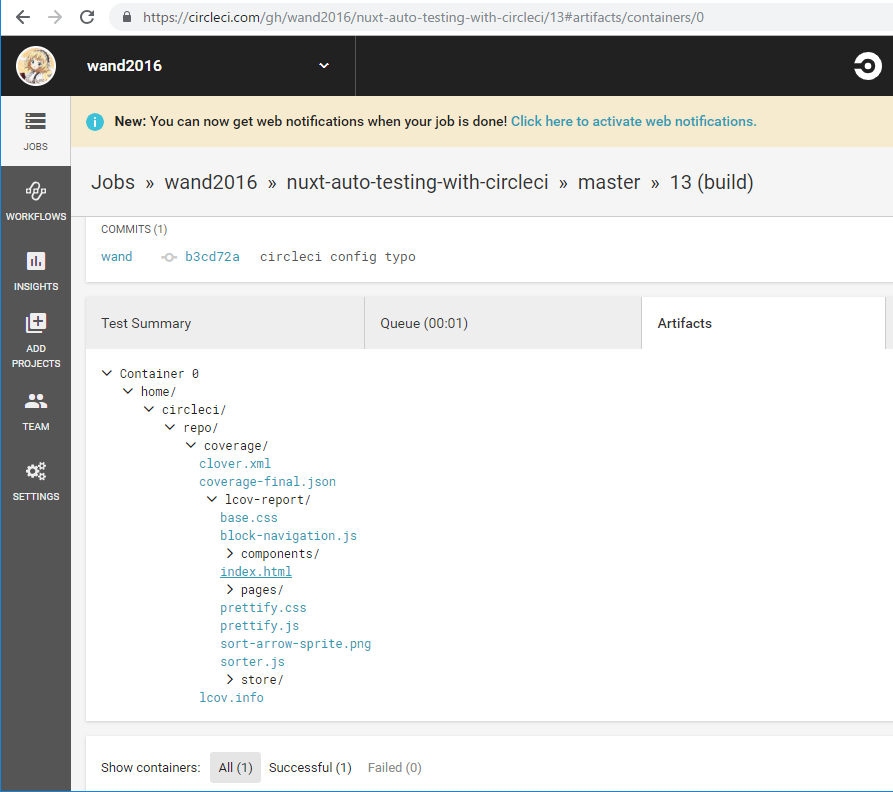

# フロントエンドにおけるテストの必要性

- 前章までで「開発」に必要な知識は最低限身に着けた
- 現場で長く運用していくためにはテスティングの理解が必要
    - フロントエンドテストの一般論
    - Vue.js、Nuxt.js特有の事情を踏まえた方法論

## フロントエンドのテストの難しさと民主化

- テストが非常に難しい分野だった
    - 参照透過性を確保しづらい
        - UI
        - 外部のSDKを読み込む
        - 外部APIとの接続
        - 【所感】テストダブル使え
    - テストの寿命が短く、作成のコストは高い
        - DOM依存
        - ブラウザ依存
- Node.js上で十分テストできるようになってきた
    - DOM非依存部分
- DOMと関わるUIコンポーネントのテストも可能に
    - SSRベース
    


## 依然として残るテストの課題

- DOM依存は切り離した
- 切り離したとはいえ残っている
    - 誰がテストを担保するの
    - HTMLやCSSを書く人？
        - 必ずしもフロントエンド開発に長けているとは限らない


## どこまでテストを書くか？

- ユニットテスト
    - 対象を絞る
        - Vuexデータストア
        - 挙動が複雑なVueコンポーネントのロジック
            - HTML部分は容易に壊れる(壊される)ので、やるのしてもスナップショット程度
        - フレームワーク非依存レイヤーのコード
            - 【補】ビジネスロジックとか
- システムテスト、e2eテスト
    - 壊れやすいので必要に応じて
        - UIが絡むから
        - HTML単位ではやらないほうがいい


## 本章で取り扱う範囲について

- 一般的なモダンJSテスト環境
- Vue.js/Nuxt.js特有部分のテスト
    - Vuexストア
    - Vueコンポーネントのロジック


# Jestの紹介と導入

## facebook製の高機能テストランナーJest

- オールインワン
    - アサーションライブラリ
    - テストランナー
    - カバレッジレポーター
- 振舞い駆動(BDD)
- 並列テスト
- 2018時点のデファクトスタンダード
- Vue Test Utils公式でも推している


## Jest環境の導入

- 入れる
```sh
yarn add -D jest
```

- テストスクリプトの定義

```diff
{
  "name": "nuxt-auto-testing-with-circleci",
  "version": "1.0.0",
  "description": "My good Nuxt.js project",
  "author": "wand",
  "private": true,
  "scripts": {
    "dev": "nuxt",
    "build": "nuxt build",
    "start": "nuxt start",
    "generate": "nuxt generate",
+   "test": "jest"
  },
  "dependencies": {
    "cross-env": "^5.2.0",
    "nuxt": "^2.3.4"
  },
  "devDependencies": {
    "eslint-config-prettier": "^3.1.0",
    "eslint-plugin-prettier": "2.6.2",
    "jest": "^24.1.0",
    "nodemon": "^1.18.9",
    "prettier": "1.14.3"
  }
}
```

- テストを実行してみる

```sh
yarn test
```

- まだテストケースがないのでerror
```
yarn run v1.13.0
$ jest
No tests found, exiting with code 1
Run with `--passWithNoTests` to exit with code 0
In C:\Users\wand\Desktop\learn\nuxt\nuxt-auto-testing-with-circleci
  2 files checked.
  testMatch: **/__tests__/**/*.[jt]s?(x),**/?(*.)+(spec|test).[tj]s?(x) - 0 matches
  testPathIgnorePatterns: \\node_modules\\ - 2 matches
  testRegex:  - 2 matches
Pattern:  - 0 matches
error Command failed with exit code 1.
info Visit https://yarnpkg.com/en/docs/cli/run for documentation about this command.
```


## 【補】CircleCIの設定

.circleci/config.yml
```yaml
# Javascript Node CircleCI 2.0 configuration file
#
# Check https://circleci.com/docs/2.0/language-javascript/ for more details
#
version: 2
jobs:
  build:
    docker:
      # specify the version you desire here
      - image: circleci/node:8

      # Specify service dependencies here if necessary
      # CircleCI maintains a library of pre-built images
      # documented at https://circleci.com/docs/2.0/circleci-images/
      # - image: circleci/mongo:3.4.4

    working_directory: ~/repo

    steps:
      - checkout

      # Download and cache dependencies
      - restore_cache:
          keys:
            - v1-dependencies-{{ checksum "package.json" }}
            # fallback to using the latest cache if no exact match is found
            - v1-dependencies-

      - run: yarn install

      - save_cache:
          paths:
            - node_modules
          key: v1-dependencies-{{ checksum "package.json" }}

      # run tests!
      - run: yarn test
```

- デフォルトのコンテナが`Node:7.10`で、バージョン非対応で死ぬのでそこだけ変える


## 【補】コードフォーマットとテストの強制

```diff
{
  "name": "nuxt-auto-testing-with-circleci",
  "version": "1.0.0",
  "description": "My good Nuxt.js project",
  "author": "wand",
  "private": true,
  "scripts": {
    "dev": "nuxt",
    "build": "nuxt build",
    "start": "nuxt start",
    "generate": "nuxt generate",
-   "test": "jest"
+   "test": "jest",
+   "fmt": "prettier --write ./{app,spec}/**/*.{js,json,vue}",
+   "fmt-check": "prettier -l ./{app,spec}/**/*.{js,json,vue}"

  },
  "dependencies": {
    "cross-env": "^5.2.0",
    "nuxt": "^2.3.4"
  },
  "devDependencies": {
    "eslint-config-prettier": "^3.1.0",
    "eslint-plugin-prettier": "2.6.2",
+   "husky": "^1.3.1",
    "jest": "^24.1.0",
    "nodemon": "^1.18.9",
    "prettier": "1.14.3"
+ },
+ "husky": {
+   "hooks": {
+     "pre-commit": "yarn fmt-check && yarn test"
+   }
  }
}
```

- prettier導入
- commit前hook
    1. prettierによるコードフォーマットチェック
        - `-l`オプションで、差分があればEXIT 1
    1. jestによるテスト
- 両方とも正常終了しなければcommitさせない


# Jestを用いたJavaScriptのテスティング

- まずは純ECMAScriptなVuexストアから
- Vue SFCはあとで
    - vue-loader相当のことをしないといけない


## テスト対象となるVuexストアの実装

- app/store/index.js
```javascript
const state = () => ({
  count: 0
})

const getters = {
  count: state => state.count
}

const mutations = {
  increment(state) {
    state.count++
  }
}

const actions = {
  increment({ commit }) {
    commit('increment')
  }
}

module.exports = {
  state,
  getters,
  mutations,
  actions
}
```

- app/pages/index.vue
```vue
<template>
  <div>
    <h2>
      カウンター
    </h2>
    <h3>
      count: {{ count }}
    </h3>
    <button type="button"
            @click="increment">
      Increment
    </button>
  </div>
</template>

<script>
import { mapGetters, mapActions } from 'vuex'

export default {
  computed: {
    ...mapGetters(['count'])
  },
  methods: {
    ...mapActions(['increment'])
  }
}
</script>
```


## Vue/VuexテストのためのVue Test Utilsの導入

- Vue.jsおよび周辺エコシステムのテストにはVue Test Utilsが必要
- ついでに、オブジェクトの深いコピーのためにlodash.clonedeepも入れる


```sh
yarn add -D @vue/test-utils lodash.clonedeep
```


## Vuexストアのテストコードの記述

- テキストのactionsのテストは単体テストになってないので変えました
- [mutations/actionsのテストダブル](https://lmiller1990.github.io/vue-testing-handbook/vuex-in-components-mutations-and-actions.html#testing-with-a-real-vuex-store)
- spec/store/index.spec.js
```javascript
import Vuex from 'vuex'
import index from '~/store'

// テストで必要なやつ
import { createLocalVue } from '@vue/test-utils'
import cloneDeep from 'lodash.clonedeep'

// Vuexのテストのために必要な下準備
const localVue = createLocalVue()
localVue.use(Vuex)

describe('store/index.js', () => {
  describe('mutations', () => {
    test('incrementミューテーションがcommitされると、countステートの値が+1される', () => {
      const store = new Vuex.Store(cloneDeep(index))

      expect(store.getters['count']).toBe(0)
      store.commit('increment')
      expect(store.getters['count']).toBe(1)
    })
  })

  describe('actions', () => {
    test('incrementアクションをdispatchするたびに、incrementミューテーションがcommitされる', () => {
      // incrementミューテーションをモックする
      const mutations = {
        increment: jest.fn()
      }
      // モックのmutationsに差し替える
      const store = new Vuex.Store({ ...cloneDeep(index), mutations })

      store.dispatch('increment')
      // モックのmutations.incrementが呼ばれていることを検証する
      expect(mutations.increment).toHaveBeenCalled()
    })
  })
})
```


## Babelを利用したモダンな記述が可能なテスト環境の構築

- CommonJS requireがヤダ
    - 普段のVue.js開発はES6 import/export
- babel周辺パッケージの導入
    - [正誤表](https://nuxt-beginners-guide.elevenback.jp/about/eratta.html#%E8%87%B4%E5%91%BD%E7%9A%84%E3%81%AA%E3%82%82%E3%81%AE)を確認のこと
    - 【疑問点】babel-coreと@babel/core両方必要なのは普通なのか？
        - @が付かないほうって古いやつですよね
        

```sh
yarn add -D babel-jest 'babel-core@^7.0.0-0' @babel/core @babel/preset-env
```

- jest,babelの設定書く
    - 個別ファイル方式とpackage.jsonに書く方式がある
    - 今回は、簡潔に管理するために後者
    

```diff
  },
  "husky": {
    "hooks": {
      "pre-commit": "yarn fmt-check && yarn test"
    }
+ },
+ "jest": {
+   "transform": {
+     ".+\\.js$": "babel-jest"
+   }
+ },
+ "babel": {
+   "env": {
+     "test": {
+       "presets": [
+         "@babel/preset-env"
+       ]
+     }
+   }
  }
}
```


- jest
    - 拡張子`js`のファイル全部について、babel-jestプラグイン使用
- babel
    - Nuxt.jsでは基本的にこう書く
    - 覚える必要なし
- まだトランスパイルするだけなので、テストは問題なく通るはず
    - テキストのまま写経すると通りません。注意


## モダンJavaScriptを利用したテストの記述


- module.exportをexport defaultに、requireをimportにする


# Vue/Nuxt.js特有のテスト環境について


## Vue.js/Nuxt.js向けのエイリアスの登録

- index.spec.js
```javascript
import index from '../../app/store'
```

- センスない
- こうしたい

```javascript
import index from '~/store'
```

- 駄目
```
 yarn test
yarn run v1.13.0
$ jest
 FAIL  spec/store/index.spec.js
  ● Test suite failed to run

    Cannot find module '~/store' from 'index.spec.js'

      1 | import Vuex from 'vuex'
    > 2 | import index from '~/store'
        | ^
      3 |
      4 | // テストで必要なやつ
      5 | import { createLocalVue } from '@vue/test-utils'

      at Resolver.resolveModule (node_modules/jest-resolve/build/index.js:203:17)
      at Object.<anonymous> (spec/store/index.spec.js:2:1)

Test Suites: 1 failed, 1 total
Tests:       0 total
Snapshots:   0 total
Time:        2.15s
Ran all test suites.
error Command failed with exit code 1.
info Visit https://yarnpkg.com/en/docs/cli/run for documentation about this command.
```


- 上記の`~`によるエイリアスはNuxt.jsの裏で動いているwebpackの設定であり、CommonJSやES6の仕様ではない
- jest等の外部ツール使用時は設定が必要


```diff
  "jest": {
    "transform": {
      ".+\\.js$": "babel-jest"
    },
+   "moduleNameMapper": {
+     "^@/(.*)$": "<rootDir>/app/$1",
+     "^@@/(.*)$": "<rootDir>/$1",
+     "^~/(.*)$": "<rootDir>/app/$1",
+     "^~~/(.*)$": "<rootDir>/$1"
    }
  },

```

- nuxt.config.jsonの設定と2重になっていることに留意する


## Vue.js向けのJestプラグインの導入

- `.vue`ファイルはwebpackのvue-loaderで解釈されている
- Jestには**vue-jest**というものがある
    - vue-loaderに可能な限り近づけたものらしい
    - 完全な互換はない
    - Vue.jsのコアプロジェクトとしても、webpack非依存のパーサの実装を進めているらしい
    - 【補】[Vue Test Utils 公式ドキュメント](https://vue-test-utils.vuejs.org/ja/guides/#%E3%83%86%E3%82%B9%E3%83%88%E3%83%A9%E3%83%B3%E3%83%8A%E3%82%92%E9%81%B8%E3%81%B6)
        - '19/2/16時点で、まだないみたい
        - mochaを使えばwebpack + vue-loaderで完全なSFCサポートを得られるそう
            - でも設定が多い
- 導入

```sh
yarn add -D vue-jest 
```

- package.jsonでの設定

```diff
  "jest": {
    "transform": {
      ".+\\.js$": "babel-jest",
+     ".+\\.vue$": "vue-jest"
    },
    "moduleNameMapper": {
      "^@/(.*)$": "<rootDir>/app/$1",
      "^@@/(.*)$": "<rootDir>/$1",
      "^~/(.*)$": "<rootDir>/app/$1",
      "^~~/(.*)$": "<rootDir>/$1"
    },
+   "moduleFileExtensions": [
+     "js",
+     "json",
+     "vue"
+   ],
+   "collectCoverageFrom": [
+     "app/**/*.{js,vue}"
+   ]
  },
```

- Vue SFC内外で`@`や`~`エイリアスを利用している可能性があるため、エイリアスの設定は必須


## Vueコンポーネントの振る舞い駆動でのテスト

- まずSFC
- TDD


spec/components/AppToggleButton.spec.js
```js
import AppToggleButton from '~/components/AppToggleButton.vue'
import { mount } from '@vue/test-utils'

describe('AppToggleButotn.vue', () => {
  let wrapper

  beforeEach(() => {
    // 適切にGCされるようにする
    wrapper = null

    // 仮想的なVue.js上のコンポーネントをマウント
    // テストな必要な情報を取得するためのwrapperが返却される
    wrapper = mount(AppToggleButton)
  })

  test('デフォルト状態でoffである', () => {
    // this.$el内を探索
    expect(wrapper.find('p').text()).toBe('off')
  })

  test('ボタンを押すことでonになる', () => {
    wrapper.find('button').trigger('click')

    expect(wrapper.find('p').text()).toBe('on')
  })
})
```

- コンポーネントを置かないとそもそもテストメソッドが実行されない
- app/components/AppToggleButton.vue
```vue
<template>
  <div>
    <p></p>
  </div>
</template>

<script>
export default {}
</script>
```

- テストを実行し、無事死亡することを確認する
- テストを通す最低限の実装をする

```vue
<template>
  <div>
    <p>
      {{ status ? 'on': 'off' }}
    </p>
    <button type="button"
            @click="toggle" >
      toggle
    </button>
  </div>
</template>

<script>
export default {
  data() {
    return {
      status: false
    }
  },

  methods: {
    toggle() {
      this.status = !this.status
    }
  }
}
</script>
```

- テストが通ることを確認

```
yarn test
yarn run v1.13.0
$ jest
 PASS  spec/store/index.spec.js
 PASS  spec/components/AppToggleButton.spec.js

Test Suites: 2 passed, 2 total
Tests:       4 passed, 4 total
Snapshots:   0 total
Time:        2.89s
Ran all test suites.
Done in 3.89s.
```

### Vuexストアと連携するコンポーネントのテスト

- これまでやったやつ
    - Vuexストア単体
    - Vue SFC単体
- Vuexと連携するVueコンポーネントはどうすんの
    - 例) pages/index.vue
        - mapGetters, mapActionsヘルパで  
        Vuexからビジネスロジックやデータを引き回している

```javascript
import { mount, createLocalVue } from '@vue/test-utils'
import Vuex from 'vuex'
import IndexPage from '~/pages/index'
import store from '~/store/index'
import cloneDeep from 'lodash.clonedeep'

const localVue = createLocalVue()
localVue.use(Vuex)

describe('pages/index.vue', () => {
  let wrapper

  beforeEach(() => {
    wrapper = null

    wrapper = mount(IndexPage, {
      store: new Vuex.Store(cloneDeep(store)),
      localVue
    })
  })

  test('カウンターはデフォルト0である', () => {
    expect(wrapper.vm.count).toBe(0)
  })

  test('カウンターをクリックしたときに、カウント値が+1される', () => {
    wrapper.find('button').trigger('click')
    expect(wrapper.vm.count).toBe(1)
  })
})
```


### Vue Routerと連携するコンポーネントのテスト

- スタブ化の必要あり
    - Vue.js
        - router-link
        - router-view
    - Nuxt.js
        - nuxt-link

```javascript
import { mount, createLocalVue, RouterLinkStub } from '@vue/test-utils'
import ChildPage from '~/pages/child'

const localVue = createLocalVue()

describe('pages/child.vue', () => {
  test('トップページに戻る導線が存在する', () => {
    const wrapper = mount(ChildPage, {
      localVue,
      stubs: {
        NuxtLink: RouterLinkStub
      }
    })

    expect(wrapper.find(RouterLinkStub).props().to).toBe('/')
  })
})
```


## コンポーネント出力結果のスナップショットテスト

- 状態をシリアライズし、照合
    - コンポーネントの状態
    - コンポーネントのレンダリング結果
- 変更が意図したものか、そうでないのかを開発者に検証させる
    - 意図した変更の場合は、変更後の状態を次からの「正しいデータ」として使う
- 功罪
    - 功
        - テストの破棄しやすさ
        - コスパがいい
            - 一度書いたら恒久的に利用できる
    - 罪
        - 精度は高くない


### スナップショットテストの実装と更新

- spec/components/AppButton.spec.js
```javascript
import { mount } from '@vue/test-utils'
import AppButton from '~/components/AppButton.vue'

describe('components/AppButton.vue', () => {
  test('match snapshot(unclicked)', () => {
    const wrapper = mount(AppButton)
    expect(wrapper.element).toMatchSnapshot()
  })

  test('match snapshot(clicked)', () => {
    const wrapper = mount(AppButton)
    wrapper.find('button').trigger('click')
    expect(wrapper.element).toMatchSnapshot()
  })
})
```

- 初実行なので、照合用スナップショットがない
- 照合用スナップショットがない場合、新規に生成して正常終了する

```
yarn test
yarn run v1.13.0
$ jest
 PASS  spec/store/index.spec.js
 PASS  spec/pages/child.spec.js
 PASS  spec/components/AppToggleButton.spec.js
 PASS  spec/pages/index.spec.js
 PASS  spec/components/AppButton.spec.js
 › 2 snapshots written.

Snapshot Summary
 › 2 snapshots written from 1 test suite.

Test Suites: 5 passed, 5 total
Tests:       9 passed, 9 total
Snapshots:   2 written, 2 total
Time:        3.401s
Ran all test suites.
Done in 4.43s.
```


- スナップショットが`spec/components/__snapshots__/AppButton.spec.js.snap`に格納されている
```
// Jest Snapshot v1, https://goo.gl/fbAQLP

exports[`components/AppButton.vue match snapshot(clicked) 1`] = `
<div>
  <p>
    clicked
  </p>
   
  <button
    type="button"
  >
    
    click
  
  </button>
</div>
`;

exports[`components/AppButton.vue match snapshot(unclicked) 1`] = `
<div>
  <!---->
   
  <button
    type="button"
  >
    
    click
  
  </button>
</div>
`;
```

- スナップショットに差異が生じた場合、それが意図したものかどうかの判断は開発者に委ねられる
- 意図したものの場合、jestを`--updateSnapshot`オプションを付けて実行する

```
yarn test --updateSnapshot spec/components/AppButton.spec.js
yarn run v1.13.0
$ jest --updateSnapshot spec/components/AppButton.spec.js
 PASS  spec/components/AppButton.spec.js
  components/AppButton.vue
    √ match snapshot(unclicked) (17ms)
    √ match snapshot(clicked) (11ms)

 › 2 snapshots updated.
Snapshot Summary
 › 2 snapshots updated from 1 test suite.

Test Suites: 1 passed, 1 total
Tests:       2 passed, 2 total
Snapshots:   2 updated, 2 total
Time:        2.049s
Ran all test suites matching /spec\\components\\AppButton.spec.js/i.
Done in 2.80s.
```


# フロントエンドのテストを腐らせないために

- テストは破綻するのが常


## カバレッジレポートの出力

- テストの網羅性の担保
    - 質は担保されないので注意
        - 本当にそのテストでデグレを拾えるのか？

```
yarn test --coverage
yarn run v1.13.0
$ jest --coverage
 PASS  spec/store/index.spec.js
 PASS  spec/components/AppButton.spec.js
 PASS  spec/pages/child.spec.js
 PASS  spec/components/AppToggleButton.spec.js
 PASS  spec/pages/index.spec.js
----------------------|----------|----------|----------|----------|-------------------|
File                  |  % Stmts | % Branch |  % Funcs |  % Lines | Uncovered Line #s |
----------------------|----------|----------|----------|----------|-------------------|
All files             |      100 |      100 |      100 |      100 |                   |
 components           |      100 |      100 |      100 |      100 |                   |
  AppButton.vue       |      100 |      100 |      100 |      100 |                   |
  AppToggleButton.vue |      100 |      100 |      100 |      100 |                   |
 pages                |      100 |      100 |      100 |      100 |                   |
  index.vue           |      100 |      100 |      100 |      100 |                   |
 store                |      100 |      100 |      100 |      100 |                   |
  index.js            |      100 |      100 |      100 |      100 |                   |
----------------------|----------|----------|----------|----------|-------------------|

Test Suites: 5 passed, 5 total
Tests:       9 passed, 9 total
Snapshots:   2 passed, 2 total
Time:        4.26s
Ran all test suites.
Done in 5.07s.
```

- カバレッジは80%くらいが現実的とされているらしい
- 【補】`import AppButton from '~/components/Appbutton.vue` とtypoしたときの謎挙動
    - ローカル(Windows)でのテストは通るがカバレッジが50%(Branches 3/6)になった
    - CircleCI回したらテストでエラーになった。Linuxコンテナではパスの大文字小文字が区別されるからか。


## 【補】CircleCIでカバレッジレポート出す

.circleci/config.yml
```diff

      # run tests!
-     - run: yarn test
+     - run: yarn test --coverage
+
+     # coverage report
+     - store_artifacts:
+         path: coverage
```



## 継続的インテグレーション環境の構築

- CIと連携してテストを強制する
    - 通らなければすぐ検知できる
    - 通らなければマージを制限する
- CircleCIがおすすめ
    - やりました
