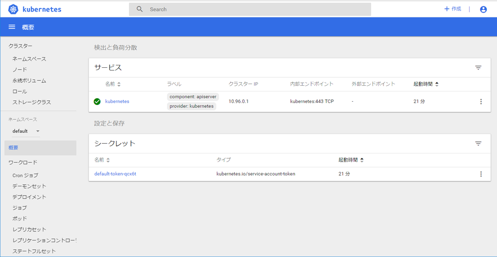
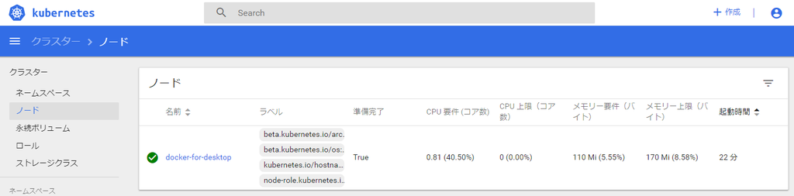

# Kubernetesとは

- コンテナオーケストレーションの統合的システム
    - Google社主導のOSS
    - APIやCLIツールも
- 機能
    - コンテナを用いたアプリケーションのデプロイ
    - Dockerホストの管理
    - サーバリソースの空き具合を考慮したコンテナ配置
    - スケーリング
    - ロードバランサー
    - 死活監視
- 世界観
    - 様々な部品(リソース)を組み合わせて、柔軟性の高いアプリケーションを構築する
    


## Dockerの隆盛とKubernetesの誕生

- Dockerのエコシステムの歴史
- Docker単体では本格的なシステムを構築・運用するには無理があった
- 様々なオーケストレーションシステムが登場
- デファクトを勝ち取ったのがKubernetes
    - Googleがコンテナ黎明期から蓄積した多くのノウハウを取り入れている
    - 多くのユースケースに対応できるだけの汎用性と柔軟性
    - Google外からも広くコントリビューションを得られるプロダクト体制


### クラウドプラットフォームのKubernetesサポート

- GCPのGKEなどからはあくまで独立したOSS
- AzureのAKS、AWSのEKSなど、各クラウド事業者がKubernetes連携している

### Dockerでの正式採用

- DockerCON EU 2017にて、DockerとKubernetes統合発表


## Kubernetesの位置付け

- Composer/Stack/Swarmの機能を統合しつつ、より高度に管理できるもの
- Docker以外のコンテナランタイムも扱える
    - rkt
    - containerd


# ローカル環境でKubernetesを実行する

## Docker for Windows/MacでローカルKubernetes環境を構築する

- Kubernetesの設定
    [x] Enable Kubernetes
    [x] Deploy Docker Stacks to Kubernetes by default
    [x] Show system containers (advanced)
- install

### Kubectlのインストール

- Kubernetesを操作するやつ
- windowsでのインストール
- PowerShell(管理者権限)
```
Set-ExecutionPolicy RemoteSigned
```
- PowerShell
```
Install-Script -Name install-kubectl -Scope CurrentUser -Force
install-kubectl.ps1 [-DownloadLocation <path>]
```

### ダッシュボードのインストール


- [kubernetes/dashboard/releases](https://github.com/kubernetes/dashboard/releases)
- Compatibilityを考慮して、1.10.1を入れた
    - Kubernetesのバージョンが1.10.11だったので
```sh
kubectl apply -f https://raw.githubusercontent.com/kubernetes/dashboard/v1.10.1/src/deploy/recommended/kubernetes-dashboard.yaml
```

- デプロイ確認

```sh
kubectl get pod --namespace=kube-system -l k8s-app=kubernetes-dashboard
```

```
NAME                                    READY     STATUS    RESTARTS   AGE
kubernetes-dashboard-669f9bbd46-8jcxs   1/1       Running   0          1m
```

- ダッシュボードへのプロキシサーバを立ち上げる
    - ブラウザで確認するため
```sh
kubectl proxy
```

```
Starting to serve on 127.0.0.1:8001
```

- ブラウザで確認
- localhost:8001/api/v1/namespaces/kube-system/services/https:kubernetes-dashboard:/proxy/
- サインインが求められる
    - 1.8系かららしい？
- 権限取得

```sh
kubectl -n kube-system get secret
```

```
NAME                                             TYPE                                  DATA      AGE
attachdetach-controller-token-rvks4              kubernetes.io/service-account-token   3         22m
bootstrap-signer-token-67wcp                     kubernetes.io/service-account-token   3         22m
bootstrap-token-8t1bpl                           bootstrap.kubernetes.io/token         7         22m
certificate-controller-token-5h2rz               kubernetes.io/service-account-token   3         22m
clusterrole-aggregation-controller-token-s8dg9   kubernetes.io/service-account-token   3         22m
cronjob-controller-token-9lmb2                   kubernetes.io/service-account-token   3         22m
daemon-set-controller-token-ghcvk                kubernetes.io/service-account-token   3         22m
default-token-m6wl2                              kubernetes.io/service-account-token   3         22m
deployment-controller-token-nxxdx                kubernetes.io/service-account-token   3         22m
disruption-controller-token-zzf9k                kubernetes.io/service-account-token   3         22m
endpoint-controller-token-9mfjd                  kubernetes.io/service-account-token   3         22m
generic-garbage-collector-token-7xhp2            kubernetes.io/service-account-token   3         22m
horizontal-pod-autoscaler-token-zlmjn            kubernetes.io/service-account-token   3         22m
job-controller-token-pjmlg                       kubernetes.io/service-account-token   3         22m
kube-dns-token-gcnwv                             kubernetes.io/service-account-token   3         22m
kube-proxy-token-xmkgx                           kubernetes.io/service-account-token   3         22m
kubernetes-dashboard-certs                       Opaque                                0         12m
kubernetes-dashboard-key-holder                  Opaque                                2         12m
kubernetes-dashboard-token-bpc65                 kubernetes.io/service-account-token   3         12m
namespace-controller-token-t6zf2                 kubernetes.io/service-account-token   3         22m
node-controller-token-9qjfm                      kubernetes.io/service-account-token   3         22m
persistent-volume-binder-token-jg55f             kubernetes.io/service-account-token   3         22m
pod-garbage-collector-token-pq89x                kubernetes.io/service-account-token   3         22m
pv-protection-controller-token-bk5c7             kubernetes.io/service-account-token   3         22m
pvc-protection-controller-token-cm9bb            kubernetes.io/service-account-token   3         22m
replicaset-controller-token-lg8s5                kubernetes.io/service-account-token   3         22m
replication-controller-token-ckmzl               kubernetes.io/service-account-token   3         22m
resourcequota-controller-token-mwf48             kubernetes.io/service-account-token   3         22m
service-account-controller-token-4w6vk           kubernetes.io/service-account-token   3         22m
service-controller-token-r7tch                   kubernetes.io/service-account-token   3         22m
statefulset-controller-token-c6flj               kubernetes.io/service-account-token   3         22m
token-cleaner-token-s2rf5                        kubernetes.io/service-account-token   3         22m
ttl-controller-token-m5xfj                       kubernetes.io/service-account-token   3         22m
```

- 認証トークンもらう

```sh
kubectl -n kube-system describe secret deployment-controller-token-nxxdx
```

```
 kubectl -n kube-system describe secret deployment-controller-token-nxxdx
Name:         deployment-controller-token-nxxdx
Namespace:    kube-system
Labels:       <none>
Annotations:  kubernetes.io/service-account.name=deployment-controller
              kubernetes.io/service-account.uid=e1206d87-3260-11e9-9ada-00155d000633

Type:  kubernetes.io/service-account-token

Data
====
ca.crt:     1025 bytes
namespace:  11 bytes
token:      eyJhbGciOiJSUzI1Ni...
```

- 取得したtokenで認証してダッシュボードを閲覧できる





# Kubernetesの概念

- 様々なリソースと協調して動作する
- リソースとは？
    - アプリケーションのデプロイ構成するための部品
    - コンテナとは別の粒度
- テキストp.173に、本書で取り扱うものが一覧されている


# KubernetesクラスタとNode

- Kubernetesクラスタ
    - リソースを管理する集合体
- Node
    - クラスタが持つリソースの中で最も大きなもの
    - (コンテナランタイムとしてDockerを使うなら)Dockerホスト
        - 物理マシン/VMの別は問わない
- Node群のうち少なくとも1つはMaster Nodeとなる
    - 全体を管理する
- ローカルkubernetesであれば、クラスタ作成時に作られたVMがNodeの1つとして登録されている

```sh
kubectl get nodes
```

```
NAME                 STATUS    ROLES     AGE       VERSION
docker-for-desktop   Ready     master    21m       v1.10.11
```

- dashboardからも見れる




# Namespace

- クラスタの中に入れ子の仮想的なクラスタを作成できる
- デフォルトのNamespaceを確認する


```sh
kubectl get namespace
```

```
NAME          STATUS    AGE
default       Active    2h
docker        Active    2h
kube-public   Active    2h
kube-system   Active    2h
```

- チーム開発で有用
    - 開発者それぞれのNamespaceを用意する
        - メインのNamespaceを散らかさない
        - Namespaceごとに操作権限を設定できる


# Pod

- コンテナ1つ以上の集合体
    - 密結合なほうが都合のよいケース
        - リバースプロキシ(Nginx)とバックエンド(API)
        - その他、同時にデプロイしないと整合性を保てないもの
- Kubernetesでは、Podという単位でコンテナをデプロイする
    - 1つでもPodとしてデプロイする
- 同種のPodを同一・異なるノードに複数デプロイ可能
- 1つのPodをノードをまたいでデプロイすることはできない
- Nodeが複数ある場合のPod配置
    - Master Nodeには管理用のコンポーネントのPodのみ
    - アプリケーション用のPodは他のNodeに
- ローカルkubernetesでは基本的に単一ノードなのでこの限りではない


## Podを作成してデプロイする

- Docker ComposeやStackのように、yamlで管理できる
- simple-pod.yml
```yaml
apiVersion: v1
kind: Pod
metadata:
  name: simple-echo
spec:
  containers:
    - name: nginx
      image: gihyodocker/nginx-proxy:latest
      env:
        - name: BACKEND_HOST
          value: localhost:8080
      ports:
        - containerPort: 80
    - name: echo
      image: gihyodocker/echo:latest
      ports:
        - containerPort: 8080
```

- デプロイ
    - `apply`は、新規作成、および変更がある場合の更新
```sh
kubectl apply -f simple-pod.yml
```

```
pod "simple-echo" created
```

### 設定ファイルの解説

- kind
    - リソースの種類
        - ReplicaSet
        - Deployment
        - Service
        - Ingress
        - その他諸々(p.173)
    - これによりspec以下のスキーマが変わってくる
- metadata
    - metadata.nameがリソース名になる
- spec
    - リソース定義部
    - Podの場合は、構成するコンテナ群をspec.containersで定義
- spec.containers
    - name
        - コンテナ名
    - image
        - イメージ保存先
        - ローカル等も可
    - ports
        - EXPOSEするポート
    - env
        - 環境変数


## Podを操作する

### 一覧取得

```sh
kubectl get pod
```

```
NAME          READY     STATUS    RESTARTS   AGE
simple-echo   2/2       Running   0          7m
```

- READY 2/2
    - nginxコンテナとechoコンテナの2つとも実行状態になったよ、ってこと
- STATUS Running
    - Podを構成する全コンテナが実行状態
   

### コンテナに入る

```sh
kubectl exec -it simple-echo sh -c nginx
```

- `-it`
    - `docker container run`につけるいつものやつ
    - 標準入出力、ならびにターミナルをホストと繋ぐ
- `-c nginx`
    - Podがnginxとechoから構成されるため指定が必要


### 標準出力拾う

```sh
kubectl logs -f simple-echo -c echo
```

- `-f`
    - `tail -f`的なやつ

### Pod削除

- pod以外のリソースも消せる
```sh
kubectl delete pod simple-echo
```

- 設定ファイルベースでも消せる
```sh
kubectl delete -f simple-pod.yml
```

- 削除確認
```sh
kubectl get pod
```

```
NAME          READY     STATUS        RESTARTS   AGE
simple-echo   0/2       Terminating   0          15m
```

## コラム: PodとPod内コンテナのアドレス

- docker-composeとかとは違うよ、という話
- Podは、コンテナを内包した仮想マシンみたいな感じ
- Pod一つ一つにIPアドレスが割り振られる
- Pod内の他コンテナには`localhost:<port>`で通信できる
    - cf. Docker Compose、Stackでは`<service名>:<port>`で通信できる
- 他のPod内のコンテナには、`<PodのIPアドレス>:<port>`で通信できる
- Pod内のコンテナの公開ポートが衝突しないように留意せよ


# ReplicaSet

- Podを定義したマニフェストファイルからは1つのPodしか作成できない
    - 何回applyしても1つだけ
- 複製して可用性を高めるには、ReplicaSetを使う
- simple-replicaset.yml
```yaml
apiVersion: apps/v1
kind: ReplicaSet
metadata:
  name: echo
  labels:
    app: echo
spec:
  replicas: 3
  selector:
    matchLabels:
      app: echo
  template:
    metadata:
      labels:
        app: echo
    spec:
      containers:
        - name: nginx
          image: gihyodocker/nginx-proxy:latest
          env:
            - name: BACKEND_HOST
              value: localhost:8080
          ports:
            - containerPort: 80
        - name: echo
          image: gihyodocker/echo:latest
          ports:
            - containerPort: 8080
```

- デプロイ

```sh
kubectl apply -f simple-replicaset.yml
```

- デプロイ確認

```sh
kubectl get replicaset
```

```
NAME      DESIRED   CURRENT   READY     AGE
echo      3         3         3         52s
```

```sh
kubectl get pod
```

```
NAME         READY     STATUS    RESTARTS   AGE
echo-6zxr4   2/2       Running   0          1m
echo-jvwvb   2/2       Running   0          1m
echo-rsqq4   2/2       Running   0          1m
```

- 削除

```
kubectl delete -f simple-replicaset.yml
```

- Podの数を減らすと、差分のPodは削除される
- 削除されたPodは復元不能
- ステートレスなPodに向いている
    - Webアプリケーションなど
- 【脚注】ステートフルなPodを複数作成するには、StatefulSetリソースを使用する


# Deployment

- Replicasetを管理・操作するリソース
- simple-deployment.yml

```yaml
apiVersion: apps/v1
kind: Deployment
metadata:
  name: echo
  labels:
    app: echo
spec:
  replicas: 3
  selector:
    matchLabels:
      app: echo
  template:
    metadata:
      labels:
        app: echo
    spec:
      containers:
        - name: nginx
          image: gihyodocker/nginx-proxy:latest
          env:
            - name: BACKEND_HOST
              value: localhost:8080
          ports:
            - containerPort: 80
        - name: echo
          image: gihyodocker/echo:latest
          ports:
            - containerPort: 8080
```

- デプロイ

```sh
kubectl apply -f simple-deployment.yml --record
```

- 確認

```sh
kubectl get pod,replicaset,deployment --selector app=echo
```

```
NAME                        READY     STATUS    RESTARTS   AGE
pod/echo-567f778dbb-gg4bl   2/2       Running   0          1m
pod/echo-567f778dbb-kh7cg   2/2       Running   0          1m
pod/echo-567f778dbb-rftfh   2/2       Running   0          1m

NAME                                    DESIRED   CURRENT   READY     AGE
replicaset.extensions/echo-567f778dbb   3         3         3         1m

NAME                         DESIRED   CURRENT   UP-TO-DATE   AVAILABLE   AGE
deployment.extensions/echo   3         3         3            3           1m
```

- Deploymentは、ReplicaSetの世代管理を可能にする
- リビジョン確認

```sh
kubectl rollout history deployment echo
```

```
deployments "echo"
REVISION  CHANGE-CAUSE
1         kubectl.exe apply --filename=simple-deployment.yml --record=true
```

- 初回なのでREVISION=1


## ReplicaSetライフサイクル

- 実運用ではReplicasを直接用いず、Deploymentを使う
- Deploymentが管理するReplicasの役割
    - 指定されたPod数の確保
    - 新しいバージョンのPodへの入れ替え
    - 以前のバージョンのPodへのロールバック


### Pod数のみを更新しても新規ReplicaSetは生まれない

- simple-deployment.yml
```diff
...
spec:
- replicas: 3
+ replicas: 4
  selector:
```


```sh
kubectl apply -f simple-deployment.yml --record
kubectl get pod,replicaset,deployment --selector app=echo
kubectl rollout history deployment echo
```

```
deployment.apps "echo" configured


NAME                        READY     STATUS              RESTARTS   AGE
pod/echo-567f778dbb-gg4bl   2/2       Running             0          7m
pod/echo-567f778dbb-kh7cg   2/2       Running             0          7m
pod/echo-567f778dbb-lbj8j   0/2       ContainerCreating   0          11s
pod/echo-567f778dbb-rftfh   2/2       Running             0          7m

NAME                                    DESIRED   CURRENT   READY     AGE
replicaset.extensions/echo-567f778dbb   4         4         3         7m

NAME                         DESIRED   CURRENT   UP-TO-DATE   AVAILABLE   AGE
deployment.extensions/echo   4         4         4            3           7m


deployments "echo"
REVISION  CHANGE-CAUSE
1         kubectl.exe apply --filename=simple-deployment.yml --record=true
```

- 新しくコンテナが生成されたが、ReplicaSetのリビジョンは上がらない


### コンテナ定義を更新

- simple-deployment.yml

```diff
        - name: echo
-         image: gihyodocker/echo:latest
+         image: gihyodocker/echo:patched
          ports:
            - containerPort: 8080
```

```
deployment.apps "echo" configured


NAME                        READY     STATUS              RESTARTS   AGE
pod/echo-567f778dbb-gg4bl   2/2       Running             0          12m
pod/echo-567f778dbb-kh7cg   2/2       Running             0          12m
pod/echo-567f778dbb-lbj8j   2/2       Terminating         0          4m
pod/echo-567f778dbb-rftfh   2/2       Running             0          12m
pod/echo-769688994b-5pr8s   0/2       ContainerCreating   0          17s
pod/echo-769688994b-7rlrd   0/2       ContainerCreating   0          18s

NAME                                    DESIRED   CURRENT   READY     AGE
replicaset.extensions/echo-567f778dbb   3         3         3         12m
replicaset.extensions/echo-769688994b   2         2         0         18s

NAME                         DESIRED   CURRENT   UP-TO-DATE   AVAILABLE   AGE
deployment.extensions/echo   4         5         2            3           12m


deployments "echo"
REVISION  CHANGE-CAUSE
1         kubectl.exe apply --filename=simple-deployment.yml --record=true
2         kubectl.exe apply --filename=simple-deployment.yml --record=true
```

- コンテナが停止され新しいものに順次差し替わる
- リビジョンが1増える


## ロールバックを実行する

- 特定のリビジョンの内容の確認

```sh
kubectl rollout history deployment echo --revision=1
```

```
deployments "echo" with revision #1
Pod Template:
  Labels:       app=echo
        pod-template-hash=1239334866
  Annotations:  kubernetes.io/change-cause=kubectl.exe apply --filename=simple-deployment.yml --record=true
  Containers:
   nginx:
    Image:      gihyodocker/nginx-proxy:latest
    Port:       80/TCP
    Host Port:  0/TCP
    Environment:
      BACKEND_HOST:     localhost:8080
    Mounts:     <none>
   echo:
    Image:      gihyodocker/echo:latest
    Port:       8080/TCP
    Host Port:  0/TCP
    Environment:        <none>
    Mounts:     <none>
  Volumes:      <none>
```

- undoで戻れる

```sh
kubectl rollout undo deployment echo
```

- 【補】リビジョンは進む

```
deployments "echo"
REVISION  CHANGE-CAUSE
2         kubectl.exe apply --filename=simple-deployment.yml --record=true
3         kubectl.exe apply --filename=simple-deployment.yml --record=true
```

### deploy消しておく

```sh
kubectl delete -f simple-deployment.yml
```


# Service

- Podの集合(主にReplicaSet)に対する経路やサービスディスカバリを提供
- まず、アクセス先のReplicaSetをデプロイする
- simple-replicaset-with-label.yml

```yaml
apiVersion: apps/v1
kind: ReplicaSet
metadata:
  name: echo-spring
  labels:
    app: echo
    release: spring
spec:
  replicas: 1
  selector:
    matchLabels:
      app: echo
      release: spring
  template:
    metadata:
      labels:
        app: echo
        release: spring
    spec:
      containers:
        - name: nginx
          image: gihyodocker/nginx-proxy:latest
          env:
            - name: BACKEND_HOST
              value: localhost:8080
          ports:
            - containerPort: 80
        - name: echo
          image: gihyodocker/echo:latest
          ports:
            - containerPort: 8080

---

apiVersion: apps/v1
kind: ReplicaSet
metadata:
  name: echo-summer
  labels:
    app: echo
    release: summer
spec:
  replicas: 2
  selector:
    matchLabels:
      app: echo
      release: summer
  template:
    metadata:
      labels:
        app: echo
        release: summer
    spec:
      containers:
        - name: nginx
          image: gihyodocker/nginx-proxy:latest
          env:
            - name: BACKEND_HOST
              value: localhost:8080
          ports:
            - containerPort: 80
        - name: echo
          image: gihyodocker/echo:latest
          ports:
            - containerPort: 8080
```

- デプロイ

```sh
kubectl apply -f simple-replicaset-with-label.yml
```

```
replicaset.apps "echo-spring" created
replicaset.apps "echo-summer" created
```

- デプロイ確認
```sh
kubectl get pod
```
```
NAME                READY     STATUS        RESTARTS   AGE
echo-spring-5jndz   2/2       Running       0          27s
echo-summer-55c54   2/2       Running       0          27s
echo-summer-l8r6l   2/2       Running       0          27s
```

- ReplicaSet別表示

```sh
kubectl get pod -l app=echo -l release=spring
kubectl get pod -l app=echo -l release=summer
```

```
NAME                READY     STATUS        RESTARTS   AGE
echo-spring-5jndz   2/2       Running       0          49s


NAME                READY     STATUS    RESTARTS   AGE
echo-summer-55c54   2/2       Running   0          50s
echo-summer-l8r6l   2/2       Running   0          50s
```


- release=summerを持つPodだけにアクセスできるServiceを作る
- simple-service.yml
```yaml
apiVersion: v1
kind: Service
metadata:
  name: echo
spec:
  selector:
    app: echo
    release: summer
  ports:
    - name: http
      port: 80
```

- デプロイ

```sh
kubectl apply -f simple-service.yml
```

- 確認

```sh
kubectl get service
```

```
NAME         TYPE        CLUSTER-IP       EXTERNAL-IP   PORT(S)   AGE
echo         ClusterIP   10.102.212.251   <none>        80/TCP    12s
kubernetes   ClusterIP   10.96.0.1        <none>        443/TCP   4h
```

- なんかデフォルト的な奴がいる
- echoだけ取得

```sh
kubectl get svc echo
```

```
NAME      TYPE        CLUSTER-IP       EXTERNAL-IP   PORT(S)   AGE
echo      ClusterIP   10.102.212.251   <none>        80/TCP    38s
```


- トラフィック疎通確認
- Serviceには基本的にクラスタ内からしかアクセスできない
- ので、デバッグ用コンテナをクラスタにデプロイし、その中からcurlする

```sh
kubectl run -it --rm debug --image=gihyodocker/fundamental:0.1.0 --restart=Never -- bash -il
```

- 何か入れなかったのでexecで入り直し

```sh
kubectl exec -it debug bash
```

```sh
bash-4.4# curl http://echo
Hello Docker!!bash-4.4#
```

- `echo`という名前で名前解決できている(サービスディスカバリ)
- 完全な名前は`echo.default.src.local`
- release=summerなReplicaSetのログを確認

```sh
kubectl logs -f echo-summer-55c54 -c echo
```

```
2019/02/17 07:28:12 start server
2019/02/17 07:41:44 received request
```

- release=springなReplicaSetのログも確認

```sh
kubectl logs -f echo-spring-5jndz  -c echo
```
```
2019/02/17 07:28:17 start server
```

- springにはトラフィックが来ていない。OK


## ClusterIP Service

- Serviceにもいろいろある
- type指定のない場合のデフォルトはClusterIP Service
    - あるPodから別のPod群に名前でアクセスできるやつ
    - クラスタ外からはreachできない


## NodePort Service

- クラスタ外からアクセスできるService
- simple-nodeport-service.yml

```yaml
apiVersion: v1
kind: Service
metadata:
  name: echo
spec:
  type: NodePort
  selector:
    app: echo
  ports:
    - name: http
      port: 80
```

- デプロイ・確認

```sh
kubectl apply -f simple-nodeport-service.yml
kubectl get svc echo
```

```
NAME      TYPE       CLUSTER-IP       EXTERNAL-IP   PORT(S)        AGE
echo      NodePort   10.102.212.251   <none>        80:30111/TCP   20m
```

- ホストから`http://localhost:30111/`で直接アクセスできる
- サービスをL4層レベルで公開可能
    - TCP/UDP利用可能
    - HTTP以外の上位プロトコルを利用可能
        - MySQLとか


## LoadBalancer Service

- ローカルKubernetesでは利用不能
- 各クラウド事業者のマネージドロードバランサーとの連携用
    - GCP: Cloud Doad Balancing
    - AWS: Elastic Load Balancing


## ExternalName Service

- selectorもportもない特殊なヤツ
- kubernetesクラスタ内から外部のホストを名前解決するためのエイリアスを提供

```yaml
apiVersion: v1
kind: Service
metadata:
  name: gihyo
spec:
  type: ExternalName
  externalName: gihyo.jp
```

- `gihyo`で`gihyo.jp`を名前解決できるようになる


# Ingress

- NodePortでKubernetesクラスタ外にServiceを公開可能
- 外 -&gt; NodePort -&gt; ClusterIP Service -&gt; ReplicaSet -&gt; Pod -&gt; Container
- NodePortはあくまでL4層。L7層の制御はできない
    - パスベースで転送先のServiceを切り替えるなど
- Ingress: L7層レベルの制御
- 素の状態のローカルKubernetesではIngressでService公開できない
- nginx_ingress_controllerをまずデプロイする

```sh
kubectl apply -f https://raw.githubusercontent.com/kubernetes/ingress-nginx/nginx-0.16.2/deploy/mandatory.yaml
kubectl apply -f https://raw.githubusercontent.com/kubernetes/ingress-nginx/nginx-0.16.2/deploy/provider/cloud-generic.yaml
```

- デプロイ確認

```sh
kubectl -n ingress-nginx get service,pod
```

```
NAME                           TYPE           CLUSTER-IP      EXTERNAL-IP   PORT(S)                      AGE
service/default-http-backend   ClusterIP      10.107.220.48   <none>        80/TCP                       2m
service/ingress-nginx          LoadBalancer   10.103.235.0    localhost     80:30281/TCP,443:30027/TCP   2m

NAME                                           READY     STATUS    RESTARTS   AGE
pod/default-http-backend-5c6d95c48-5vnrx       1/1       Running   0          2m
pod/nginx-ingress-controller-685fdbc9c-2t6p2   1/1       Running   0          2m
```


## Ingressを通じたアクセス

- simple-service.yml
```yaml
apiVersion: v1
kind: Service
metadata:
  name: echo
spec:
  selector:
    app: echo
  ports:
    - name: http
      port: 80
```

- NodePortなechoをいったん消して、デプロイ
```sh
kubectl delete svc echo
kubectl apply -f simple-service.yml
```

- simple-ingress.yml

```yaml
apiVersion: extensions/v1beta1
kind: Ingress
metadata:
  name: echo
spec:
  rules:
    - host: ch05.gihyo.local
      http:
        paths:
          - path: /
            backend:
              serviceName: echo
              servicePort: 80
```


- デプロイ

```sh
kubectl apply -f simple-ingress.yml
```


- 疎通確認

```
$ curl http://localhost
default backend - 404

$ curl http://localhost -H 'Host: ch05.gihyo.local'
Hello Docker!!
```

- リクエストヘッダのHostが `ch05.gihyo.local`のときだけechoサービスに転送されている。OK
- nginx-ingress-controller独自制御も追加してみる

```yaml
apiVersion: extensions/v1beta1
kind: Ingress
metadata:
  name: echo
  annotations:
    nginx.ingress.kubernetes.io/server-snippet: |
      set $agentflag 0;

      if ($http_user_agent ~* "(Mobile)" ){
        set $agentflag 1;
      }

      if ( $agentflag = 1 ) {
        return 301 http://gihyo.jp/;
      }

spec:
  rules:
    - host: ch05.gihyo.local
      http:
        paths:
          - path: /
            backend:
              serviceName: echo
              servicePort: 80
```


- モバイルのフリをして疎通確認

```sh
$ curl http://localhost -H 'Host: ch05.gihyo.local'
Hello Docker!!

$ curl http://localhost -H 'Host: ch05.gihyo.local' -H 'User-Agent: Mozilla/5.0 (iPhone; CPU iPhone OS 11_0 like Mac OS X) AppleWebKit/604.1.38 (KHTML, like Gecko) Version/11.0 Mobile/15A372 Safari/604.1'
<html>
<head><title>301 Moved Permanently</title></head>
<body bgcolor="white">
<center><h1>301 Moved Permanently</h1></center>
<hr><center>nginx/1.13.12</center>
</body>
</html>
```

- UAに`Mobile`が含まれる場合のみリダイレクトするようになった
    - 【補】HTTPリクエストのヘッダ情報なので、HTTPすなわちL7層レベルの制御
- バックエンドのWebサーバやアプリケーションが、上記のようなL7層レベルの制御から解放される
- クラウドプラットフォームのマネージドのロードバランサーを利用可能
    - GCP: Cloud Load Balancing
    - AWS: Application Load Balancer
    
# さいごに

- ローカルKubernetesは制約があり、全機能備えているわけでもない
- 次章、パブリッククラウドを用いる

# コラム

## freshpod

- イメージの更新を検知し、Podを自動更新する

## kube-prompt

- kubectlのコマンドやリソース名の候補を補完してくれる

## Kubernetes API

- リソースの作成・更新・削除はKubernetesクラスタにデプロイされているAPIにより行われる
- マニフェストファイル冒頭の `apiVersion: v1`とかがそれ
- Kubernetes APIを叩く独自のデプロイツールを作れる
