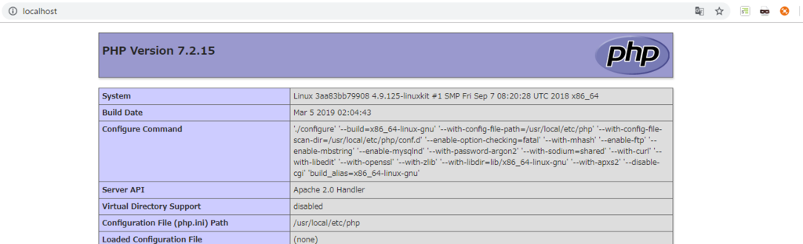

[https://www.shuwasystem.co.jp/book/9784798047492.html:embed:cite]


# Chapter03

## Section01 エディタ
        
- 宗教戦争

### エディタを選ぶポイント

- 必須
    - 文字コードの変更
        - UTF-8が利用できればOK
    - シンタックスハイライト
        - 可読性向上
        - typoに気づきやすい
- IDE: Integrated Developoment Environment(統合開発環境)
    - エディタ + 便利機能群

#### コラム: コードリーディング

- F/Wのコードとか追ってみると勉強になるよ、という話
- あると捗るエディタ・IDEの機能
    - 定義ジャンプ
    - ステップ実行


## Section02 DockerでPHPの開発環境を整える

### Dockerとは

- **コンテナ**を使用してアプリケーションを開発、展開、実行するためのプラットフォーム
- 高速・軽量・オーバーヘッド小さい
- IaC: Infrastructure as Code
    - サーバーの各設定やミドルウェア等の実行環境もコード化(Dockerfile)
    - 誰でも手軽に同じ環境を作れる
- [Docker/Kubernetes 実践コンテナ開発入門 Ch.1 Dockerの基礎](https://wand-ta.hatenablog.com/entry/2019/01/27/172839)


### Dockerのインストール

- [Get Started with Docker](https://www.docker.com/get-started)
- DockerHubアカウント要る


### DockerからHello Worldを試す

```sh
docker container run hello-world
```

```
Unable to find image 'hello-world:latest' locally
latest: Pulling from library/hello-world
1b930d010525: Pull complete
Digest: sha256:2557e3c07ed1e38f26e389462d03ed943586f744621577a99efb77324b0fe535
Status: Downloaded newer image for hello-world:latest

Hello from Docker!
This message shows that your installation appears to be working correctly.

To generate this message, Docker took the following steps:
 1. The Docker client contacted the Docker daemon.
 2. The Docker daemon pulled the "hello-world" image from the Docker Hub.
    (amd64)
 3. The Docker daemon created a new container from that image which runs the
    executable that produces the output you are currently reading.
 4. The Docker daemon streamed that output to the Docker client, which sent it
    to your terminal.

To try something more ambitious, you can run an Ubuntu container with:
 $ docker run -it ubuntu bash

Share images, automate workflows, and more with a free Docker ID:
 https://hub.docker.com/

For more examples and ideas, visit:
 https://docs.docker.com/get-started/
```

- 後始末

```sh
docker container rm $(docker container ls -a -q --filter="ancestor=hello-world")
```

### PHPの開発環境を作る

- Dockerの勉強会ではないので用意しておきました
- [GitHub](https://github.com/wand2016/php_sandbox)

```
.
├── docker-compose.yml
└── html
    └── index.php
```

docker-compose.yml
```yaml
version: "3"
services:
  php:
    image: php:7.2-apache
    ports:
      - 80:80
    volumes:
      - ./html:/var/www/html
```

html/index.php
```php
<?php

phpinfo();
```

- Docker Composeでコンテナ立ち上げる

```sh
docker-compose up -d
```

- localhost:80にアクセスして、phpinfoを確認

<figure class="figure-image figure-image-fotolife" title="phpinfo"><figcaption>phpinfo</figcaption></figure>


- コンテナ停止・削除

```sh
docker-compose down
```
