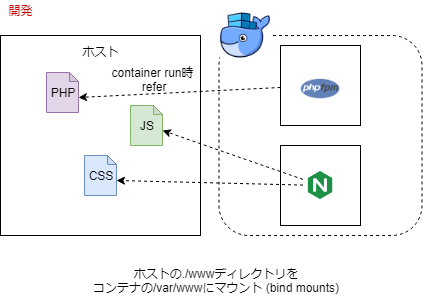

# バレットガールズというゲームの話

- かわいい

# 平成最後の夏をバレットガールズ2のタイムアタックに捧げた

## 世界最速です

[https://www.nicovideo.jp/watch/sm33701982:embed:cite]

[https://www.nicovideo.jp/watch/sm33708719:embed:cite]

[https://www.nicovideo.jp/watch/sm33709636:embed:cite]

[https://www.nicovideo.jp/watch/sm33710210:embed:cite]

## RTA in Japan Online 2に出るなどした

[https://www.twitch.tv/videos/296565648:embed:cite]

# そして３作目

[https://www.d3p.co.jp/bulletgirls_p/:title]

PS4のゲーム

# とんでもねえマゾゲーだった

- 収集要素がきつい
- トロコン率0.6%とかいう惨状

# 収集要素の情報が一切ない

[https://www.amazon.co.jp/%E3%83%90%E3%83%AC%E3%83%83%E3%83%88%E3%82%AC%E3%83%BC%E3%83%AB%E3%82%BA-%E3%83%95%E3%82%A1%E3%83%B3%E3%82%BF%E3%82%B8%E3%82%A2-%E3%82%AA%E3%83%95%E3%82%A3%E3%82%B7%E3%83%A3%E3%83%AB%E3%82%B3%E3%83%B3%E3%83%97%E3%83%AA%E3%83%BC%E3%83%88%E3%82%AC%E3%82%A4%E3%83%89-%E9%9B%BB%E6%92%83%E3%82%B2%E3%83%BC%E3%83%A0%E6%9B%B8%E7%B1%8D%E7%B7%A8%E9%9B%86%E9%83%A8/dp/4049121220:title]

オフィシャルコンプリートガイド(女の子の情報しかない)

# 収集要素の情報を事細かに調査する？？？

情報が集まるころにはトロコンしてしまい、意味がない

# 2chの暇人どもに集めてもらおう

# 情報収集サイトを立ち上げた

- [情報収集サイト](http://ec2-54-238-241-222.ap-northeast-1.compute.amazonaws.com)
-  2018年9月初頭に1.5日で構築
- Laravel
    - Laravelしか知らなかった
- EC2 Amazon Linux上に直接構築
    - t2.microだったが、compose installでメモリ不足で死亡し  
        慌ててt2.smallに変更。ひどい散財だ

# 集まった情報をもとにトロコンでき、11月にサービスクローズ

# 2019年1月

コンテナ運用を勉強し始める

# 2019年2月

- コンテナでリメイク
- [ソースコード・環境](https://github.com/wand2016/BulletGirlsPhangasia_Laravel)

# 構成

## 開発

- [bind-mounts](https://docs.docker.com/storage/bind-mounts/)
- ホストとコード共有
- ホストの変更がそのままコンテナに反映されるため、開発効率が良い

## 本番

- ホストとコード共有しない
    - `php-fpm`コンテナイメージをビルドする時にCOPYしてそれっきり
    - ホストに依存しないため、**ポータビリティが高い**
- コンテナ実行時に`php-fpm`コンテナの`/var/www`に`code_share`ボリュームの`/var/www`をマウント
- [volumes](https://docs.docker.com/storage/volumes)
- ボリュームが空の場合、`php-fpm`コンテナの`/var/www`は見えなくなるの**ではなく**、  
    **`php-fpm`コンテナの`/var/www`がボリュームの`/var/www`にコピーされる**
- その後、`nginx`コンテナの`/var/www`にボリュームの`/var/www`がマウントされる
- 結果、**`php-fpm`のコードを`nginx`と共有できる**
- 新しいコードを新しい`php-fpm`イメージに詰めた場合は、ボリュームを一度削除する必要がある
    - `docmer volume rm`
    - `docker-compose down -v`

# 本番用コンテナイメージのビルド

- これをどう作る
- `composer.json`からcomposerパッケージを取得**するためだけ**にcomposerが必要
- `package.json`からnpmパッケージを取得し、JS・CSSをビルド**するためだけ**にnodejsやnpmが必要
- **本番ではいらない**
- 余計なもの入れてイメージを巨大にしたくない
    - dockerイメージのプライベートリポジトリは容量課金(1GBまで無料？)

## マルチステージビルド

- `composer.json`からcomposerパッケージを取得**するためだけ**のイメージ
- `package.json`からnpmパッケージを取得し、JS・CSSをビルド**するためだけ**のイメージ
- **成果物だけ**を引っこ抜いて、本番用コンテナに詰め込む
- イメージが小さくてすむ

    
