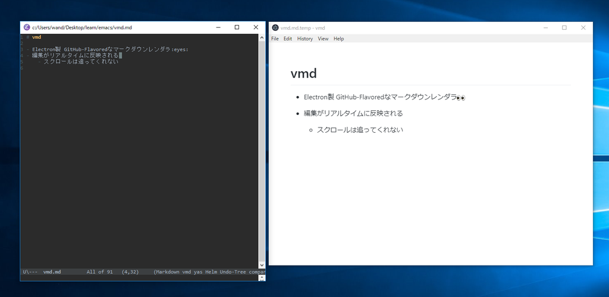

# vmd

- Electron製 GitHub-Flavoredなマークダウンレンダラ
- 編集がリアルタイムに反映される
- スクロールは追ってくれない
    - これまで使っていた`markdown-preview-mode`は追ってくれてたので  
        そこだけ不満

# 経緯

## 動機

- 以前は`markdown-preview-mode`
- markdownのレンダラが別途必要で選定が嫌になった
    - perlのやつ
        - perlというのがイヤ
    - pandoc
        - title周りが微妙
        - windowsのファイルシステムだとCSS指定がうまくいかない
        - 画像埋め込みがうまくいかない
        - コードブロック周りで不具合があるっぽい
        - 他、方言がいろいろ使えない

## よさげなの見つけた

- [vmd](https://www.npmjs.com/package/vmd)
- [vmd-mode](https://github.com/blak3mill3r/vmd-mode)

# 導入

## vmd-mode入れる

1. emacs起動
1. `M-x package-list-packages RET`
1. `vmd-mode`探して入れる

## vmd入れる

1. シェル起動
1. `npm install -g vmd`

# つかう

1. `*.md`ファイル開く
1. `M-x vmd-mode RET`
    - 同階層に`*.md.temp`が生成される
    - `*.md`が書き込み禁止だと`*.md.temp`も書き込み禁止になって死ぬので注意
