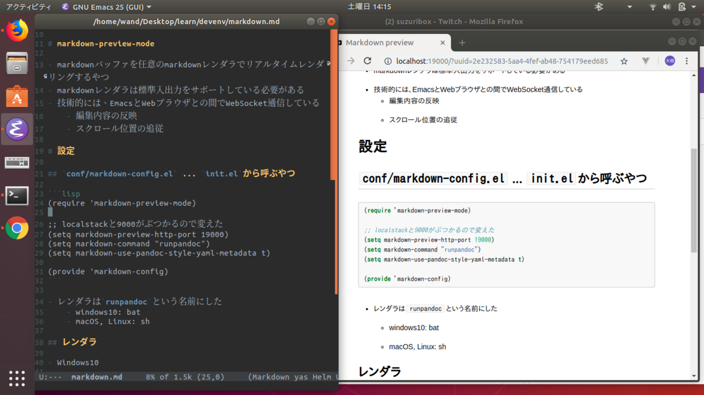

dockerとかいろいろ覚えたので再度入れた

<figure class="figure-image figure-image-fotolife" title="スクロールに追従してくれたりする"><figcaption>スクロールに追従してくれたりする</figcaption></figure>

# pandoc

- 名前どおり、あらゆるdocを扱うやつ
- Haskell製らしい

# markdown-preview-mode

- markdownバッファを任意のmarkdownレンダラでリアルタイムレンダリングするやつ
- markdownレンダラは標準入出力をサポートしている必要がある
- 技術的には、EmacsとWebブラウザとの間でWebSocket通信している
    - 編集内容の反映
    - スクロール位置の追従

# 設定

## `conf/markdown-config.el` ... `init.el`から呼ぶやつ

```lisp
(require 'markdown-preview-mode)

;; localstackと9000がぶつかるので変えた
(setq markdown-preview-http-port 19000)
(setq markdown-command "runpandoc")
(setq markdown-use-pandoc-style-yaml-metadata t)

;; ショッキングピンクとか使ってて見た目がやばいので変える
(setq markdown-preview-stylesheets nil)

(provide 'markdown-config)
```

- レンダラは`runpandoc`という名前にした
    - windows10: bat
    - macOS, Linux: sh

## レンダラ

- Windows10

```bat
@echo off
docker container run --rm -i -v %CD%:/source -v %HOME%/.emacs.d/bin/common/pandoc/resources:/root/resources jagregory/pandoc -s --self-contained -c /root/resources/github.css -t html5  --metadata pagetitle=hoge
```

- macOS, Linux

```
#!/bin/sh
docker container run --rm -i -v $(pwd):/source -v ~/.emacs.d/bin/common/pandoc/resources:/root/resources jagregory/pandoc -s --self-contained -c /root/resources/github.css -t html5  --metadata pagetitle=hoge
```

- pandocは直接インストールせず、dockerコンテナを使用することにした
    - 環境を変えるたびにインストールするの面倒
    - resourcesパスまわりを統一的に扱いたい
- 上記のスクリプトの置き場にパスを通す
- ` --metadata pagetitle=hoge`がないと「`<title>`ねーぞ」と怒られるうえ、`<title>`が開始タグとして認識されて以降の文書が消え失せる
    - markdown文書の頭にpandoc仕様のyamlメタデータブロックを埋め込めば回避可能

## `$PATH`環境変数をemacsに渡すための設定

- exec-path-from-shellをpackage installする

init.el
```lisp
;; 環境変数持ち込む
(when (require 'exec-path-from-shell nil t)
  (exec-path-from-shell-initialize))
```

## CSS変える

- デフォルトは黒背景に<font color="FF00FF">ショッキングピンク</font>とか<font color="00FFFF">シアン</font>とかがぶちまけられていて見た目がやばい
- GitHubフレーバーなCSSを作って配置
    - `~/.emacs.d/bin/common/pandoc/resources/github.css`に置く
    - `docker container run`の`-v`オプションで上記ホスト側ディレクトリをコンテナ内の`/root/resources`ディレクトリにバインド
    - `pandoc`の`-c`オプションで`/root/resources/github.css`を指定
    - `--self-contained`オプションで、CSSをData URIとして埋め込む
- `markdown-preview-mode`で生成されるHTMLでは、`article#markdown-body`要素で文書が包まれるので、`body`セレクタを`article`にも対応させる
    - `#markdown-body`とかを使用すると優先度が変わってしまうので避けた


```css
article,
body {
    font-family: Helvetica, arial, sans-serif;
    font-size: 14px;
    line-height: 1.6;
    padding-top: 10px;
    padding-bottom: 10px;
    background-color: white;
    padding: 30px;
}

article > *:first-child,
body > *:first-child {
    margin-top: 0 !important;
}

article > *:last-child,
body > *:last-child {
    margin-bottom: 0 !important;
}

a {
    color: #4183C4;
}
a.absent {
    color: #cc0000;
}
a.anchor {
    display: block;
    padding-left: 30px;
    margin-left: -30px;
    cursor: pointer;
    position: absolute;
    top: 0;
    left: 0;
    bottom: 0;
}

h1, h2, h3, h4, h5, h6 {
    margin: 20px 0 10px;
    padding: 0;
    font-weight: bold;
    -webkit-font-smoothing: antialiased;
    cursor: text;
    position: relative;
}

h1:hover a.anchor, h2:hover a.anchor, h3:hover a.anchor, h4:hover a.anchor, h5:hover a.anchor, h6:hover a.anchor {
    /* background: url("https://raw.githubusercontent.com/gollum/gollum/master/lib/gollum/public/gollum/images/para.png") no-repeat 10px center; */
    text-decoration: none;
}

h1 tt, h1 code {
    font-size: inherit;
}

h2 tt, h2 code {
    font-size: inherit;
}

h3 tt, h3 code {
    font-size: inherit;
}

h4 tt, h4 code {
    font-size: inherit;
}

h5 tt, h5 code {
    font-size: inherit;
}

h6 tt, h6 code {
    font-size: inherit;
}

h1 {
    font-size: 28px;
    color: black;
}

h2 {
    font-size: 24px;
    border-bottom: 1px solid #cccccc;
    color: black;
}

h3 {
    font-size: 18px;
}

h4 {
    font-size: 16px;
}

h5 {
    font-size: 14px;
}

h6 {
    color: #777777;
    font-size: 14px;
}

p, blockquote, ul, ol, dl, li, table, pre {
    margin: 15px 0;
}

hr {
    /* background: transparent url("https://raw.githubusercontent.com/gollum/gollum/master/lib/gollum/public/gollum/images/dirty-shade.png") repeat-x 0 0; */
    border: 0 none;
    color: #cccccc;
    height: 4px;
    padding: 0;
}

article > h2:first-child,
body > h2:first-child {
    margin-top: 0;
    padding-top: 0;
}

article > h1:first-child,
body > h1:first-child {
    margin-top: 0;
    padding-top: 0;
}

article > h1:first-child + h2,
body > h1:first-child + h2 {
    margin-top: 0;
    padding-top: 0;
}

article > h3:first-child, article > h4:first-child, article > h5:first-child, article > h6:first-child,
body > h3:first-child, body > h4:first-child, body > h5:first-child, body > h6:first-child {
    margin-top: 0;
    padding-top: 0;
}

a:first-child h1, a:first-child h2, a:first-child h3, a:first-child h4, a:first-child h5, a:first-child h6 {
    margin-top: 0;
    padding-top: 0;
}

h1 p, h2 p, h3 p, h4 p, h5 p, h6 p {
    margin-top: 0;
}

li p.first {
    display: inline-block;
}

ul, ol {
    padding-left: 30px;
}

ul :first-child, ol :first-child {
    margin-top: 0;
}

ul :last-child, ol :last-child {
    margin-bottom: 0;
}

dl {
    padding: 0;
}
dl dt {
    font-size: 14px;
    font-weight: bold;
    font-style: italic;
    padding: 0;
    margin: 15px 0 5px;
}
dl dt:first-child {
    padding: 0;
}
dl dt > :first-child {
    margin-top: 0;
}
dl dt > :last-child {
    margin-bottom: 0;
}
dl dd {
    margin: 0 0 15px;
    padding: 0 15px;
}
dl dd > :first-child {
    margin-top: 0;
}
dl dd > :last-child {
    margin-bottom: 0;
}

blockquote {
    border-left: 4px solid #dddddd;
    padding: 0 15px;
    color: #777777;
}
blockquote > :first-child {
    margin-top: 0;
}
blockquote > :last-child {
    margin-bottom: 0;
}

table {
    padding: 0;
}
table tr {
    border-top: 1px solid #cccccc;
    background-color: white;
    margin: 0;
    padding: 0;
}
table tr:nth-child(2n) {
    background-color: #f8f8f8;
}
table tr th {
    font-weight: bold;
    border: 1px solid #cccccc;
    text-align: left;
    margin: 0;
    padding: 6px 13px;
}
table tr td {
    border: 1px solid #cccccc;
    text-align: left;
    margin: 0;
    padding: 6px 13px;
}
table tr th :first-child, table tr td :first-child {
    margin-top: 0;
}
table tr th :last-child, table tr td :last-child {
    margin-bottom: 0;
}

img {
    max-width: 100%;
}

span.frame {
    display: block;
    overflow: hidden;
}
span.frame > span {
    border: 1px solid #dddddd;
    display: block;
    float: left;
    overflow: hidden;
    margin: 13px 0 0;
    padding: 7px;
    width: auto;
}
span.frame span img {
    display: block;
    float: left;
}
span.frame span span {
    clear: both;
    color: #333333;
    display: block;
    padding: 5px 0 0;
}
span.align-center {
    display: block;
    overflow: hidden;
    clear: both;
}
span.align-center > span {
    display: block;
    overflow: hidden;
    margin: 13px auto 0;
    text-align: center;
}
span.align-center span img {
    margin: 0 auto;
    text-align: center;
}
span.align-right {
    display: block;
    overflow: hidden;
    clear: both;
}
span.align-right > span {
    display: block;
    overflow: hidden;
    margin: 13px 0 0;
    text-align: right;
}
span.align-right span img {
    margin: 0;
    text-align: right;
}
span.float-left {
    display: block;
    margin-right: 13px;
    overflow: hidden;
    float: left;
}
span.float-left span {
    margin: 13px 0 0;
}
span.float-right {
    display: block;
    margin-left: 13px;
    overflow: hidden;
    float: right;
}
span.float-right > span {
    display: block;
    overflow: hidden;
    margin: 13px auto 0;
    text-align: right;
}

code, tt {
    margin: 0 2px;
    padding: 0 5px;
    white-space: nowrap;
    border: 1px solid #eaeaea;
    background-color: #f8f8f8;
    border-radius: 3px;
}

pre code {
    margin: 0;
    padding: 0;
    white-space: pre;
    border: none;
    background: transparent;
}

.highlight pre {
    background-color: #f8f8f8;
    border: 1px solid #cccccc;
    font-size: 13px;
    line-height: 19px;
    overflow: auto;
    padding: 6px 10px;
    border-radius: 3px;
}

pre {
    background-color: #f8f8f8;
    border: 1px solid #cccccc;
    font-size: 13px;
    line-height: 19px;
    overflow: auto;
    padding: 6px 10px;
    border-radius: 3px;
}
pre code, pre tt {
    background-color: transparent;
    border: none;
}
```

# 課題

- スクロール追従は便利だが、編集が少し固まる
