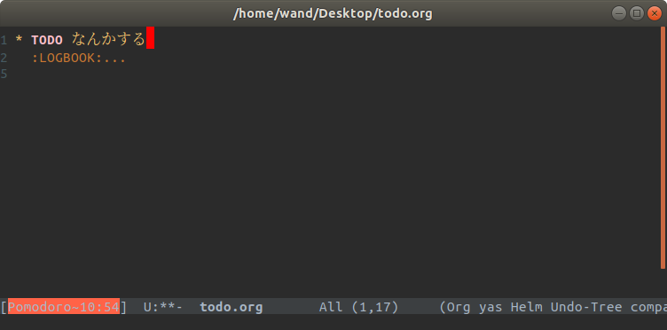

久しぶりにcarとかcdrとかconsとかした

# スクショ

- [org-pomodoro](https://github.com/lolownia/org-pomodoro)
    - org-modeでポモドーロテクニックするやつ




- デフォルトでは、タイマーがモードラインの右にはみ出して見えなくなってしまうことがある
- 左寄せにすることで必ず視認できるようにした


# 設定

- `mode-line-format`: モードラインのフォーマットを格納する変数
    - 文字列やシンボルのリスト
    
```lisp
'("%e" mode-line-front-space mode-line-mule-info mode-line-client mode-line-modified mode-line-remote mode-line-frame-identification mode-line-buffer-identification "   " mode-line-position (vc-mode vc-mode) ...)
```

- `org-pomodoro-mode-line`: org-pomodoroのタイマー文字列を格納する変数
- 頭から二番目に割り込ませる


```lisp
(require 'org-pomodoro)
(setq-default mode-line-format
      (cons (car mode-line-format)
            (cons 'org-pomodoro-mode-line
                  (cdr mode-line-format))))
```
