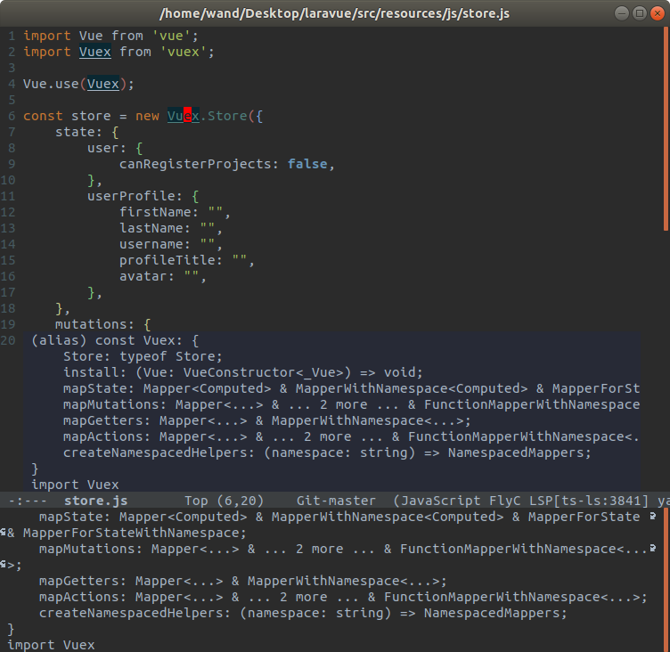

---
title: 【Emacs】lsp-modeでVue.jsの定義ジャンプ・補完
tags:
- Emacs
- Vue.js
- 開発環境
date: 2019-05-06T20:35:39+09:00
URL: https://wand-ta.hatenablog.com/entry/2019/05/06/203539
EditURL: https://blog.hatena.ne.jp/wand_ta/wand-ta.hatenablog.com/atom/entry/17680117127117136189
-------------------------------------

色々躓きまくったのでメモ

調べても日本語記事が全然見つからないんですよ

VSCode使え？うるせ〜〜


# スクショ




# 環境

- emacs 26.2
- elisp ... package installする
    - web-mode
    - lsp-mode
    - lsp-ui
    - company-lsp
- language server ... `npm i -g` する
    - [vls:vue-language-server](https://github.com/vuejs/vetur/tree/master/server)
- いい感じに入れて、READMEどおり設定する


# これだけだとエラー出た

```
Request initialize failed with message: Cannot read property 'config' of null (Internal Error). 
```


# 再度設定

- vlsは色々設定しないと駄目みたい
    - [vue-mode document format fails, vetur config is undefined](https://github.com/emacs-lsp/lsp-mode/issues/727)
        - [yyoncho/vls.el](https://gist.github.com/yyoncho/1d434b0a24b0eaa1fc4292dde7f5a06c)
        - [appledelhi/vls_config.el](https://gist.github.com/appledelhi/c2adc3e6cadba726dd417a8d659be84e)
- `~/.emacs.d/conf/vue-config.el`
    - `~/.emacs.d/init.el`から`(require 'vue-config)`する

```lisp
;; ========================================
;;  Vue SFCの設定
;; ========================================
(require 'web-mode)
(add-to-list 'auto-mode-alist '("\\.vue\\'" . web-mode))


(defun my-lsp-set-cfg (workspace)
  "Set lsp configuration."
  (let ((lsp-cfg `(:vetur
                   (:completion
                    (:autoImport t :useScaffoldSnippets t :tagCasing "kebab")
                    :grammar
                    (:customBlocks
                     (:docs "md" :i18n "json"))
                    :validation
                    (:template t :style t :script t)
                    :format
                    (:options
                     (:tabSize 2 :useTabs :json-false)
                     :defaultFormatter
                     (:html "prettyhtml" :css "prettier" :postcss "prettier" :scss "prettier" :less "prettier" :stylus "stylus-supremacy" :js "prettier" :ts "prettier")
                     :defaultFormatterOptions
                     (:js-beautify-html
                      (:wrap_attributes "force-expand-multiline")
                      :prettyhtml
                      (:printWidth 100 :singleQuote :json-false :wrapAttributes :json-false :sortAttributes :json-false))
                     :styleInitialIndent :json-false :scriptInitialIndent :json-false)
                    :trace
                    (:server "verbose")
                    :dev
                    (:vlsPath ""))
                   :emmet
                   (:showExpandedAbbreviation "always" :showAbbreviationSuggestions t :includeLanguages nil :variables nil :syntaxProfiles nil :excludeLanguages
                                              ["markdown"]
                                              :extensionsPath nil :triggerExpansionOnTab :json-false :preferences nil :showSuggestionsAsSnippets :json-false :optimizeStylesheetParsing t)
                   :html
                   (:experimental
                    (:custom
                     (:tags
                      []
                      :attributes
                      []))
                    :format
                    (:enable t :wrapLineLength 120 :unformatted "wbr" :contentUnformatted "pre,code,textarea" :indentInnerHtml :json-false :preserveNewLines t :maxPreserveNewLines nil :indentHandlebars :json-false :endWithNewline :json-false :extraLiners "head, body, /html" :wrapAttributes "auto")
                    :suggest
                    (:angular1 :json-false :ionic :json-false :html5 t)
                    :validate
                    (:scripts t :styles t)
                    :autoClosingTags t :trace
                    (:server "off"))
                   :javascript
                   (:referencesCodeLens
                    (:enabled :json-false)
                    :suggest
                    (:completeFunctionCalls :json-false :names t :paths t :autoImports t :enabled t)
                    :validate
                    (:enable t)
                    :format
                    (:enable t :insertSpaceAfterCommaDelimiter t :insertSpaceAfterConstructor :json-false :insertSpaceAfterSemicolonInForStatements t :insertSpaceBeforeAndAfterBinaryOperators t :insertSpaceAfterKeywordsInControlFlowStatements t :insertSpaceAfterFunctionKeywordForAnonymousFunctions t :insertSpaceBeforeFunctionParenthesis :json-false :insertSpaceAfterOpeningAndBeforeClosingNonemptyParenthesis :json-false :insertSpaceAfterOpeningAndBeforeClosingNonemptyBrackets :json-false :insertSpaceAfterOpeningAndBeforeClosingNonemptyBraces t :insertSpaceAfterOpeningAndBeforeClosingTemplateStringBraces :json-false :insertSpaceAfterOpeningAndBeforeClosingJsxExpressionBraces :json-false :placeOpenBraceOnNewLineForFunctions :json-false :placeOpenBraceOnNewLineForControlBlocks :json-false)
                    :implicitProjectConfig
                    (:checkJs :json-false :experimentalDecorators :json-false)
                    :suggestionActions
                    (:enabled t)
                    :preferences
                    (:quoteStyle "auto" :importModuleSpecifier "auto")
                    :updateImportsOnFileMove
                    (:enabled "prompt")
                    :autoClosingTags t)
                   :typescript
                   (:tsdk nil :disableAutomaticTypeAcquisition :json-false :npm nil :check
                          (:npmIsInstalled t)
                          :referencesCodeLens
                          (:enabled :json-false)
                          :implementationsCodeLens
                          (:enabled :json-false)
                          :tsserver
                          (:log "verbose" :pluginPaths
                                []
                                :trace "messages")
                          :suggest
                          (:completeFunctionCalls :json-false :paths t :autoImports t :enabled t)
                          :reportStyleChecksAsWarnings t :validate
                          (:enable t)
                          :format
                          (:enable t :insertSpaceAfterCommaDelimiter t :insertSpaceAfterConstructor :json-false :insertSpaceAfterSemicolonInForStatements t :insertSpaceBeforeAndAfterBinaryOperators t :insertSpaceAfterKeywordsInControlFlowStatements t :insertSpaceAfterFunctionKeywordForAnonymousFunctions t :insertSpaceBeforeFunctionParenthesis :json-false :insertSpaceAfterOpeningAndBeforeClosingNonemptyParenthesis :json-false :insertSpaceAfterOpeningAndBeforeClosingNonemptyBrackets :json-false :insertSpaceAfterOpeningAndBeforeClosingNonemptyBraces t :insertSpaceAfterOpeningAndBeforeClosingTemplateStringBraces :json-false :insertSpaceAfterOpeningAndBeforeClosingJsxExpressionBraces :json-false :insertSpaceAfterTypeAssertion :json-false :placeOpenBraceOnNewLineForFunctions :json-false :placeOpenBraceOnNewLineForControlBlocks :json-false)
                          :tsc
                          (:autoDetect "on")
                          :locale nil :suggestionActions
                          (:enabled t)
                          :preferences
                          (:quoteStyle "auto" :importModuleSpecifier "auto")
                          :updateImportsOnFileMove
                          (:enabled "prompt")
                          :autoClosingTags t :surveys
                          (:enabled t))
                   :prettier nil :stylusSupremacy nil)
                 ))
    (lsp--set-configuration lsp-cfg)))

(lsp-register-client
 (make-lsp-client :new-connection (lsp-stdio-connection "vls")
                  :major-modes '(web-mode)
                  :ignore-messages '("readFile .*? requested by Vue but content not available")
                  :initialization-options (lambda ()
                                            '(:vetur
                                              (:completion
                                               (:autoImport t :useScaffoldSnippets t :tagCasing "kebab")
                                               :grammar
                                               (:customBlocks
                                                (:docs "md" :i18n "json"))
                                               :validation
                                               (:template t :style t :script t)
                                               :format
                                               (:options
                                                (:tabSize 2 :useTabs :json-false)
                                                :defaultFormatter
                                                (:html "prettyhtml" :css "prettier" :postcss "prettier" :scss "prettier" :less "prettier" :stylus "stylus-supremacy" :js "prettier" :ts "prettier")
                                                :defaultFormatterOptions
                                                (:js-beautify-html
                                                 (:wrap_attributes "force-expand-multiline")
                                                 :prettyhtml
                                                 (:printWidth 100 :singleQuote :json-false :wrapAttributes :json-false :sortAttributes :json-false))
                                                :styleInitialIndent :json-false :scriptInitialIndent :json-false)
                                               :trace
                                               (:server "verbose")
                                               :dev
                                               (:vlsPath ""))
                                              ))
                  :initialized-fn 'my-lsp-set-cfg
                  :server-id 'vls))

(provide 'vue-config)
```

- vue-modeを使っていたが、アンインストールしてweb-modeに乗り替えた
    - vue-modeだと  
        `"Not enabling jit-lock: it does not work in indirect buffer"`  
        とか怒られる


# 課題

- laravel5.7の新規プロジェクトで試した
- なぜかlodashだけ定義ジャンプと補完が効かない。謎


# 検索用

- emacs
- lsp
- language server protocol
- vue
- vls
- vue language server
