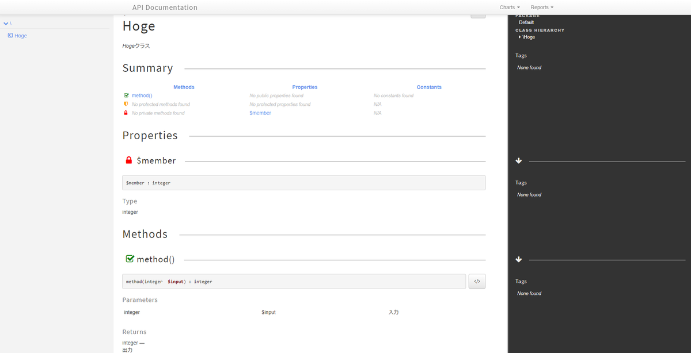

---
title: DebianベースのcomposerコンテナでphpDocumentorを動かした話
tags:
- Docker
- PHP
date: 2019-05-18T23:36:31+09:00
URL: https://wand-ta.hatenablog.com/entry/2019/05/18/233631
EditURL: https://blog.hatena.ne.jp/wand_ta/wand-ta.hatenablog.com/atom/entry/17680117127143905688
-------------------------------------

# TL;DR

- alpineベースだとうまく動かないのでdebianベース等使え


# 動機

- composerとかがなかった太古の時代のソースコードのドキュメント自動生成
    - したがって、composer配下ではない。composer.jsonとか置いてない
- 普段遣いの環境にPHPを直接入れたくないので、dockerコンテナで実行


# 構成

- windowsで作業していたのでtreeコマンドコンテナ使用

```sh
docker container run --rm -v ${pwd}:/root wandta/tree -L 3
```

```
.
├── app
│   ├── composer.json
│   └── src
│      └── Hoge.php
└── docker-compose.yml
```

- docker-compose.yml

```yaml
version: "3"
services:
  composer:
    image: composer
    volumes:
      - ./app:/app
```

- app/composer.json
    - 普通に`composer require phpdocumentor/phpdocumentor`すると動かない('19/5/18現在)
        - [JMS serializer 1.8.0 is incompatible ](https://github.com/phpDocumentor/phpDocumentor2/issues/1868)  
            依存ライブラリ`jms/serializer`の1.8系が入ってしまい、互換性がなくてエラー
    - ので真面目にcomposer.json書く

```json
{
    "require-dev": {
        "phpdocumentor/phpdocumentor": "^2.9",
        "jms/serializer": "1.7.*"
    },
    "scripts": {
        "doc": [
            "vendor/bin/phpdoc -d src -t doc"
        ]
    }
}
```


- app/src/Hoge.php

```php
<?php

/**
 * Hogeクラス
 */
class Hoge
{
    /** @var int */
    private $member = 3;

    /**
     * @param int $input 入力
     * @return int 出力
     */
    function method (int $input): int
    {
        return 3;
    }
}
```


# phpDocumentor実行、エラー出る

```sh
docker-compose run --rm composer composer install
docker-compose run --rm composer composer run doc
```

すごい勢いでエラー出る

```
> vendor/bin/phpdoc -d src -t doc
Collecting files .. OK
Initializing parser .. OK
Parsing files
Parsing /app/src/Hoge.php
Storing cache in "/app/doc" .. OK
Load cache                                                         ..    0.015s
Preparing template "clean"                                         ..    0.033s
Preparing 17 transformations                                       ..    0.000s
Build "elements" index                                             ..    0.000s
Replace textual FQCNs with object aliases                          ..    0.000s
Resolve @link and @see tags in descriptions                        ..    0.000s
Enriches inline example tags with their sources                    ..    0.000s
Build "packages" index                                             ..    0.004s
Build "namespaces" index and add namespaces to "elements"          ..    0.000s
Collect all markers embedded in tags                               ..    0.000s
Transform analyzed project into artifacts                          .. 
Applying 17 transformations
  Initialize writer "phpDocumentor\Plugin\Core\Transformer\Writer\FileIo"
  Initialize writer "phpDocumentor\Plugin\Twig\Writer\Twig"
  Initialize writer "phpDocumentor\Plugin\Graphs\Writer\Graph"
  Execute transformation using writer "FileIo"
  Execute transformation using writer "FileIo"
  Execute transformation using writer "FileIo"
  Execute transformation using writer "FileIo"
  Execute transformation using writer "FileIo"
  Execute transformation using writer "twig"
  Execute transformation using writer "twig"

Warning: file_put_contents(/app/doc//): failed to open stream: Is a directory in /app/vendor/phpdocumentor/phpdocumentor/src/phpDocumentor/Plugin/Twig/Writer/Twig.php on line 117
  Execute transformation using writer "twig"

Warning: file_put_contents(/app/doc//): failed to open stream: Is a directory in /app/vendor/phpdocumentor/phpdocumentor/src/phpDocumentor/Plugin/Twig/Writer/Twig.php on line 117
  Execute transformation using writer "twig"
  Execute transformation using writer "twig"
  Execute transformation using writer "twig"

Warning: file_put_contents(/app/doc//): failed to open stream: Is a directory in /app/vendor/phpdocumentor/phpdocumentor/src/phpDocumentor/Plugin/Twig/Writer/Twig.php on line 117
  Execute transformation using writer "twig"
  Execute transformation using writer "twig"
  Execute transformation using writer "twig"
  Execute transformation using writer "twig"
  Execute transformation using writer "twig"
  Execute transformation using writer "Graph"
Unable to find the `dot` command of the GraphViz package. Is GraphViz correctly installed and present in your path?   0.566s
Analyze results and write report to log                            ..    0.000s
```

## alpineベースだとうまく動かないよう


- パスの連結まわりでエラーが出てるっぽい

```
Warning: file_put_contents(/app/doc//): 
```

- issueも報告されている
    - [Unable to generate documentation with php:alpine](https://github.com/phpDocumentor/phpDocumentor2/issues/1874)


> It looks like it has to do something with the dubble / in your target path.  
> But I don't know where this is comming from. Please check your config for that.


- alpineベースだとうまく動かない？
- 確かに[composer公式イメージ](https://hub.docker.com/_/composer)はalpineベース


```dockerfile
FROM php:7-alpine

...

COPY docker-entrypoint.sh /docker-entrypoint.sh

WORKDIR /app

ENTRYPOINT ["/bin/sh", "/docker-entrypoint.sh"]

CMD ["composer"]
```


# debianベースのcomposerイメージ作る

- マルチステージビルド的なことをする
    - composer公式イメージから、composer実行ファイルのみ引っこ抜いてdebianベースのphpイメージに突っ込む
- そもそも`composer`がどこにあるのかをまず確認

```sh
docker-compose run --rm composer composer install
```

```
/usr/bin/composer
```

- Dockerfile書く
- composer-debian/Dockerfile

```dockerfile
FROM composer as composer


FROM php:7.3.5-cli-stretch

COPY --from=composer /usr/bin/composer /usr/bin/composer
RUN chmod +x /usr/bin/composer

# composerでパッケージ取得するためにGitとunzip入れる
RUN apt-get update -y && apt-get upgrade -y
RUN apt-get install -y git unzip

WORKDIR /app

CMD ["composer"]
```

- イメージビルド必要


```diff
  version: "3"
  services:
    composer:
-     image: composer
+     build:
+       context: .
+       dockerfile: ./composer-debian/Dockerfile
      volumes:
        - ./app:/app
```

```sh
docker-compose build
```

- 再度phpDocumentor実行

```sh
docker-compose run --rm composer composer run doc
```

```
Collecting files .. OK
Initializing parser .. OK
Parsing files
Parsing /app/src/Hoge.php

Warning: count(): Parameter must be an array or an object that implements Countable in /app/vendor/phpdocumentor/phpdocumentor/src/phpDocumentor/Plugin/Core/Descriptor/Validator/Constraints/Functions/IsArgumentInDocBlockValidator.php on line 33
  No summary was found for this file
  No summary for method method()
  No summary for property $member
Storing cache in "/app/doc" .. OK
Load cache                                                         ..    0.007s
Preparing template "clean"                                         ..    0.016s
Preparing 17 transformations                                       ..    0.000s
Build "elements" index                                             ..    0.000s
Replace textual FQCNs with object aliases                          ..    0.000s
Resolve @link and @see tags in descriptions                        ..    0.000s
Enriches inline example tags with their sources                    ..    0.000s
Build "packages" index                                             ..    0.003s
Build "namespaces" index and add namespaces to "elements"          ..    0.000s
Collect all markers embedded in tags                               ..    0.000s
Transform analyzed project into artifacts                          .. 
Applying 17 transformations
  Initialize writer "phpDocumentor\Plugin\Core\Transformer\Writer\FileIo"
  Initialize writer "phpDocumentor\Plugin\Twig\Writer\Twig"
  Initialize writer "phpDocumentor\Plugin\Graphs\Writer\Graph"
  Execute transformation using writer "FileIo"
  Execute transformation using writer "FileIo"
  Execute transformation using writer "FileIo"
  Execute transformation using writer "FileIo"
  Execute transformation using writer "FileIo"
  Execute transformation using writer "twig"
  Execute transformation using writer "twig"
  Execute transformation using writer "twig"
  Execute transformation using writer "twig"
  Execute transformation using writer "twig"
  Execute transformation using writer "twig"
  Execute transformation using writer "twig"
  Execute transformation using writer "twig"
  Execute transformation using writer "twig"
  Execute transformation using writer "twig"
  Execute transformation using writer "twig"
  Execute transformation using writer "Graph"
Unable to find the `dot` command of the GraphViz package. Is GraphViz correctly installed and present in your path?   0.611s
Analyze results and write report to log                            ..    0.000s
```

- `failed to open stream`エラーが消えた
- いい感じに出力できている
    - app/doc/classes/Hoge.html




# phpDocumentorさえ使えればいい場合

- [これ](https://hub.docker.com/r/phpdoc/phpdoc/)を使えばよかったみたい(徒労)
    - debianベースのPHPイメージベース
