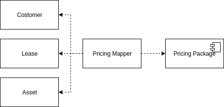
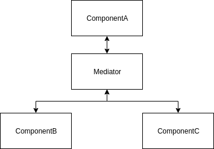

---
title: PoEAA ch18 Mapper
tags:
- PoEAA
- GoF
- デザインパターン
- 勉強メモ
date: 2019-05-19T18:07:16+09:00
URL: https://wand-ta.hatenablog.com/entry/2019/05/19/180716
EditURL: https://blog.hatena.ne.jp/wand_ta/wand-ta.hatenablog.com/atom/entry/17680117127147058420
bibliography: https://martinfowler.com/books/eaa.html
-------------------------------------

# Mapper

> An object that sets up a communication between two independent objects.

- 2つのサブシステムをつなぐ
- 疎結合に保ちたい
    - 変更できないから
    - 変更できるにしても、依存させたくないから

<figure class="figure-image figure-image-fotolife" title="Mapper"><figcaption>Mapper</figcaption></figure>

# How It Works

- サブシステムをつなぐ
- コミュニケーションの詳細を制御する
    - 両サブシステムが意識しなくて良いように
- shuffle
- mapperをどうやって起動するか？
    - サブシステムからmapperを直接起動しては意味がない
        - サブシステムが何かに依存するのを避けるためのmapperなのだから
    - 第三のサブシステムを設けてmapper起動する
    - Observer Pattern取り入れる
        - サブシステム: Publisher
        - mapper: Observer
        - mapperはイベントをリッスンして起動する
- mapperがどう動作するかは、マッピング対象の層の種類による
    - *Data Mapper*とか

# When to Use It

- システムの部品の結合をほぐす
- *Mapper*にするか*Gateway*にするか

<figure class="figure-image figure-image-fotolife" title="Gateway (Mapperとは依存の方向が異なる)"><figcaption>Gateway (Mapperとは依存の方向が異なる)</figcaption></figure>

- *Gateway*のほうが、書くにも使うにもシンプル
- サブシステム間で互いに依存がないことを保証する必要がある場合にのみ*Mapper*使え
    - 【補】片方向依存があってもいいなら*Gateway*
    - サブシステム間の相互作用がとりわけ複雑
    - それでいて、サブシステムの主要な目的には関係がない
- 例えばどんなとき
    - Domain ModelとDBとのO/Rマッピング(*Data Mapper*)
        - データ変換は複雑
        - Domain ModelはDBのことは意識するべきではない
        - DBも誰に使われるか知っているべきではない
- GoFの*Mediator*に似ている
- 異なる点
    - *Mediator Pattern*: 各クラスはMediatorを知っている
    - *Mapper Pattern*: 各クラスはMapperを知らない

<figure class="figure-image figure-image-fotolife" title="GoFのMediator Pattern (双方向依存)"><figcaption>GoFのMediator Pattern (双方向依存)</figcaption></figure>
