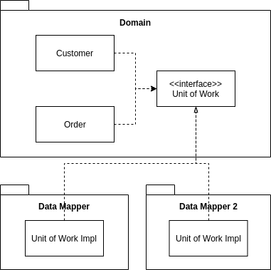

---
title: PoEAA ch18 Separated Interface
tags:
- PoEAA
- デザインパターン
- 勉強メモ
date: 2019-05-20T21:18:00+09:00
URL: https://wand-ta.hatenablog.com/entry/2019/05/20/211800
EditURL: https://blog.hatena.ne.jp/wand_ta/wand-ta.hatenablog.com/atom/entry/17680117127147415053
bibliography: https://martinfowler.com/books/eaa.html
-------------------------------------

# Separated Interface

> Defines An Interface In A Separate Package From Its Implementation.

- 開発を進めるにあたり、システムの部品間の結合を減らして品質を高めることがある
- どうやる
- クラスをパッケージにまとめ、パッケージ単位で依存性を管理する
    - DomainパッケージからPresentationパッケージを呼ばない、等
- 一般的な依存構造に反してメソッドを呼ばないといけないことがある
    - 知っていてはならないはずのものを呼ぶ
        - Domain ObjectがDataMapperを呼ぶとか
- こういうときはインタフェースだけ別パッケージに切り出す

    

# How It Works

- 依存方向
    - クライアント -> インタフェース
    - 実装 -> インタフェース
- クライアントは特定の実装に依存しない
- もちろん、遅くともruntimeまでには実装クラスを決定しないとプログラムは動かない
    - compile timeに決定
    - configuration timeに決定 ... *Plugin*
- インタフェースを別パッケージに切り出してもよい
- 誰がインタフェース定義に責任をもつか
    - クライアントが責任をもつなら、クライアントパッケージに同梱
    - そうでない場合や、実装側が責任をもつなら、別パッケージに切り出す
        - 複数のクライアントから使用する場合など
- 言語機構
    - `interface`
        - 実装を強制する
    - `abstract class`
        - デフォルト実装を提供できる
            - 任意でoverride
- どうやってインスタンシエートするの
    - 具象クラスと、そのインスタンシエート方法の知識が必要
    - Factory classつくる
        - Factoryのインタフェースを再度切り出す
            - 【補】GoFの *Abstract Factory* / *Factory Method* 的な
        - Factoryの実装クラスはconfiguration timeに決定する(*Plugin*)
        - 依存性が完全になくなるわけではないが、実装の選択がconfiguration timeにまで遅延される
            - 【補】遅延束縛(late-binding)
    - インタフェースと実装クラスの両方を知っているパッケージを用意する
        - 【補】LaravelのServiceProvider/DIコンテナがまさにこれ
        - アプリケーション起動時に適切にインスタンシエートする
            - 実装クラス自身がインスタンシエート方法を知っている
            - ファクトリに作らせる

# When to Use It

- 使いどころの例
    - F/Wから特定のアプリケーション用のコードを呼ばせる
        - F/Wは「特定のアプリケーション」なんか知らないので、インタフェースを提供する
        - 特定のアプリケーション用のコードは、当該インタフェースを実装/継承して作る
    - 呼び出したいが、特定の実装に依存したくない
        - 例えば、*Domain Model*から*DataMapper*
        - Domain ModelからはDataMapperのインタフェースのメソッドを呼ぶようにする
        - 特定の実装には依存しなくなる
    - 別の開発グループによって開発された関数を呼び出す
        - そのAPIへの依存性を持ち込みたくない
- 全クラスにinterfaceを切るのはやりすぎ
    - 余計な仕事
    - 使いどころを絞る
        - 依存を切り離したい場合
        - 独立した実装が複数ある場合
            - 【補】データソースとしてRDBとNoSQLとファイルがある、とか
    - interfaceを切って依存を切り離すのは軽微なリファクタリングなので、必要になるまで行わなくてよい
- 依存性の管理について
- 通常は、特定の実装クラスへの依存は、オブジェクト生成時にのみ必要となる
    - 以降はinterfaceに依存すれば十分なはず
- それを強制し始めると困難が生じる
    - ビルド時に依存性チェックを行う等
    - すべての依存を排除しなければならない
- 小規模システムでは割に合わない
    - 余計な依存があってもあまり問題にならない
- 大規模システムでは遵守するに値する
