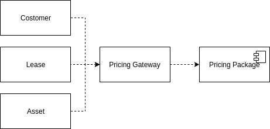
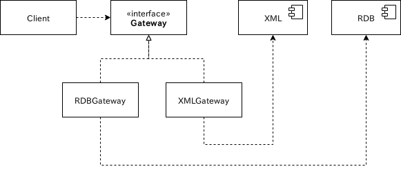
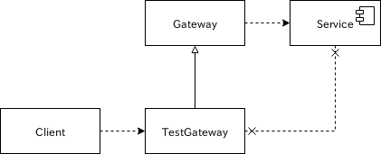
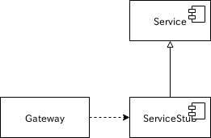

---
title: PoEAA ch18 Gateway
tags:
- PoEAA
- デザインパターン
- 勉強メモ
date: 2019-05-21T00:08:20+09:00
URL: https://wand-ta.hatenablog.com/entry/2019/05/21/000820
EditURL: https://blog.hatena.ne.jp/wand_ta/wand-ta.hatenablog.com/atom/entry/17680117127152272536
bibliography: https://martinfowler.com/books/eaa.html
-------------------------------------

# Gateway

> An object that encapsulates access to an external system or resource.

- OOシステムはオブジェクトではない外部リソースを取り扱わねばならないことがある
    - DBテーブル
    - CICSトランザクション
    - XMLデータ構造
- 外部リソースはそれ専用のAPIをもつ
    - RDB: JDBC,SQL
    - XML: W3C, JDOM
- そのまま使うのはよくない
    - プログラムを理解しづらくなる
    - 将来RDBをXMLに置換できなくなる
- オブジェクトでラップしろ

# How It Works

- やることは至ってシンプルなラッピング
- 用途を満たすシンプルなAPI(=メソッドとか)を定義し、外部リソースの操作にマッピングする
- *Gateway*は*Service Stub*のよい適用場所でもある
    - 後述
- *Service Stub*を適用しやすい設計にするのは重要なこと
    - テスト容易性
- *Gateway*はシンプルに保て
    - 一番大事な役割は...
        - 外部リソースのラッピング・クライアントコードの要求への適合
        - スタブの適用箇所の提供
    - これらを満足できる程度の最小のものであるべき
    - 複雑なロジックはクライアントコードに任せろ
- コード自動生成を使うのは良いアイデア
    - 例
        - リレーショナルメタデータからRDBゲートウェイ
        - XMLスキーマやDTDからXMLゲートウェイ
    - 生成される*Gateway*は賢くない(dumb)が、うまくいく
        - 複雑な操作は他のオブジェクトに任せればいい
- 2つ以上のオブジェクトで*Gateway*を作るのもよい
    - バックエンドとフロントエンド
        - バックエンド: ミニマルなラッパ
        - フロントエンド: バックエンドを叩き、シンプルなAPIを提供する
            - 【補】GoFの*Facade Pattern*
    - 外部サービスのラッピングと、クライアントコードの要求への適合が相応に複雑ならば良い
    - 単純なら分けるほどではない

# When to Use It

- 外部のもの感があり、インタフェースがぎこちない(OOPと合わない)ものがあれば*Gateway*適用を検討せよ
    - ぎこちなさをシステム全体に波及させるよりも、*Gateway*で閉じ込める
    - *Gateway*で包むデメリットはまずない
    - クライアントコード読みやすくなる
- *Gateway*を導入するとテストが容易になる
    - *Service Stubs*の明確な適用箇所
    - 外部リソースのインタフェースが*Gateway*で包むまでもなくOOPに適合していても、  
        *Service Stub*の適用のために*Gateway*で包むのは有用
- *Gateway*でを導入すると置換可能になる
    - 【補】クライアントコードをinterfaceに依存させれば、特定の実装には依存しなくなる
    - テスト用*Gateway*への置換も可能(後述)

<figure class="figure-image figure-image-fotolife" title="別の外部サービスに置換可能"><figcaption>別の外部サービスに置換可能</figcaption></figure>

- *Mapper*という別の選択肢
    - 外部リソースとの結合を切り離す
    - *Gateway*よりも複雑
        - クライアントと外部リソースを互いにignorantにするため

<figure class="figure-image figure-image-fotolife" title="Mapper"><figcaption>Mapper</figcaption></figure>

- これって改めてデザインパターンとして挙げるほどのものか？
    - GoFのなにがしかと同じじゃないの？
    - 下記の理由につき区別した
        - Facadeとの違い
            - Facade
                - 複雑なAPIの単純化
                - 汎用
                - 異なるインタフェースが裏にあることを示唆
            - Gateway
                - 特定用途
                - 外部リソースのAPIへの単なるマッピングだったりする
                - 置換やテストを旨とする
        - Adapterとの違い
            - Adapter
                - 既存のインタフェースに寄せるやつ
            - Gateway
                - 既存のインタフェースは(普通)ない
                - Adapterパターンをとることもある
                    - GatewayインタフェースがAdapterのインタフェース(Target)
                    - 外部リソースの実装を包むのがAdapter
                    - 外部リソースがAdaptee
                - この場合adapterはGatewayの実装の一部
        - Mediatorとの違い
            - Mediator
                - 各クラスはMediatorを知っている
            - Gateway
                - Gatewayに包まれる外部リソースはGatewayのことを知らない
        - 【疑問】Bridgeパターンとはどう違うの
            - 既存のインタフェースはないが、様々な実装ありきでインタフェースを作る点がそっくり
            - Bridgeパターンは「種類の継承ツリーと実装の継承ツリーとを分離する」ことを旨とするから違うのかな
            - Facade, Adapter, Mediatorよりは似てると思う

# Example: A Gateway to a Proprietary Messaging Service (Java)

- コード略(pp.468-472)
- *Gateway*のインタフェースについて
    - `send('CNFRM', [1, 10, 'hoge'])`
        - 汎用
    - `sendConfirmation(1, 10, 'hoge')`
        - 特定用途
    - 良し悪し
        - 汎用インタフェース
            - 引数の正当性が静的にわからない
                - typoでエラー出たりしそう
        - 特定用途インタフェース
            - 包んでいる外部リソースに追加変更があるたびに*Gateway*クラスに変更が生じる
                - 実装の単純なマッピングじゃないから
                - 自動生成じゃないから
    - 両方あるとよい
- 戻り値から例外へのマッピング
    - exit 0: 正常終了
    - ほか: 異常終了
- *Gateway*のスタブ
    - テスト用protectedメソッドを生やしておく
        - 外部リソースの操作を単に包むだけのやつ
            - 特定用途のためのシグネチャとか持たない
            - 戻り値の例外へのマッピングもしない
    - 本メソッドをオーバライドして、外部サービスへのアクセスをモックする
        - 【補】サービス自体のスタブを作るわけではない
- もう一つのテスト方法: *Service Stub*
    - 外部サービス自体のスタブを作る
        - 【補】JSON Serverとか
    - スタブの開発作業が困難でなければうまくいく
- GatewayのスタブとServiceのスタブを併用するのもよい
    - Gatewayのスタブ: クライアントコードのテスト用
    - Serviceのスタブ: Gatewayのテスト用
- *Plugin*パターンを併用することで、本物とスタブの選択をconfiguration timeまで遅延できる

<figure class="figure-image figure-image-fotolife" title="本物のGatewayを継承してテスト用Gatewayを作る(interface切ったほうが行儀いいと思う)"><figcaption>本物のGatewayを継承してテスト用Gatewayを作る(interface切ったほうが行儀いいと思う)</figcaption></figure>

<figure class="figure-image figure-image-fotolife" title="Serivce Stub ... サービスのスタブでGatewayをテスト"><figcaption>Serivce Stub ... サービスのスタブでGatewayをテスト</figcaption></figure>

----------------------------------------

# 英語

- do the trick
    - うまくいく
- ludicrous
    - ばかばかしい
- laudable
    - 称賛に値する
