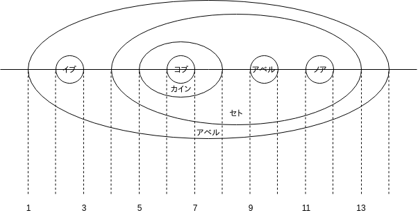

---
title: 達人に学ぶDB設計 徹底指南書 ch9 一歩進んだ論理設計〜SQLで木構造を扱う
tags:
- RDB
- 勉強メモ
date: 2019-06-15T19:00:57+09:00
URL: https://wand-ta.hatenablog.com/entry/2019/06/15/190057
EditURL: https://blog.hatena.ne.jp/wand_ta/wand-ta.hatenablog.com/atom/entry/17680117127200793026
bibliography: https://www.shoeisha.co.jp/book/detail/9784798124704
-------------------------------------


# リレーショナルデータベースのアキレス腱

- 木構造が苦手

## 木構造とは？

- 例: 会社の組織
- 言葉の定義
    - 略

```
アダム
├── イブ
└── セト
    ├── カイン
    │   └── ヨブ
    ├── アベル
    └── ノア
```

# 伝統的な解法〜隣接リストモデル


| 社員(PK) | 上司   |
|----------|--------|
| アダム   |        |
| イブ     | アダム |
| セト     | アダム |
| アベル   | セト   |
| カイン   | セト   |
| ノア     | セト   |
| ヨブ     | カイン |


- 最も古くポピュラーな方法
- デメリット
    - 更新や検索のクエリがベンダー拡張を使わないと極めて複雑
    - パフォーマンスも悪い
- 以降、欠点を対処し、かつ標準SQLのみを使用して階層データを取り扱う方法


# 新しい解法〜入れ子集合モデル

> 入れ子集合モデルでは、ノードを円とみなす

- Nested Sets Model
- 数直線状の線分でもいい
- 上司が部下を内包する





組織図

| 社員(PK) | 左端 | 右端 |
|----------|------|------|
| アダム   | 1    | 14   |
| イブ     | 2    | 3    |
| セト     | 4    | 13   |
| カイン   | 5    | 8    |
| ヨブ     | 6    | 7    |
| アベル   | 9    | 10   |
| ノア     | 11   | 12   |


- [sqlite online](https://sqliteonline.com/#fiddle-5d07b3be98b63mzxjx0jlktp)

## 入れ子集合モデルを使った検索

- ルート
    - 上司がいない

```sql
SELECT *
  FROM 組織図 部下
 WHERE NOT EXISTS
       (SELECT *
          FROM 組織図 上司
         WHERE 部下.左端 > 上司.左端
           AND 部下.左端 < 上司.右端);
```

- リーフ
    - 部下がいない

```sql
SELECT *
  FROM 組織図 上司
 WHERE NOT EXISTS
       (SELECT *
          FROM 組織図 部下
         WHERE 部下.左端 > 上司.左端
           AND 部下.左端 < 上司.右端);
```


- 木の深さ
    - = 上司の人数
    - = 自身を包含する円の個数

```sql
SELECT 部下.社員, COUNT(上司.社員) AS 深さ
  FROM 組織図 部下
 INNER JOIN 組織図 上司
    ON 部下.左端 BETWEEN 上司.左端 AND 上司.右端
 GROUP BY 部下.社員
 ORDER BY 深さ;
```


## 入れ子集合モデルを使った更新

- 更新に問題あり
    - リーフに部下を持たせるには、円を広げる必要がある
    - リーフの円を広げるために、その上司の円を広げる必要がある
    - ...
    - 更新対象と無関係な円の座標も連動して更新しなければならない
- 削除は簡単
    - BETWEENで絞って部分木をまるっと消す
    - 歯抜けが生じるが問題なし


# もしも無限の資源があったなら〜入れ子区間モデル

- Nested Intervals Model
- 入れ子集合モデルの実数拡張版

## 使っても使っても尽きない資源

- 座標のとれる範囲を実数に
- 実数の稠密性につき、いくらでも区間を刻んで円を追加できる
    - 円を広げる必要がないため、入れ子集合モデルにおける更新時のパフォーマンス問題を解決
    - 実際には「実数」ではなく有効桁数は有限桁なのでいつか枯渇する


## 入れ子区間モデルを使った更新

- 検索、削除は変わらない
- 部下の追加は、内分の公式を使っていい感じに
    - 関係のない円を広げる必要なし


# ノードをフォルダだと思え〜経路列挙モデル

- 経路列挙モデル(Path Enumeration Model)
- 経路実体化モデル(Materialized Path Model)とも

## ファイルシステムとしての階層

> ノードをディレクトリと見なし、各ノードまでの経路(path)を記述する

```
アダム
├── イブ
└── セト
    ├── カイン
    │   └── ヨブ
    ├── アベル
    └── ノア
```

- 主キー使う

| 社員(PK) | 経路                      |
|----------|---------------------------|
| アダム   | /アダム/                  |
| イブ     | /アダム/イブ/             |
| セト     | /アダム/セト/             |
| カイン   | /アダム/セト/カイン/      |
| ヨブ     | /アダム/セト/カイン/ヨブ/ |
| アベル   | /アダム/セト/アベル/      |
| ノア     | /アダム/セト/ノア/        |

- 番号使う

| 社員(PK) | 経路      |
|----------|-----------|
| アダム   | .1.       |
| イブ     | .1.1.     |
| セト     | .1.2.     |
| カイン   | .1.2.1.   |
| ヨブ     | .1.2.1.1. |
| アベル   | .1.2.2.   |
| ノア     | .1.2.3.   |

- 利点
    - 検索のパフォーマンスが良い
        - ノード自身のレコードに親子関係が含まれている
            - 正規表現を使えるDBMSと高い親和性
                - Oracle
                - Postgres
        - 経路も一意なのでユニークインデックス効く
- 欠点
    - 主キー使うと経路が長大に
    - 主キー使うと同階層のノードの順序を示せない
        - cf.入れ子集合モデルでは、座標位置で示せる
        - cf. 番号を使えば解決
    - 番号使うとノードの更新が複雑になる
    - 文字列関数まわりで可搬性が低い


## 経路列挙モデルによる検索

- 検索にはめっぽう強い
- ルート
    - 主キー使用: 経路が主キーからのみなる
        - `WHERE 社員 = REPLACE(経路, '/', '')`
    - 番号使用:
        - `WHERE 経路 = '.1.'`
- リーフ
    - 子が存在しない
    - 子とは？
    - 自分の経路の後ろに追加の経路を持つ
        - `子.経路 LIKE 親.経路 || '_%'`
    - `||`: 標準SQLの文字列結合
    - `'_%'`: 任意の1文字以上
- 深さ
    - デリミタの数を数える
    - `SELECT LENGTH(経路) - LENGTH(REPLACE(経路, '/', '')) - 1`
    - レコード自身が親子関係を含んでいるため、自己結合が不要
        - cf.入れ子集合モデルでは自己結合が必要だった


## 経路列挙モデルを使った更新

- 挿入
    1. 親にぶら下げる
    1. 子孫すべての経路を書き換える(高コスト)
- 削除
    - 子孫すべて削除


```sql
DELETE FROM 組織図
 WHERE 経路 LIKE '%/' || 'カイン' || '/%';
```

- LIKEによる中間一致
    - すぐ思いつくやつ
    - インデックス効かないのでパフォーマンス悪い
    - 主キー使用方式でないと使えない
- 改良版


```sql
DELETE FROM 組織図
 WHERE 経路 LIKE (SELECT 経路
                    FROM 組織図
                   WHERE 社員 = 'カイン') || '%';
                   -- %が空文字列にマッチするときカイン自身が削除される
```

- こう展開される

```sql
DELETE FROM 組織図
 WHERE 経路 LIKE '.1.2.1.' || '%';
```

- 経路`.1.2.1.`のカイン氏、`.1.2.1.1.`のヨブ氏クビ
- 主キー使用方式でなくても使える
- サブクエリ内外いずれもインデックス効くのでパフォーマンス良好
    - サブクエリ
        - 主キーによるインデックス効く
    - LIKE
        - 前方一致につきユニークインデックス効く


# 各モデルのまとめ

- 隣接リストモデル
    - 古典
    - 複雑
        - DBMS依存機能で欠点軽減
            - 可搬性はなくなる
- 入れ子集合モデル
    - 検索のSQLが簡単
    - 更新のパフォーマンスに問題
- 入れ子区間モデル
    - 入れ子集合モデルの拡張版
    - 更新のパフォーマンス問題の克服
    - 実数型の有効桁数が十分に確保されていること
- 経路列挙モデル
    - 検索に強く更新に弱い
