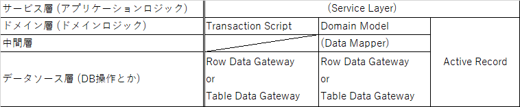

---
title: Laravel輪読会 ch3  アプリケーションアーキテクチャ
tags:
- Laravel
- 勉強メモ
date: 2019-07-31T21:26:18+09:00
URL: https://wand-ta.hatenablog.com/entry/2019/07/31/212618
EditURL: https://blog.hatena.ne.jp/wand_ta/wand-ta.hatenablog.com/atom/entry/26006613382487632
bibliography: https://www.socym.co.jp/book/1184
-------------------------------------

# 3-1 MVCとADR

## 3-1-1 MVC(Model View Controller)


```
@startuml
class Controller
class View
class Model
class Client

Client --> Controller
Controller --> Model
Controller <-- Model
Controller --> View
Client <-- View
@enduml
```


- もともとのMVC
    - UI設計のための設計パターン
    - 【補】MVVMとかの仲間？
- MVC2
    - もともとのMVCパターンをサーバサイドに適用したもの
- 以下、単に「MVC」というときはMVC2を指す

### MVCとLaravel

- MVCを意識したディレクトリ構成が初めから用意されている


### Laravelにおけるコントローラ

| MVCにおけるCの責務                      | Laravelにおいて対応しているもの |
|-----------------------------------------|---------------------------------|
| HTTPリクエストの解釈(URI,HTTPメソッド)  | routes/*.php                    |
| 制御を移すModel(ドメインロジック)の選択 | コントローラのメソッド          |
| 表示するViewの選択                      | コントローラのメソッド          |


- [リソースコントローラ](https://readouble.com/laravel/5.5/ja/controllers.html#resource-controllers)
    - CRUDのスキャフォールディング


### Laravelにおけるモデル

- 「モデル」の本来の意味
    - ビジネスロジックを解決する処理グループ
    - 【補】ビジネスロジックはさらに細分化される (PoEAA的文脈)
        - アプリケーションロジック
            - システム関わるロジック
            - ワークフローロジックとも
            - 例: ATMでお金を送金するフロー
        - ドメインロジック
            - システム化しなくても存在するロジック
            - 例: 軽減税率
- 小規模な場合はデータベース構造がそのままビジネス要求に結びつくこともある
    - が、本質は別物
- いくつかの選択がある
- 【補】PoEAAのパターンとの対応

<figure class="figure-image figure-image-fotolife" title="PoEAAにおけるパターンとの対応"><figcaption>PoEAAにおけるパターンとの対応</figcaption></figure>

- LaravelのEloquentはActive Record、もしくはRow Data Gatewayにあたる
    - DBのレコードを模したオブジェクトに`save()`メソッドが生えている
    - ビジネスロジックを載せる場合は「Active Record」、DB操作のみ行うなら「Row Data Gateway」
    - Eloquentにビジネスロジックを乗せない場合は「Row Data Gateway」にあたると自分は解釈しています
- LaravelのDBファサードはTable Data Gatewayにあたる


#### トランザクションスクリプトパターン

- 1つのビジネストランザクションを1つの手続きに紐付ける
- メリット
    - 単純
- デメリット
    - ビジネスロジックが複雑だと破綻する
- データの永続化にRow Data Gateway (≒LaravelにおけるEloquent)を使用している場合は、  
    ビジネスロジックをRow Data Gatewayに移植していくことで、推移的にActive Recordパターンになる


#### ドメインモデルパターン

- オブジェクトの相互作用でビジネスロジックを表現する
- メリット
    - 複雑なビジネスロジックに対処できる
        - オブジェクト指向の各種テクニックを適用できる
            - 参考書籍
                - Gang of Four
                - Refactoring (Martin)
            - if文減らせる、拡張性高い
            - SOLID原則に撥ねる話
                - O: オープンクローズド
                - L: リスコフの置換原則
                - I: インタフェース分離
                - D: 依存性逆転
- デメリット
    - 難易度高い
    - ビジネスロジックがシンプルな場合は大げさ


### Laravelにおけるビュー

- Illuminate\Http\Responseクラス
    - Illuminate\View\Viewは結局Responseインスタンスになる


## 3-1-2 ADR(Action Domain Responder)

```
@startuml
class Action
class Responder
class Model
class Client

Client --> Action
Action --> Model
Action <-- Model
Action --> Responder
Client <-- Responder
@enduml
```


### アクション(Action)

- 単メソッドコントローラ


### ドメイン(Domain)

- MVCのModelに同じ

### レスポンダ(Responder)


- 責務: HTTP Responseの生成全般
- Laravelでいうと、ViewやResponseインスタンスを生成するクラス
- MVCのV(ページの見た目)よりも責任範囲が広い
    - ステータスコード
        - 200 OK
        - 202 Accepted ... 時間のかかる処理とか
        - 400 Bad Request
        - ...
    - レスポンス形式
        - ページ表示
            - HTML
        - API
            - XML
            - JSON


# 3-2 アーキテクチャへの入口

## 3-2-1 フレームワークとアーキテクチャ設計

- ビジネスロジックとデータ永続化を分離しよう
    - データ永続化の実装はさまざま
        - Eloquent (RDB前提)
        - NoSQL
        - 【補】読むだけならconfigファイルも
        - etc.

## 3-2-2 アーキテクチャ設計のポイント

## 3-2-3 レイヤードアーキテクチャ

- リポジトリパターンを実装してみようの巻

### レイヤ化のための概念

- SOLIDのS
    - 単一責任の原則
- 【補】それぞれの責務
    - Controller
        - ビジネスロジック(Service)の選択
        - ビューの選択・生成
    - Service
        - ビジネスロジック
        - データ永続化についてはRepositoryInterfaceの実装クラスに丸投げ
    - RepositoryInterface
        - データ永続化の実装の隠蔽
    - Repository
        - データ永続化の実装
            - Eloquentとか


## 3-2-4 レイヤードアーキテクチャの一歩先の世界

- 参考文献がいっぱい
