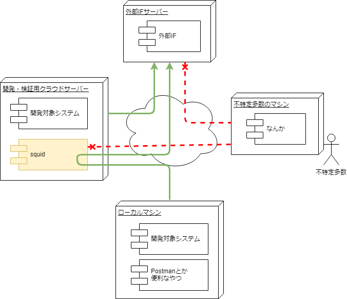
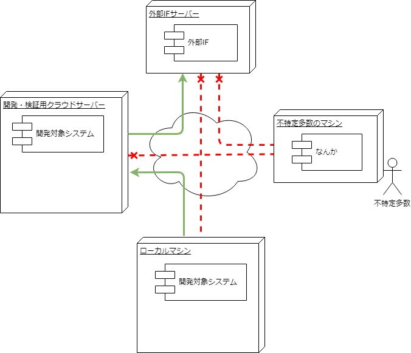

---
title: 【squid】HTTPプロキシサーバ立てた
tags:
- 開発環境
date: 2019-08-15T01:04:14+09:00
URL: https://wand-ta.hatenablog.com/entry/2019/08/15/010414
EditURL: https://blog.hatena.ne.jp/wand_ta/wand-ta.hatenablog.com/atom/entry/26006613395829738
-------------------------------------

# 構築後のネットワークのイメージ



- ブログのサムネ用


# 背景



- 外部システムのIFと連携するシステムの構築
- IFにアクセスするマシンは申請制
    - 不特定多数にフルオープンにしてもらうわけにはいかない
    - 特定のマシンに対してのみ穴を開けてもらう
- 今回は`開発・検証用クラウドサーバー`に対してのみ穴を開けてもらった
- `ローカルマシン`から気軽にHTTPリクエストを送れなくてつらい
    - Postmanとか使いたい


# Solution: クラウドサーバーにHTTPプロキシを立てる


- ローカルマシンから、クラウドサーバーを経由してHTTPリクエストを送りつける
- プロキシサーバープログラムとしてはsquidを選定


# 設定

## squidの設定

- まず入れる

```sh
yum -y install squid
```

- ポートはTCP 3128(デフォルト)
- ホワイトリスト形式で、src にローカルマシンのグローバルIPアドレスを設定する
    - 不特定多数がプロキシを経由できたら大問題なので

/etc/squid/squid.conf

```diff
  ...
+ acl whitelist src "/etc/squid/whitelist"    # whitelistの定義
  ...
+ http_access allow whitelist    # whitelistの許可
  ...
  http_access deny all    # 上からここまで、いずれにもマッチしなければ不許可
```

/etc/squid/whitelist

```
192.0.2.0/24
```

- 実際には「ローカルマシン」のグローバルIPアドレスを書く
- 設定し終わったらsquid起動 or 設定再読み込み

```sh
systemctl start squid

# すでに起動してたら
systemctl reload squid
```

    
## クラウドサーバーの設定

- TCP 3128を開けてやる必要がある
- AWSのセキュリティグループを新しく作った
    - インバウンド TCP 3128 、ローカルマシンのグローバルIPアドレスのみ許可
        - セキュリティグループはステートフルなのでインバウンドだけでOK
    - やはり不特定多数には開放しない


## プロキシ経由してHTTPリクエスト送る

```sh
curl --proxy http://<クラウドサーバーのIPアドレス>:3128 <外部IFのIPアドレス>
```

- ローカルマシンから気軽にHTTPリクエストできるようになった
    - Postmanとか使えて幸せ
