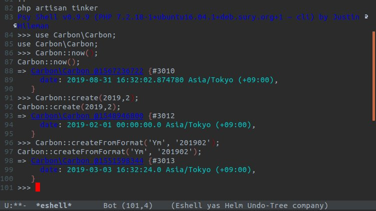

# 8/31に2月を作ろうとしたら3月になった例

<figure class="figure-image figure-image-fotolife" title="3月！？"><figcaption>3月！？</figcaption></figure>


# どうしてこうなった


## 2019年8月31日に実行

```
php artisan tinker
Psy Shell v0.9.9 (PHP 7.2.18-1+ubuntu16.04.1+deb.sury.org+1 — cli) by Justin Hileman
>>> use Carbon\Carbon;
use Carbon\Carbon;
>>> Carbon::now();
Carbon::now();
=> Carbon\Carbon @1567236722 {#3010
     date: 2019-08-31 16:32:02.874780 Asia/Tokyo (+09:00),
   }
```

- 今月末じゃない方は`Carbon::setTestNow(Carbon::create(2019,8,31))`で確認できますぜ

## `Carbon::create(...$args)`は大丈夫

```
>>> Carbon::create(2019,2);
Carbon::create(2019,2);
=> Carbon\Carbon @1548946800 {#3012
     date: 2019-02-01 00:00:00.0 Asia/Tokyo (+09:00),
   }
```

-  未指定分は0や1で埋められる


## `Carbon::createFromFormat($format, $datetimeStr)`が危険

```
>>> Carbon::createFromFormat('Ym', '201902');
Carbon::createFromFormat('Ym', '201902');
=> Carbon\Carbon @1551598344 {#3013
     date: 2019-03-03 16:32:24.0 Asia/Tokyo (+09:00),
   }
```

- 未指定分は`Carbon::now()`基準で埋められる模様
- 「2019年」「2月」しか指定していない
- 現在は「31日」なので、「2019年2月31日」扱いになる
- が、「2019年2月」は「28日」までしかない
- ので、3日ぶん溢れて「2019年3月3日」になったと思われる

```
>>> Carbon::createFromFormat('Ymd', '20190231');
Carbon::createFromFormat('Ymd', '20190231');
=> Carbon\Carbon @1551599505 {#3005
     date: 2019-03-03 16:51:45.0 Asia/Tokyo (+09:00),
   }

```

↑証拠

```
>>> Carbon::createFromFormat('Ym', '201902')->startOfMonth();
Carbon::createFromFormat('Ym', '201902')->startOfMonth();
=> Carbon\Carbon @1551366000 {#3018
     date: 2019-03-01 00:00:00.0 Asia/Tokyo (+09:00),
   }
>>> 
```

- startOfMonth()を呼んでもムダ
    - 3月3日 -> 3月1日になるだけ


# 回避方法 -- Ymd使え

```
>>> Carbon::createFromFormat('Ymd', '20190201')->startOfMonth();
Carbon::createFromFormat('Ymd', '20190201')->startOfMonth();
=> Carbon\Carbon @1548946800 {#3016
     date: 2019-02-01 00:00:00.0 Asia/Tokyo (+09:00),
   }
```


