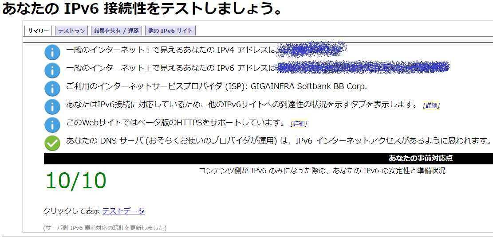

ソフトバンク光が遅いからIPv6高速ハイブリッド IPv6 IPoE + IPv4にした

# はやい

わあい

- 別プロトコルを使うことで、混雑している回線を避けている
    - 「道路が混むから誰も彼もに自動車を与えるな」  
        とは、**DIO様**も**海原雄山**ものたまっていることですね(画像掲載略)

# はやくなる前

- 夜～深夜帯がやばい
- twitchがプチプチでストレスでハゲそうだった
    - 好きな配信が1080pしか選べなかったりする
        - 6Mbpsくらいないとむり

# 申し込み

[https://ybb.softbank.jp/member/yf/ipv6/:embed:cite]

> 光BBユニットレンタル料467円／月が必要です。  
> (2019/8/31現在)

- これを申し込む
- 申し込み自体はマジで1-2分で終わる
    - ログイン情報を探すほうが時間かかるまである
- 初回契約時に貰った[ルータ](https://www.buffalo.jp/product/series/WSR-300HP)があったので、無線LAN機能は申し込まなかった

# 光BBユニットが届く

月曜申し込みの木曜着くらい

[f:id:wand_ta:20190831155802j:plain]

[f:id:wand_ta:20190831155811j:plain]

# つなぐ

- 直感に従っていい感じにつなぐ
- これまではWSR-HP300 を無線LAN機能付きルータとして使っていた(L2・L3)
- 今後は光BBユニットがルーティングする(L3)
- ので、WSR-HP300にはAP専任になってもらう(L2)

# 何もわからない。俺たちは雰囲気でパソンココを繋いでいる

- 192.168.11.1でアクセスできていたWSR-HP300の管理画面にアクセスできなくなってハマる
    - WSR-HP300でルーティングしてた頃は、同機器のDHCPで192.168.11のセグのIPを配っていた
    - 光BBユニットでルーティングするようになり、DHCPで192.168.3のセグのIPを配るように
    - 光BBユニットの隣のIPアドレスでアクセスできた
        - DHCPクライアントリストには居ない。謎
- DHCPクライアントリストに謎の払い出しがある
    - MACアドレス検索してもベンダ情報なし
        - ダミーか何かか？
