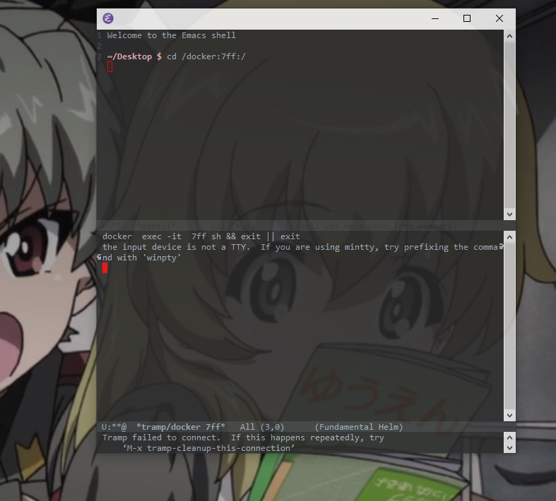
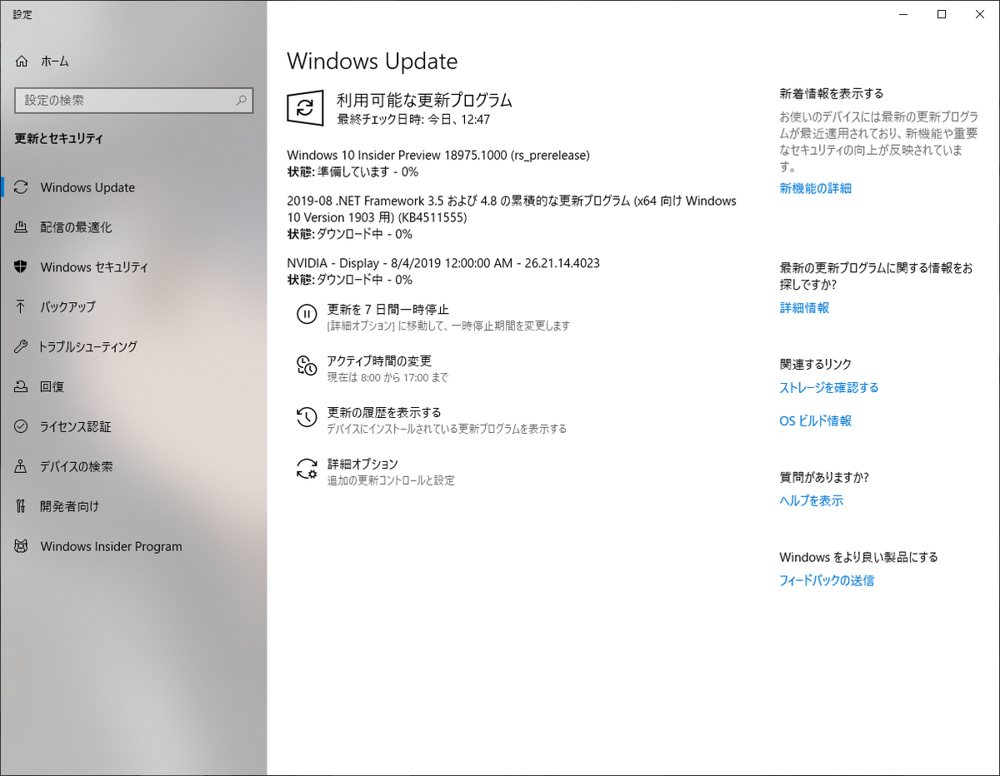
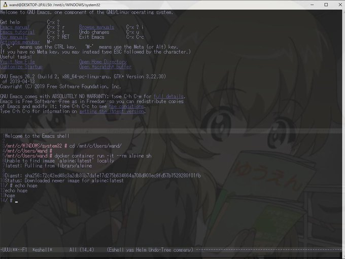
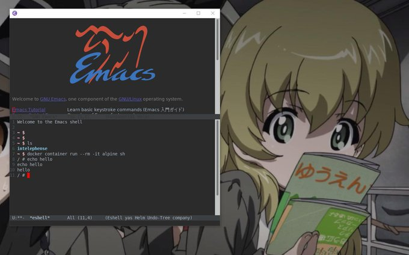
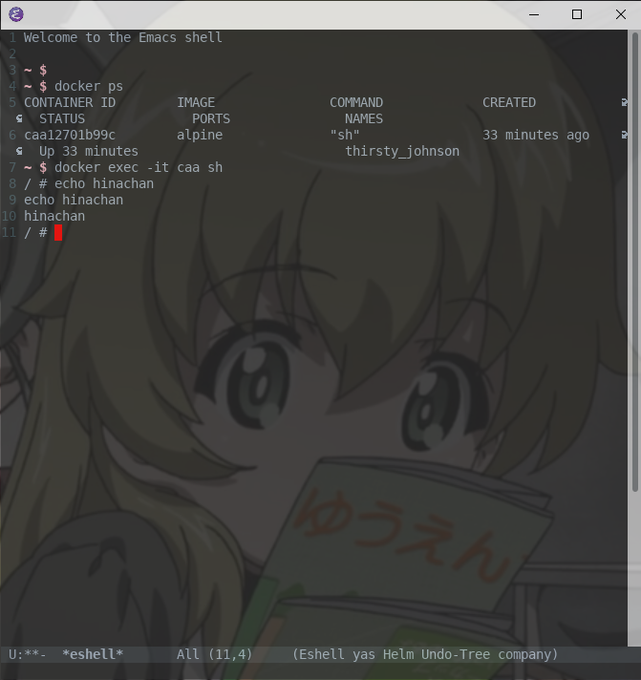

---
title: 【開発環境】Windows10で、Emacs上のシェルでDockerコンテナログインできるようになった話
tags:
- Emacs
- Docker
- 開発環境
- WSL2
date: 2019-09-09T21:57:40+09:00
URL: https://wand-ta.hatenablog.com/entry/2019/09/09/215740
EditURL: https://blog.hatena.ne.jp/wand_ta/wand-ta.hatenablog.com/atom/entry/26006613426420501
-------------------------------------

# モチベーション



- NTEmacsでは、eshellやshell-modeからdockerコンテナにログインできないのです
- より正確には、Docker Desktop for Windowsだと駄目
    - `winpty`をつけても駄目
    - linux上のdockerdのコンテナにtrampで入ることは可能
- EmacsもDockerもLinux上で動いてれば大丈夫なのでは？？

# WSL2入れる

## Windows10のビルド確認

- PowerShellとかで`winver`
- **Build 18917** 以上でないとWSL2使用不能
- 19/09/10現在、安定版ビルドではまだWSL2が入ってこない
- バージョンが足りてなければWindows Insider Programに加入して、将来のビルドを先取りする
    - 更新プログラムをインストールして再起動



## WSL有効化

- Windowsの機能の有効化 => Windows Subsystem for Linux
- 再起動

## Ubuntu18.04 LTS 入れる

- ストアから落としてくる
- 管理者権限PowerShellでwsl実行
    - ストアから落としてきたUbuntuをインストール
- `wsl --set-version <distro> 2`でWSLをWSL2にバージョンアップ

```
PS C:\Users\wand> wsl -l -v
  NAME            STATE           VERSION
* Ubuntu-18.04    Stopped         1
PS C:\Users\wand> wsl --set-version Ubuntu-18.04 2
変換中です。この処理には数分かかることがあります...
WSL 2 との主な違いについては、https://aka.ms/wsl2 を参照してください
変換が完了しました。
```

- スタートメニューから管理者権限で`wsl`実行、ubuntuにログイン
- 今後のためにいつものやつ

```sh
sudo apt update && sudo apt upgrade -y
```


# Emacs26入れる

```sh
sudo add-apt-repository ppa:kelleyk/emacs
sudo apt update sudo apt install emacs26
sudo apt update -y
sudo apt install emacs26
```

- 適宜「ぼくのさいきょうの`.emacs.d`」を配置する
- `~/.bashrc`で環境変数`export EDITOR=emacsclient`しておく


# Docker環境揃える

## Docker

```sh
sudo apt install docker.io -y
sudo usermod $USER -aG docker # sudoなしでdockerコマンド実行するため
```

- wsl再起動
    - バックグラウンドで残るっぽい？調べるのも面倒なのでホストのWindowsごと再起動した

```sh
sudo cgroupfs-mount
sudo service docker start
```

```
Client:
 Version:           18.09.7
 API version:       1.39
 Go version:        go1.10.1
 Git commit:        2d0083d
 Built:             Fri Aug 16 14:20:06 2019
 OS/Arch:           linux/amd64
 Experimental:      false

Server:
 Engine:
  Version:          18.09.7
  API version:      1.39 (minimum version 1.12)
  Go version:       go1.10.1
  Git commit:       2d0083d
  Built:            Wed Aug 14 19:41:23 2019
  OS/Arch:          linux/amd64
  Experimental:     false
```

    

- 注記
    - WSL2じゃないと17.12までしか動かない
    - Docker 17.12対応のDocker Composeはv1.21.0
    - このバージョンだとネットワーク周りがうまく動かない


## Docker Compose

- 執筆時点でいちばん新しいやつ
    - 変に古いやつだとネットワーク周りがうまく動かない

```sh
sudo curl -L https://github.com/docker/compose/releases/download/1.24.1/docker-compose-$(uname -s)-$(uname -m) -o /usr/local/bin/docker-compose
sudo chmod +x /usr/local/bin/docker-compose 
docker-compose version
```

```
docker-compose version 1.24.1, build 4667896b
docker-py version: 3.7.3
CPython version: 3.6.8
OpenSSL version: OpenSSL 1.1.0j  20 Nov 2018
```


## eshell上でdockerコンテナログインできることを確認

- WSLの`/etc/resolv.conf`に`nameserver 8.8.8.8`を加えないと名前解決できずイメージが降ってこないことに注意する
    - コンテナ内の`/etc/resolv.conf`についても同様。`apk update`が通らなかったりする

```sh
docker container run --rm -it alpine sh
```



- Windowsで！Emacs上のシェルから！！コンテナにログインできた！！！
    - もうコンテナログインのためだけにPowerShellを使わなくて済むんですね…(感涙)


# X11Forwarding

- この時点でNTEmacsよりうれしいこと
    - shell,eshell上でdockerコンテナにログインできる
    - plinkとか入れなくてもtrampでssh接続できる
    - magitの動作が軽快
- コマンドラインemacsの問題点
    - F5~F12キーとかC-RETとかが入らない
    - カーソルとかが地味で見づらい
- **X11Forwardingで解決**
- [参考にさせていただいた記事](http://alfa.hatenablog.jp/entry/2016/05/19/101456)

## Ubuntu側

### sshd

```sh
sudo ssh-keygen -A # 鍵ねーぞ、と怒られるので一式作る
sudo service ssh start
```

## Windows側

### sshクライアント: PuTTY

- NTEmacsでtrampでssh接続していた諸兄はplink目当てにインストール済のはず
- なければ鍵ペア作って公開鍵をUbuntuに搬送する (略)
- `localhost:22`向きの接続設定をつくる
    - `[ ] Enable X11 Forwarding`にチェックを入れる

### Xサーバー: VcXsrv

- なんか流行ってるらしいので特に何も考えずこれにした


### Xクライアント: emacs26

- X11Forwardingできてる状態で

```sh
emacs26 &
```



- GUI版が立ち上がった！


### 嫁透過

- このままでは裏側の嫁が見えないという致命的な欠陥が

[TranspWnds](https://code.google.com/archive/p/transpwnds/downloads)

- 任意のウィンドウを透過するやつ
- cmd,PowerShell,wslと同じ、「Ctrl + Shift + マウスホイール」に透明度操作を割り当てた


