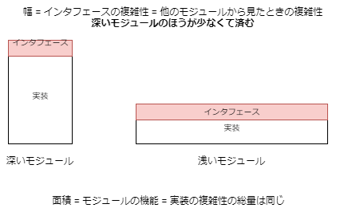

---
title: A Philosophy of Software Design ch4 Modules Should Be Deep
tags:
- APoSD
- ソフトウェア設計
- 勉強メモ
date: 2019-10-05T22:31:55+09:00
URL: https://wand-ta.hatenablog.com/entry/2019/10/05/223155
EditURL: https://blog.hatena.ne.jp/wand_ta/wand-ta.hatenablog.com/atom/entry/26006613445214844
bibliography: https://www.goodreads.com/book/show/39996759-a-philosophy-of-software-design
-------------------------------------

# Modules Should Be Deep

- _modular design_
    - 開発者が一度に直面する複雑性を少なくする
        - ソフトウェアの複雑性を御するうえで最重要なテクニック
- 本章はこの基本原則について述べる

## Modular design

- ソフトウェアシステムはモジュールのコレクションに分解される
- モジュールとは
    - 比較的独立した部品
    - class, subsystem, service等
- 理想オブ理想: どのモジュールも、互いに完全に独立している
    - 開発者は、あるモジュールに変更を加える際、他のモジュールのことを一切気にしなくてよい
- 現実はそうではない
    - モジュール間には依存がある
    - あるモジュールに変更を加えると、他のモジュールも追従して変更が必要になる
    - 例: 関数のシグネチャが変更されたら、呼び出しにも変更が必要
    - 依存にはいろいろな形がある
- 依存を管理するうえで、モジュールを2つに分けて考える
    - インタフェース
        - あるモジュールを他のモジュールから利用するうえで、知らなければならない情報
        - what
    - 実装
        - インタフェースに準拠して実行されるコード
        - how
- 例: 平衡木データ構造
    - 利用者に見えるのはinsert, remove, fetch等のみ
    - 木の平衡を保つためになんやかんやしているはずだが、利用者には見えない
- 本書では、インタフェースと実装をもつ任意のコード単位はすべて「モジュール」ということにする
    - OOPのclass
    - クラスの中のメソッド
    - 関数
    - 高水準のサービス、サブモジュール
        - 例
            - カーネル呼び出し
            - HTTPリクエスト
- 重要なのは、インタフェースが実装よりも単純であること
    - モジュールが他に課す複雑性を最小化する
    - モジュールに変更を加えても、インタフェースを変えない限り、他に影響を与えない
        - インタフェースが単純なほうがチャンス多し

## What's in an interface

- 「インタフェース」は、有形/無形の情報を含む
    - 【補】OOP言語機構としての`interface`だけのことを言ってるのではない、ということ
- 有形
    - コードとして明示されているもの
    - 例
        - メソッドのシグネチャ
        - 【補】OOP言語機構としてのinterface
    - プログラミング言語により、正しさが保証される
        - 実引数の型と順番と数が仮引数と一致している、等
- 無形
    - コードとして明示されないもの
    - 例
        - 「この関数よりも先にあの関数を呼ぶ必要がある」
        - 【補】malloc/freeとか
    - 一般に「あるモジュールを利用するために必要な情報」すべて
    - プログラミング言語によって完全性/正しさを保証できない
        - コメントで表現するほかない
- ほとんどの場合、無形の情報は有形の情報よりも大きく複雑である
- インタフェースを明記する利点
    - モジュールを利用するために必要な情報を正確に表す
        - 「分からないことが分からない」がなくなる
            - 【補】複雑性のうち最も深刻なもの


## Abstractions

- **ある実体から、重要でない詳細を省いて単純化したビュー**
    - 【補】「モデリング」もそうね
- modular programmingと密接に関わる
    - インタフェースは、モジュールの機能の抽象化
        - 重要でない実装の詳細が省かれる
- 「重要でない」詳細をそぎ落とせば削ぎ落とすほどよい
- 抽象化がうまく行かない2つのケース
    - 重要でない詳細を残してしまう
        - 「認知の負荷」になる
    - 重要な情報を削ぎ落としてしまう
        - 「分からないことが分からない」になる
        - _false abstraction_
- 抽象化の例: ファイルシステム
    - 略
- 抽象化はなにもプログラミングに限った話ではない
    - 例: 電子レンジ
        - 利用者が意識するのは出力と時間のみ
        - 電気をマイクロ波に変えてなんやらかんやら…というのを利用者は意識しない
    - 他にもいろいろ

## Deep modules




- モジュールのべき論
- モジュールの機能 = インタフェースの複雑性 x モジュールの深さ
    - cf. 長方形の面積 = 幅 x 高さ
    - モジュールの深さとはすなわち、実装の複雑性のうち、抽象化により隠蔽される部分
- 「深いモジュール」とは、インタフェースが単純で、実装の複雑性の多くの部分が隠蔽されているモジュール
- 好例: UnixのファイルI/O
    - システムコールはたかだか5種類しかない
        - open
        - read
        - write
        - lseek
        - close
    - 何十万行にもわたる実装が隠蔽されている
    - 実装は何年にも渡り大きく変わってきたが、その間インタフェースは変わっていない

## Shalow modules

- インタフェースが実装の複雑性を隠蔽していないもの
- 実装自体が単純な場合は避けられないことも
    - 例: 連結リスト
        - insert/deleteの実装自体が数行で終わるような代物
- こういうのはやめよう:

```java
private void addNullValueForAttribute(String attribute) {
    data.put(attribute, null);
}
```

- 複雑性の見地からは、悪くなりこそすれ良くはならない
    - 一切抽象化されていない
        - シグネチャが実装をすべて語っている
    - インタフェースの複雑性が実装のそれと変わらない
        - まともにドキュメンテーションしたら実装より長くなるまである
    - `data`を直接触ったほうがタイプ量少ない
        - 【所感】それは別によくない？
    - 開発者が新しいインタフェースを覚えなければならないという点で、システムに複雑性を導入している
    - しかしなんの利益ももたらさない


## Classitis

- 「クラスは深くあるべき」論は現在のところ、広くは認められていない
- 「クラスは小さくあるべき」というのが主流
    - 大きなクラスは小さなものに分割する
    - N行より長いメソッドは分割する
- _classitis_症候群
    - 「クラスは小さくあるべき」という考えの究極
    - 各クラスの機能を最小にする
    - 機能を追加するときはクラスを追加する
    - 個々のクラスは単純だが、システム全体の複雑性を増してしまう
        - インタフェースが増加するぶん
        - 定形コードの冗長性も

## Examples: Java and Unix I/O

- **インタフェースは、普遍的なケースが可能な限り単純になるように設計する**
    - 【補】柔軟なものが使いやすいとは限らない
        - 利用側が知らなければならないことが増える
        - 利用の手順が増える
        - ミスが発生しやすい
    - 【補】GoFのFacadeパターンはこの考え方に基づいたもの
- べき論に反している例: Javaでシリアライズされたオブジェクトをファイルから読み込む例

```java
FileInputStream fileStream = new FileInputStream(fileName);
BufferedInputStream bufferedStream = new BufferedInputStream(fileStream);
ObjectInputStream objectStream = new ObjectInputStream(bufferedStream);
```

- 2行目を忘れると、バッファリングが効かずI/Oは遅くなる
- 支持者の言い分
    - 「利用者全員がバァファリングを利用したいとは限らない」
- 著者の意見
    - ほとんどの利用者がバッファリングを使うのであれば、デフォルトで提供すべき
    - オプションで無効化できるようにすればよい
- べき論に従っている例: Unix
    - デフォルトでシーケンシャルアクセス提供
    - ランダムアクセスしたくなったらlseekシステムコール
        - シーケンシャルアクセスしか利用しなければ知る必要なし


## Conclusion

- 実装からインタフェースを分離せよ
    - 【補】SOLID原則のISP
        - いらんものに依存しない
- モジュール利用側は、インタフェースにより提供される「抽象」にのみ依存する
    - 実装の複雑性を意識しない
- 「深いモジュール」
    - 共通のユースケース向けに単純なインタフェースをもつ
    - 隠される=意識させない複雑性を最大化する

----------------------------------------

# 英語

- pervasively
    - 普及して
