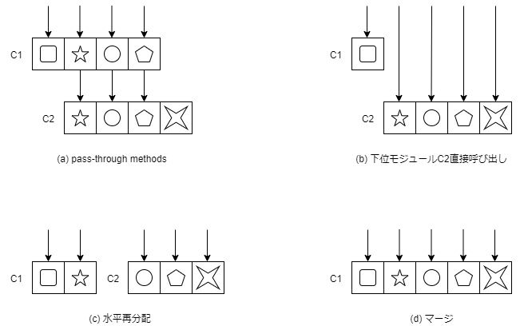

---
title: A Philosophy of Software Design ch7. Different Layer, Different Abstraction
tags:
- APoSD
- ソフトウェア設計
- 勉強メモ
date: 2019-10-14T16:57:17+09:00
URL: https://wand-ta.hatenablog.com/entry/2019/10/14/165717
EditURL: https://blog.hatena.ne.jp/wand_ta/wand-ta.hatenablog.com/atom/entry/26006613449350525
bibliography: https://www.goodreads.com/book/show/39996759-a-philosophy-of-software-design
-------------------------------------


# Different Layer, Different Abstraction

- 上位の層は下位の層の機能を利用する
- よく設計されたシステムでは、各層が異なる抽象度である
    - 例
        - ファイルシステム
        - OSI参照モデル
- 危険信号: 隣接する層が同じ抽象度
    - クラス分割に問題あり


## Pass-through methods

- 上位のクラスのメソッドが、下位のクラスのメソッドを呼び出すだけなヤツ
    - シグネチャは似ている、もしくは全く同じ


```java
public class TextDocument... {
    private TextArea textArea;
    private TextDocumentListner listener;
    ...
    public Character getLastTypedCharacter() {
        return textArea.getLastTypedCharacter();
    ]
    public int getCursorOffset() {
        return textArea.getCursorOffset();
    ]
    public void insertString(String textToInsert, int offset) {
        textArea.insertString(textToInsert, offset);
    }
    public void willInsertString(String stringToInsert, int offset) {
        if (listener != null) {
            listener.willInsertString(this, stringToInsert, offset);
        }
    }
    ...
}
```

- pass-through methods
    - 最後のメソッド以外、`textArea`の同名メソッドを呼び出しているだけ
    - 最後のメソッドも大したことをしていない
- 各クラス間の責務の分割に混乱があることを意味する
    - TextDocumentはinsertString()なるインタフェースを提供する
    - が、機能は下位のTextAreaにより完全に実装されている
    - この場合、インタフェースを提供しているTextDocumentが機能も実装するべき
- pass-throughメソッドに出くわしたら自問自答せよ:
    - どの機能・抽象化が、どのクラスの責務か？
    - クラスをまたいで重なった責務があるかも
- pass-throughメソッドのリファクタリング
    - 下位モジュールを直接利用する
        - 【所感】デメテルの法則違反にならない？
            - 隣しか知らないよってやつ
    - 責務を水平に再分配する
    - 上下両クラスをマージする(不可分な場合)




## When is interface duplication OK?

- 何か貢献していればOK
- 例
    - ディスパッチャ
        - メソッドの呼び出し分けという重要任務を担う
        - Webのルーティングとかもこの類
    - 複数の実装をもつインタフェース
        - 例: OSのディスクドライバ
        - 【補】GoFのBridge Patternもこの類か
        - ひとたび1実装の使い方を学習すれば、他の実装も難なく使える
            - 複雑性の3本の柱の1つ、「認知の負荷」の減少
        - 1実装が同レイヤーの他実装を呼び出すことも、普通はない
            - 【所感】Composite Pattern適用時はこの限りではないと思う


## Decorators

- Decoratorは浅くなりがち
    - 大して機能を提供しないわりに、大量の定形コードが必要
    - 大量のpass-throughメソッドが生まれる
        - 【所感】PHPなら`__call`マジックメソッド、静的型付け言語なら継承をうまく使えばそんなことないと思うけど…
- 濫用すると浅いクラスの爆発をもたらすので気をつけろ
    - 例
        - JavaのBufferedInputStreamクラス
        - ウィンドウにスクロールバーをつけるScrollableWindowクラス
- Decoratorを作る前に別案を検討せよ:
    - コアクラスに直接機能を追加できないか？
        - デフォルトで有効にしてよいような機能
            - 例: ファイルI/Oのバッファリング
    - ユースケースに記述すべきでは？
    - 既存のデコレータに混ぜ込めないか？
    - 独立したクラスであるべきでは？
        - 例: スクロールバー
            - Windowの全機能をラップせずに実装できそう


## Interface versus implementation


- インタフェース(抽象化)と実装(内部表現)とは異なっているべき
    - そうでない場合、浅いモジュールになっている可能性がある
- 抽象化に内部表現が漏れている例
    - Text.putLine(String string)
    - 内部表現が「行のコレクションであること」がインタフェースにも反映されている
    - 高水準レイヤーから利用しづらい
- 抽象化と内部表現とが異なる例
    - Text.insert(String string, Position position)
    - Text.delete(Position start, Position end)
    - 内部表現が「行のコレクションであること」は現れていない
    - 高水準レイヤーから利用しやすい


## Pass-through variables

- 同じ引数を何層にもわたるメソッド呼び出しで引き回すやつ
- 複雑性をもたらす
    - その引数を直接利用しない中間層も、その引数について知らなければならない
        - その引数型への依存を持ち込んでしまう
    - 引数追加時に何箇所も変更が生ずる
        - 複雑性の3本の柱の1つ、「変更の増幅」
- 無くすのは難しい
    - 複数の引数を1つのオブジェクトに詰める
        - メリット
            - 中間層の依存が減る
            - 引数追加時の変更箇所が少なくて済む
        - デメリット
            - このオブジェクト自体がpass-through variableなので完全解決には至っていない
    - グローバル変数
        - メリット
            - 引数の引き回しがなくなる
        - デメリット
            - 複数のアプリケーションインスタンスが共存できない
                - グローバル変数が衝突するため
                - 複数のアプリケーションインスタンスが共存できると、テスト時に有用
    - コンテキストオブジェクト
        - どんなもの
            - 【補】PofEAAのRegistry Patternみたいなやつ
            - アプリケーションインスタンスごとに、下記のような情報を格納する
                - コンフィグ
                - 共有しているサブシステム
                - パフォーマンスカウンター
            - コンストラクタで引き回す
        - メリット
            - コンストラクタ以外で引数の引き回しがなくなる
            - テストで有用
                - テスト用コンフィグを設定するのが容易
        - デメリット
            - グローバル変数の欠点のほとんど
                - ある変数の存在理由が不明瞭
                - ある変数がどこで利用されるか不明瞭
                - 規律をもって利用しないと、データの巨大なごった煮になってしまう
            - スレッドセーフティ問題
                - イミュータブルなもののみ格納するのが最良の解決策
                - 【補】PofEAAの「thread-scope Registry」でも解決できそう
        - 著者的には「一番マシ」
            - 理想からは程遠い


## Conclusion

- いかなるプログラム要素も、その存在自体がシステムに複雑性をもたらす
    - 例
        - インタフェース
        - 引数
        - 関数
        - クラス
        - 定義文
    - 開発者が使い方を学習しなければならないため
        - 複雑性の3本の柱の1つ、「認知の負荷」
- システム全体の正味の複雑性を下げるためには、プログラム要素はシステムの他の部分の複雑性を減らさなければならない
    - 例: 利用者が知る必要のない知識のカプセル化
        - 【補】「認知の負荷」が下がる
        - 【補】「変更の増幅」も減るかも
- さもなくば、その要素はない方がマシ
- 「異なる層では異なる抽象化」はこの応用
    - 同じ抽象度の異なる層があるということは、その層の追加分の複雑性をペイできていないということ


----------------------------------------

# 英語

- grab-bag
    - 福袋
        - ごった煮的な意味合いで使われている
