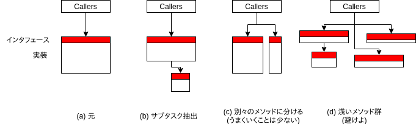

---
title: A Philosophy of Software Design ch9 Better Together Or Better Apart?
tags:
- APoSD
- ソフトウェア設計
- 勉強メモ
date: 2019-10-17T21:41:53+09:00
URL: https://wand-ta.hatenablog.com/entry/2019/10/17/214153
EditURL: https://blog.hatena.ne.jp/wand_ta/wand-ta.hatenablog.com/atom/entry/26006613450885893
bibliography: https://www.goodreads.com/book/show/39996759-a-philosophy-of-software-design
-------------------------------------


# Better Together Or Better Apart?

- ソフトウェア設計において一番肝心な疑問
- 2つの機能片があったとして...
    - 同じ場所に一緒に実装すべきか？
    - 分けて実装すべきか？
- あらゆるレベルのモジュールについて生じる疑問
    - 関数
    - メソッド
    - クラス
    - サービス
- 例
    - ストリームI/Oに対するバッファリングはコア機能に含めるべき？分けるべき？
        - 【補】
            - Unixは分けなかった
            - Javaは分けた
            - 著者は「分けない」推し
    - HTTPリクエストのパースは1メソッドで行われるべき？複数メソッドに分けるべき？複数クラスに分けるべき？
        - 【補】時分割アンチパターンに陥りがち。著者は「分けない」推し
- 迷ったら目標に立ち返る
    - システム全体の複雑性を減らすこと
    - モジュラリティを向上させること
- 細分すればするほど個々の部品はシンプルになるが、システム全体としての複雑性は増してしまう
    - 部品の個数が多いことからくる複雑性
        - 追いづらい
        - インタフェース増える
            - 【補】認知の負荷増加
    - 多数のコンポーネントを制御しなければならなくなる
        - 1つのオブジェクトを利用していた部分が複数オブジェクトを制御するようになる
    - もともと1つのメソッド等にまとまっていたコードが遠く離れる
        - 別クラス
        - 別ファイル
        - それらの部品が独立しているなら結構
            - モジュラリティの向上
        - 依存があるなら良くない
            - 開発者はソースコードを追う際、コンポーネント間をあちこち行き来することになる
        - 見えづらい依存があるとなお悪い
            - 【補】back-door dependency
            - バグのもと
    - コード重複をまねく
- 密接に関連しているものはまとめるが吉、関連のないものは分割せよ
- コード間に関連がある兆候
    - 知識を共有している
        - 例: ある種のドキュメントのシンタックスに依存している
            - 【補】HTTPリクエストのパースの例もこれ
    - 一方を利用する場合、他方も必ず併用する
        - 双方向依存でなければ、この限りではない
            - 例: ディスクブロックキャッシュとハッシュテーブル
                - `ディスクブロックキャッシュ --> ハッシュテーブル`なる依存
                - ハッシュテーブルはキャッシュ以外にも利用されるため、分けるべき
    - 概念的に重なっている
        - 例: `substring`と`toUpper`等
            - 文字列操作
        - 例: フロー制御と高信頼転送
            - ネットワーク通信
    - 一方を見ずに他方を理解することが困難
        - 後述のConjoined Method Red Flag


## Bring together if information is shared

- 例: HTTPリクエストの読み込みとパース
    - ボディの読み込みのためにContnet-Lengthヘッダを読まないといけない
    - ので、結局ボディの読み込みにはHTTPリクエストのパースの知識が必要
    - この場合、同じ場所にまとめたほうが良い


## Bring together if it will simplify the interface

- 複数のモジュールを組み合わせて単一のモジュールにすることで、シンプルかつ簡単に利用できるようになるケース
- 元のモジュールが問題を部分的にしか解決しない場合におこる
- 例: JavaのストリームIO
    - FileInputStreamとBufferedInputStream
    - BufferedInputStreamはFileInputStreamと組み合わせて使用する
    - まとめてFileInputSreamとして、デフォルトでバッファリングをサポートするほうがシンプル


## Bring together to eliminte duplication

- 同じようなスニペットが何度も何度も繰り返されている場合
    - その部分をメソッドとして括り出して置き換える
        - 繰り返し部分が長く、かつ括り出したメソッドのシグネチャが単純な場合に有効
            - 繰り返し部分が短いとあまり効果がない
                - 【補】極端な場合、メソッドのシグネチャのほうが長くなったりする
            - 括り出したメソッドのシグネチャが複雑な場合はうまみが少ない
                - スニペットが大量の局所変数を参照している場合など
    - 1箇所にまとめて、GOTOでジャンプする
        - 後始末コードなど


## Separate general-purpose and special-purpose code

- 例: Textクラス(汎用)とUIクラス(用途特化)
- 汎用のメカニズムを分離する
    - 汎用に用途特化を混ぜない
        - Textクラスに`backspace`メソッド等を生やさない
    - 汎用に別の汎用を混ぜない
- 汎用は下の層、用途特化は上の層に
    - 【補】differenct layer, different abstraction

### Red Flag: Speial-General Mixture

- 混ざっていると複雑になり、知識の漏出もおきる
    - 例: TextとUI
        - `Text.backspace()`が生えているということは、汎用であるべきTextクラスにUIの知識が漏れている
        - UIを変更するとTextにも変更が必要になる


## Example: insertion cursor and selection

- GUIエディタの例
    - UI
        - カーソル
            - 常に見える
        - 選択範囲
            - 何も選択されていないときは非表示
    - カーソルと選択範囲には関連性がある
        - カーソルは必ず選択範囲の開始・終了地点どちらかの端にある
- 実装案1: 選択範囲の一方の端をカーソルとして扱い、カーソルクラスと選択範囲クラスを統合する
    - カーソルはどちらの端か、booleanメンバで保持
    - 1つのオブジェクトにまとまったはいいが、使いづらいものとなった
        - 利用側コードは結局選択範囲とカーソルとを区別しなければならない
        - 別々に管理するよりも複雑
        - カーソルを直接利用するはずの部分はbooleanによる間接指定に
    - 選択範囲とカーソルとは、統合できるほど関連深くなかったのである
- 実装案2: 汎用のPositionクラスを追加し、カーソルと選択範囲を表現する
    - `Cursor` --> `Position`
    - `Selection` --> `Pair<Position, Position>`
    - Positionはカーソルや選択範囲以外にも利用できる、低レイヤの汎用モジュール

## Example: separate class for logging

- 一箇所でしか使われない、特定用途の浅いメソッドを大量に生やしてしまう
    - logRpcSendError
    - logRpcReceiveError
- コードを追う際、呼び出しと宣言を行き来することになる
- 呼び出し箇所にインラインで記述したほうがシンプル
    - 行き来しなくてすみ、読みやすい
    - インタフェースの単純化

## Example: editor undo mechanism

- 【補】長いので抜粋、読み解いてクラス図を起こした

```
@startuml
package UI{
  class UI
  class UndoableCursor
  class UndoableSelection
  class UndoableDelete
}

package History{
  class History{
    public void addAction(Action action)
    public void addFence()
    public void undo()
    public void redo()
  }
   
  interface Action{
    public void redo()
    public void undo()
  }
}

package Text{
  class Text {
    public void insert(Position position, String string)
    public void delete(Position begin, Position end)
    public void redo()
    public void undo()
  }
}

UndoableCursor ..|> Action
UndoableSelection ..|> Action
UndoableDelete ..|> Action

UI --> Text
History o-- Action
UI --> History
UI ..> UndoableCursor : <<create>>
UI ..> UndoableSelection : <<create>>
UI ..> UndoableDelete : <<create>>
UndoableDelete --> Text

@enduml
```


- UIは上位レイヤの用途特化モジュール
- Textは下位レイヤの汎用モジュール
- HistoryとAction Interfaceはアンドゥ・リドゥの枠組みを提供する下位レイヤ
    - インタフェース
        - addAction
            - アンドゥ可能なアクションの登録
        - addFence
            - 「ここまではまとめてアンドゥする」というグルーピング
        - undo/redo
            - Fenceにぶつかるまで、個々のActionのundo/redo呼び出し
    - 特定のアクションのアンドゥ・リドゥの詳細については知らない
- 特定のアンドゥ・リドゥのしかたや、アンドゥをまとめるポリシーは上位のUIレイヤの仕事
- TextクラスがText自身のアンドゥ・リドゥ機能を実装するのはアリ
    - 汎用のHistoryに直接実装することはできない
        - Historyからすれば「テキスト編集」という用途特化のコードなので
    - 汎用のHistoryの枠組みに組み入れることは可能


## Splitting and joining methods

- クラスだけではなくメソッドについても、いつ細分化するかの課題はついてまわる
- 「長い」というだけの理由で分割されがち
    - 長いメソッドは理解しづらい傾向にあるため
    - 「20行以下に分割せよ！」
- 総じて分割しすぎる傾向にある
    - 分割すればするほどインタフェースが増えて複雑になる
    - システム全体の複雑性が下がらない限り、分割すべきではないのである
    - 細分化しすぎると、コードを追うためにあちこち行き来しなければならない
    - 長くても、シグネチャが単純で理解しやすければ問題ない
- メソッドを設計するうえで最も重要なのは、きれいで単純な抽象化を提供すること
    - これらさえ満たせば長さは重要ではない:
        - 各メソッドは一つのことを**完全に**行うべき
        - インタフェースは実装よりも単純であるべき
    - メソッドを分割するときはこれらを満たすこと

----------------------------------------



- メソッドを分割するときは(b)が一番良い。ついで(c)がよい。(d)は避けよ
    - (b) サブタスクを抽出する
        - 呼び出し元 -> 親メソッド -> 子メソッド(サブタスク)
        - 親メソッドは、元のメソッドと同じインタフェースをもつ
        - 子メソッドが綺麗に分割できる場合に有効
        - 効能
            - 子メソッドの実装を読む人は、親メソッドのことは知らなくて良い
            - 親メソッドの実装を読む人は、子メソッドの実装のことは知らなくて良い
        - 子メソッドは下位レイヤーの汎用モジュール
            - 他の親メソッドからも共通で利用可能
        - Red Flag: Conjoined Methods
            - コードを追うにあたり、親メソッドと子メソッドの実装を行き来しなければならないようなら、この分割はまずい
    - (c) 別々のメソッドに分ける
        - 呼び出し元 -> メソッドA, 呼び出し元 -> メソッドB
        - 元のメソッドのインタフェースが過度に複雑な場合に有効
            - 元のメソッドが複数のことをやろうとしている
                - 分割後は片方だけ呼び出せばよくなるのが理想
        - 分割後のメソッドが元のメソッドよりも汎用的になるのは良い兆候
        - うまくいくことは少ない
            - 呼び出し側は複数のメソッドを呼び出さねばならなくなる
            - 状態変数を引き回さねばならないようなら良くない
- 浅いメソッド群を1つの深いメソッドに統合することで、システムがシンプルになることもある
    - コード重複の排除
    - 元のメソッド間の依存の排除
    - 中間データ構造の排除
    - 散らばっていた知識が一箇所にカプセル化される
    - インタフェースが単純化する

## Conclusion

- モジュールの分割/統合の判断は、複雑性に基づいて下す
- 下記のような構造を選定せよ
    - 知識をもっともよく隠蔽し
    - 依存がもっとも少なく
    - インタフェースが単純でモジュールが最も深くなる
