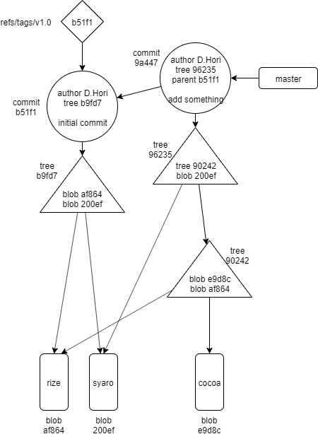

---
title: Version Control with Git ch4 Basic Git Concepts (1/2)
tags:
- Git
- 勉強メモ
date: 2019-10-25T01:37:13+09:00
URL: https://wand-ta.hatenablog.com/entry/2019/10/25/013713
EditURL: https://blog.hatena.ne.jp/wand_ta/wand-ta.hatenablog.com/atom/entry/26006613454978593
bibliography: http://shop.oreilly.com/product/0636920022862.do
-------------------------------------


# Basic Concepts


- 前章で生じたであろう疑問
    - Gitはファイル全体を毎コミット保存するの？
    - .gitディレクトリの役目は？
    - なぜコミットIDはわけがわからないの？書き留めておくべき？
- 他のモダンなVCSが提供しているものと同じ機能は備えている
- しかしそれらとは根本的に異なる
- 本章の内容
    - 他のVCSとの違い
        - 構造
        - 概念
    - 1つのリポジトリとのやりとり
    - ch12: 複数リポジトリ の基礎となる
    
## Repositories

- リポジトリとは
    - 他のVCSとの共通点
        - プロジェクトの修正と歴史を維持管理するために必要な全ての情報を格納する
    - 異なる点
        - 作業用ファイルのコピーのみならず、リポジトリ自体のコピーも提供する
            - 【補】`git clone`のことを言っている？
- コンフィグファイル
    - そのリポジトリ固有
    - 他のファイルデータやメタデータとは異なり、`git clone`しても伝播しない
        - 【補】メタデータというのは、`git add --chmod=+x`とかのことを言っていると思われる
- Gitが維持する2つのデータ構造
    - Object Store
        - 効率の良い複製操作
        - 分散型VCSの要
    - Index
        - 一時的な情報の格納
        - リポジトリプライベート


## Git Object Types

- Object StoreはGitリポジトリの心臓部
- プロジェクトのバージョンやブランチを復元するのに必要な情報全てを含む
    - 元のデータファイル
    - ログメッセージ
    - author情報
    - 日付
    - etc.
- オブジェクトは4種類
    - Blobs (Binary Large OBjects)
        - BLOBという言葉は、内部構造を無視する任意のデータを指す言葉
        - Gitでもそう
            - ファイルの中身のデータのみ保持
            - メタデータやファイル名すら持たない
    - Trees
        - 1層のディレクトリ情報
            - blobの識別子
            - パス名
            - ファイルのメタデータ
            - 他の部分木への参照
    - Commits
        - 変更のメタデータ
            - author
            - committer
            - コミット日時
            - ログメッセージ
            - コミット実施時点での、コミット対象のTreeのスナップショット
        - 親コミット
            - 初回コミット(ルートコミット)にはない
            - 他コミットには1つある
            - 複数の親コミットを参照することもできる(ch9)
    - Tags
        - オブジェクトにhuman-redableな名前を与える
- ディスクと帯域の効率のために_pack files_として圧縮保存される


## Index

- リポジトリ全体のディレクトリ構造を表現する、一時的で動的なバイナリファイル
- `git add`のステージング領域とか
- マージで重要な役割を担う
    - 同時に同じファイルの複数のバージョンを管理し検査し操作できる

## Content-Addressable Names

- Object Store中のオブジェクトはSHA1にかけられたユニークな名前をもつ
    - 160ビット、40桁16進数
    - 次のものは全部同じ意味
        - SHA1
        - ハッシュコード
        - オブジェクトID


### Globally Unique Identifiers

- ファイルがどこにあろうが同じファイル内容ならば同じハッシュ値というのが重要
    - たとえ別のマシン上でも
- ファイル同一性比較の際、SHA1ハッシュ値を比較するだけでよいのが強力
    - 任意のファイルサイズ
    - インターネット越しでも

## Git Tracks Content

- Gitのコンテンツ追跡は、他のVCSとは2つの点で根本的に異なる
    - ハッシュ値算出に基づいている
        - ファイルやディレクトリの名前ではなく、中身を追跡しているということ
        - 2つの別々のファイルの中身が同一の内容ならば、オブジェクトストア上には共通のひとつのオブジェクトが格納される
            - 片方に変更が加わったらあらためてオブジェクトストアにオブジェクトが追加される
                - 【補】コピーオンライト的な感じ
    - Git内部のデータベースには全バージョン全ファイル格納されている
        - 差分ではなく、である
            - SHA1を算出するために完全コピーが必要
        - 利用者の目には修正差分を追跡しているかのように映るが、都度生成している


## Pathname Versus Content

- Gitはファイルの内容とファイル名とを別々に管理している
    - データベースやファイルシステムもそう
        - ISAM/レコード
        - ディレクトリ/ブロック
- 元のディレクトリ構造よりも効率的な内部表現でデータを格納している

## Pack Files

- 「全バージョン全ファイルをオブジェクトストアに格納しているのは非効率なのでは？」
- 結論NO
- _pack files_にいい感じに差分圧縮している
- 【所感】Different Layers, Different Abstractions (APoSD)


# Object Store Pictures




- 【補】`git cat-file`サブコマンドでオブジェクトの中身を見れる
    - [内部表現勉強用ごちうさリポジトリ](https://github.com/wand2016/GitSandbox)

```sh
git cat-file -p  master^{tree}
```

```
040000 tree 90242d36854889cac7893116118dc97b0a0e947f	rabbit-house
100644 blob 200efce75e8f04b16ac365eb554b38e55573488e	syaro
```


- ファイルの中身がblobとして格納される
    - rize
    - syaro
    - cocoa
- 複数のtreeでblob共有
    - rize
    - syaro
- treeはtreeまたはblobを指す
    - 指す内容が変わればハッシュ値も変わる
- commitの内容
    - author、committer等
    - tree
    - 親commit
- tagは`refs/tags/v1.0` のようなファイル名
- ほかは`objects/b5/1f1cd76f543ce81445a290fb0e4fe37f86c93f` のようなファイル名
- よく見るコミットグラフとは矢印の向きが逆であることに留意する
    - よく見るやつ: コミットの順序
    - 上で示した図: 参照の向き

----------------------------------------

# 英語

- gibberish
    - ちんぷんかんぷんな
- transitory
    - 一時的な
- corollary
    - 帰着
- exposition
    - 詳細な解説
